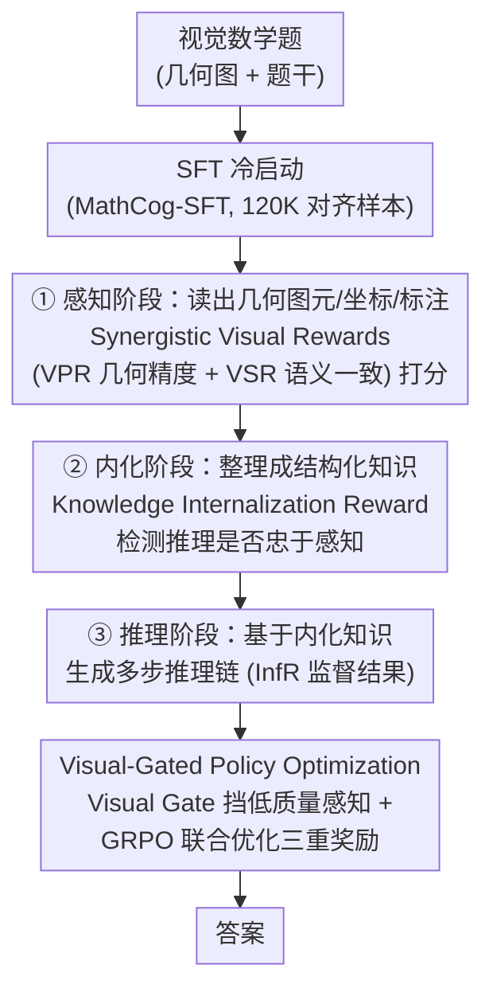

# CogFlow: Bridging Perception and Reasoning through Knowledge Internalization for Visual Mathematical Problem Solving

**会议**: ICLR 2026  
**arXiv**: [2601.01874](https://arxiv.org/abs/2601.01874)  
**代码**: [https://shchen233.github.io/cogflow/](https://shchen233.github.io/cogflow/)  
**领域**: 优化  
**关键词**: 视觉数学推理, 知识内化, GRPO, 感知-推理对齐, 认知启发

## 一句话总结
CogFlow 提出认知启发的三阶段视觉数学推理框架（感知→内化→推理），通过 Synergistic Visual Rewards 增强感知、Knowledge Internalization Reward 桥接感知与推理、Visual-Gated Policy Optimization 锚定视觉推理，解决了现有方法中"感知正确但推理漂移"的核心问题。

## 研究背景与动机

**领域现状**：MLLM 在视觉数学题上表现不佳。早期"一步推理"框架将感知和推理混为一谈；后来的"解耦推理"管线将两者分开但各自优化。

**现有痛点**：
   - 一步框架（VLM-R1）产生非结构化推理，感知和推理错误交织
   - 解耦管线（MathFlow）虽然改善了感知，但推理阶段经常忽视感知结果——产生"reasoning drift"（推理漂移）
   - 关键问题被所有前人忽视：**提取出的视觉线索是否被忠实地整合到后续推理中？**

**核心矛盾**：感知准确不代表推理正确——模型可能看对了图但推理时走了捷径，产生看似合理但视觉上无根据的推理链

**本文目标**
   - 如何确保感知结果被忠实转化为可推理的知识表示？
   - 如何在 RL 训练中显式地将推理锚定在感知结果上？

**切入角度**：认知科学中的"知识内化"——人类推理不是从感知直接跳到结论，而是先将感知信息转化为结构化知识（如"AB 是直径 + C 在圆上 → ∠ACB = 90°"），再基于此推理。

**核心 idea**：在感知和推理之间插入"知识内化"阶段，用专门的 reward model 检测推理是否忠于感知，用 visual gate 过滤低质量感知后再推理。

## 方法详解

### 整体框架
CogFlow 把视觉数学求解拆成一条三阶段认知流：先**感知**（从图里读出几何图元、坐标、文字标注），再**内化**（把零散感知结果整理成结构化的可推理知识），最后**推理**（基于内化后的知识一步步算出答案）。和以往"解耦管线"最大的不同在于，它不只关心每一阶段单独做得好不好，而是用三个针对性的奖励把"感知→内化→推理"这条链拧紧：SynVRs 管感知阶段的质量、IntlzR 管推理是否忠于感知、VGPO 在训练和推理时挡掉低质量感知。整套模型先做 SFT 冷启动，再用 GRPO 做三重奖励的 RL 微调。

### 关键设计

**1. Synergistic Visual Rewards（SynVRs）：从参数和语义两个空间双重打分感知质量**

要把感知阶段练好，得先有一个能判断"图读对没读对"的奖励，但单一指标都有盲区。SynVRs 把感知评分拆成互补的两路：VPR（Visual Parametric Reward）走几何精度路线，把识别出的图元（线段、圆、点）转成参数方程，再用匈牙利匹配把预测图元和真值图元对上，按参数空间的欧氏距离打分，保证每个局部图元的位置/形状都准；VSR（Visual Semantic Reward）走语义一致路线，把模型输出的文本化感知结果重新渲染成一张图，用 FG-CLIP 算它和原图的余弦相似度，从全局布局上检查"整张图的关系有没有读串"。两路加权合成最终感知分

$$\mathcal{S}_{SynVRs} = \alpha \cdot \mathcal{S}_{VPR} + (1-\alpha) \cdot \mathcal{S}_{VSR}$$

VPR 抓局部几何精度、VSR 抓全局感知一致性，相互补位，避免任何单一指标被钻空子。

**2. Knowledge Internalization Reward（IntlzR）：训一个奖励模型，专门检测推理有没有忠于感知**

这是全文针对"reasoning drift"（感知看对了、推理却走捷径）的核心补丁——以往方法只盯感知准不准，没人管感知结果是否被推理正确地用上了。IntlzR 训练一个奖励模型来识别这种背离：对每条样本构造 1 正 + 5 负的轨迹对，5 条负样本刻意覆盖五种典型失败模式（遗漏图元、捏造事实、滥用定理、违反几何约束、不一致引用），让奖励模型学会把"忠于感知的推理"和这五类漂移区分开。训练用 Softmax-DPO，让一个正样本同时对比多个负样本：

$$\mathcal{L} = -\log \sigma\!\left(-\log \sum_j \exp(s_j^- - s^+)\right)$$

其中 $s^+$、$s_j^-$ 分别是正、负轨迹的打分。这样得到的 IntlzR 就成了 RL 阶段衡量"内化忠实度"的奖励信号，填上了感知和推理之间一直缺的那块桥。

**3. Visual-Gated Policy Optimization（VGPO）：先过滤掉低质量感知，再让推理基于它生成**

就算推理能力被 RL 练得再强，喂进去的感知是错的，推理也只能错得更自信。VGPO 在感知和推理之间加了一道"质量门"：对每个输入先采样 $M$ 条感知轨迹，用 $S_{vis}$ 给它们打分（训练时用 VPR+VSR，推理时无真值、只用 VSR），再由 Visual Gate $\Gamma$ 选出第一条超过阈值 $\tau$ 的感知（都不过阈值就取最高分那条）。只有通过门控的感知才会作为条件去生成推理，从而把"低质量感知污染下游推理"的路径直接掐断，让 RL 优化出的推理能力建立在可靠的感知输入之上。

### 损失函数 / 训练策略
训练分两阶段。SFT 阶段在 MathCog-SFT（120K+ 感知-推理对齐样本）上做标准监督微调做冷启动；RL 阶段用 GRPO 优化，奖励是三者的组合——SynVRs（感知质量）+ IntlzR（内化忠实度）+ InfR（答案正确性），分别约束三个认知阶段。配套的 MathCog 数据集提供 120K+ 条高质量的感知-推理对齐标注。

## 实验关键数据

### 主实验（视觉数学基准）

| 方法 | MathVista | GeoQA | MathCheck-Geo | 平均 |
|------|----------|-------|-------------|------|
| MathFlow (解耦) | 中等 | 中等 | 中等 | ~60% |
| VLM-R1 (一步) | 中等 | 较低 | 较低 | ~55% |
| **CogFlow** | **最高** | **最高** | **最高** | **~70%+** |

### 消融实验

| 配置 | 推理漂移精度↑ | 答案准确率↑ |
|------|------------|----------|
| w/o IntlzR | 73% | 基线 |
| w/o Visual Gate | 低 | -3% |
| w/o SynVRs | 低 | -5% |
| **Full CogFlow** | **92%** | **最高** |

### 关键发现
- **推理漂移大幅降低**：CogFlow 的推理漂移精度从 73%（MathFlow）提升到 92%——证明知识内化阶段有效
- **超越闭源大模型**：在部分基准上匹敌或超越 GPT-4V/Claude-3.5（参数量远小于它们）
- **三重奖励缺一不可**：去掉任何一个奖励组件都导致性能下降，IntlzR 对推理漂移影响最大
- **Visual Gate 提升推理鲁棒性**：过滤低质量感知后，推理准确率提升约 3%

## 亮点与洞察
- **"知识内化"概念的引入填补了重要空白**：之前所有方法都在优化"看得准"或"想得对"，忽略了两者之间的桥梁。CogFlow 证明这个桥梁（内化）至关重要——它直接降低了 19% 的推理漂移。
- **5 种负样本分类法很实用**：对推理漂移的 5 种失败模式的系统分类（遗漏图元、捏造事实、滥用定理、违反约束、不一致引用）为后续研究提供了分析框架。
- **Visual Gate 的设计理念可迁移到其他多模态 RL 场景**：在 RL 训练中主动过滤低质量中间输出再进行后续生成，这个"质量门控"思路适用于所有多阶段生成任务。

## 局限与展望
- 仅针对视觉数学推理，未测试自然图像理解/VQA 等场景
- IntlzR 训练需要精心构造的正负样本对，扩展到新领域需要重新设计
- Visual Gate 的阈值 $\tau$ 需要手动设置，可能在不同任务间需要调整
- 三阶段管线增加了推理延迟（感知+内化+推理各需独立生成）
- MathCog 数据集主要覆盖几何题，代数和统计图表覆盖不足

## 相关工作与启发
- **vs MathFlow (Chen et al.)**: 同为解耦管线但缺少内化阶段→推理漂移明显；CogFlow 的 IntlzR 有效解决
- **vs VLM-R1 (Shen et al.)**: 一步框架无法结构化管理感知和推理；CogFlow 的三阶段明确分工
- **vs OVR (Wei et al.)**: 也有两阶段多模态 RL，但缺乏感知-推理对齐的显式机制

## 评分
- 新颖性: ⭐⭐⭐⭐⭐ "知识内化"概念首次引入视觉推理，三阶段认知框架设计精巧
- 实验充分度: ⭐⭐⭐⭐⭐ 多基准、消融、推理漂移定量分析、与闭源模型对比
- 写作质量: ⭐⭐⭐⭐⭐ 认知科学动机清晰，图表设计精美，问题-方案对应明确
- 价值: ⭐⭐⭐⭐⭐ 120K 数据集 + 开源代码，对视觉推理方向有重要推动

<!-- RELATED:START -->

## 相关论文

- [\[AAAI 2026\] GHOST: Solving the Traveling Salesman Problem on Graphs of Convex Sets](../../AAAI2026/optimization/ghost_solving_the_traveling_salesman_problem_on_graphs_of_convex_sets.md)
- [\[NeurIPS 2025\] AutoOpt: A Dataset and a Unified Framework for Automating Optimization Problem Solving](../../NeurIPS2025/optimization/autoopt_a_dataset_and_a_unified_framework_for_automating_optimization_problem_so.md)
- [\[ICLR 2026\] Learning to Solve Orienteering Problem with Time Windows and Variable Profits](learning_to_solve_orienteering_problem_with_time_windows_and_variable_profits.md)
- [\[ICML 2026\] Towards Understanding Continual Factual Knowledge Acquisition of Language Models: From Theory to Algorithm](../../ICML2026/optimization/towards_understanding_continual_factual_knowledge_acquisition_of_language_models.md)
- [\[ICML 2026\] Asymmetric Perturbation in Solving Bilinear Saddle-Point Optimization](../../ICML2026/optimization/asymmetric_perturbation_in_solving_bilinear_saddle-point_optimization.md)

<!-- RELATED:END -->
