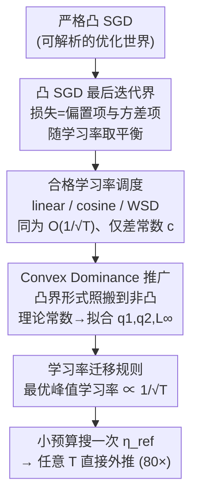

# Convex Dominance in Deep Learning I: A Scaling Law of Loss and Learning Rate

**会议**: ICLR 2026  
**arXiv**: [2602.07145](https://arxiv.org/abs/2602.07145)  
**代码**: 未公开  
**领域**: 优化  
**关键词**: 缩放定律, 学习率调度, 凸优化, 损失收敛, 训练规划

## 一句话总结
从凸优化理论出发，证明深度学习训练损失以 O(1/sqrt(T)) 速率收敛，最优学习率以 1/sqrt(T) 缩放，在 GPT-2 到 12.5B 参数模型上验证了该缩放律（R^2 >= 0.978），并实现了 80 倍训练步数的学习率外推。

## 研究背景与动机

**领域现状**：Chinchilla 等缩放定律描述了损失与数据量/模型大小的关系，但损失与训练步数/学习率的耦合关系缺乏理论基础。实践中学习率调度（cosine, linear decay, WSD）的选择主要靠经验。

**现有痛点**：当改变训练预算（总步数 T）时，需要重新搜索最优学习率——这既昂贵又不确定。现有的经验缩放律缺乏理论指导，无法可靠外推到新的训练设定。

**核心矛盾**：尽管深度学习是非凸优化问题，但实际训练中观察到的收敛行为更像凸优化——这种"隐含凸性"尚未被系统理论化。

**本文目标** (a) 建立损失-学习率-训练步数的统一缩放律，(b) 实现跨训练预算的学习率迁移。

**切入角度**：假设深度学习在宏观上表现出弱凸性（convex dominance），从凸分析推导出的收敛界可以描述实际训练行为。

**核心 idea**：深度学习的训练损失遵循 L(T) ~ L_inf + C/sqrt(T)，最优学习率 eta* = eta_ref/sqrt(T)，其中 eta_ref 可以在小规模实验中确定后直接迁移。

## 方法详解

### 整体框架
论文要回答的问题是：训练损失、学习率、总训练步数 $T$ 三者之间到底服从什么定量关系，以及能不能在小规模实验里把最优学习率定下来、直接搬到大规模训练上。整条推理链是这样转的：先在严格凸的 SGD 上推出一个"最后一步迭代"的损失上界，看清楚损失随训练步数和学习率怎么变；再把"什么样的学习率调度能跑出最优收敛速率"的条件抽出来；然后做关键一跳——把这个凸理论里的形式直接搬到非凸的真实深度学习上，只把理论常数换成由数据拟合得到的系数；最后从拟合出的缩放律里读出一条简洁的学习率迁移规则。

### 关键设计

**1. 凸 SGD 的最后迭代收敛界：先在能算清楚的凸世界里把损失—学习率关系推明白**

理论的起点是严格凸目标上的 SGD。论文不去推常见的"平均迭代"界，而是推**最后一步迭代** $w_T$ 的损失上界，因为实际训练用的就是最终那个模型、不是历史平均。界的形式为

$$\mathbb{E}[L(w_T)] \le L^* + \frac{D^2}{2\sum_t \eta_t} + \frac{G^2 \sum_t \eta_t^2}{2\sum_t \eta_t} + \text{残差项},$$

其中 $D$ 是初始化点到最优解的距离，$G$ 是梯度范数的上界，$\eta_t$ 是第 $t$ 步的学习率。这个式子把损失超出最优值 $L^*$ 的部分拆成了两块：一块随学习率总和 $\sum_t \eta_t$ 增大而衰减（走得越远偏置越小），一块随 $\sum_t \eta_t^2$ 增大而上升（步子越大方差越大），最优学习率就是这两项的平衡点。

**2. 合格学习率调度：证明常用的几种调度在收敛速率上其实等价**

有了上界，下一步是问"哪些学习率调度能让损失以最优的 $O(1/\sqrt{T})$ 速率收敛"。论文把满足这个速率的调度称为**合格调度（qualified schedules）**，并证明线性衰减、余弦衰减、WSD（warmup-stable-decay）都属于合格调度。对每种合格调度，把上界对峰值学习率求最优，得到最优峰值学习率

$$\eta_{\text{peak}}^*(T) = \frac{D}{G\sqrt{c\,T}},$$

其中 $c$ 是只跟调度形状有关的常数因子。这意味着不同调度在 $O(\cdot)$ 意义上完全等价、只差一个常数倍——这从理论上解释了为什么实践里换一种衰减曲线最终效果差不多。

**3. 推广到深度学习（Convex Dominance 假设）：把凸理论的形式照搬到非凸训练，用拟合换掉理论常数**

真实深度学习是非凸的，理论界里的 $D$、$G$、$L^*$ 都没法直接算。论文的核心赌注是 **Convex Dominance 假设**：深度学习虽然损失面非凸，但从宏观优化动态看，凸性占主导，于是凸界的**函数形式**应该仍然成立。据此把损失写成

$$\mathbb{E}[L(w_T)] \approx L_\infty + \frac{q_1^2}{T\,\eta_{\text{peak}}} + \eta_{\text{peak}}\,q_2^2,$$

形式和凸界一模一样，但 $L_\infty$（不可约损失）、$q_1$、$q_2$ 不再是理论常数，而是用实际训练数据拟合出来的系数。对 $\eta_{\text{peak}}$ 求最优，得到最优峰值学习率 $\eta_{\text{peak}}^* = q_1 / (q_2\sqrt{T})$——和凸情形一样仍是 $1/\sqrt{T}$ 缩放。

**4. 学习率迁移规则：在小规模上搜一次，对任意训练预算直接外推**

上一条给出的 $\eta_{\text{peak}}^*(T) \propto 1/\sqrt{T}$ 直接导出一条迁移规则：

$$\eta_{\text{peak}}^*(T) = \frac{\eta_{\text{ref}}}{\sqrt{T}},\qquad \eta_{\text{ref}} = \eta_{\text{peak}}^*(T_{\text{small}})\cdot\sqrt{T_{\text{small}}}.$$

也就是只需在一个小训练预算 $T_{\text{small}}$ 上搜一次最优学习率，反解出与步数无关的参考值 $\eta_{\text{ref}}$，之后对任意更大的 $T$ 直接套公式算出最优峰值学习率，不必重新搜索。论文据此实现了训练步数 80 倍的有效外推（100 步搜出 $\eta_{\text{ref}}$，外推到 5000 步），外推误差极小。

## 实验关键数据

### 模型拟合质量

| 模型 | 数据集 | R^2 |
|------|--------|-----|
| ResNet18 | ImageNet | >= 0.95 |
| GPT2-124M | OpenWebText | >= 0.95 |
| GPT2-0.1B (AdamW) | OpenWebText | >= 0.99 |
| GPT2-0.1B (Muon-NSGD) | OpenWebText | >= 0.99 |

### 跨模型大小验证（Chinchilla 数据集）

| 模型大小 | L_inf | R^2 |
|---------|-------|-----|
| 0.074B | 2.825 | 0.991 |
| 0.632B | 2.367 | 0.998 |
| 2.004B | 2.178 | 0.999 |
| 9.290B | 2.046 | 0.988 |
| 12.56B | 2.053 | 1.000 |

### 关键发现
- L(T) ~ L_inf + C/sqrt(T) 在所有测试设置下 R^2 >= 0.978
- 学习率迁移实现 80 倍外推（从 100 步到 5000 步），外推误差极小
- 不同学习率调度（linear, cosine, WSD）在归一化后行为高度一致
- 不同优化器（SGD, AdamW, Muon）都遵循同一缩放律
- 跨模型大小（0.074B-12.56B）的缩放律形式一致

## 亮点与洞察
- **理论与实践的连接**：从凸优化理论推导出的界竟然能精确描述深度学习的实际训练行为，支持了"深度学习在宏观上是凸的"这一大胆假设。
- **实用的外推工具**：在小实验中确定 eta_ref 后，可以直接计算任意训练预算下的最优学习率，省去大规模超参搜索。
- **统一调度分析**：线性衰减、余弦衰减、WSD 在缩放律框架下是等价的，只差常数因子。这解释了为什么实践中多种调度效果差不多。

## 局限与展望
- "Convex Dominance"只是经验假设，理论上深度学习的损失面是非凸的
- 拟合参数（L_inf, q_1, q_2）需要多个训练运行来估计，初始成本不低
- 未考虑 warmup 阶段的理论分析（warmup 对实际训练很重要）
- 只验证了预训练场景，微调场景的缩放律可能不同

## 相关工作与启发
- **vs Chinchilla Scaling Law**: Chinchilla 描述数据/模型大小-损失关系，本文描述步数/学习率-损失关系，两者互补
- **vs Kaplan et al. (2020)**: 早期的 LLM 缩放律，但未涉及学习率缩放

## 评分
- 新颖性: ⭐⭐⭐⭐⭐ 从凸优化到深度学习缩放律的理论连接非常深刻
- 实验充分度: ⭐⭐⭐⭐⭐ 从 ResNet 到 12.5B GPT，跨越 170 倍模型大小
- 写作质量: ⭐⭐⭐⭐⭐ 理论推导严谨，实验展示清晰
- 价值: ⭐⭐⭐⭐⭐ 对 LLM 训练规划有直接指导意义

<!-- RELATED:START -->

## 相关论文

- [\[NeurIPS 2025\] Functional Scaling Laws in Kernel Regression: Loss Dynamics and Learning Rate Schedules](../../NeurIPS2025/optimization/functional_scaling_laws_in_kernel_regression_loss_dynamics_and_learning_rate_sch.md)
- [\[ICLR 2026\] Scaling Laws of SignSGD in Linear Regression: When Does It Outperform SGD?](scaling_laws_of_signsgd_in_linear_regression_when_does_it_outperform_sgd.md)
- [\[ICLR 2026\] DeepAFL: Deep Analytic Federated Learning](deepafl_deep_analytic_federated_learning.md)
- [\[ICLR 2026\] Weak-SIGReg: Covariance Regularization for Stable Deep Learning](weak-sigreg_covariance_regularization_for_stable_deep_learning.md)
- [\[ICLR 2026\] Rolling Ball Optimizer: Learning by Ironing Out Loss Landscape Wrinkles](rolling_ball_optimizer_learning_by_ironing_out_loss_landscape_wrinkles.md)

<!-- RELATED:END -->
