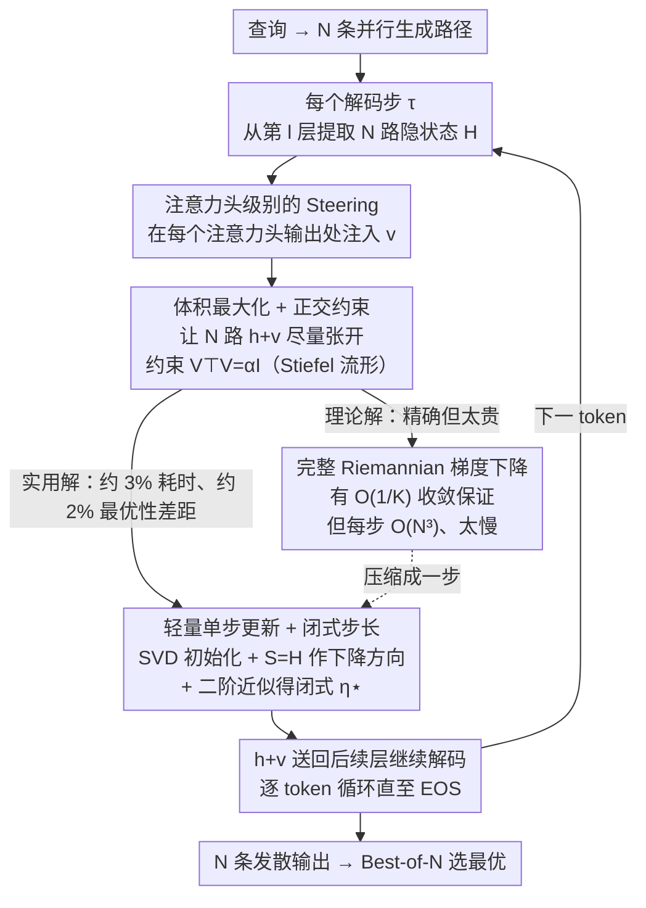

# Exploring Diverse Generation Paths via Inference-time Stiefel Activation Steering

**会议**: ICLR 2026  
**arXiv**: [2601.22010](https://arxiv.org/abs/2601.22010)  
**代码**: [https://github.com/lythk88/STARS](https://github.com/lythk88/STARS)  
**领域**: 优化  
**关键词**: activation steering, Stiefel manifold, Riemannian optimization, diverse generation, inference-time intervention  

## 一句话总结
提出 STARS（Stiefel-based Activation Steering for Diverse ReaSoning），一种 training-free 的推理时激活转向方法，在每个 token 解码时于 Stiefel 流形上联合优化 N 条并行生成路径的正交 steering 方向，最大化隐状态的几何体积以促进发散的激活轨迹，在测试用例生成（TestEval）和科学发现（LiveIdeaBench）上以极低延迟一致超越温度采样的多样性，且不损失质量。

## 研究背景与动机
**领域现状**：Best-of-N 范式（采样多个候选解再选最优）已广泛用于推理、编程和规划任务，但其效果受限于候选池的多样性。当多条并行生成路径在隐空间中收敛到相同的高概率区域时，输出仅是同一思路的不同措辞（paraphrases），增加采样预算也无法突破性能瓶颈。

**现有痛点**：
   - 温度采样 / 核采样 / beam search 等方法仅在 token 层面局部扰动概率分布，对并行运行之间**不协调**，缺乏全局多样性目标
   - 训练时方法（强化学习改目标函数）需要完整训练管线，计算成本高，且收益可能跨域不泛化
   - 现有激活转向（activation steering）技术为**收敛**设计——将单条生成推向固定预定方向，不适用于**发散**目标

**核心矛盾**：推理时多样化需要同时满足两个冲突目标——(a) 足够轻量以在每个 token 实时干预而不引入显著延迟；(b) 足够强力以在隐空间产生有意义的发散，而非仅表面差异

**本文切入角度**：将激活转向从"朝固定方向收敛"重新定义为"使多条路径彼此远离"——从控制工具变为探索引擎。在 Stiefel 流形上联合优化正交 steering 方向，最大化修改后隐状态的几何体积

## 方法详解

### 整体框架
给定一个查询，模型并行生成 $N$ 条输出序列；在每个解码步 $\tau$，STARS 从指定层 $l$ 提取所有路径的隐状态 $h_{\tau,1}^{(l)}, \ldots, h_{\tau,N}^{(l)} \in \mathbb{R}^d$，在 Stiefel 流形上联合求解一组正交的 steering 向量 $v_{\tau,i}^{(l)}$，再把修改后的隐状态 $h_i + v_i$ 送回后续层继续解码，直至所有路径触及 EOS。整个过程不改动任何权重，只在前向传播中实时插入一次几何优化，让 $N$ 条路径在隐空间彼此推开。其中"在哪儿注入"由设计 1 回答、"优化什么"由设计 2 定义、"怎么解得够快"则是设计 3 到设计 4 的演进——理论上严谨的完整算法太慢，最终被压成一次几乎免费的闭式更新。

### 关键设计

**1. 注意力头级别的 Steering：让干预落在功能特化的子空间上**

STARS 不在残差流上做整体偏移，而是把 steering 向量注入多头注意力每个头的输出处，即用 $\text{Attn}_j(x^{(l)}) + v^{(l,j)}$ 替换第 $j$ 个头的输出。这样设计是因为不同注意力头往往承担不同的功能（句法依赖、共指消解等），在头一级干预比在混合后的残差流上更有针对性，也更容易把"发散"导向语义上真正不同的方向。所有 $M$ 个头的 steering 向量拼接后构成完整的 $v^{(l)} \in \mathbb{R}^d$，其中 $d = d_h \times M$，从而后续的几何优化在整层维度上统一进行。

**2. 体积最大化 + 正交约束：把"多样性"形式化为可优化的几何目标**

要让 $N$ 条路径真正分开，STARS 最大化修改后隐状态 $\{h_i + v_i\}_{i=1}^N$ 张成的平行多面体体积——体积越大，向量越张开、越彼此独立。把矩阵记为 $H, V$，目标等价于约束优化问题 $\min_{V^\top V = \alpha I} -\log\det\big((H+V)^\top(H+V)\big)$。其中 $V^\top V = \alpha I$ 是一个 scaled Stiefel 流形约束，同时管住两件事：正交性 $v_i^\top v_j = 0$ 保证每条路径拿到方向互不重叠的扰动，而固定模长 $\|v_i\|_2^2 = \alpha$ 防止 steering 强度失控、把原本携带信息的隐状态冲垮。模长由 $\alpha = C \cdot \|H\|_2^2$ 设定，$C > 0$ 是唯一的强度超参，实验取 $C \in \{0.1, 0.5\}$。这个约束的几何直觉也很清楚：steering 向量被钉在一个"正交框架"上，而当 $d \gg N$（如 Qwen-2.5-1.5B 的 $d = 1536$、$N = 4\sim20$）时，流形维度远高于路径数，正交约束几乎不构成限制，却能为每条路径提供本质不同的干预方向。

**3. 完整 Riemannian 梯度下降：有收敛保证，但太贵**

最直接的解法是在 Stiefel 流形 $\text{St}(d, N, \alpha)$ 上做标准 Riemannian 优化（Algorithm 2）：每步先算欧氏梯度 $\nabla\ell(V_k) = -2(H+V_k)[(H+V_k)^\top(H+V_k)]^{-1}$，投影到切空间得到 Riemannian 梯度，用极分解 retraction 拉回流形，再配 Armijo 回溯线搜索保证充分下降。它带来理论上的安全感——Theorem 1 给出 $\min_{0 \le k \le K} \|\text{grad}\,\ell(V_k)\|_F^2 = O(1/K)$ 的收敛速率。但代价是每步都要算矩阵逆、平方根和线搜索，单步复杂度 $O(N^3)$，再叠加多步迭代，放到每个 token 都要执行的推理场景里完全不可接受。这也正是 STARS 真正要解决的工程难点：保留体积最大化的目标，却必须把求解成本压到接近零。

**4. 轻量单步更新 + 闭式步长：用 SVD 一次性换来 97% 的提速**

实用算法（Algorithm 3）的核心是把多步迭代砍成精心设计的一步。初始化阶段（Algorithm 1）对 $H$ 做一次 SVD $H = Q\Sigma W^\top$，从 $Q$ 的零空间基（后 $d-r$ 列）里随机抽 $N$ 列并缩放到 $\sqrt{\alpha}$ 得到 $V_0$，Proposition 1 构造性地保证了 $H + V_0$ 满秩、起点合法。搜索方向不另算梯度，而是直接取 $S = H$——用激活矩阵自身当下降方向，Proposition 3 证明它在 $V_0$ 处确实是 Riemannian 下降方向，且零额外计算。步长则对精确线搜索做二阶 Taylor 近似（Proposition 2），得到闭式解 $\eta^\star = D_1 / D_2$，其中 $D_1 = 2\sum_{i=1}^r \frac{\sigma_i^2}{\sigma_i^2 + \alpha}$、$D_2 = 4\sum_{i=1}^r \frac{\sigma_i^4}{(\sigma_i^2 + \alpha)^2}$，整个步长只由 $H$ 的奇异值决定，而奇异值在初始化的 SVD 里已经算好，因此步长计算不花一分钱。最终一步更新为 $V_1 = \sqrt{\alpha}(V_0 + \eta^\star H) W (\alpha I + (\eta^\star \Sigma)^2)^{-1/2} W^\top$，同样复用同一份 SVD 结果。经验上，这个单步版本相比多步 Algorithm 2 仅有约 2% 的最优性差距，运行时间却只占约 3%——把"有保证但太慢"的优化压缩成了"几乎免费且足够好"的一步。

## 实验关键数据

### 测试用例生成（TestEval，$N = 20$）

| 模型 | 温度 | 方法 | 语法正确率 | 总行覆盖 | 总分支覆盖 |
|------|------|------|-----------|---------|-----------|
| Gemma-1.1-2B | 0.2 | Sampling | 95.64% | 1.44% | 1.41% |
| | 0.2 | **STARS_0.5** | 78.93% | **39.03%** | **35.05%** |
| Qwen3-1.7B | 0.2 | Sampling | 8.17% | 4.71% | 4.16% |
| | 0.2 | **STARS_0.5** | 73.40% | **91.35%** | **87.13%** |

- STARS_0.5 在所有温度设置下一致大幅提升覆盖率（多样性指标）
- Qwen3-1.7B 上 STARS 同时将执行正确率从 ~3% 提升至 ~42%——说明多样化的 steering 反而帮助模型探索了更好的生成路径
- 在低温（T=0.2）场景下优势尤为明显——原始采样多样性几乎为零时 STARS 仍能产生高多样性

### 科学发现（LiveIdeaBench，$N = 4$）

| 模型 | 温度 | 方法 | Fluency（多样性）| 平均分 |
|------|------|------|-----------------|--------|
| Qwen2.5-3B | 0.2 | Sampling | 2.68 | 5.01 |
| | 0.2 | **STARS_0.5** | **5.09** | **5.59** |
| Llama-3.2-3B | 0.2 | Sampling | 3.27 | 5.27 |
| | 0.2 | **STARS_0.5** | **4.04** | **5.48** |

- Fluency（衡量多样性）：T=0.2 时 STARS 得分几乎是标准采样的 2 倍（5.09 vs 2.68）
- 关键发现：标准采样随温度降低性能急剧下降（5.71 → 5.01），而 STARS 在各温度下保持稳定
- Originality、Feasibility、Clarity 等质量指标几乎不受影响——多样性提升未以质量为代价

### 运行时间

| 任务 | 模型 | 标准采样 | Algorithm 3 | 额外开销 |
|------|------|---------|------------|---------|
| TestEval | Gemma-1.1-2B | 4.53s | 4.63s | +0.1s |
| TestEval | Qwen3-1.7B | 9.01s | 9.97s | +0.96s |
| LiveIdeaBench | Qwen2.5-3B | 3.02s | 5.01s | +1.99s |
| LiveIdeaBench | Llama-3.2-3B | 4.21s | 4.33s | +0.12s |

- 每个问题最多额外 ~2 秒——实际部署开销可忽略

## 亮点与洞察
- **问题转化精妙**：将"推理多样性"这一模糊目标形式化为 Stiefel 流形上的体积最大化问题，建立了严谨的数学框架
- **理论与实用的平衡**：Algorithm 2 提供收敛保证但不实用；Algorithm 3 用 SVD 初始化 + $H$ 作搜索方向 + 闭式步长的组合，牺牲 2% 最优性换取 97% 速度提升
- **"用激活矩阵自身做搜索方向"是天才设计**：$S = H$ 不仅是有效下降方向（Proposition 3），而且零额外计算成本，还使步长公式完全由奇异值决定
- **Training-free**：不修改模型权重，不需要对比样本，仅在推理时干预，对任意预训练模型即插即用

## 局限与展望
- 语法正确率在 STARS_0.5 下有所下降（Gemma 从 95% 降至 79%）——强 steering 可能破坏生成流畅性
- $\alpha$ 的超参需要调节（$C = 0.1$ 或 $0.5$），不同任务/模型的最优值可能不同
- 仅验证了小模型（1.5B~3B），更大模型（7B+）上的效果和开销尚未报告
- 选择哪一层做 steering 需要额外实验确定（文中 LiveIdeaBench 使用第 20 层）
- 当 $N$ 接近 $d$ 时正交约束可能过于严格（虽然实际中 $d \gg N$）
- Algorithm 3 无理论收敛保证——仅有经验验证

## 相关工作与启发
- **vs 温度 / 核采样**：这些方法在 token 级别局部扰动，STARS 在隐空间全局协调多条路径——从"随机扰动"升级为"结构化发散"
- **vs 训练时多样性方法（DPP、RL）**：STARS 是 training-free 的推理时方法，无需修改训练管线
- **vs 传统 activation steering**：传统方法用对比样本提取固定方向做收敛控制，STARS 用正交体积最大化做发散探索——设计哲学完全相反
- **启发**：Stiefel 流形上的正交约束可以推广到其他需要"结构化多样性"的场景，如集成学习的多样化、多智能体协作中的策略分化

## 评分
- 新颖性: ⭐⭐⭐⭐⭐ Stiefel 流形 + 激活转向的全新组合，将 steering 从收敛工具变为探索引擎
- 实验充分度: ⭐⭐⭐⭐ 两个 benchmark 验证，多模型多温度全面对比，但缺少大模型验证
- 写作质量: ⭐⭐⭐⭐⭐ 理论推导严谨完整，从问题建模到实用算法层层递进
- 价值: ⭐⭐⭐⭐ 为 Best-of-N 范式提供了即插即用的推理时多样性增强工具

<!-- RELATED:START -->

## 相关论文

- [\[ICLR 2026\] SCRAPL: Scattering Transform with Random Paths for Machine Learning](scrapl_scattering_transform_with_random_paths_for_machine_learning.md)
- [\[ICLR 2026\] When to Restart? Exploring Escalating Restarts on Convergence](when_to_restart_exploring_escalating_restarts_on_convergence.md)
- [\[ICLR 2026\] The Affine Divergence: Aligning Activation Updates Beyond Normalisation](the_affine_divergence_aligning_activation_updates_beyond_normalisation.md)
- [\[ICLR 2026\] COLD-Steer: Steering Large Language Models via In-Context One-step Learning Dynamics](cold-steer_steering_large_language_models_via_in-context_one-step_learning_dynam.md)
- [\[ICLR 2026\] Test-Time Meta-Adaptation with Self-Synthesis](test-time_meta-adaptation_with_self-synthesis.md)

<!-- RELATED:END -->
