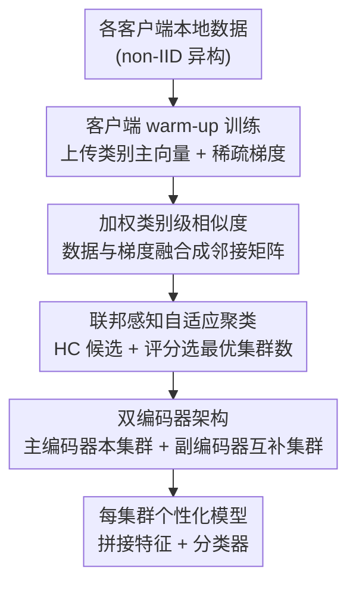

# FedDAG: Clustered Federated Learning via Global Data and Gradient Integration for Heterogeneous Environments

**会议**: ICLR 2026  
**arXiv**: [2602.23504](https://arxiv.org/abs/2602.23504)  
**代码**: [https://tinyurl.com/2rbkb3zu](https://tinyurl.com/2rbkb3zu)  
**领域**: 优化 / 联邦学习  
**关键词**: 聚类联邦学习, 数据异构性, 双编码器架构, 跨集群知识共享, 自适应聚类

## 一句话总结
提出 FedDAG 聚类联邦学习框架，通过融合数据和梯度信息进行加权类别级相似度计算来实现更准确的客户端聚类，并通过双编码器架构实现跨集群特征迁移，在多种异构性设置下一致超越现有基线。

## 研究背景与动机

**领域现状**：联邦学习（FL）通过协作训练模型而不共享数据，但客户端数据异构性（non-IID）会导致收敛慢和精度不佳。聚类 FL 通过将相似客户端分组来应对，每个集群训练自己的模型。

**现有痛点**：现有聚类 FL 方法存在四大限制：1) 仅使用数据或梯度单一信号计算相似度，不够全面；2) 知识共享限制在同一集群内，无法利用跨集群的多样化表征；3) 主要处理标签偏斜，忽视概念漂移和数量偏移；4) 需要预先指定集群数量。

**核心矛盾**：数据相似度和梯度相似度各有盲区——高维数据中梯度相似度可能产生误判，而数据相似度忽视概念漂移。单独使用任一信号都无法准确刻画客户端间的真实相似性。

**本文目标** 如何综合利用数据和梯度信息动态聚类客户端，同时允许集群间的表征共享？

**切入角度**：将相似度计算细化到类别级（class-wise），为数据和梯度信号自动学习权重，并用双编码器架构实现跨集群特征迁移。

**核心 idea**：通过类别级加权融合数据和梯度相似度进行更精准的客户端聚类，并用双编码器架构在保持集群特化的同时实现跨集群知识共享。

## 方法详解

### 整体框架
FedDAG 把聚类联邦学习串成三段流水：第一段，每个客户端先做几轮本地 warm-up 训练，把类别主向量（class-wise principal vectors）和稀疏梯度上传给服务器，服务器据此分别算出数据相似度和梯度相似度，再用一个学出来的权重把两路融成最终邻接矩阵；第二段，在这个邻接矩阵上跑层次聚类（hierarchical clustering, HC），用一个联邦感知指标从不同粒度的候选划分里选出最优集群数，同时建立一张"哪个集群该给哪个集群补特征"的互补图（CC-Graph）；第三段，每个集群模型带一对主副编码器联合训练——主编码器吃本集群数据学特化特征，副编码器按互补图从其他集群引进互补表征，两路特征拼接后过分类器。这样既保住了集群各自的特化，又把跨集群的互补信息引了进来。

### 关键设计

**1. 加权类别级相似度：让数据和梯度互相补盲区**

聚类的成败全看相似度矩阵准不准，而单看数据子空间会漏掉概念漂移（concept shift），单看梯度在高维下又容易误判。FedDAG 把 PACFL 的子空间比较细化到类别级——不再拿两个客户端的整体数据子空间硬比，而是只在同一类别内部比较各自的主向量子空间（同类不存在时主角度记为 $90°$、两边都没有时记为 $0°$），这样"同一个标签在不同客户端含义不同"的概念漂移就会自然暴露成更大的类间夹角。每个类别的相似度再按两客户端的类别样本量差异加权（应对数量偏移）。在数据信号之上，每个客户端还学一个权重 $w_i$ 来调和数据与梯度两路，最终相似度写成

$$S_{ij} = w_i \cdot S_{ij}^{data} + (1 - w_i) \cdot S_{ij}^{grad}$$

$w_i$ 通过最小化一个基于熵的损失来优化，目的是把邻接矩阵推向更锐利、更接近二值的形态，让该相似的更相似、该分开的更分开。融合而非二选一，等于让每个客户端自适应地挑出对自己最有信息量的那路信号。

**2. 联邦感知自适应聚类：不用人工预设集群数**

实际场景里根本没法提前知道该分几个集群，而层次聚类在联邦设定下又特别容易过度分裂（over-splitting）、切出一堆只有几个客户端的退化集群。FedDAG 让 HC 扫不同的合并阈值 $\alpha$ 生成一系列候选划分，再用一个新提出的联邦感知指标给每个划分打分：指标由两项构成——紧凑度损失 $\mathcal{L}_1$ 奖励集群内部聚得紧，退化惩罚 $\mathcal{L}_2$ 压制过小的集群。和传统指标（如惯性，集群越多损失越低）不同，这个损失在集群数下降时反而可能因为出现小集群而陡增，于是最优解落在"损失低且集群数不大"的那个 $\alpha^*$ 上，在"分得够细"和"别分得太碎"之间自动找平衡。

**3. 双编码器架构：把集群特化和跨集群互补分到两条通道**

现有方法要么把知识共享锁死在集群内部、白白浪费别的集群的多样表征，要么用软聚类让客户端混搭多个集群模型、把噪声也混了进来。FedDAG 给每个集群模型配主编码器 $\phi^{(1)}$ 和副编码器 $\phi^{(2)}$，并据上一步的互补图 $H$ 决定哪个集群给哪个集群供特征（$H_{p,q}$ 高表示集群 $q$ 在某些类上和 $p$ 互补且对齐得好）。训练分两个交替的相位：主相位里，主编码器参数 $\Theta_z^{1f}$ 和分类器 $\Theta_z^c$ 用本集群客户端的聚合更新来训、副编码器冻结，专注学集群内特化特征；次相位里，请求方集群把当前副编码器汇总后送到源集群、由源集群客户端在本地数据上训练再回传梯度，从而把外部视角灌进 $\Theta_z^{2f}$。两路输出在特征维度上拼接后送进分类器

$$F_z(\cdot) = \psi\big(\phi^{(1)}(\cdot; \Theta_z^{1f}),\, \phi^{(2)}(\cdot; \Theta_z^{2f});\, \Theta_z^c\big)$$

为避免主副编码器学出冗余特征，主编码器用第一段 warm-up 时已部分收敛的本地特征提取器来初始化（warm-up 不浪费）。结构上的分离保证了跨集群知识是"并列引入"而不是"混合污染"，集群既能保住自己的特化，又能借到别人的互补信息。

训练侧整体仍是标准配置：每个集群内用交叉熵损失聚合，相似度权重的优化靠前面提到的熵正则把邻接矩阵往二值推。通信上传的梯度做 $k$-稀疏化压缩，且相似度阶段每个客户端只需算一个模型的梯度；双编码器多出的开销（副编码器与主编码器等大）可通过"主编码器训几轮、副编码器训一轮"的交替排程摊薄。

## 实验关键数据

### 主实验

| 算法 | 技术 | CIFAR-10 | FMNIST |
|------|------|----------|--------|
| PACFL | 数据 (D) | 90.45±0.30 | 94.41±0.31 |
| CFL | 梯度 (G) | 72.80±0.66 | 86.97±0.23 |
| IFCA | 梯度 (G) | 89.68±0.17 | 94.03±0.09 |
| **FedDAG** | **D+G+全局特征共享** | **94.53±0.12** | **96.82±0.18** |

### 消融实验

| 配置 | CIFAR-10 | 说明 |
|------|----------|------|
| FedDAG (完整) | 94.53 | 完整框架 |
| 仅数据相似度 | ~91.0 | 退化为 PACFL++ |
| 仅梯度相似度 | ~88.5 | 退化为改进版 CFL |
| 无双编码器 | ~92.0 | 无跨集群特征 |
| 无自适应聚类数 | ~93.0 | 使用预设聚类数 |

### 关键发现
- FedDAG 在 CIFAR-10 上比最强基线 PACFL 高出 4+ 个百分点
- 数据和梯度信号的融合一致性优于单一信号，尤其在概念漂移场景下
- 双编码器架构相比单编码器带来 2-3% 的提升，跨集群知识共享确实有价值
- 在标签偏斜、特征偏斜、概念漂移和数量偏移四种异构类型下都有效

## 亮点与洞察
- **类别级相似度计算**：将相似度细化到类别维度是处理概念漂移的自然方式，比整体子空间比较更鲁棒
- **双编码器的职责分离设计**：主副编码器各自专注不同信号来源，避免了软聚类方法中的噪声混合问题

## 局限与展望
- 双编码器增加了模型参数和计算开销
- 类别级比较在类别数很多时计算成本增长
- 依赖客户端上传少量信息进行相似度计算，虽然压缩但仍有隐私风险
- 未在真实联邦场景（如跨设备 FL）中测试

## 相关工作与启发
- **vs PACFL**: PACFL 用主角度比较整体子空间，FedDAG 改为类别级比较+加权融合，更全面
- **vs FedSoft/FedRC**: 它们通过软聚类让客户端混合多个集群模型，可能引入噪声；FedDAG 的双编码器在结构上分离了两个信号来源

## 评分
- 新颖性: ⭐⭐⭐⭐ 类别级融合和双编码器是合理但增量式创新
- 实验充分度: ⭐⭐⭐⭐⭐ 四种异构类型的评估较全面
- 写作质量: ⭐⭐⭐⭐ 内容充实但结构略显复杂
- 价值: ⭐⭐⭐⭐ 对聚类 FL 有实际改进，但场景较为特定

<!-- RELATED:START -->

## 相关论文

- [\[ICLR 2026\] Incentives in Federated Learning with Heterogeneous Agents](incentives_in_federated_learning_with_heterogeneous_agents.md)
- [\[AAAI 2026\] SMoFi: Step-wise Momentum Fusion for Split Federated Learning on Heterogeneous Data](../../AAAI2026/optimization/smofi_step-wise_momentum_fusion_for_split_federated_learning_on_heterogeneous_da.md)
- [\[ICML 2026\] Adaptive Estimation and Inference in Semi-parametric Heterogeneous Clustered Multitask Learning via Neyman Orthogonality](../../ICML2026/optimization/adaptive_estimation_and_inference_in_semi-parametric_heterogeneous_clustered_mul.md)
- [\[ICCV 2025\] Federated Prompt-Tuning with Heterogeneous and Incomplete Multimodal Client Data](../../ICCV2025/optimization/federated_prompt-tuning_with_heterogeneous_and_incomplete_multimodal_client_data.md)
- [\[ICML 2026\] Learning Locally, Revising Globally: Global Reviser for Federated Learning with Noisy Labels](../../ICML2026/optimization/learning_locally_revising_globally_global_reviser_for_federated_learning_with_no.md)

<!-- RELATED:END -->
