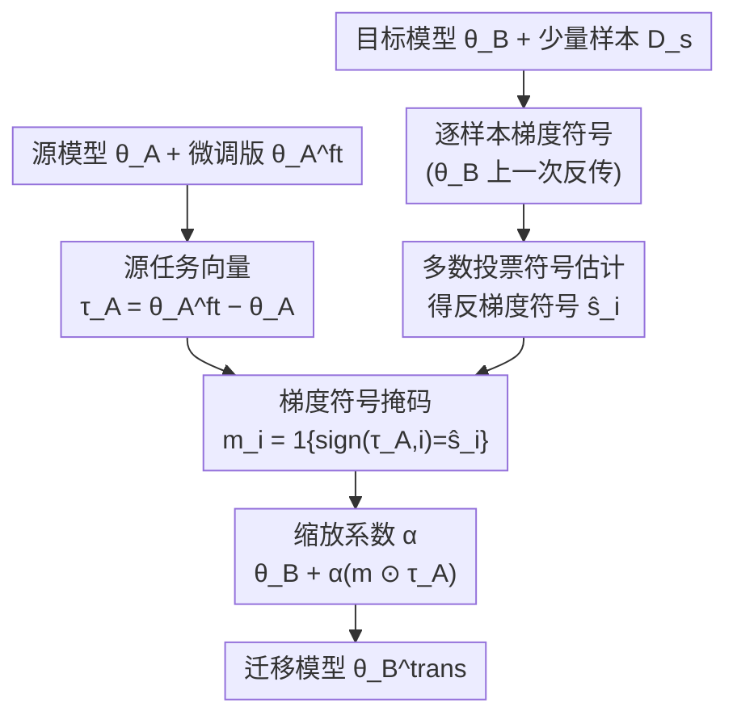

# Gradient-Sign Masking for Task Vector Transport Across Pre-Trained Models

**会议**: ICLR 2026  
**arXiv**: [2510.09658](https://arxiv.org/abs/2510.09658)  
**代码**: [GitHub](https://github.com/fillo-rinaldi/GradFix)  
**领域**: 自监督学习 / 模型合并 / 迁移学习  
**关键词**: 任务向量, 模型合并, gradient masking, 基础模型, 迁移学习

## 一句话总结

提出 GradFix 方法，利用目标预训练模型上极少量样本计算的梯度符号构建二值掩码，逐坐标过滤源模型的任务向量，仅保留与目标损失景观下降方向一致的分量，在无需任何微调的情况下实现跨预训练模型的任务知识迁移，理论上提供严格的一阶下降保证，在视觉与语言基准上均大幅超越朴素迁移和少样本微调。

## 研究背景与动机

**领域现状**：深度学习已全面转向"预训练 + 微调"范式。Task Arithmetic 证明任务向量（微调参数与预训练参数之差 $\tau = \theta^{ft} - \theta^{0}$）可以通过线性加减操作在同一预训练模型上组合多种能力。Model Rebasin 研究则试图通过排列对齐将不同预训练模型映射到同一损失盆地，使参数可以跨模型比较。

**现有痛点**：基础模型不断迭代更新（更多数据、更好训练策略），每次更新后用户都需要在新模型上重复微调，之前在旧模型上积累的微调成果无法直接复用。朴素地将旧模型的任务向量 $\tau_A$ 加到新模型 $\theta_B$ 上基本不起作用，性能近似于零样本水平——因为两个预训练模型的参数空间不对齐，任务向量中大量分量在新模型的损失景观上属于"有害方向"，会增加而非减小损失。

**核心矛盾**：任务向量 $\tau_A$ 编码了真实有价值的任务适应信息，但其中的"好分量"和"坏分量"相互混杂。现有方法如 TransFusion 尝试用排列匹配做参数对齐，但这种方法的改进幅度有限，且计算复杂度较高。核心问题是：**如何高效识别哪些坐标是可迁移的、哪些坐标会产生负迁移？**

**切入角度**：作者的关键洞察来自分布式优化文献——SignSGD 表明梯度的符号信息足以指示可靠的下降方向。既然目标模型 $\theta_B$ 上的反梯度方向 $-\mathbf{g}$ 指示了局部最优的参数更新方向，那么只保留任务向量中与 $-\mathbf{g}$ 符号一致的坐标，就能过滤掉所有有害分量。更进一步，多数投票法允许仅用极少量标注样本就能稳定估计梯度符号。

**核心 idea**：用目标模型上少量样本估计的梯度符号做二值掩码，保留源任务向量中符号对齐的分量、丢弃不对齐的分量，"一步到位"完成跨模型任务迁移。

## 方法详解

### 整体框架

输入包含三部分：源预训练模型 $\theta_A$ 及其微调版本 $\theta_A^{ft}$、目标预训练模型 $\theta_B$、以及目标任务的少量标注样本 $\mathcal{D}_s$。整个流程分两条支路汇合：源支路只做一次减法得到任务向量 $\tau_A = \theta_A^{ft} - \theta_A$；目标支路在 $\theta_B$ 上对 $\mathcal{D}_s$ 逐样本算梯度符号、再做多数投票得到每个坐标的反梯度符号估计 $\hat{s}_i$。两条支路在「梯度符号掩码」处汇合——逐坐标比对 $\text{sign}(\tau_{A,i})$ 与 $\hat{s}_i$ 是否一致，构成二值掩码 $\mathbf{m}$，再乘缩放系数 $\alpha$ 加回目标模型，得到迁移后的 $\theta_B^{trans} = \theta_B + \alpha(\mathbf{m} \odot \tau_A)$。全程不含任何参数更新/微调，仅需一次前向-反向传播来收集符号。

### 关键设计

**1. 梯度符号掩码：逐坐标过滤掉会让目标损失上升的分量**

朴素迁移失败的根源在于 $\tau_A$ 里混着大量在 $\theta_B$ 损失景观上指向"上坡"的坐标。理想的过滤需要目标模型的真实任务向量 $\tau_B$（oracle）来做符号比对，但拿到 $\tau_B$ 必须完整微调目标模型，恰恰是要避免的代价。作者的破局点是：若目标模型只做一步全批量梯度下降，其任务向量就正比于反梯度 $-\mathbf{g}$，于是反梯度的符号可以充当 $\tau_B$ 符号的廉价代理。据此构建二值掩码

$$m_i = \mathbb{1}\{\text{sign}(\tau_{A,i}) = \text{sign}(-g_i)\},$$

符号对齐的坐标保留原值，不对齐的坐标直接置零。这一过滤之所以可靠，是因为它带来严格的一阶下降保证：每个保留坐标都满足 $g_i \cdot (m_i \tau_{A,i}) = -|g_i||\tau_{A,i}| \leq 0$，累加得整体内积 $\mathbf{g}^\top \delta^A = -\alpha \sum_i m_i |g_i||\tau_{A,i}| \leq 0$，因此对充分小的 $\alpha$，掩码后的更新方向必然降低目标损失——不存在被混入的有害分量把损失推高。

**2. 多数投票符号估计：用每类 1-5 个样本就稳住梯度符号**

真实梯度 $\mathbf{g}$ 需要数据来估计，而跨模型迁移的卖点正是"几乎不用标注数据"，所以符号估计必须在极少样本下也稳。做法是对 $\mathcal{D}_s$ 中每个样本独立算单样本梯度、取其符号当作"一票"，再按坐标做多数投票：

$$\hat{s}_i = \text{sign}\Big(-\sum_n \text{sign}\big(\nabla_\theta \ell(f_{\theta_B}(x_n), y_n)\big)\Big).$$

它与"先平均梯度再取符号"的均值聚合本质不同——只看每个坐标符号为正/负的票数，完全忽略幅值，因此个别异常大的梯度无法翻转结论，鲁棒性更好。理论上用 Hoeffding 不等式可证：只要单样本符号正确的概率 $p_i > 1/2$，多数投票恢复真实符号的概率至少为 $1 - \exp(-2N(p_i - 1/2)^2)$，随样本数 $N$ 指数级收敛。这正解释了为何每类仅 1-2 个样本也足以给出可用的掩码。

**3. 缩放系数 $\alpha$：在迁移幅度与一阶近似有效区间之间取尺度**

掩码定了"保留哪些坐标"，$\alpha$ 定"沿这些坐标走多远"，最终更新为 $\theta_B^{trans} = \theta_B + \alpha(\mathbf{m} \odot \tau_A)$，$\alpha \in (0, 1]$ 由验证集选定。下降保证严格来说只对"充分小的 $\alpha$"成立——步子太大就跨出一阶近似、高阶项可能反噬。但配合多数投票后，性能在很宽的 $\alpha$ 区间里保持平稳，没有突然跌落；相比之下均值聚合在 $\alpha$ 偏大时容易因符号翻转导致性能骤降。因此实际可用的 $\alpha$ 范围相当宽，几乎不需要精细调参。

### 训练策略

GradFix 严格来说没有"训练"过程——它是一个不含参数更新的单步迁移方法。整个流程仅需在 $\theta_B$ 上对 $|\mathcal{D}_s|$ 个样本做一次前向-反向传播来收集梯度符号，然后进行逐坐标掩码和加法操作。与少样本微调相比，GradFix 不需要设置学习率调度、迭代次数等超参，计算量低一到两个数量级。

## 实验关键数据

### 主实验：视觉跨预训练模型迁移（ViT-B/16，每类 2 个样本）

| 方法 | EuroSAT | SVHN | GTSRB | RESISC45 | DTD | 说明 |
|------|---------|------|-------|----------|-----|------|
| $\theta_B$ zero-shot | 49.41 | 50.58 | 48.29 | 67.98 | 55.96 | 下界 |
| $\theta_B + \tau_A$（直接加） | 49.58 | 50.84 | 49.31 | 67.87 | 56.27 | 几乎无效 |
| TransFusion | 50.12 | 53.26 | 50.24 | 67.99 | 56.70 | 排列对齐，改进微弱 |
| 少样本微调 $\theta_B^{opt}$ | 59.49 | 62.01 | 61.70 | 71.20 | 57.00 | 同等数据量微调 |
| **GradFix** $\theta_B + \delta^A$ | **65.07** | **70.19** | **64.33** | **71.42** | **58.51** | 全面领先少样本微调 |
| Oracle $\theta_B + \delta^\star$ | 95.06 | 92.04 | 82.92 | 87.06 | 71.44 | 上界（需已知 $\tau_B$） |
| $\theta_B$ 全量微调 | 98.70 | 97.45 | 98.65 | 95.66 | 83.19 | 理论上界 |

### NLP 跨模型迁移（T5v1.1 → FLAN-T5，每类 50 个样本）

| 方法 | SNLI | MNLI | RTE | QNLI | SCITAIL | AVG |
|------|------|------|-----|------|---------|-----|
| $\theta_B$ zero-shot | 34.24 | 35.21 | 47.20 | 50.54 | 50.38 | 43.51 |
| $\theta_B + \tau_A$ | 31.61 | 30.75 | 47.36 | 50.52 | 50.46 | 42.12 |
| 少样本微调 | 35.09 | 26.05 | 47.29 | 51.45 | 51.78 | 42.33 |
| **GradFix** | **68.06** | **49.68** | **54.25** | **60.50** | **59.89** | **58.48** |
| $\theta_B$ 全量微调 | 88.20 | 86.30 | 84.40 | 92.79 | 95.32 | 89.40 |

### 掩码策略消融（ViT-B/16，每类 1 样本）

| 掩码策略 | EuroSAT | GTSRB | SVHN | AVG | 说明 |
|---------|---------|-------|------|-----|------|
| 符号一致（GradFix） | 61.94 | 60.89 | 71.07 | 64.45 | 仅保留符号对齐分量 |
| 符号强制 | 61.32 | 60.91 | 70.52 | 64.18 | 翻转不一致符号，噪声放大 |
| 幅值加权 | 49.51 | 49.20 | 50.71 | 54.70 | 同时匹配幅值，过度过滤 |
| 随机掩码 | 49.49 | 48.41 | 50.54 | 54.50 | 无信号基线 |

### 关键发现

- **朴素迁移完全失败**：直接加 $\tau_A$ 到 $\theta_B$ 的效果与零样本基本相同，确认了参数空间不对齐导致的负迁移问题
- **GradFix 全面超越少样本微调**：使用相同的标注预算，GradFix 在 ViT-B/16 和 ViT-L/14 上均优于少样本微调 $\theta_B^{opt}$，而且方差更小、鲁棒性更强
- **NLP 上改进更大**：在 T5v1.1→FLAN-T5 迁移中，GradFix 相对朴素迁移的提升更为显著，说明当源-目标预训练差异较大时符号过滤的价值更高
- **幅值信息不可迁移**：即使在 Oracle 设置下，利用幅值的掩码策略也远逊于纯符号掩码。这揭示了一个深刻洞察：跨预训练模型时方向信息可迁移、但幅值高度依赖于各自的损失几何
- **多数投票优于均值**：在宽范围的 $\alpha$ 上表现一致稳定，不会因个别异常梯度导致符号翻转
- **模型合并兼容**：GradFix 可以与 Task Arithmetic 和 TIES-Merging 结合。多任务设置中 Merge-then-Mask（先合并再掩码）效果最佳（AVG 66.02）；多源设置中 Mask-then-Merge（先掩码再合并）效果最佳（AVG 67.41）

## 亮点与洞察

- **理论-实践完美闭合**：一阶下降保证从 Taylor 展开出发仅需几行推导即可得到，但它精准预测了实验行为——所有保留的坐标确实在降低损失。这种"简洁理论 + 强实验验证"的风格值得学习
- **"方向可迁移、幅值不可迁移"的洞察**：这是本文最深刻的发现之一。它说明不同预训练模型在参数空间中学到了相似的"任务应该往哪个方向走"的信息，但"走多远"是高度局部于各自损失盆地的。这个洞察可以指导未来所有基于参数操作的模型合并和迁移方法
- **零微调设计极具实用性**：整个方法不需要任何参数更新循环，仅一次前向-反向传播即可完成。这使得它在计算资源受限或需要快速适配的场景下极具价值，比如边缘部署场景下基础模型更新后的快速任务迁移

## 局限与展望

- **只做过滤不做修正**：GradFix 丢弃了所有符号不一致的坐标，但其中部分坐标可能包含有价值的任务信息，只是幅值或方向需要调整。未来可以探索"软掩码"或对不一致坐标做方向修正而非简单丢弃
- **架构必须完全相同**：源和目标模型必须是同一架构（参数数量和结构一一对应），限制了跨架构迁移的适用性
- **$\alpha$ 仍需验证集**：缩放系数是唯一的超参，虽然对多数投票法来说敏感度较低，但仍需要验证数据来选择
- **Oracle 差距仍大**：GradFix（AVG ~65）与 Oracle（AVG ~86）之间仍有 20+ 个百分点差距，说明少样本梯度符号估计仍是较粗糙的近似，更好的符号估计策略有望进一步缩小差距
- **未探索与 LoRA 等参数高效微调的结合**：任务向量来自全参数微调，如果源模型用 LoRA 微调，低秩任务向量的迁移性是否有所不同值得研究

## 相关工作与启发

- **vs TransFusion**：TransFusion 尝试用排列匹配做参数空间对齐（rebasin），计算更复杂但改进微弱（仅略优于直接加法）。GradFix 完全跳过参数对齐步骤，直接在目标模型的损失景观上做局部过滤，思路更简洁、效果更好
- **vs TIES-Merging**：TIES 通过符号一致性解决多任务向量合并中的参数冲突，但它的"符号"来自任务向量本身。GradFix 的"符号"来自目标模型的梯度，这是本质差异——前者解决任务间冲突，后者解决跨模型对齐
- **vs SignSGD**：GradFix 本质上可以看作 SignSGD 思想在模型合并/迁移领域的创新应用。SignSGD 用符号信息压缩梯度通信，GradFix 用符号信息过滤任务向量，都利用了"符号比幅值更鲁棒"这个共同洞察

## 评分

- 新颖性: ⭐⭐⭐⭐ 梯度符号掩码的想法简洁优雅，但本质上是 SignSGD 思想的迁移应用
- 实验充分度: ⭐⭐⭐⭐⭐ 视觉+语言两个领域、单任务+多任务+多源三种设置、四种掩码策略对比、理论分析完备
- 写作质量: ⭐⭐⭐⭐⭐ 动机-理论-实验逻辑链条清晰，从 Oracle 推导到实际方法的过渡自然流畅
- 价值: ⭐⭐⭐⭐ 实用性强、方法轻量，但适用范围限于同架构迁移，且与 Oracle 差距仍较大

<!-- RELATED:START -->

## 相关论文

- [\[ICML 2025\] Adjustment for Confounding using Pre-Trained Representations](../../ICML2025/optimization/adjustment_for_confounding_using_pre-trained_representations.md)
- [\[ICLR 2026\] Saddle-to-Saddle Dynamics Explains A Simplicity Bias Across Neural Network Architectures](saddle-to-saddle_dynamics_explains_a_simplicity_bias_across_neural_network_archi.md)
- [\[ICML 2025\] Provable In-Context Vector Arithmetic via Retrieving Task Concepts](../../ICML2025/optimization/provable_in-context_vector_arithmetic_via_retrieving_task_concepts.md)
- [\[ICLR 2026\] COLD-Steer: Steering Large Language Models via In-Context One-step Learning Dynamics](cold-steer_steering_large_language_models_via_in-context_one-step_learning_dynam.md)
- [\[ICLR 2026\] Neural Networks Learn Generic Multi-Index Models Near Information-Theoretic Limit](neural_networks_learn_generic_multi-index_models_near_information-theoretic_limi.md)

<!-- RELATED:END -->
