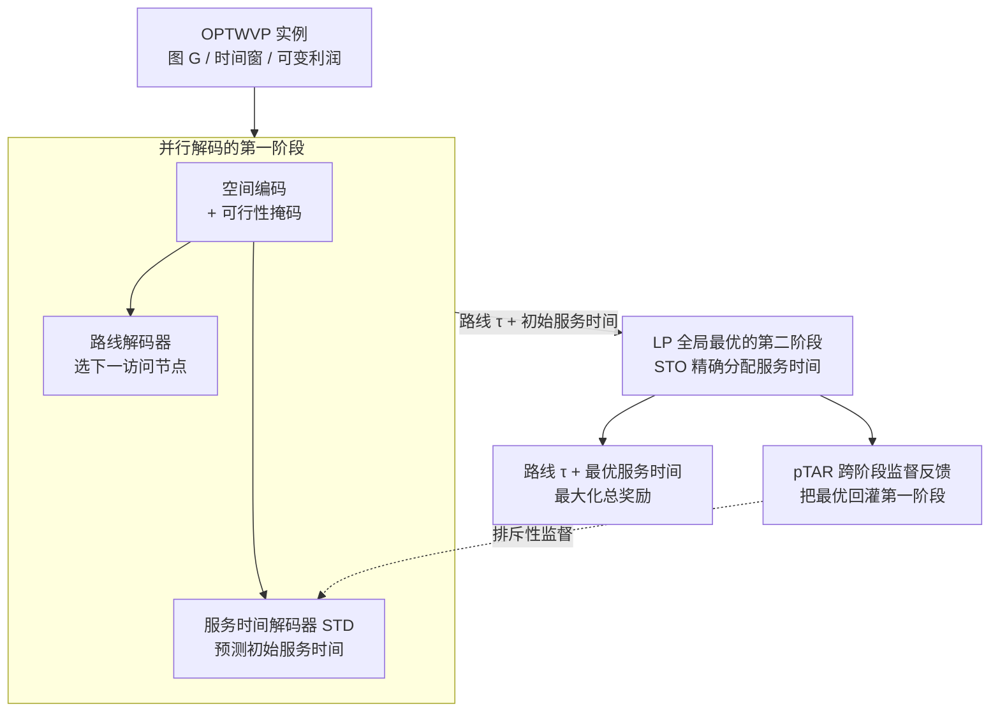

# Learning to Solve Orienteering Problem with Time Windows and Variable Profits

**会议**: ICLR 2026  
**arXiv**: [2603.06260](https://arxiv.org/abs/2603.06260)  
**代码**: [GitHub](https://github.com/SwonGao/DeCoST)  
**领域**: 组合优化/车辆路径  
**关键词**: 定向问题, 时间窗, 可变利润, 离散-连续解耦, 线性规划

## 一句话总结

提出DeCoST——一种学习式两阶段框架，将OPTWVP中耦合的离散路线决策和连续服务时间分配解耦：第一阶段并行解码器联合生成路径+初始服务时间，第二阶段LP精确优化服务时间(全局最优)，通过pTAR反馈实现跨阶段协调。在50-500节点OPTWVP上优化间隙仅0.83%-3.31%，推理速度比元启发式快最高45倍。

## 研究背景与动机

**领域现状**：定向问题(OP)是VRP的重要变体，需要在固定时间预算内选择节点子集访问以最大化奖励。实际场景中——工厂调度、物流运输、机器人规划——奖励通常随服务时间增长(可变利润)，且节点仅在特定时间窗内可访问。这催生了OPTWVP：同时优化离散路线和连续服务时间分配。

**现有痛点**：

1. **离散-连续耦合**：路线变化→重塑所有节点的可行服务时间区间→反过来影响奖励和路线决策→双向依赖导致联合搜索空间指数膨胀
2. **NCO方法的局限**：现有神经组合优化(NCO)方法仅处理离散路线选择，不具备连续变量(服务时间)的分配能力
3. **分解方法的短视性**：简单分解→第一阶段路线决策无法预见最优服务时间→后续局部调整不足以纠正结构偏差
4. **元启发式的可扩展性**：手动设计启发规则+穷举局部搜索→每次路线变化需重新求解连续子问题→计算代价高

**核心矛盾**：离散路线和连续服务时间本质上相互依赖，但联合优化计算不可行，而简单解耦又导致短视决策。

**本文方案**：智能解耦+跨阶段协调。第一阶段感知连续变量(并行解码路线+时间)→第二阶段精确优化(LP全局最优)→pTAR反馈让第一阶段"预见"第二阶段后果。

## 方法详解

### 整体框架

DeCoST把OPTWVP建模为约束马尔可夫决策过程(CMDP)，并将原本耦合的优化拆成两个阶段：第一阶段用并行解码器一次性吐出离散路线和初始服务时间，第二阶段固定路线后用线性规划把连续的服务时间分配推到全局最优，再用一个跨阶段反馈信号把第二阶段的最优结果回灌给第一阶段，避免它做出短视的路线决策。每一步的动作同时包含选哪个节点和归一化的服务时间比 $a_i = (v^{(i)}, d_{v^{(i)}}/d_{v^{(i)}\max})$，整体目标是最大化期望总奖励 $\max_{\pi_\theta} J_r(\pi_\theta) = \mathbb{E}_{(\tau,\mathbf{d})\sim\pi_\theta}[R(\tau, \mathbf{d}|\mathcal{G})]$，其中 $R(\tau, \mathbf{d}|\mathcal{G}) = \sum_{i=1}^{l-1} p_{v^{(i)}} d_{v^{(i)}}$，并受时间预算、服务时间上限和时间窗约束。

### 关键设计

**1. 并行解码的第一阶段：让路线决策提前感知服务时间**

纯路线导向的构造式求解器在选节点时看不到后续服务时间的收益，容易选出结构上无法分配好时间的路径。DeCoST在第一阶段并排放两个解码器：基于注意力的路线解码器负责选下一个访问节点，服务时间解码器(Service Time Decoder, STD)同步预测对应的初始服务时间，于是路线决策在生成的当下就已经把服务时间的影响考虑进去。为了让模型更懂图结构，空间编码(Spatial Encoding)把边特征(节点间距离)编成注意力偏置注入；可行性掩码(Feasibility Masking)则在每一步动态剔除违反约束的候选节点——既排除那些选了之后无法在时间预算内返回起点的节点，也排除到达时间会超出自身时间窗的节点，保证生成的路径始终合法、并大幅压缩搜索空间。

**2. LP 全局最优的第二阶段：固定路线后精确分配服务时间**

一旦路线 $\tau$ 固定，剩下的连续服务时间分配恰好退化成一个线性规划 $\max_{\mathbf{s},\mathbf{d}} \mathbf{p}^T \mathbf{d}$，约束为 $\mathbf{s}^- \leq \mathbf{s} \leq \mathbf{s}^+$、$\mathbf{0} \leq \mathbf{d} \leq \mathbf{d}_{\max}$ 以及 $(I-U)\mathbf{s} + \mathbf{d} + \mathbf{t} \leq \mathbf{0}$。作者没有调用通用 LP 求解器，而是提出服务时间优化(Service Time Optimization, STO)算法用贪心策略求解：把节点按单位利润从高到低排序，依次给每个节点分配最大可行服务时间，再更新后续节点的起始时间。论文严格证明了这一贪心解就是该 LP 的全局最优(Theorem 4.1)，而且整个过程支持并行计算，因此第二阶段既精确又快——这也是消融里把 Gap 从 23.0% 锐降到 2.28% 的关键组件。

**3. pTAR 跨阶段监督反馈：把第二阶段的最优回灌给第一阶段**

解耦的风险是第一阶段意识不到第二阶段会怎么重新分配时间，做出看似合理却注定低效的路线。为此作者定义利润加权时间分配比(profit-weighted Time Allocation Ratio, pTAR) $pTAR(\mathbf{d}) = \sum_{i \in \tau} \frac{p_i d_i}{t_i}$ 来衡量一条解的利润效率——它度量单位旅行成本能换回多少奖励，越高代表越偏向"低旅行代价、高回报"的区域。基于它，作者加一个排斥性监督损失 $\mathcal{L}_{pTAR} = -(pTAR(\hat{\mathbf{d}}) - pTAR(\mathbf{d}^*))^2$，刻意拉开 STD 预测 $\hat{\mathbf{d}}$ 与某条路线下 LP 条件最优 $\mathbf{d}^*$ 的距离。这样做是因为不同路线对应不同的条件最优，若让 STD 早早收敛到某个条件最优反而会锁死探索；排斥项促使第一阶段去"预见"第二阶段的后果、广泛探索策略，而非简单复制某个条件最优。最终训练目标把 REINFORCE 损失和 pTAR 损失加权组合：$\mathcal{L}_{total} = \beta_1 \mathcal{L} + \beta_2 \mathcal{L}_{pTAR}$。

## 实验关键数据

### 主实验：不同规模OPTWVP性能

| 方法 | 类别 | n=50,TW100 Score(Gap) | n=100,TW100 Score(Gap) | n=50,TW500 Score(Gap) |
|------|------|----------------------|----------------------|----------------------|
| B&C (Gurobi) | 精确 | 15.2 (0.00%) | 26.1 (0.00%) | 51.9 (0.00%) |
| Greedy-PRS | 启发式 | 12.9 (15.7%) | 21.9 (16.2%) | 46.1 (11.4%) |
| ILS | 元启发式 | 14.5 (4.34%) | 24.9 (4.2%) | 47.8 (7.82%) |
| POMO | NCO | 11.3 (25.3%) | 11.5 (55.7%) | 31.3 (39.6%) |
| GFACS | NCO | 12.3 (18.6%) | 25.2 (3.38%) | 47.4 (8.57%) |
| **DeCoST** | **NCO** | **15.1 (1.06%)** | **25.6 (1.97%)** | **51.4 (0.83%)** |

DeCoST在所有设置下优化间隙最小(0.83%-3.31%)，远优于其他NCO和元启发式方法。POMO因不处理服务时间而表现最差(Gap达55.7%)。

### 大规模实验(n=500, TW=100)

| 方法 | Score | Gap | Runtime (ms) |
|------|-------|-----|-------------|
| B&C (Gurobi) | 82.3 | 0.00% | 68,400 |
| ILS | 78.2 | 4.98% | 8,803 |
| POMO | 58.6 | 28.8% | 747 |
| **DeCoST** | **79.6** | **3.31%** | **1,329** |

500节点规模下，DeCoST仍保持3.31%的优化间隙，推理速度比ILS快6.6倍，比Gurobi快51倍。

### 消融实验(n=50, TW=100)

| 配置 | SE | STO | SL | Score | Gap |
|------|----|----|-----|-------|-----|
| 基线(POMO) | ✗ | ✗ | ✗ | 11.3 | 25.3% |
| +空间编码 | ✓ | ✗ | ✗ | 11.6 | 23.0% |
| +STO | ✓ | ✓ | ✗ | 14.9 | 2.28% |
| **DeCoST(完整)** | **✓** | **✓** | **✓** | **15.1** | **1.06%** |

STO是最关键组件，将Gap从23.0%锐降至2.28%；pTAR监督进一步降至1.06%。

## 亮点与洞察

- **"解耦但协调"的设计哲学**：不是简单分开两个优化问题，而是通过pTAR反馈实现两阶段的信息互通——比联合优化更高效，比独立优化更好
- **LP全局最优性的巧妙利用**：固定路线后连续部分有精确LP解，这是OPTWVP特有结构的"幸运"——但关键在于发现并证明了这一点
- **对NCO领域的扩展意义**：大多数NCO只处理纯离散问题，DeCoST首次系统解决离散-连续混合优化的NCO，填补了重要空白
- **STO可作为通用插件**：DeCoST的第二阶段可与不同的第一阶段构造式求解器组合，一致提升各种基线的解质量

## 局限性

- LP全局最优性依赖于线性利润函数假设(非线性利润需要非线性规划)
- 大规模实例(n=500)的Gap仍有3.31%，存在改进空间
- pTAR的权衡参数 $\beta_1, \beta_2$ 需要手动调节

## 评分

- 新颖性: ⭐⭐⭐⭐ 两阶段解耦+LP最优+pTAR跨阶段反馈
- 实验充分度: ⭐⭐⭐⭐ 多规模+多时间窗+vs精确/启发式/NCO+消融
- 写作质量: ⭐⭐⭐⭐ 问题定义清晰，数学严谨
- 价值: ⭐⭐⭐⭐ 对带连续变量的组合优化有直接应用价值

<!-- RELATED:START -->

## 相关论文

- [\[ICML 2026\] On the Expressive Power of GNNs to Solve Linear SDPs](../../ICML2026/optimization/on_the_expressive_power_of_gnns_to_solve_linear_sdps.md)
- [\[ICLR 2026\] Test-Time Meta-Adaptation with Self-Synthesis](test-time_meta-adaptation_with_self-synthesis.md)
- [\[ICLR 2026\] Exploring Diverse Generation Paths via Inference-time Stiefel Activation Steering](exploring_diverse_generation_paths_via_inference-time_stiefel_activation_steerin.md)
- [\[ICLR 2026\] CogFlow: Bridging Perception and Reasoning through Knowledge Internalization for Visual Mathematical Problem Solving](cogflow_bridging_perception_and_reasoning_through_knowledge_internalization_for_.md)
- [\[ICML 2026\] Test time training enhances in-context learning of nonlinear functions](../../ICML2026/optimization/test_time_training_enhances_in-context_learning_of_nonlinear_functions.md)

<!-- RELATED:END -->
