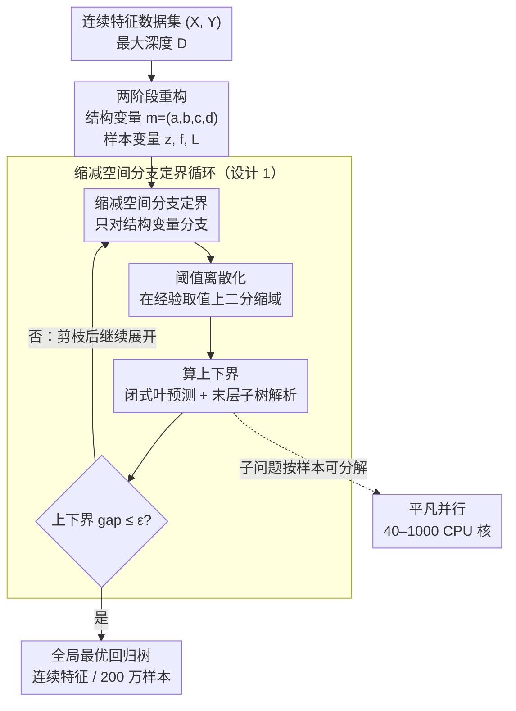

# RS-ORT: A Reduced-Space Branch-and-Bound Algorithm for Optimal Regression Trees

**会议**: ICLR 2026  
**arXiv**: [2510.23901](https://arxiv.org/abs/2510.23901)  
**领域**: 优化  
**关键词**: 最优决策树, 回归树, 分支定界, 混合整数规划, 可解释机器学习

## 一句话总结

提出 RS-ORT 算法，通过将回归树训练重构为两阶段优化问题并在缩减空间上进行分支定界（仅对树结构变量分支），结合闭式叶预测、阈值离散化和精确末层子树解析等加速策略，首次在包含连续特征的 200 万样本数据集上实现了有全局最优性保证的回归树学习。

## 研究背景与动机

决策树因其强可解释性广泛应用于医疗、金融等高风险领域。传统启发式方法（ID3、C4.5、CART）容易产生次优解，而真正的最优决策树是 NP-complete 问题。

**现有最优回归树方法的局限**：

**MIP 方法**（Bertsimas & Dunn 2019）：可保证全局最优但计算不可扩展，搜索空间与样本量相关

**DPB 方法**（Zhang et al. 2023, 当前 SOTA）：可扩展到 200 万样本，但**必须将连续特征二值化**，损失了全局最优性且可能导致不必要的深树

**进化搜索**（evtree）：无最优性保证

**其他 MIP 变体**：限制树的大小或分裂数量以保证可扩展性

**核心挑战**：连续特征使回归树的搜索空间急剧膨胀。即使对于深度 $D=2$、$n=1030$、$P=8$ 的小数据集（Concrete），不同树结构数量就超过 $1.39 \times 10^{11}$。

## 方法详解

### 整体框架

RS-ORT 要解决的是：怎么在**连续特征**上训练出有全局最优保证、又能扩展到百万级样本的回归树。它的核心思路是把回归树训练改写成一个**两阶段优化**问题——第一阶段只管「树长什么样」（分裂特征、阈值、分裂指示等结构变量），第二阶段才管「每个样本落到哪个叶、损失多少」这些样本相关变量。改写之后，分支定界（branch-and-bound, BB）就只需要在结构变量这层「缩减空间」里搜索，样本相关变量交给子问题闭式或精确求解，于是搜索维度和样本量彻底脱钩。

整条流水线是：先把问题做两阶段重构，再进入缩减空间 BB 循环——每一轮只对结构变量（阈值二分）分支、用三个利用问题结构的加界技巧（闭式叶预测、阈值离散化、末层子树解析）快速算出上下界并剪枝，直到上下界收敛即得全局最优树。由于子问题按样本可分解，整个上下界计算还能平凡地铺到上千个核心上并行，这才让它首次把精确回归树推到 200 万连续特征样本的规模。

### 关键设计

**1. 两阶段重构 + 缩减空间分支定界：让搜索维度和样本量彻底脱钩**

朴素 MIP 把树结构和每个样本的叶分配、损失全塞进一个大优化问题，变量数随样本量 $n$ 线性膨胀，这正是现有方法在大数据上跑不动的根源。RS-ORT 把变量切成两层：第一阶段是树结构 $m = (a, b, c, d)$（分裂特征 $a$、阈值 $b$、叶预测 $c$、分裂指示 $d$），第二阶段是样本依赖变量（叶分配 $z$、损失 $f, L$）。目标改写成

$$f(M_0) = \min_{m} \sum_{i \in \mathcal{N}} Q_i(m), \qquad Q_i(m) = \min_{z_i, L_{i*}} \frac{L_{i*}}{\hat{L}} + \frac{\lambda}{n}\sum_{t \in \mathcal{T}_D} d_t$$

其中结构 $m$ 一旦固定，每个样本的子问题 $Q_i(m)$ 就能独立求解。基于这层分解，BB **只对第一阶段结构变量分支**，第二阶段变量在每个 BB 节点直接通过求解子问题给出上下界（下界靠松弛 non-anticipativity 约束、允许每个样本临时用不同结构而得到，从而按样本解耦）。这样搜索空间的维度只由树深度 $D$ 和特征数 $P$ 决定，与样本数 $n$ **完全无关**——这是和所有现有 MIP 方法的根本分水岭。论文进一步证明（Theorem 2）只分支结构变量并不损最优性：上下界序列满足 $\lim_{t \to \infty} \alpha_t = \lim_{t \to \infty} \beta_t = f^*$，仍收敛到全局最优。

**2. 闭式叶预测隐式化：一整层连续变量直接消掉**

叶预测值 $c_t$ 本身也是要优化的连续变量，若进 BB 枚举会让节点数指数膨胀。论文指出（Theorem 3）：一旦树结构定下、样本路由到哪个叶也就定了，平方损失下每个叶的最优预测就是落入样本标签的均值

$$c_t^* = \frac{1}{|\mathcal{S}_t|}\sum_{i \in \mathcal{S}_t} y_i$$

且这是唯一最小值。于是 $|\mathcal{T}_L|$ 个连续叶变量被整体移出 BB 决策空间、需要时才解析地算出来，节点数随之指数级下降，而最优性丝毫不损（因为对任意固定路由 $c_t^*$ 都是唯一最优）。

**3. 阈值离散化 + 末层子树解析：把结构搜索从无穷压成有限、再砍掉最底层**

这一档把结构搜索本身收紧到能算的程度，靠两个互补的技巧。其一是**阈值离散化**：连续阈值 $b_t$ 理论上有无穷取值，但排序后相邻两个特征值之间的任何阈值都切出同一划分，因此最优阈值只需在训练数据实际出现的特征值里找（无损）。RS-ORT 在 BB 里对这个有限候选集做二分——每次取可行区间的中位数索引分支，保证每次分支至少消除一个候选分割点，把连续区间的搜索收成对数级的离散搜索。其二是**末层子树精确解析**：当深度 $D-2$ 以上的结构都已固定，每个父节点 $P$ 的样本集 $X_P, Y_P$ 就完全确定，没必要再展开 BB。此时直接用 CART（max_depth=1）精确求出 $P$ 的最优深度-1 子树——若分裂增益 $\Delta(P) > \lambda|P|/\hat{L}$ 就接受分裂，否则把 $P$ 留作叶。这相当于在 BB 树底部接一段解析的「收尾」：每解析一个父节点就剪掉两片叶、同时收紧上界，且因为 CART 在深度-1 上本就全局最优，整体最优性依然保持。

**4. 样本级可分解 → 平凡并行**

前三个设计已让搜索维度和 $n$ 脱钩，但百万级数据单核仍慢。由于第二阶段子问题对每个样本独立，下界（松弛后）和上界的计算天然在**样本维度**上可分解，可直接铺到大量计算节点上并行、且**无需节点间通信**。实验据此用了 40 到 1000 个 CPU 核心，把 200 万样本的求解压进 4 小时——这正是它能在该规模上拿到精确解的工程前提。

## 实验关键数据

### 主实验：连续特征数据集性能

| 数据集 | $n$ | $P$ | 方法 | Train RMSE | Test RMSE | Gap (%) | Time (s) |
|--------|------|-----|------|-----------|-----------|---------|----------|
| Concrete | 1,030 | 8 | **RS-ORT** | 11.96 | **11.80** | **<0.01** | 631 |
| | | | Bertsimas | 11.96 | 11.80 | <0.01 | 10047 |
| | | | OSRT | 11.96 | 11.80 | <0.01 | 116 |
| | | | CART | 12.01 | 12.57 | - | - |
| CPU ACT | 8,192 | 21 | **RS-ORT** | **5.99** | **6.03** | 8.08 | 14400 |
| | | | Bertsimas | 6.01 | 6.03 | 100.00 | 14400 |
| | | | OSRT | OoM | OoM | OoM | OoM |
| Seoul Bike | 8,760 | 12 | **RS-ORT** | **478.67** | **495.92** | **<0.01** | 10116 |

### OSRT 与 RS-ORT 关键对比

| 维度 | OSRT (SOTA) | RS-ORT |
|------|-------------|--------|
| 连续特征 | 需二值化 | 直接处理 |
| 搜索空间 | 与样本量相关 | 与样本量无关 |
| 最大规模 | 200万（二值化） | 200万（连续） |
| 全局最优保证 | 仅二值化后 | 连续特征下 |
| 并行化 | 有限 | 高度可分解 |

### 关键实验发现

1. 在所有小-中规模数据集上，RS-ORT 与最优基线达到相同的训练/测试 RMSE，但在大数据集上优势明显
2. Household 数据集（200 万样本，连续特征）：RS-ORT 在 4 小时内找到全局最优树，**这是文献中首次有精确方法在此规模连续特征数据上成功**
3. RS-ORT 生成的树通常比竞争方法浅 2-3 层，同时保持更好的测试性能
4. OSRT 在 CPU ACT（8192 样本、21 特征）上内存溢出，而 RS-ORT 多核并行后可处理

## 亮点与洞察

1. **搜索空间与样本量解耦**：这是与所有现有 MIP 方法的根本区别，使得算法对大数据集天然友好
2. **三个加速策略相辅相成**：闭式解减变量、离散化缩域、末层解析剪枝，每个都利用了问题的特殊结构
3. **连续特征直接处理**：避免了二值化带来的信息损失和不必要的树深度增加
4. **实际工程价值高**：在可解释 AI 场景（医疗、合规审计）中，全局最优的浅决策树比近似最优的深树更有价值
5. **并行计算设计自然**：下界计算的样本级可分解性使得并行化无需额外通信

## 局限性

1. 计算资源需求大：大数据集需要数百至上千 CPU 核心，普通用户难以使用
2. 固定深度-2 的实验设置局限了对更深树的性能评估
3. 4 小时时间限制可能不适用于实时或交互式场景
4. 仅处理单变量分裂（axis-aligned splits），未扩展到多变量分裂
5. 正则化参数 $\lambda$ 的选择依赖先验知识，论文未提供自动化策略

## 评分

- **新颖性**: ⭐⭐⭐⭐ — 两阶段分解 + 缩减空间 BB 的组合在回归树上是重要创新
- **实验**: ⭐⭐⭐⭐⭐ — 从小到 200 万样本的全面实验，首次攻克连续特征大规模最优回归树
- **写作**: ⭐⭐⭐⭐ — 问题定义清晰，算法描述详细，理论证明完整
- **价值**: ⭐⭐⭐⭐⭐ — 对可解释 AI 和最优决策树领域具有重要推动作用

<!-- RELATED:START -->

## 相关论文

- [\[ICLR 2026\] Non-Asymptotic Analysis of Efficiency in Conformalized Regression](non-asymptotic_analysis_of_efficiency_in_conformalized_regression.md)
- [\[ICML 2025\] A Near-Optimal Single-Loop Stochastic Algorithm for Convex Finite-Sum Coupled Compositional Optimization](../../ICML2025/optimization/a_near-optimal_single-loop_stochastic_algorithm_for_convex_finite-sum_coupled_co.md)
- [\[ICLR 2026\] Scaling Laws of SignSGD in Linear Regression: When Does It Outperform SGD?](scaling_laws_of_signsgd_in_linear_regression_when_does_it_outperform_sgd.md)
- [\[CVPR 2026\] Label-Free Cross-Task LoRA Merging with Null-Space Compression](../../CVPR2026/optimization/label-free_cross-task_lora_merging_with_null-space_compression.md)
- [\[AAAI 2026\] A Distributed Asynchronous Generalized Momentum Algorithm Without Delay Bounds](../../AAAI2026/optimization/a_distributed_asynchronous_generalized_momentum_algorithm_wi.md)

<!-- RELATED:END -->
