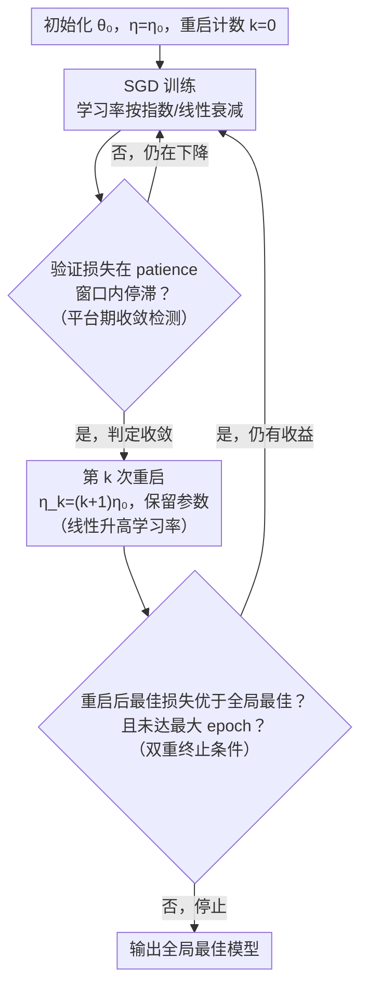

# When to Restart? Exploring Escalating Restarts on Convergence

**会议**: ICLR 2026  
**arXiv**: [2603.04117](https://arxiv.org/abs/2603.04117)  
**领域**: 优化  
**关键词**: 学习率调度, 自适应重启, 收敛感知, SGD优化, 深度学习训练

## 一句话总结

提出 SGD-ER（SGD with Escalating Restarts），一种收敛感知的学习率调度策略：当检测到训练停滞时触发重启并线性升高学习率，帮助优化器逃离尖锐局部极小值、探索更平坦的损失景观区域，在 CIFAR-10/100 和 TinyImageNet 上取得 0.5-4.5% 的测试精度提升。

## 研究背景与动机

学习率是深度学习训练中最关键的超参数之一，直接影响收敛速度、稳定性和泛化能力。

### 现有学习率调度策略及其局限

| 调度器 | 策略 | 局限 |
|--------|------|------|
| 指数/线性衰减 | 单调递减 | 无法逃离尖锐极小值和鞍点 |
| Cosine Annealing (SGDR) | 周期性余弦衰减 + 热重启 | 重启时机固定，与训练动态无关 |
| Cyclical LR (CLR) | 在预设范围内平滑振荡 | 边界固定，不自适应 |
| Warmup-Stable-Decay (WSD) | 三阶段：升温-稳定-衰减 | 与固定计算预算绑定 |

**核心问题**：现有方法的重启/调整都是**预设或周期性的**，对实际训练动态（如停滞、收敛行为）完全不感知。

**核心观点**：重启应该是**自适应的**——由收敛触发而非固定计划。当模型到达损失平台期时，用更大的学习率重启可以帮助跳出当前局部极小值。

## 方法详解

### 整体框架

SGD-ER 要解决的问题是：现有调度器（Cosine 退火、CLR、WSD）的重启都按预设周期发生，跟模型此刻是不是真的卡住毫无关系，常常在损失还能下降时就强行抬高、或在早已停滞时迟迟不动。SGD-ER 的思路是把重启的决定权交给训练动态本身——在普通的「衰减式 SGD」外面套一层收敛感知的控制回环。

整体怎么转：以初始学习率 $\eta_0$ 开始，按指数或线性策略正常衰减地训练；同时用一个平台期判据持续监测验证损失，一旦在耐心窗口（patience）内不再有意义地下降，就判定模型收敛、触发第 $k$ 次重启，把学习率线性抬高到 $\eta_k=(k+1)\eta_0$ 并**保留已学到的参数**继续训；如此循环，直到某次重启不再带来更好的损失、或达到最大 epoch 才停止。每一次「加大探索力度」都精确地落在优化真正停滞的时刻，用更大的步长把优化器从当前的尖锐极小值或鞍点里推出去，转向更平坦、泛化更好的区域。

### 关键设计

**1. 平台期收敛检测：让训练动态决定何时重启**

整个方法的触发开关，对应框架里「监测验证损失」这一步。要做到「自适应」而非「按周期」重启，前提是有一个可靠的「卡住了」信号。SGD-ER 直接复用与早停一致的平台期判据：如果验证损失在预定义的耐心窗口内没有出现有意义的下降，就认为优化已进入局部改进受限的区域、可以重启。耐心窗口随任务难度调整——CIFAR-10 取 patience = 30 epochs，CIFAR-100 取 patience = 50 epochs，越难收敛的任务给越长的观察窗口，避免把正常的缓慢下降误判成停滞。正是这一步把「何时重启」从人为预设变成由训练曲线自己回答。

**2. 线性升高学习率与鞍点逃离理论：越卡越用力推**

对应框架里的重启节点，是论文最核心的设计。重启 $k$ 时把学习率线性抬高为 $\eta_k=(k+1)\eta_0$，SGD 更新写成 $\theta_{t+1}=\theta_t-\eta_k\nabla f(\theta_t)$，即每多重启一次步长就多加一个 $\eta_0$；重启时不重置参数，而是带着已学到的表征用更大的步子继续探索。比如 patience=50 时，模型第一次卡住后学习率从 $\eta_0$ 跳到 $2\eta_0$，再卡再跳到 $3\eta_0$，探索力度温和但持续递增。这种「越往后步子越大」的设计有理论支撑：Theorem 1 假设 $f$ 为 $L$-光滑、$\theta^*$ 是严格鞍点（$\lambda_{\min}(\nabla^2 f(\theta^*))=-\gamma<0$），证明逃离 $\delta$-邻域所需的迭代数满足

$$T_k\geq \frac{\ln(\delta/|x_0|)}{\ln(1+\eta_k\gamma)}$$

当 $k\to\infty$ 时 $T_k\to 0$，即学习率越大、逃离鞍点越快。这从理论上解释了为什么应该在停滞时**抬高**而不是继续压低学习率。

**3. 双重终止条件：防止无谓发散**

对应框架里的退出判断。学习率一路线性抬高若不加约束会有发散风险，因此 SGD-ER 用「双保险」收尾：当某次重启后取得的最佳损失不再优于之前的全局最佳、或达到最大 epoch 数时，训练即停止。前者保证重启只在确实带来收益时才继续——一旦升高学习率不再换来更好的极小值就及时刹车，把自适应探索约束在有意义的范围内。

## 实验关键数据

### 主实验：ResNet-18 测试精度（%）

| 数据集 | SGD_exp | SGD_lin | Adam | CosA | CLR | WSDS | **Ours_exp** | **Ours_lin** |
|--------|---------|---------|------|------|-----|------|:---:|:---:|
| CIFAR-10 | 90.86 | 91.93 | 91.34 | 92.59 | 92.15 | 93.05 | **93.83** | **93.83** |
| CIFAR-100 | 68.30 | 71.00 | 67.94 | 71.63 | 70.44 | 72.39 | **74.30** | **74.30** |
| TinyImageNet | 59.09 | 58.35 | 54.53 | 59.46 | 57.53 | 59.28 | 59.71 | **60.79** |

### 跨架构实验：CIFAR-100 测试精度（%，指数衰减）

| 架构 | SGD_exp | CosA | CLR | WSDS | **Ours** |
|------|---------|------|-----|------|:---:|
| ResNet-34 | 67.75 | 72.17 | 71.04 | 72.36 | **74.24** |
| ResNet-50 | 65.52 | 72.10 | 70.25 | 73.76 | **76.77** |
| VGG-16 | 65.17 | 67.35 | 67.23 | 68.08 | **68.56** |
| DenseNet-121 | 56.10 | 71.20 | 66.61 | 72.45 | **76.76** |

### 长训练实验：CIFAR-100, 2000 epochs

| SGD_exp | SGD_lin | Adam | CosA | CLR | WSDS | **Ours_exp** | **Ours_lin** |
|---------|---------|------|------|-----|------|:---:|:---:|
| 68.53 | 62.17 | 71.27 | 72.84 | 72.10 | 73.59 | **74.41** | **74.41** |

### 过拟合分析（CIFAR-100, 3种 seed 平均）

| 方法 | Train Loss | Val Loss | Test Loss | Test Acc (%) |
|------|-----------|----------|-----------|:---:|
| CLR | **1.60e-05** | 0.00488 | 0.00496 | 70.65 |
| CosA | 1.75e-05 | 0.00466 | 0.00472 | 72.05 |
| WSDS | 1.64e-05 | 0.00462 | 0.00465 | 72.83 |
| **Ours_exp** | 2.40e-05 | 0.00434 | 0.00443 | 73.62 |
| **Ours_lin** | 2.16e-05 | **0.00427** | **0.00435** | **74.61** |

注：CLR 训练损失最低但测试损失最高——典型过拟合。SGD-ER 训练损失略高但泛化显著更好。

### 关键实验发现

1. SGD-ER 在**所有**数据集×架构组合上均取得最高测试精度
2. DenseNet-121 上提升最显著：56.10% → 76.76%（+20.66%），原始 SGD 几乎无法训练 DenseNet
3. 重启后会出现短暂精度下降，但模型快速恢复并超越之前的最佳性能
4. 长训练（2000 epochs）时，SGD-ER 继续改善而其他方法已饱和
5. SGD-ER 实现更好的泛化同时训练损失更高——说明确实找到了更平坦的极小值

## 亮点与洞察

1. **简单有效**：方法极其简单（仅需 patience 参数和线性增量），无额外计算开销，可作为任何 SGD 训练的即插即用模块
2. **收敛感知 vs 固定周期**：核心理念是"让训练动态告诉你何时重启"，比预设周期更合理
3. **更高训练损失 = 更好泛化**：完美体现了平坦 vs 尖锐极小值的经典理论——SGD-ER 找到的极小值更宽，泛化更好
4. **对弱架构帮助更大**：DenseNet-121 在标准 SGD 下几乎失效，但 SGD-ER 使其恢复到与 ResNet 竞争的水平
5. **理论与实践一致**：Theorem 1 预测更大学习率更快逃离鞍点，实验中确实观察到重启后快速改善

## 局限性

1. **方法极其简单**：线性升高可能不是最优策略，缺乏对升高幅度和方式的系统研究
2. **patience 需要手动设置**：CIFAR-10 用 30，CIFAR-100 用 50，不同场景需要不同值
3. **重启后精度波动**：每次重启后必须经历性能下降再恢复的周期，整体训练不够平滑
4. **仅在图像分类上验证**：未测试 NLP、语音等其他任务
5. **与 Adam 系优化器的结合未充分探索**：主要关注 SGD，Adam 变体仅在附录提及
6. **理论分析仅针对鞍点逃离**：未分析对局部极小值的逃离能力和对收敛速率的保证

## 评分

- **新颖性**: ⭐⭐⭐ — 思路直观但不复杂，属于"简单但有效"的工程优化
- **实验**: ⭐⭐⭐⭐ — 覆盖 3 数据集、5 架构、多种 baseline，结果一致且显著
- **写作**: ⭐⭐⭐⭐ — 图表清晰，尤其 Fig.1 的学习率曲线对比很直观
- **价值**: ⭐⭐⭐⭐ — 作为即插即用模块有实际工程价值，但理论深度有限

<!-- RELATED:START -->

## 相关论文

- [\[ICLR 2026\] Scaling Laws of SignSGD in Linear Regression: When Does It Outperform SGD?](scaling_laws_of_signsgd_in_linear_regression_when_does_it_outperform_sgd.md)
- [\[ICLR 2026\] Exploring Diverse Generation Paths via Inference-time Stiefel Activation Steering](exploring_diverse_generation_paths_via_inference-time_stiefel_activation_steerin.md)
- [\[NeurIPS 2025\] Exploring Landscapes for Better Minima along Valleys](../../NeurIPS2025/optimization/exploring_landscapes_for_better_minima_along_valleys.md)
- [\[ICLR 2026\] Convergence of Muon with Newton-Schulz](convergence_of_muon_with_newton-schulz.md)
- [\[ICLR 2026\] A Convergence Analysis of Adaptive Optimizers under Floating-Point Quantization](a_convergence_analysis_of_adaptive_optimizers_under_floating-point_quantization.md)

<!-- RELATED:END -->
