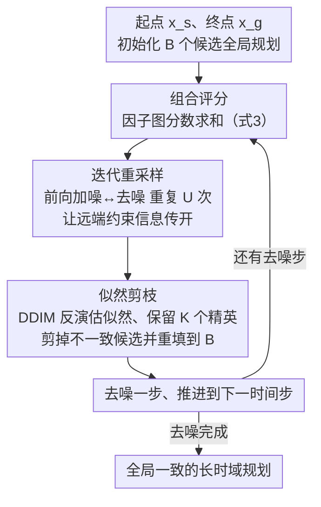

# Compositional Diffusion with Guided Search for Long-Horizon Planning

**会议**: ICLR 2026  
**arXiv**: [2601.00126](https://arxiv.org/abs/2601.00126)  
**代码**: [cdgsearch.github.io](https://cdgsearch.github.io/)  
**领域**: 其他  
**关键词**: compositional diffusion, long-horizon planning, mode averaging, guided search, inference-time compute

## 一句话总结

提出 CDGS（Compositional Diffusion with Guided Search），通过在扩散去噪过程中嵌入基于种群的搜索机制（迭代重采样 + 似然剪枝），解决组合式扩散模型在多模态局部分布合成时的模式平均问题，从短时域模型采样出全局一致的长时域规划。

## 研究背景与动机

**现状**: 扩散模型已成为规划的强大工具，组合式方法通过组合局部短时域生成模型来建模长时域任务分布，可应用于机器人多步操作、全景图像拼接和长视频生成等领域。

**痛点**: 当局部分布是多模态的（如机器人在多种物体和动作组合中选择），现有组合采样方法（如分数平均）会将不兼容的模式平均化（mode averaging），导致既不局部可行也不全局一致的无效规划。

**矛盾**: 全局规划的搜索空间随规划长度指数增长，而现有推理时间缩放方法仅适用于单一分布采样，无法处理分布链的组合推理。

**核心idea**: 在去噪过程中嵌入搜索——通过(1)迭代重采样增强远程信息传播以构造全局一致的候选规划，(2)基于似然的剪枝去除包含不一致局部段的候选规划。

## 方法详解

### 整体框架

CDGS 把长时域规划看成因子图上的组合采样问题，再往去噪过程里塞一套基于种群的搜索：一边维护一批候选规划、靠迭代重采样让远端约束的信息在去噪过程中传开来构造全局一致的候选，一边用 DDIM 反演估出的似然把含不一致局部段的候选剪掉。整套流程不需要任何长时域训练数据，只复用短时域扩散模型，所有"全局性"都在推理时由搜索补足。

具体地，全局规划 $\tau = (x_1, \ldots, x_N)$ 被分解成一组重叠局部因子的乘积 $p(\tau) = \frac{\prod_{j=1}^M p(y_j)}{\prod_{i=1}^N p(x_i)^{d_i - 1}}$，其中 $y_j$ 对应相邻变量构成的子序列、$d_i$ 是变量 $x_i$ 出现的因子数。对应的组合评分函数为 $\nabla \log p(\tau) = \sum_{j=1}^M \nabla \log p(y_j) + \sum_{i=1}^N (1 - d_i) \nabla \log p(x_i)$。直接对它做分数平均正是问题的根源——当局部分布多模态时，不兼容模式的分数被加权平均，落到既不局部可行也不全局一致的"中间地带"。CDGS 把这件事放进一个**逐去噪步循环**里：每一步先算组合评分，再用迭代重采样让远端约束的信息传开，接着用似然剪枝把不一致的候选删掉、重填种群，最后去噪一步进入下一时刻，直到采出全局一致的规划。两个关键设计（迭代重采样、似然剪枝）就是绕开分数平均、用搜索挑出互相兼容的局部模式。

### 关键设计

**1. 迭代重采样：把远端约束的信息在去噪过程中传开**

朴素组合采样的毛病在于，去噪每一步只看当下的局部分数，相隔很远的两个因子之间没有信息流，于是采出来的局部段各自合理、拼在一起却冲突。CDGS 在每个去噪步内不止做一次去噪，而是交替执行前向加噪 $\tau^{(t)} \sim p(\tau^{(t)} \mid \tau^{(t-1)})$ 和去噪，重复 $U$ 次。这一来一回相当于在链式因子图上跑置信传播：每重采样一轮，远端因子的约束就通过重叠变量往前推一格，多轮之后全局信息得以渗透到整条轨迹，候选规划自然朝全局一致的方向收敛。重采样步数 $U$ 越大、信息传得越远，也正是推理时间算力可以换性能的旋钮之一。

**2. 似然剪枝：用 DDIM 反演把含不一致局部段的候选删掉**

光靠重采样仍可能残留若干局部冲突的候选，需要一个便宜的似然代理来排序和剪枝。精确算样本似然代价太高，CDGS 转而用 DDIM 反演的去噪轨迹曲率近似它：对局部段定义平滑度度量 $g(y^{(0)}) = \sum_{i=1}^T \left\| \frac{\partial \epsilon_\theta(y^{(i-1)}, i)}{\partial i} \right\|_2$，反演轨迹越"颠簸"（$g$ 越大）说明该段越不像模型见过的高似然样本。把各段乘起来得到全局排序目标 $J(\tau^{(0)}) = \prod_{m=1}^M \exp(-g(y_m^{(0)}))$，据此在大小为 $B$ 的种群里保留 $K$ 个精英、剪掉低似然候选并重新填满种群。$B$ 与 $K$ 都可调，于是面对更难的问题可以直接加大种群来提升成功率，实现自适应的推理时间计算。

### 一个完整示例

论文用一个一维玩具域把上面两个设计讲透：变量 $x_1, \ldots, x_7$ 排成一串，相邻变量之间有 6 个可行的有向转移因子 $y_1, \ldots, y_6$，从起点 $x_1$ 到终点 $x_7$ 恰好存在两条可行的长时域规划——一条"走上面"、一条"走下面"。

- **朴素组合采样**：采样时一条候选可能在前半段选了"上面"的模式、后半段又落到"下面"，为了同时满足首尾约束，中间的局部模型 $y_2, \ldots, y_5$ 只能把上下两个模式平均掉，结果在中段冒出根本走不通的转移（即 mode averaging）。
- **加入迭代重采样**：多轮加噪—去噪让"前半段已经选了上面"这个信息沿因子链往后传，后半段被推着也选上面，上下混搭的候选明显变少。
- **再加似然剪枝**：仍有少数候选含不可行的 $y$，DDIM 反演会发现这些段的去噪轨迹特别"颠簸"、似然低，于是把它们剪掉，最终留下的都是要么全走上面、要么全走下面的全局一致规划。

### 训练策略

训练侧只学短时域：用 Diffuser 学局部规划的扩散模型，每个局部段覆盖约 4 秒、20Hz 的轨迹；推理时再把这些局部模型组合成最长 10 秒的全局规划。也就是说模型从未见过长时域样本，长时域一致性完全由上述搜索在推理时拼出来。

## 实验关键数据

### 主实验: OGBench 迷宫与场景任务（成功率%）

| 环境 | GCBC | HIQL | Diffuser | GSC | CD | **CDGS** |
|------|------|------|----------|-----|-----|----------|
| PointMaze-Giant | 0 | 0 | - | 29 | 68 | **82** |
| AntMaze-Giant | 0 | 2 | - | 20 | 65 | **84** |
| Scene-play (avg) | 5 | 38 | 6 | 8 | - | **51** |

### TAMP 混合规划任务（成功率）

| 任务 | Random CEM | STAP CEM | LLM-T2M | GSC (oracle) | **CDGS** |
|------|-----------|----------|---------|-------------|----------|
| Hook Reach T1 | 0.14 | 0.66 | 0.0 | 0.78 | **0.64** |
| Rearrange Push T1 | 0.08 | 0.76 | 0.72 | 0.88 | **0.84** |
| Rearrange Memory T1 | 0.02 | 0.00 | 0.0 | 0.82 | **0.42** |

### 全景图生成（512×4608）

| 指标 | Multi-Diffusion | Sync-Diffusion | **CDGS** |
|------|----------------|----------------|----------|
| Intra-LPIPS↓ | 0.72 | **0.58** | **0.59** |
| Intra-Style-L↓ | 2.96 | **1.39** | **1.38** |
| Mean-CLIP-S↑ | 31.77 | 31.77 | **32.51** |

### 关键发现

- 在无需长时域训练数据的条件下，CDGS 在 OGBench 上与逆RL基线持平，超越所有生成式基线
- TAMP 任务中无需任务骨架或PDDL即可发现可行计划，在 Rearrangement Memory 上显著超越无先验方法
- 推理时间计算可缩放：增大批量 $B$ 和重采样步数 $U$ 均可提升成功率

## 亮点与洞察

1. **优雅的问题形式化**: 将长时域规划统一建模为因子图上的组合采样，跨域适用（机器人/图像/视频）
2. **免训练的推理增强**: 不需要额外训练，仅通过推理时搜索即可将朴素组合采样提升至与 CompDiffuser 等需训练方法持平
3. **自适应推理计算**: 可通过增加 $B$ 和 $U$ 应对更难问题，体现了推理时间缩放的潜力
4. **DDIM反演作为似然代理**: 巧妙地利用去噪轨迹曲率来近似评估样本似然，避免了精确似然计算的高开销

## 局限与展望

- 需要预先指定目标状态，无法处理未知目标的开放式任务
- 规划长度固定，虽可通过多次尝试不同长度缓解
- 远程依赖仅通过分数平均和重采样传播，更高级的消息传递或注意力机制可能提升效率
- 推理开销随 $B \times U$ 线性增长，在实时应用中可能受限

## 相关工作与启发

- 与 CompDiffuser、GSC 等组合扩散方法互补：CDGS 专注解决模式平均而非依赖额外训练
- 与推理时间缩放文献呼应：将搜索嵌入去噪是该范式在组合生成中的自然延伸
- 因子图 + 扩散模型的框架可推广到其他结构化生成问题（如分子设计、蛋白质折叠的片段组合）

## 评分

- **新颖性**: ⭐⭐⭐⭐ — 将搜索嵌入组合扩散去噪过程的思路新颖
- **实验充分度**: ⭐⭐⭐⭐⭐ — 跨三个域（机器人/图像/视频）的全面验证
- **写作质量**: ⭐⭐⭐⭐ — 清晰的running example和直观的图示
- **价值**: ⭐⭐⭐⭐ — 提供了通用的长时域生成方案，但推理开销可能限制实际部署

<!-- RELATED:START -->

## 相关论文

- [\[AAAI 2026\] Controllable Financial Market Generation with Diffusion Guided Meta Agent](../../AAAI2026/others/controllable_financial_market_generation_with_diffusion_guided_meta_agent.md)
- [\[AAAI 2026\] Extreme Value Monte Carlo Tree Search for Classical Planning](../../AAAI2026/others/extreme_value_monte_carlo_tree_search_for_classical_planning.md)
- [\[ICLR 2026\] Hilbert-Guided Sparse Local Attention](hilbert-guided_sparse_local_attention.md)
- [\[ICLR 2026\] Harpoon: Generalised Manifold Guidance for Conditional Tabular Diffusion](harpoon_generalised_manifold_guidance_for_conditional_tabular_diffusion.md)
- [\[ICML 2026\] NonZero: Interaction-Guided Exploration for Multi-Agent Monte Carlo Tree Search](../../ICML2026/others/nonzero_interaction-guided_exploration_for_multi-agent_monte_carlo_tree_search.md)

<!-- RELATED:END -->
