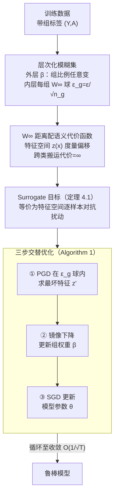

# Mitigating Spurious Correlation via Distributionally Robust Learning with Hierarchical Ambiguity Sets

**会议**: ICLR 2026  
**arXiv**: [2510.02818](https://arxiv.org/abs/2510.02818)  
**代码**: 无  
**领域**: LLM评测  
**关键词**: 虚假相关, 分布鲁棒优化, 层次模糊集, Wasserstein距离, 少数群体偏移

## 一句话总结
提出层次化DRO框架，同时捕获组间（group proportion shifts）和组内（intra-group distributional shifts）不确定性。使用W_∞距离在语义空间定义组内模糊集，在标准基准上达SOTA，且在新设计的少数群体分布偏移设置下——其他方法均失败时——仍保持强鲁棒性。

## 研究背景与动机
ERM在存在虚假相关的数据上训练后，对少数群体（如水鸟+陆地背景）性能严重退化。Group DRO通过最小化最差组损失缓解该问题，但隐式假设每组的训练分布能可靠代表真实分布。

然而少数群体样本极少——训练分布与真实分布差距大。这种"组内分布偏移"在现有虚假相关研究中被完全忽略。即使是SOTA方法也在这种设置下崩溃。

本文通过层次化模糊集解决这个问题：第一层允许组比例任意变化（同Group DRO），第二层在每组内允许W_∞范围内的分布偏移。语义空间定义的cost function使得组内偏移既有意义又可计算。

## 方法详解

### 整体框架
本文要对付的问题是：在带虚假相关的数据上，少数群体（如"水鸟+陆地背景"）样本太少，它们的训练分布根本代表不了真实分布，结果连 Group DRO 这类专门做鲁棒的方法都会在测试时崩。方法的主线分三步走：先把 Group DRO 的不确定集扩成一个两层嵌套的**层次化模糊集**——外层允许各组比例任意变化、内层再在每个组内额外允许真实分布相对训练分布发生 Wasserstein 范围内的漂移；接着用一个等价定理把"对未知分布做最差化"这个无从下手的问题，还原成特征空间里逐样本的有界对抗扰动，从而可解；最后用一个三步交替的极小极大算法把它训出来。形式上优化的最差风险被定义在层次模糊集 $\mathcal{Q}=\{\sum_g \beta_g Q_g : \beta\in\Delta,\ W_\infty(Q_g, P_g)\le \varepsilon_g\}$ 上，于是模型既要扛住"少数群体占比被放大"，又要扛住"某组内部分布本身偏移"两类不确定性。

### 关键设计

**1. 层次化模糊集：把组间与组内两类偏移同时纳入**

标准 Group DRO 只在组比例上做最差化，隐含假设每组训练分布 $P_g$ 就等于真实分布，而少数群体样本极少时这个假设根本站不住。本文把不确定集做成两层：外层取 $\rho=\infty$ 保留组比例的任意变化（这正是 Group DRO 原有的那一层），内层再给每组配一个半径 $\varepsilon_g=\varepsilon/\sqrt{n_g}$ 的 $W_\infty$ 球。$\rho=\infty,\ \varepsilon_g=0$ 时它精确退回 Group DRO，所以是后者的严格推广。关键在半径随组样本量 $n_g$ 反比缩放：样本越稀少的少数群体得到越大的组内保护范围，恰好对应"它最不可能被训练集如实代表"的直觉。

**2. $W_\infty$ 距离配语义代价函数：让组内偏移既可计算又有意义**

直接在像素空间度量分布距离会让"偏移"退化成无意义的噪声扰动，于是本文用网络倒数第二层特征 $z(x)$ 定义传输代价，只有 label 相同的样本之间才有有限距离，跨类搬运代价设为无穷大（保证扰动不会把样本搬成另一个类）。选无穷阶 $W_\infty$ 而非 $f$-散度（如 KL、TV）是因为：$f$-散度要求候选分布对经验分布绝对连续，而经验分布只有有限支撑，于是它只能对已观测样本重新加权；$W_\infty$ 没有绝对连续的约束，允许 support shift——把概率质量搬到训练集里根本没出现过的语义邻域，这才匹配"测试时出现训练未见过的少数群体表现形态"这一目标。

**3. Surrogate 目标：把抽象的层次 DRO 还原成特征空间的对抗扰动**

直接对分布族做最差化无从下手，定理 4.1 证明该层次问题可被上界为一个在特征空间内逐样本做有界对抗扰动、再对组比例最差化的代理目标：

$$\inf_{\theta}\ \max_{\beta\in\Delta}\ \sum_g \beta_g\, \mathbb{E}_{P_g}\Big[\max_{z':\,\lVert z'-z(x)\rVert\le \varepsilon_g} \mathcal{L}\big(f_L^\theta(z'), y\big)\Big]$$

其中 $f_L^\theta$ 是从特征到输出的后段网络。这一步把"对未知分布鲁棒"转写成"对每个点在半径 $\varepsilon_g$ 内的最坏特征鲁棒"，从而可以用梯度方法求解。该上界在特征映射 $z(\cdot)$ 非满射到 $\varepsilon_g$ 球时可能不紧，但在现代深网的嵌入分布下通常近似为紧。

**4. 三步交替优化：内层扰动、组权重、模型参数轮流更新**

代理目标是个 min-max，Algorithm 1 把它拆成三个坐标块交替推进：先用一步投影梯度上升（PGD）在 $\varepsilon_g$ 球内求最坏特征 $z'$，再用镜像下降/指数梯度更新组权重 $\beta$，最后用 SGD 更新模型参数 $\theta$。三者循环迭代，凸假设下整体收敛率为 $O(1/\sqrt{T})$。半径基准 $\varepsilon$ 本身按附录 G 的启发式选取，方法对 $\varepsilon$ 的取值范围相当不敏感。

## 实验关键数据

### 标准基准

| 方法 | Waterbirds WGA | CelebA WGA | CMNIST WGA |
|------|--------------|-----------|-----------|
| ERM | 72.6% | 47.2% | 27.1% |
| Group DRO | 91.4% | 88.9% | 89.3% |
| **Hierarchical DRO** | **92.8%** | **89.5%** | **91.2%** |

### 少数群体偏移设置（核心新贡献）

| 方法 | Waterbirds (shifted) | CelebA (shifted) | 说明 |
|------|---------------------|-----------------|------|
| Group DRO | 崩溃 | 崩溃 | 假设组内分布不变 |
| JTT | 崩溃 | 崩溃 | 同上 |
| **Hierarchical DRO** | **稳定** | **稳定** | 组内模糊集提供鲁棒性 |

### 消融实验

| 配置 | WGA | 说明 |
|------|-----|------|
| ε=0 (纯Group DRO) | 91.4% | 无组内鲁棒性 |
| ε=0.5 | 92.3% | 适度组内扰动 |
| ε=1.0 | **92.8%** | 最优 |
| ε=2.0 | 92.1% | 过度保守 |
| 原始空间cost（非语义） | 90.1% | 语义空间更有效 |

### 关键发现
- 在标准设置下层次DRO略优于Group DRO。
- 关键区分在少数群体偏移设置——仅通过改变训练/测试划分（无人工噪声）就暴露了Group DRO的脆弱性。
- ε_g = ε/√n_g 的设计直觉正确：少数群体需要更大的保护范围。
- W_∞ vs f-divergence：前者允许support shifts，对组内偏移更自然。

## 亮点与洞察
- 揭示了虚假相关文献中被忽略的重要失败模式——少数群体组内分布偏移。
- 层次化模糊集是Group DRO和标准DRO的优雅统一。
- 新的评测设置本身就是对社区的重要贡献。

## 局限与展望
- Surrogate目标是上界，tightness依赖于特征映射z的surjectivity。
- ε的选择仍需启发式——自适应ε是潜在改进方向。
- 计算开销略高于Group DRO（额外的z'优化步骤）。

## 相关工作与启发
- Group DRO + Wasserstein DRO的自然组合，但组织方式和motivation新颖。

## 评分
- 新颖性: ⭐⭐⭐⭐ 层次化模糊集设计+新评测设置
- 实验充分度: ⭐⭐⭐⭐ 标准+新设置双重验证
- 写作质量: ⭐⭐⭐⭐ 数学严谨
- 价值: ⭐⭐⭐⭐ 鲁棒学习的有意义改进

<!-- RELATED:START -->

## 相关论文

- [\[ICLR 2026\] Distributionally Robust Classification for Multi-Source Unsupervised Domain Adaptation](distributionally_robust_classification_for_multi-source_unsupervised_domain_adap.md)
- [\[NeurIPS 2025\] Distributionally Robust Feature Selection](../../NeurIPS2025/others/distributionally_robust_feature_selection.md)
- [\[ICML 2026\] DISCO: Mitigating Bias in Deep Learning with Conditional Distance Correlation](../../ICML2026/others/disco_mitigating_bias_in_deep_learning_with_conditional_distance_correlation.md)
- [\[ICLR 2026\] Noisy-Pair Robust Representation Alignment for Positive-Unlabeled Learning](noisy-pair_robust_representation_alignment_for_positive-unlabeled_learning.md)
- [\[ICLR 2026\] On the Lipschitz Continuity of Set Aggregation Functions and Neural Networks for Sets](on_the_lipschitz_continuity_of_set_aggregation_functions_and_neural_networks_for.md)

<!-- RELATED:END -->
