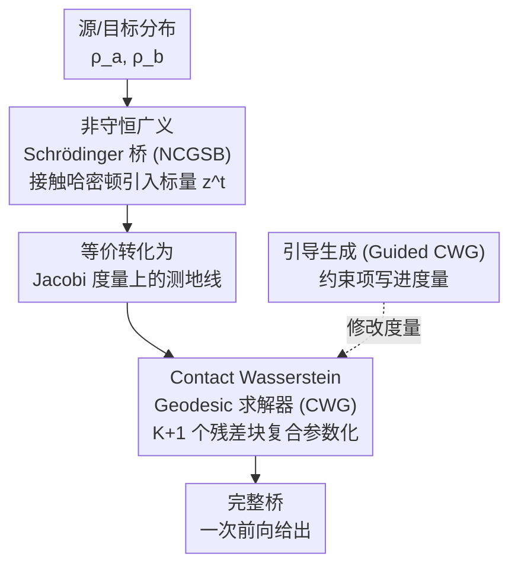

# Contact Wasserstein Geodesics for Non-Conservative Schrödinger Bridges

**会议**: ICLR2026  
**arXiv**: [2511.06856](https://arxiv.org/abs/2511.06856)  
**代码**: [项目主页](https://sites.google.com/view/c-w-g)  
**领域**: 图像生成  
**关键词**: Schrödinger bridge, contact Hamiltonian, Wasserstein geodesic, non-conservative dynamics, guided generation

## 一句话总结
提出非守恒广义 Schrödinger 桥 (NCGSB)——基于接触哈密顿力学允许能量随时间变化，通过 Contact Wasserstein Geodesic (CWG) 将桥问题转化为有限维 Jacobi 度量上的测地线计算，用 ResNet 参数化实现近线性复杂度且支持引导生成，在流形导航、分子动力学、图像生成等任务上大幅超越迭代式 SB 求解器。

## 研究背景与动机

**领域现状**：Schrödinger 桥 (SB) 为两个分布间的随机过程建模提供了原则性框架，广泛用于细胞动力学、气象预测、经济建模、图像生成等。

**能量守恒限制**：现有 SB 方法假设系统能量守恒（动能+势能不变），约束了桥的形状，无法描述耗散系统（如风暴逐渐减弱、细胞分化等非守恒过程）。

**迭代求解器瓶颈**：当前 SB 求解器依赖前向-后向迭代模拟（IPF、匹配方法等），计算代价高。GSBM 假设高斯概率路径限制表达力，mmSB 有分段一致性问题。

**动量 SB 的不足**：Momentum SB 通过增加速度维度来建模阻尼，但状态空间加倍，计算成本翻倍。OU 过程替代缺乏旋转动力学中的能量耗散机制。

**切入角度**：用接触哈密顿力学（contact Hamiltonian）替代经典哈密顿，仅增加一个标量状态 $z^t$ 即可建模能量变化，同时利用几何视角将 SB 转化为测地线计算避免迭代。

**核心贡献**：(1) NCGSB 非守恒公式化；(2) CWG 近线性时间求解器；(3) 通过修改 Riemannian 度量实现引导生成。

## 方法详解

### 整体框架
方法的核心是把无穷维的 Schrödinger 桥问题改写成有限维参数空间上的测地线计算，从而绕开传统 SB 求解器的前向-后向迭代。给定源分布 $\rho_a$ 与目标分布 $\rho_b$，整条流水线分三步：先用接触哈密顿力学给系统补上一个标量状态 $z^t$（即 NCGSB 公式化），让总能量可以随时间耗散或增长；再证明这一非守恒最优性条件等价于扩展空间 $\mathcal{P}^+(\mathcal{M}) \times \mathbb{R}$ 上的一条测地线，从而把桥的求解搬到 Jacobi 度量下；最后用一串残差块（CWG 求解器）去离散地参数化这条测地线，每个残差块负责把分布往前推一小步，整条网络一次前向就给出完整的桥。需要条件约束时，引导生成只需把约束项写进度量、再微调即可。

### 关键设计

**1. 非守恒广义 Schrödinger 桥 (NCGSB)：让能量随时间变化**

经典 SB 假设系统能量守恒，桥的形状被这一约束锁死，无法刻画风暴衰减、细胞分化这类耗散过程。NCGSB 借接触哈密顿力学引入一个时变标量 $z^t$，把代价泛函写成它沿轨迹的演化 $\partial_t z^t = \int_\mathcal{M} (\frac{1}{2}\|v^t\|^2 + U(x))\rho^t \, dx - \gamma z^t$，其中阻尼因子 $\gamma \in \mathbb{R}$ 决定能量走向：$\gamma > 0$ 时总能量递减（耗散），$\gamma < 0$ 时递增。这个 $z^t$ 的递归定义让它隐式编码了整条历史轨迹，等于给系统装上"记忆"，从而能表达路径依赖的非守恒力——而代价仅仅是多了一个标量维度，远比动量 SB 把状态空间整体加倍来得轻。

**2. Contact Wasserstein Geodesic (CWG) 求解器：把桥变成可微的测地线**

即便有了非守恒公式，若仍走迭代模拟就谈不上提速。CWG 把接触哈密顿的最优性条件等价转化为 Jacobi 度量 $\tilde{g}_J = (H - \mathcal{F} - \mathcal{B})\, g^{\mathcal{W}_2}$ 下求测地线，并用 $(K+1)$ 个残差块的复合映射 $T_{\{\theta^k\}} = T_{\theta^K} \circ \cdots \circ T_{\theta^0}$ 直接参数化离散测地线，整条桥由一次前向复合得到，不再需要外层的前向-后向循环。这样总复杂度降到 $\mathcal{O}(NK(T_{sh} + D(LW + \log N)))$，对数据维度 $D$ 线性、对批量大小 $N$ 近线性，正是实验中训练能比迭代式求解器快一到两个数量级的根源。

**3. 引导生成 (Guided CWG)：把条件约束写进度量**

要在桥上加约束（如终点须满足 $y = f(x^{t_s})$），常规做法是在采样时叠加 classifier 梯度，但那与桥的几何是割裂的。CWG 直接在 Lagrangian 动力学里加入引导项 $\|y - f(x^{t_s})\|^2$，它恰好等价于把 Jacobi 度量改写成 $\tilde{g}'_J = (\Phi^{t_k} + \|y - f(x^{t_s})\|^2)\, g^{\mathcal{W}_2}$，于是偏离目标条件的测地线会因度量增大而被自然惩罚——引导从"采样时打补丁"变成了度量层面的内生约束。实践上采用先无引导训练、再用引导损失微调的混合策略，兼顾全局最优性与局部条件满足。

### 损失函数 / 训练策略
训练目标由三项 Wasserstein-2 距离组成：$\ell = d_{\mathcal{W}_2}^2(\rho_\theta^{t_K}, \rho_b) + \sum_m d_{\mathcal{W}_2}^2(\rho_\theta^{t_{k_m}}, \rho_m) + \sum_k \Phi^{t_k} d_{\mathcal{W}_2}^2(\rho_\theta^{t_k}, \rho_\theta^{t_{k-1}})$，分别约束终端边际对齐目标分布 $\rho_b$、若干中间时刻对齐给定边际 $\rho_m$、以及用能量权重 $\Phi^{t_k}$ 最小化相邻步之间的测地线长度（即让桥真正成为度量意义下的最短路径）。引导任务则在此基础上接入引导损失做微调。

## 实验关键数据

### LiDAR 流形导航 + 单细胞测序

| 任务/指标 | CWG (ours) | GSBM | DSBM | SBIRR/DM-SB |
|-----------|-----------|------|------|-------------|
| LiDAR Optimality ↓ | **1.40** | 2.18 | 4.16 | — |
| LiDAR Feasibility ↓ | **0.06** | 0.83 | 0.97 | — |
| LiDAR 训练时间 (s) | **280** | 1570 | 1340 | — |
| 单细胞 $d_{\mathcal{W}_2}(x^{t_3})$ ↓ | **0.33** | — | — | 1.64 / 1.86 |
| 单细胞训练时间 (s) | **710** | — | — | 38120 / 1740 |

### 图像生成任务

| 任务/指标 | CWG (ours) | GSBM | DSBM | SB-Flow |
|-----------|-----------|------|------|---------|
| 海温预测 FID($x^{t_1}$) ↓ | **121** | 161 | 242 | 177 |
| 机器人重建 FID ↓ | **19** | 40 | 150 | 73 |
| 机器人训练时间 (h) | **0.5** | 25.3 | 7.6 | 1.4 |
| FFHQ Feasibility ↓ | **4.33** | 6.84 | 7.78 | 21.75 |
| FFHQ 训练时间 (s) | **930** | 2650 | 2530 | 1490 |

## 亮点与洞察
- **接触力学 → 生成模型的优雅桥接**：用接触哈密顿力学仅增加标量 $z^t$ 即突破能量守恒限制，比动量 SB（加倍状态空间）高效得多
- **ResNet = 离散测地线**：将每个残差块解释为概率流形上的一步推前映射，理论基础扎实且实现简洁
- **速度优势惊人**：单细胞任务比 DM-SB 快 **50×**，机器人任务比 GSBM 快 **50×**
- **引导生成的几何解释**：引导项直接修改 Riemannian 度量而非在采样过程中加梯度，比 classifier guidance 更原生

## 局限性
- Wasserstein 距离 $d_{\mathcal{W}_2}$ 的经验估计在高维空间中不稳定，图像实验部分依赖 VAE 潜空间
- 引导生成需要先训练无引导模型再微调，不是端到端的
- $\gamma$ 的选择依赖先验知识（是否耗散、耗散速率），缺少自适应调节机制
- ResNet 块数 $K$ 决定时间离散精度，过少则测地线近似粗糙，过多则参数量增大

## 相关工作与启发
- **vs GSBM (Liu et al., 2024)**：GSBM 假设高斯路径、迭代求解；CWG 无此限制且非迭代——Optimality 指标低 36%，训练快 5× 以上
- **vs 动量 SB (Blessing et al., 2025)**：动量 SB 加倍状态空间建模阻尼；NCGSB 只加一个标量——更优雅的非守恒建模
- **vs SB-Flow (Bortoli et al., 2024)**：SB-Flow 迭代 IPF 方法，不支持 GSB/mmSB/能量变化/引导生成；CWG 全面覆盖
- **启发**：接触几何是一个尚未被深度学习充分利用的数学工具，在材料科学、气候模拟等需要建模耗散的领域有广阔前景

## 评分
- 新颖性: ⭐⭐⭐⭐⭐ 接触哈密顿力学引入 SB 是全新视角，理论贡献深刻
- 实验充分度: ⭐⭐⭐⭐ 覆盖流形导航、分子动力学、多种图像任务，消融充分
- 写作质量: ⭐⭐⭐⭐ 数学推导严谨，但对非几何背景读者门槛较高
- 价值: ⭐⭐⭐⭐⭐ 兼具理论深度和实用速度优势，是 SB 方向的重要进展

<!-- RELATED:START -->

## 相关论文

- [\[ICML 2025\] The Dark Side of the Forces: Assessing Non-Conservative Force Models for Atomistic Machine Learning](../../ICML2025/physics/the_dark_side_of_the_forces_assessing_non-conservative_force_models_for_atomisti.md)
- [\[ICLR 2026\] HyperKKL: Enabling Non-Autonomous State Estimation through Dynamic Weight Conditioning](hyperkkl_enabling_non-autonomous_state_estimation_through_dynamic_weight_conditi.md)
- [\[ICML 2026\] Teaching Molecular Dynamics to a Non-Autoregressive Ionic Transport Predictor](../../ICML2026/physics/teaching_molecular_dynamics_to_a_non-autoregressive_ionic_transport_predictor.md)
- [\[ICLR 2026\] Sublinear Time Quantum Algorithm for Attention Approximation](sublinear_time_quantum_algorithm_for_attention_approximation.md)
- [\[ICLR 2026\] Feedback-driven Recurrent Quantum Neural Network Universality](feedback-driven_recurrent_quantum_neural_network_universality.md)

<!-- RELATED:END -->
