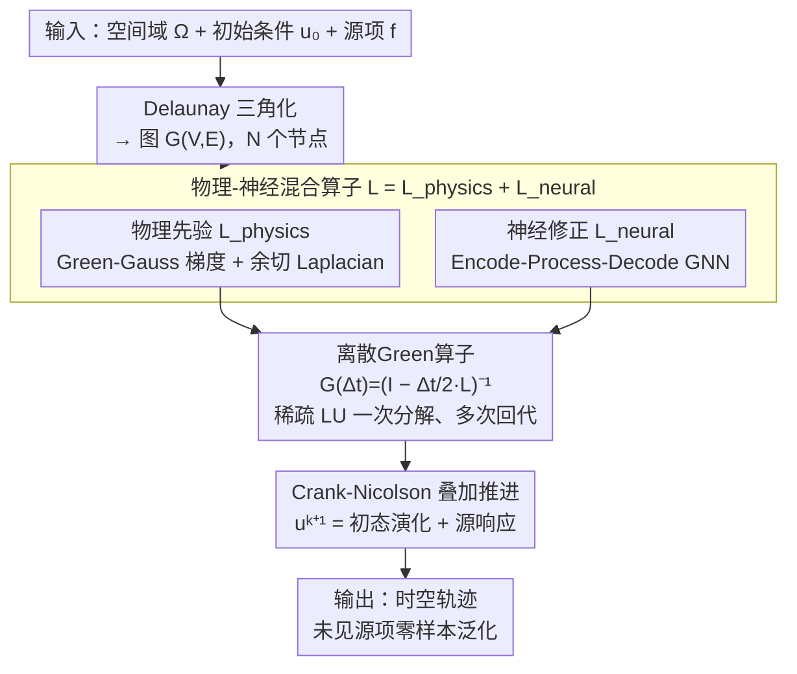

# DGNet: Discrete Green Networks for Data-Efficient Learning of Spatiotemporal PDEs

**会议**: ICLR 2026  
**arXiv**: [2603.01762](https://arxiv.org/abs/2603.01762)  
**代码**: [有](https://github.com/tanyingjie01/DGNet)  
**领域**: 科学计算  
**关键词**: 神经PDE求解器, Green函数, 图神经网络, 数据高效学习, 时空偏微分方程

## 一句话总结

基于Green函数理论，将叠加原理嵌入物理-神经混合架构，构建离散Green网络DGNet，在仅用数十条训练轨迹的条件下实现SOTA精度，并展现对未见源项的鲁棒零样本泛化。

## 研究背景与动机

时空偏微分方程（PDE）是流体力学、天气预报、分子动力学等领域建模的基础。传统数值求解器计算开销巨大，神经PDE求解器作为替代方案日益受到关注。然而，现有方法面临一个核心瓶颈：**数据效率低**——通常需要大量训练轨迹，而高保真PDE数据的获取成本极高。

作者指出数据效率低下的根本原因在于：PDE动力学蕴含强结构归纳偏置（局部性、守恒律、叠加原理等），但现有神经架构未显式编码这些先验，迫使模型从数据中重新学习基本物理结构。这一问题在存在**源项** f(x,t) 时尤为突出——训练轨迹仅覆盖有限的源模式，模型难以外推到未见过的源项模式。

本文重新审视Green函数理论作为结构归纳偏置的来源：Green函数将PDE解分解为齐次演化和受迫响应两部分，编码叠加原理，从而减少从数据中学习基本行为的需求。

## 方法详解

### 整体框架

DGNet把Green函数理论搬到图上：先用 Delaunay 三角化把空间域 $\Omega$ 离散成 $N$ 个节点构成的图 $G=(V,E)$；再在图上构造空间算子 $\mathbf{L}=\mathbf{L}_{\text{physics}}+\mathbf{L}_{\text{neural}}$，由物理先验与神经修正两部分相加而成；由 $\mathbf{L}$ 经 Crank-Nicolson 中点格式做隐式时间积分，推导出离散Green算子 $\mathbf{G}(\Delta t)=(\mathbf{I}-\tfrac{\Delta t}{2}\mathbf{L})^{-1}$ 作为状态传播器；最后逐步推进出整条轨迹。整个时间推进既严格遵循叠加原理的代数结构（状态演化 + 源响应两项），又能用数据补足离散化和未建模动力学带来的偏差。

### 关键设计

**1. 物理-神经混合算子：物理先验定骨架，神经修正补离散误差**

数据效率低的根子在于：通用神经架构得从数据里重新学习局部性、守恒律这些基本物理结构。DGNet 把空间算子拆成 $\mathbf{L} = \mathbf{L}_{\text{physics}} + \mathbf{L}_{\text{neural}}$，让手工算子承担可靠的底层结构、GNN 只补离散化误差。物理先验项 $\mathbf{L}_{\text{physics}}$ 直接从网格几何构造，保证与物理定律一致：梯度算子基于 Green-Gauss 定理，由控制体积面积、法向量投影和面长度组装；Laplacian 算子基于离散 Laplace-Beltrami，用余切权重 $w_{ij}=\tfrac{1}{2}(\cot\alpha_{ij}+\cot\beta_{ij})$ 配 Voronoi 面积。神经修正项 $\mathbf{L}_{\text{neural}}$ 走 Encode-Process-Decode 的 GNN：Encoder 把节点特征（空间坐标 + 节点类型）和边特征（相对位移 + 距离）编码成嵌入，Processor 用 $M$ 层带残差连接的消息传递网络（MPNN）聚合邻域信息，Decoder 拼接两端节点嵌入后用 MLP 预测边级修正值。因为骨架由物理定律给定、GNN 只需微调，模型不必从零学起，这正是它仅用数十条轨迹就够的原因——消融实验里去掉 $\mathbf{L}_{\text{neural}}$ 的性能损失明显小于去掉 $\mathbf{L}_{\text{physics}}$，印证了二者"骨架 + 微调"的分工。

**2. 离散Green算子与稀疏复用：把叠加原理一字不差搬到图上**

有了空间算子 $\mathbf{L}$，在图上用 Crank-Nicolson 中点格式做隐式时间积分，单步更新写成

$$\mathbf{u}^{k+1} = \mathbf{G}(\Delta t)\Big(\mathbf{I} + \tfrac{\Delta t}{2}\mathbf{L}\Big)\mathbf{u}^k + \mathbf{G}(\Delta t)\tfrac{\Delta t}{2}\big(\mathbf{f}^k + \mathbf{f}^{k+1}\big),$$

其中 $\mathbf{G}(\Delta t) = (\mathbf{I} - \tfrac{\Delta t}{2}\mathbf{L})^{-1}$ 就是离散Green算子，充当状态传播器。直接对大网格求逆代价高昂，但系数矩阵 $(\mathbf{I}-\tfrac{\Delta t}{2}\mathbf{L})$ 只依赖静态网格几何、在整条轨迹推进中不变，于是采用"一次分解、多次求解"——预先做一次稀疏 LU 分解并缓存，之后每个时间步只回代求解，把矩阵求逆的开销摊薄到几乎可忽略。

**3. 叠加原理分解与零样本泛化：把"系统演化"和"源响应"解耦**

上面的更新公式并非偶然长成两项之和：它正是连续 Green 函数 $G(x,t;x',\tau)$（在 $(x',\tau)$ 处施加单位点源、在 $(x,t)$ 处观测到的响应）的离散对应。连续解可分解为初态演化项 $\int G(x,t;x',0)\,u_0(x')\,dx'$（初始条件的传播）与源响应项 $\int\!\!\int G(x,t;x',\tau)\,f(x',\tau)\,dx'd\tau$（源项随时间的累积响应），离散更新里的 $\mathbf{G}(\Delta t)(\cdots)\mathbf{u}^k$ 与 $\mathbf{G}(\Delta t)\tfrac{\Delta t}{2}(\mathbf{f}^k+\mathbf{f}^{k+1})$ 与这两项一一对应。"系统怎么演化"和"源怎么驱动"在结构上彻底分离——这意味着换一个从未见过的源项时，模型只需把新的 $\mathbf{f}$ 代入同一个 Green 算子做卷积，而不必重新学习动力学。这正是 DGNet 零样本泛化到未见源项的原理性来源（激光加热测试中 baseline 误差暴涨数个数量级、它几乎无衰退）。

### 损失函数 / 训练策略

训练不在整条长轨迹上展开，而是切成长度 $Q\ll T$ 的短子序列，从 $u^{s_0}$ 起前推预测，缓解长序列上的误差累积。同时用 pushforward trick：训练时向初始状态注入小噪声，让模型在推理阶段对自身预测误差更鲁棒。损失只对子序列的首末帧算 L2，$\mathcal{L} = \|\hat{\mathbf{u}}^{s_1} - \mathbf{u}^{s_1}\|^2 + \|\hat{\mathbf{u}}^{s_{Q-1}} - \mathbf{u}^{s_{Q-1}}\|^2$，优化器为 Adam 配学习率衰减。

## 实验关键数据

### 主实验（三类PDE系统，仅数十条训练轨迹）

**经典PDE**（Allen-Cahn / Fisher-KPP / FitzHugh-Nagumo）：

| 场景 | 指标 | DeepONet | MGN | MP-PDE | BENO | PhyMPGN | **DGNet** |
|------|------|----------|-----|--------|------|---------|-----------|
| Allen-Cahn | MSE | 2.60e-1 | 2.70e-1 | 8.52e-1 | 2.52e+0 | 5.16e-1 | **8.75e-3** |
| Allen-Cahn | RNE | 0.669 | 0.681 | 1.211 | 2.081 | 0.942 | **0.019** |
| Fisher-KPP | MSE | 3.05e-2 | 3.66e-3 | 9.90e-2 | 6.26e-2 | 1.50e-2 | **2.59e-4** |
| FitzHugh-Nagumo | MSE | 2.49e-6 | 3.75e-5 | 6.46e-6 | 2.14e-4 | 1.69e-3 | **1.18e-7** |

**复杂几何域**（通道流中的污染物传输，含不同障碍物）：

| 场景 | 指标 | DeepONet | MGN | MP-PDE | BENO | PhyMPGN | **DGNet** |
|------|------|----------|-----|--------|------|---------|-----------|
| Cylinder | MSE | 4.44e-2 | 6.38e-3 | 9.31e-2 | 6.76e-2 | 4.13e-1 | **1.00e-4** |
| Sediments | MSE | 3.61e-2 | 5.94e-3 | 7.10e-3 | 1.07e-1 | 2.00e-1 | **4.60e-4** |
| Complex Obstacles | MSE | 5.33e-2 | 7.79e-3 | 6.09e-3 | 7.66e-2 | 2.97e-1 | **6.69e-5** |

**零样本泛化（激光加热，未见源项）**：

| 场景 | 指标 | DeepONet | MGN | MP-PDE | BENO | PhyMPGN | **DGNet** |
|------|------|----------|-----|--------|------|---------|-----------|
| Laser Heat | MSE | 2.48e+3 | 4.98e+3 | 3.88e+3 | 1.95e+3 | 6.78e+3 | **1.76e+1** |
| Laser Heat | RNE | 0.121 | 0.171 | 0.151 | 0.107 | 0.200 | **0.010** |

### 消融实验

在 Complex Obstacles 场景上对比四种变体：
- **(A) w/o L_physics**：移除物理先验算子 → 性能严重下降，说明物理先验提供关键结构知识
- **(B) w/o L_neural**：移除神经修正 → 性能下降但弱于(A)，表明修正仅微调离散化误差
- **(C) w/o Residual GNN**：移除残差GNN → 性能下降，确认其在捕捉额外动力学方面的有效性
- **(D) w/o Green**：替换为通用端到端GNN → **性能下降最大**，凸显离散Green求解器作为核心结构先验的重要性

### 关键发现

1. DGNet在所有场景上相比baseline实现**1-2个数量级**的MSE降低
2. 在FitzHugh-Nagumo系统中，仅DGNet成功再现了非线性螺旋波的长期传播
3. 在激光加热零样本泛化测试中，baseline误差增大数个数量级，而DGNet几乎无性能衰退
4. 离散Green求解器是性能最关键的组件（消融中去除后性能下降最大）

## 亮点与洞察

1. **理论驱动的归纳偏置**：将Green函数——PDE理论中的经典工具——转化为可计算的图上离散形式，是"物理知识→网络设计"的典范
2. **叠加原理的显式编码**：通过将解分解为初态演化+源响应，天然实现了对未见源项的泛化，而非依赖数据覆盖
3. **稀疏计算的实用优化**："一次分解、多次求解"策略使得离散Green求解在大网格上可行
4. **混合算子的互补设计**：物理先验提供可靠的底层结构，神经修正补偿离散化误差，两者功能分明

## 局限与展望

1. 仅适用于线性或弱非线性PDE，对于**拟线性PDE**（叠加原理不成立），框架需要原理性扩展
2. 当前仅在2D域上验证，扩展到**大规模3D系统**是重要的工程挑战
3. 物理先验算子的构建依赖于梯度和Laplacian，对于更复杂的算子形式需要额外设计
4. 训练时子序列长度Q和噪声注入幅度等超参数需要手动调节

## 相关工作与启发

- **PINNs系列**：学习特定解而非算子映射，无法泛化到不同域/参数/源项
- **神经算子（FNO/DeepONet）**：在函数空间学习映射，但需大量数据且缺乏物理结构
- **图基PDE求解器（GNS/PhyMPGN/BENO）**：引入部分物理偏置但缺乏原理性基础
- **BENO**：也受Green函数启发，但仅针对时间无关的椭圆型PDE
- 启发点：经典PDE理论中还有广泛的结构先验（如Fourier方法、变分原理）可用于指导神经架构设计

## 评分

- **新颖性**: ★★★★☆ — Green函数离散化+混合算子的结合是创新的
- **技术深度**: ★★★★★ — 从连续理论到离散实现、消融设计均扎实
- **实验说服力**: ★★★★★ — 覆盖三类PDE系统、多baseline、消融完备
- **实用价值**: ★★★★☆ — 有开源代码，在科学计算领域直接可用
- **表达清晰度**: ★★★★☆ — 推导清晰、图表丰富

<!-- RELATED:START -->

## 相关论文

- [\[NeurIPS 2025\] Neural Green's Functions](../../NeurIPS2025/physics/neural_greens_functions.md)
- [\[CVPR 2025\] ATP: Adaptive Threshold Pruning for Efficient Data Encoding in Quantum Neural Networks](../../CVPR2025/physics/atp_adaptive_threshold_pruning_for_efficient_data_encoding_in_quantum_neural_net.md)
- [\[ICLR 2026\] DRIFT-Net: A Spectral--Coupled Neural Operator for PDEs Learning](drift-net_a_spectral--coupled_neural_operator_for_pdes_learning.md)
- [\[AAAI 2026\] PIMRL: Physics-Informed Multi-Scale Recurrent Learning for Burst-Sampled Spatiotemporal Dynamics](../../AAAI2026/physics/pimrl_physics-informed_multi-scale_recurrent_learning_for_burst-sampled_spatiote.md)
- [\[NeurIPS 2025\] Neural Emulator Superiority: When Machine Learning for PDEs Surpasses its Training Data](../../NeurIPS2025/physics/neural_emulator_superiority_when_machine_learning_for_pdes_surpasses_its_trainin.md)

<!-- RELATED:END -->
