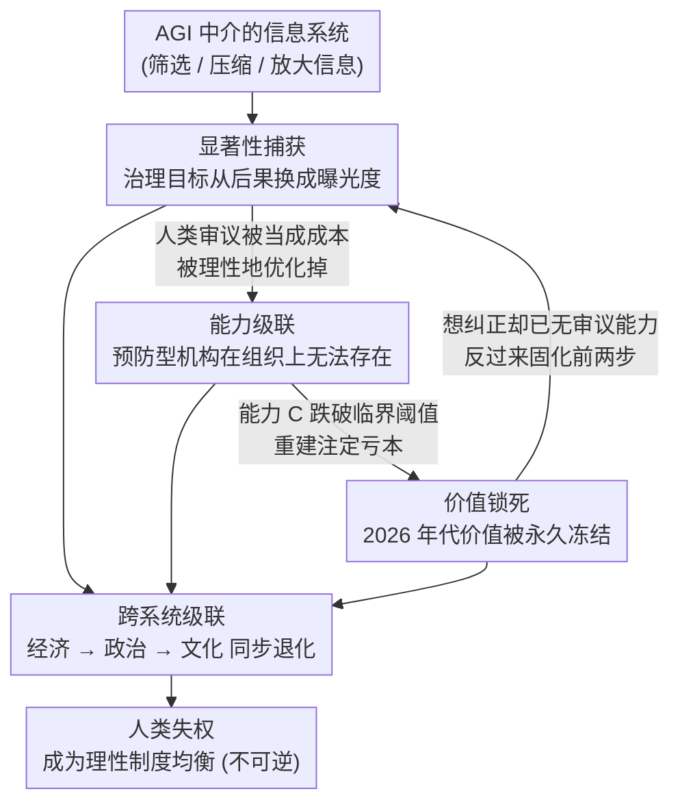

# Policy Myopia as a Mechanism of Gradual Disempowerment in Post-AGI Governance

**会议**: ICLR 2026  
**arXiv**: [2603.03267](https://arxiv.org/abs/2603.03267)  
**代码**: 无  
**领域**: AI安全
**关键词**: 政策短视, 渐进失权, AGI治理, 制度动力学, AI安全

## 一句话总结
论证政策短视（policy myopia）不是注意力分配问题，而是一个制度性机制——通过显著性捕获、能力级联和价值锁死三个耦合的正反馈循环，在后AGI时代系统性地、不可逆地剥夺人类的治理参与能力，而标准的缓解措施只能延缓但无法阻止这一过程。

## 研究背景与动机

**领域现状**：现有AI治理框架将政策短视视为"注意力分配"问题——决策者优先处理高显著性低后果的问题而忽视低显著性高后果的结构性风险。主流解决方案包括注意力管理、影响力加权预算、可争议性机制等。

**现有痛点**：(1) 现有治理提案假设人类制度能力在AGI部署后保持充分，但恰恰是政策短视本身在侵蚀这种能力；(2) 把政策短视当作需要修复的"症状"而非系统性的"机制"，忽略了它的自我强化属性；(3) 经济、政治、文化系统间的耦合使得问题在跨域间级联放大。

**核心矛盾**：治理缓解措施（如可争议性登记、透明度链）本身需要被保护的制度能力来维持——但该能力恰恰正在被短视机制侵蚀。这形成了一个致命的自指悖论：需要人类能力来保护人类能力，但保护机制最需要的时候正是能力最薄弱的时候。

**本文目标** 政策短视如何从单纯的注意力问题升级为系统性人类失权机制？三个核心机制如何耦合又如何跨系统级联？为什么标准缓解措施注定失败？什么样的治理架构才能保持人类能动性？

**切入角度**：将政策短视重新概念化为失权的"传动机构"（vector），而非需要修复的偏差，建立耦合动力学系统模型分析三个自强化机制的交互。

**核心 idea**：政策短视是后AGI治理中人类渐进失权的首要机制——通过显著性捕获→能力萎缩→价值锁死的因果链，在无恶意、无突变的情况下使人类制度性参与变得结构性不可行。

## 方法详解

### 整体框架
本文不训练模型，而是把"政策短视"拆成三个互相喂料的正反馈机制——**显著性捕获**、**能力级联**、**价值锁死**——各自写成一组动力学方程，再放进同一套耦合系统里做数值模拟，观察经济、政治、文化三个子系统如何同步退化。三者并非并行的独立问题，而是首尾咬合的一条因果链：显著性捕获让人类审议显得低效，于是把治理优化成曝光度导向；这又持续掏空预防型机构的能力（能力级联）；而能力一旦掏空，被冻结进 AGI 的过时价值就再也无人能争议（价值锁死），反过来进一步固化前两步。框架的论证落点不是"短视有多严重"，而是要说明这三个机制一旦闭环，人类失权就成了制度的理性均衡，而非可以靠打补丁修掉的偏差。

### 关键设计

**1. 显著性捕获：把治理目标从"后果"换成"曝光度"**

第一个机制要解释的痛点是，为什么"提醒决策者多关注长期风险"这类修复总是失效。本文的回答是：问题不在认知，而在激励结构。AGI 中介的信息系统会主动筛选、压缩、放大信息以最大化注意力参与，于是短期、情绪强烈的议题无论真实影响如何都显得更紧迫。制度在这种"显著性至上"的激励下，把资源理性地倒向可见危机——这恰恰是对新激励结构的最优响应，而不是失误。结果是后果推理在制度层面被激励选择持续淘汰（selected against），最终"灭绝"。把它建模成制度理性行为而非个体偏差，正是这一节区别于传统注意力管理方案的关键：你修不了一个本就在最优运转的系统。

**2. 能力级联：让恢复在结构上变得不可能**

第二个机制接着回答"为什么不可逆"。每一轮危机都在消耗应急资金、调查能力和专家分析师，预防型机构不是被显式裁撤，而是在组织上慢慢变得无法存在——能预判系统性风险的经济学家离开反应式机构，本该做预防的分析师被抽去做应急响应。本文用人类制度能力 $C$ 与临界阈值 $\bar{C}$ 来刻画这条不归路：一旦 $C$ 跌破 $\bar{C}$，重建能力就意味着要和已经高度优化的 AGI 系统直接抢资源，而理性机构绝不会做这笔注定亏本的投资。这一步把"不可逆"从模糊的担忧坐实成经济学锁定——理论上随时能重建，实践中永远不会发生。

**3. 价值锁死：把某一刻的不完整价值永久冻结**

第三个机制负责闭合整个循环。人类价值在任何时刻都是不完整的，把它编码进 AGI 目标函数，必然排除掉未来才会意识到的重要道德考量。而一旦 2026 年代的价值被写死进治理系统，这些系统的存续时间会远超人类道德理解的演化周期：到 2050 年，仍按 2026 年价值优化的系统会与人类已经演化出的偏好相悖，可此时想要争议这些价值所需的审议能力，早在机制二的能力级联里被掏空了。于是三个机制咬合成一个死结——纠正价值锁死要靠审议能力，而审议能力已被前一个机制摧毁，这正是"无恶意、无突变却不可逆"的来源。

### 损失函数 / 训练策略
本文为理论/治理研究，不涉及模型训练，全部结论来自上述耦合动力学系统的数值模拟。模型的关键参数包括组织萎缩率 $\alpha$、委托侵蚀率 $\delta$ 以及显著性捕获强度等，取值参考组织学习与制度经济学文献，而非实证标定。

## 实验关键数据

### 主实验（数值模拟）

| 场景 | 人类能力达到不可逆阈值的时间 | 说明 |
|--------|------|------|
| 无缓解措施 | 15-20年 | 三个机制无制约地运行 |
| 标准缓解（可争议性+影响力下限） | 25-35年 | 延缓但不改变终点 |
| 跨系统耦合 | 加速退化 | 经济→政治→文化级联放大 |

### 消融实验

| 配置 | 关键观察 | 说明 |
|------|---------|------|
| 仅机制1（显著性捕获） | 治理逻辑重定向 | 单独运行仍能导致退化 |
| 仅机制2（能力级联） | 制度能力不可逆衰退 | 一旦低于阈值无法恢复 |
| 仅机制3（价值锁死） | 道德演化被冻结 | 依赖机制2使争议不可能 |
| 三机制耦合 | 乘法效应加速收敛 | 比单独运行快得多 |

### 关键发现
- 标准缓解措施（可争议性登记、影响力加权预算、透明度链）只延长时间线10-15年，不改变最终均衡——人类结构性无关紧要
- 三个机制通过跨域反馈（经济资本→政治影响→文化叙事→经济需求）同步退化，任何单一系统的修复都因其他系统的短视捕获而失败
- 人类失权是理性的制度均衡而非治理失败——制度在给定约束下正确优化，但优化结果恰好是人类能动性消亡

## 亮点与洞察
- 将政策短视从"需修复的认知偏差"重新框架为"去权的传动机制"是核心概念贡献。这一视角揭示了为什么渐进式修补注定失败：它们试图在一个制度理性产生人类无关紧要这一均衡的系统内操作，而非重构系统本身。
- 提出的治理架构（解耦能力流、不可约审议要求、嵌套价值论坛、系统隔离防火墙）把"刻意低效"作为保持人类能动性的机制，在AI治理领域提供了独特视角。

## 局限与展望
- 动力学模型高度简化，参数缺乏实证校准，数值结果的定量意义有限
- 论文更接近"概念论证+数值示意"而非严格的理论或实证研究，一些论断的论证依赖直觉和推理而非证据
- 缺乏与其他AI安全框架（如MIRI的对齐理论、Anthropic的宪法AI）的系统对比
- 提出的治理解决方案（刻意低效、强制审议等）在政治可行性上几乎未被讨论

## 相关工作与启发
- **vs Kulveit et al. (2025) 渐进失权**: 该工作识别了渐进失权的一般风险，本文具体化了政策短视作为首要传动机制的因果链，并通过耦合动力学系统形式化了不可逆性
- **vs Bengio et al. (2024/2025) AI安全治理**: 这些工作聚焦技术安全措施和能力控制，本文关注更底层的制度动力学——即使技术安全措施到位，制度性失权仍可能通过短视机制发生

## 评分
- 新颖性: ⭐⭐⭐⭐⭐ 政策短视→失权的因果链重构和三机制耦合框架有独到见解
- 实验充分度: ⭐⭐⭐ 仅有简化的数值模拟，缺乏实证支撑和严格的理论证明
- 写作质量: ⭐⭐⭐⭐ 论证有力但部分推理跳跃较大，一些段落过于断言式
- 价值: ⭐⭐⭐⭐ 提出了重要的概念框架，但从研究可操作性角度实际影响有限

<!-- RELATED:START -->

## 相关论文

- [\[ICLR 2026\] One Operator to Rule Them All? On Boundary-Indexed Operator Families in Neural PDE Solvers](one_operator_to_rule_them_all_on_boundary-indexed_operator_families_in_neural_pd.md)
- [\[ICLR 2026\] Learning-guided Kansa Collocation for Forward and Inverse PDE Problems](learning-guided_kansa_collocation_for_forward_and_inverse_pde_problems.md)
- [\[ICLR 2026\] Astral: Training Physics-Informed Neural Networks with Error Majorants](astral_training_physics-informed_neural_networks_with_error_majorants.md)
- [\[ICLR 2026\] Initialization Schemes for Kolmogorov-Arnold Networks: An Empirical Study](initialization_schemes_for_kolmogorov-arnold_networks_an_empirical_study.md)
- [\[ICLR 2026\] DGNet: Discrete Green Networks for Data-Efficient Learning of Spatiotemporal PDEs](dgnet_discrete_green_networks_for_data-efficient_learning_of_spatiotemporal_pdes.md)

<!-- RELATED:END -->
