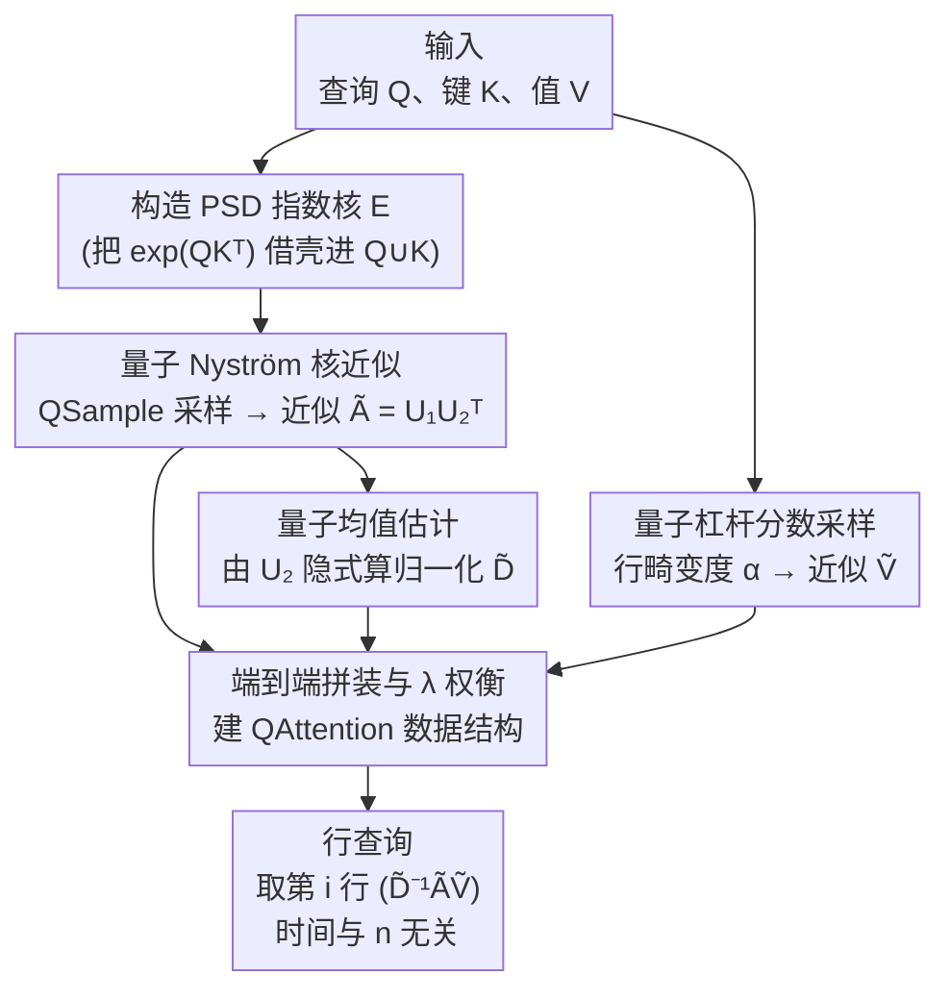

# Sublinear Time Quantum Algorithm for Attention Approximation

**会议**: ICLR2026  
**arXiv**: [2602.00874](https://arxiv.org/abs/2602.00874)  
**代码**: 无  
**领域**: 物理学  
**关键词**: 量子计算, Attention 近似, 亚线性算法, Nyström 近似, 量子采样  
**作者**: Zhao Song (UC Berkeley/Simons), Jianfei Xue (NYU), Jiahao Zhang, Lichen Zhang (MIT)

## 一句话总结

提出首个对序列长度 $n$ 具有**亚线性**时间复杂度的量子数据结构，用于近似 Transformer 注意力矩阵的行查询，预处理时间 $\widetilde{O}(\epsilon^{-1} n^{0.5} \cdot \text{poly}(d, s_\lambda, \alpha))$，每次行查询 $\widetilde{O}(s_\lambda^2 + s_\lambda d)$，相对经典算法实现了关于 $n$ 的二次加速。

## 研究背景与动机

**Attention 的二次瓶颈**：Transformer 的核心是注意力模块 $\text{Att}(Q,K,V) = D^{-1}AV$，其中 $A = \exp(QK^\top / \sqrt{d}) \in \mathbb{R}^{n \times n}$，$D = \text{diag}(A \mathbf{1}_n)$。显式构造 softmax 矩阵 $D^{-1}A$ 需要 $\Omega(n^2)$ 时间，这在长序列 LLM 推理时成为严重瓶颈。

**经典近似的极限**：已有大量工作将注意力计算加速到 $\widetilde{O}(nd)$（稀疏注意力、线性化核方法、KDE 等），但在经典计算机上，$\widetilde{O}(nd)$ 已是最优——因为输出矩阵本身就有 $n \times d$ 大小。

**行查询模型的突破口**：在推理阶段，往往只需要查询 $\text{Att}(Q,K,V)$ 的**特定行**（而非完整矩阵）。这一"行查询模型"规避了 $\Omega(nd)$ 的输出下界。然而，每一行是 $V$ 的行的凸组合，经典算法仍然难以做到对 $n$ 亚线性。

**量子加速的可能性**：Grover 搜索等量子原语可为采样问题提供二次加速。本文的核心洞察在于：将注意力近似分解为三个子问题（近似 $A$、近似 $D$、近似 $V$），每个子问题都可以利用量子技术获得 $\sqrt{n}$ 的加速。

**先前量子方法的局限**：此前 [Gao et al.] 的量子注意力方法需要结构性假设（每个 query 对应的高相关 key 数量 $k$ 有限），当 $k=n$ 时无加速。本文不做任何结构假设。

**理论意义**：这是首个在行查询模型下实现对 $n$ 亚线性的量子注意力近似算法，填补了量子计算与高效 Transformer 推理之间的理论空白。

## 方法详解

### 整体框架

算法把注意力 $\text{Att}(Q,K,V)=D^{-1}AV$ 拆成三个可以分别近似的组件——指数核矩阵 $A$、归一化因子 $D$、值矩阵 $V$——并对每个组件套一层 $\sqrt{n}$ 量子加速。三部分的近似产物组装成一个量子数据结构 `QAttention`：预处理阶段一次性建好压缩表示，之后任意一行注意力都能在与 $n$ 无关的时间里查询出来。下面三点对应三个组件，第四点把它们拼回端到端的精度与复杂度保证。

### 关键设计

**1. 量子 Nyström 核近似：让非对称指数核也能做谱压缩**

直接对 $A=\exp(QK^\top)$ 做 Nyström 近似行不通，因为它既不对称也不是半正定矩阵，谈不上谱低秩结构。本文的做法是把 query 和 key 并成一个扩展数据集 $X=\{q_1,\dots,q_n,k_1,\dots,k_n\}$，构造 $2n\times 2n$ 的指数核矩阵 $E=\begin{bmatrix}\exp(QQ^\top)&\exp(QK^\top)\\\exp(KQ^\top)&\exp(KK^\top)\end{bmatrix}$。$E$ 是 PSD 的、可以做 Nyström 谱近似，而它的右上角块恰好就是要找的 $A$，于是对 $A$ 的近似被"借壳"成对 $E$ 的近似。加速来自采样环节：经典递归脊杠杆分数采样要做 $O(ns_\lambda)$ 次核函数评估，这里改用 Grover 搜索的量子采样器 `QSample`，把采样压到 $\widetilde{O}(n^{0.5}s^{0.5})$ 次 oracle 调用，整段近似的时间为 $\widetilde{O}(n^{0.5}s^{1.5}(d+s)+s^\omega)$，其中 $s=O(s_\lambda\log(s_\lambda/\delta))$，$s_\lambda(E):=\text{tr}[E(E+\lambda I)^{-1}]$ 是 $\lambda$-统计维度，$\omega\approx 2.37$ 是矩阵乘法指数。最终得到的 $\widetilde{E}$ 夹在 $E\preceq\widetilde{E}\preceq E+\lambda I$ 之间，由此推出谱误差 $\|A-\widetilde{A}\|\le\lambda$、Frobenius 误差 $\|A-\widetilde{A}\|_F\le\lambda\sqrt{n}$——所有精度都被单一旋钮 $\lambda$ 控住。

**2. 量子均值估计：在不展开 $\widetilde{E}$ 的前提下隐式算出归一化因子**

归一化因子 $D=\text{diag}(A\mathbf{1}_n)$ 看似只是一次求和，但显式写出 $\widetilde{E}$ 就要 $\Omega(n)$ 的存储和时间，把前一步省下的加速吃光。本文把 $\widetilde{E}=UU^\top$ 按行分块成 $U=[U_1;U_2]$，于是 $\widetilde{A}=U_1U_2^\top$，归一化向量 $\widetilde{A}\mathbf{1}_n=U_1(U_2^\top\mathbf{1}_n)$ 的瓶颈只剩里层的 $U_2^\top\mathbf{1}_n$。把这一项看成对 $U_2$ 各行求均值的多元均值估计问题，用量子多元均值估计（Lemma 2.6）得到 $\widetilde{\mu}$ 满足马氏范数误差 $\|\widetilde{\mu}-U_2^\top\mathbf{1}_n\|_{(U_2^\top U_2)^{-1}}\le\epsilon$，只需 $\widetilde{O}(\epsilon^{-1}n^{0.5}s^{0.5})$ 次对 $U_2$ 的行查询。这样归一化因子从未被完整物化，查询任意第 $i$ 行的归一化值只花 $O(s(s+d))$ 时间。

**3. 量子杠杆分数采样：用行畸变度替代全矩阵扫描来近似 $V$**

最后一步是把 $\widetilde{A}\widetilde{V}$ 里的 $V$ 也压缩掉。经典的联合行范数采样要先读遍 $V$ 的所有条目去估 Frobenius 范数，又是一次 $\Omega(n)$ 扫描。本文改用量子杠杆分数采样，并引入**行畸变度** $\alpha(V):=\frac{d}{\|V\|_F^2}\cdot\max_{i\in[n]}\frac{\|v_i\|_2^2}{\tau_i}$，其中 $\tau_i$ 是 $V$ 第 $i$ 行的杠杆分数；它度量行的"重要性分布有多不均"，并满足 $\alpha\le d/\text{srank}(V)$。按杠杆分数采样 $\widetilde{O}(\epsilon^{-2}\alpha)$ 行就能拿到 Frobenius 范数下的近似矩阵乘法保证，量子实现把这步做到 $\widetilde{O}(\epsilon^{-1}n^{0.5}\alpha^{0.5}d)$。$\alpha$ 这个量推广了经典近似矩阵乘法里"列正交"的苛刻前提，使非正交的 $V$ 也能被高效采样。

**4. 端到端拼装与 $\lambda$ 权衡：把三段误差合成一个保证，并暴露单旋钮调控**

三部分组装后（主定理 3.1 / 9.2），总误差为 $\|\widetilde{D}^{-1}\widetilde{A}\widetilde{V}-\text{Att}(Q,K,V)\|_F\le\epsilon\cdot(\beta\cdot\|D^{-1}\|)\cdot(\|A\|_F+\lambda\sqrt{n})\cdot\|V\|_F$，其中 $\beta=\frac{1}{1-(\epsilon\|A\|+\lambda\sqrt{n})\|D^{-1}\|}$ 是归一化因子被扰动后的放大系数。复杂度上，预处理是对 $n$ 亚线性的 $\widetilde{O}(\epsilon^{-1}n^{0.5}(s_\lambda^{2.5}+s_\lambda^{1.5}d+\alpha^{0.5}d))$，而行查询彻底与 $n$ 脱钩、只要 $\widetilde{O}(s_\lambda^2+s_\lambda d)$。整套算法的实际行为由 $\lambda$ 主导一个张力：$\lambda$ 调大会压低统计维度 $s_\lambda$（更快），却同时收紧 $\|D^{-1}\|$ 的约束余量、抬高 $\beta$（精度更脆），反之亦然，所以 $\lambda$ 要在加速与精度之间找平衡点。

| 阶段 | 时间复杂度 |
|------|-----------|
| 预处理 | $\widetilde{O}(\epsilon^{-1} n^{0.5}(s_\lambda^{2.5} + s_\lambda^{1.5}d + \alpha^{0.5}d))$ |
| 行查询 | $\widetilde{O}(s_\lambda^2 + s_\lambda d)$ |

| $\lambda$ 变化 | $s_\lambda$ | $\|D^{-1}\|$ 约束余量 | $\beta$ |
|:-:|:-:|:-:|:-:|
| $\uparrow$ | $\downarrow$ | $\downarrow$ | $\uparrow$ |
| $\downarrow$ | $\uparrow$ | $\uparrow$ | $\downarrow$ |

## 实验

本文实验主要验证理论假设中关键参数在真实模型上的取值，使用 OLMo2-1B 和 OLMo2-7B 模型的预训练检查点。

### 实验设置

| 参数 | OLMo2-1B | OLMo2-7B |
|------|----------|----------|
| 序列长度 $n$ | 4096 | 4096 |
| 值维度 $d$ | 128 | 128 |
| 层数 $L$ | 16 | 32 |
| 注意力头数 $H$ | 16 | 32 |

使用预训练数据集，batch size 2，共 16 个 batch，统计所有头和层的均值。

### 主实验：参数验证

| 指标 | OLMo2-1B | OLMo2-7B | 理论最坏情况 | 实际含义 |
|------|----------|----------|------------|---------|
| $\epsilon_{\max}$ | 0.1708 | 0.1685 | — | 满足 $\|D^{-1}\| \leq \frac{1}{\epsilon\|A\|}$ 的最大 $\epsilon$ |
| $\|A\|_F / \|A\|$ | 1.3769 | 1.3586 | $\sqrt{n} = 64$ | Frobenius 与谱范数之比 |
| $\|V\|_F / \|V\|$ | 11.3137 | 11.3137 | $\sqrt{d} \approx 11.3$ | 值矩阵的稳定秩相关 |
| $d / \text{srank}(V)$ | 1.7126 | 2.1345 | $d = 128$ | 行畸变度 $\alpha$ 的上界 |
| $\|A\|_\infty / \|A\|$ | 2.7439 | 2.7439 | $\sqrt{n} = 64$ | 无穷范数与谱范数之比 |

### 关键发现

1. **$\epsilon_{\max} \approx 0.17$**：远大于常用的 $\epsilon \approx 0.1$，说明 $\|D^{-1}\|$ 条件在实践中容易满足，参数调节空间充足。

2. **$\|A\|_F / \|A\| \approx 1.4$**：远小于理论最坏情况 $\sqrt{n} = 64$。这意味着 Frobenius 范数误差保证接近谱范数保证，算法精度优于理论预测。

3. **$d / \text{srank}(V) \approx 1.7\text{-}2.1$**：远小于上界 $d = 128$，说明 $\alpha = O(1)$，值矩阵的"行畸变"非常温和，不会造成额外运行时间膨胀。

4. **$\|A\|_\infty / \|A\| \approx 2.7$**：远小于 $\sqrt{n} = 64$，意味着理论中的 $\lambda\sqrt{n}$ 加性误差项在实践中实际为 $O(\lambda)$，大幅拓展了 $\lambda$ 的可选范围。

5. **比特复杂度**：$\log(\kappa(V))$ 平均小于 4，最大小于 20，在 QRAM 模型中是可承受的。

## 亮点

- **首个亚线性量子注意力算法**：在行查询模型下，预处理时间 $O(n^{0.5})$，相对经典 $O(n)$ 实现二次加速，这是该方向的开创性工作。
- **无结构假设**：不需要对 $Q, K, V$ 做任何结构性限制（如稀疏性、低秩），普适性强。
- **巧妙的核矩阵构造**：将非对称的 $\exp(QK^\top)$ 嵌入对称 PSD 核矩阵 $E$，使 Nyström 近似理论可用。
- **理论与实验相互验证**：实验结果表明理论中的最坏情况界在实际中非常松弛，算法的实际表现可能远优于理论保证。
- **行畸变度 $\alpha$ 概念的引入**：推广了经典近似矩阵乘法中对正交列的要求，使得非正交 $V$ 也可高效采样。

## 局限性

1. **误差为 Frobenius 范数**：目前仅提供 Frobenius 范数保证（所有行误差平方和），未能给出谱范数的逐行最坏情况保证。
2. **$\lambda\sqrt{n}$ 加性项**：理论分析中将无穷范数放缩为 $\sqrt{n}$ 倍谱范数，导致该加性误差项——虽然实验表明实际远小于此，但理论上迫使选择小 $\lambda$。
3. **不支持因果掩码**：Nyström 近似隐式假设 query-key 全连接交互，无法直接处理自回归解码中的因果 mask。
4. **QRAM 模型假设**：算法依赖量子随机读写存储器 (QRAM)，当前量子硬件尚不支持，短期内难以实际部署。
5. **比特复杂度分析不完整**：仅给出初步分析，QRAM 模型下数值线性代数的比特复杂度仍需更系统的研究。

## 相关工作

| 方向 | 代表方法 | 与本文关系 |
|------|---------|-----------|
| 稀疏注意力 | Sliding window, BigBird, ETC | 经典 $O(n)$，利用结构先验，无量子加速 |
| 线性注意力 | Random feature map, Performer | 经典 $O(nd)$，近似精度有限 |
| 数据结构注意力 | KDE [Alman & Song], Hashing [Chen et al.] | 经典最优 $\widetilde{O}(nd)$，本文在量子计算下进一步突破 |
| Nyströmformer | [Xiong et al.] | 虽也用 Nyström，但仅在所有行做 landmark 时收敛；本文基于核矩阵做谱近似 |
| 量子注意力 | [Gao et al.] | 需要 $k$-稀疏假设，$k=n$ 时无加速；本文无假设 |
| 量子 ML 通用方法 | Grover search, QMatVec | 本文的基础量子原语 |

## 评分

- **新颖性**: ⭐⭐⭐⭐⭐ — 首个无假设亚线性量子注意力算法，核矩阵嵌入思路优雅
- **理论深度**: ⭐⭐⭐⭐⭐ — 从 Nyström 谱近似到均值估计到杠杆分数采样，三部分分析严谨完整
- **实验充分度**: ⭐⭐⭐ — 仅做参数验证（OLMo2 上），无端到端的加速/精度对比实验
- **写作质量**: ⭐⭐⭐⭐ — 技术概览清晰，证明步骤详尽，roadmap 组织良好
- **实用价值**: ⭐⭐ — 依赖 QRAM，短期无法在真实量子硬件上部署；理论贡献大于实用意义
- **综合**: ⭐⭐⭐⭐ — 量子计算×Transformer 交叉方向的高质量理论工作

<!-- RELATED:START -->

## 相关论文

- [\[CVPR 2026\] PhysSkin: Real-Time and Generalizable Physics-Based Skin Simulation](../../CVPR2026/physics/physskin_real-time_and_generalizable_physics-based_animation_via_self-supervised.md)
- [\[ICLR 2026\] Feedback-driven Recurrent Quantum Neural Network Universality](feedback-driven_recurrent_quantum_neural_network_universality.md)
- [\[NeurIPS 2025\] Why Is Attention Sparse in Particle Transformer?](../../NeurIPS2025/physics/why_is_attention_sparse_in_particle_transformer.md)
- [\[CVPR 2026\] Continuous Exposure-Time Modeling for Realistic Atmospheric Turbulence Synthesis](../../CVPR2026/physics/continuous_exposure-time_modeling_for_realistic_atmospheric_turbulence_synthesis.md)
- [\[NeurIPS 2025\] Hamiltonian Neural PDE Solvers through Functional Approximation](../../NeurIPS2025/physics/hamiltonian_neural_pde_solvers_through_functional_approximation.md)

<!-- RELATED:END -->
