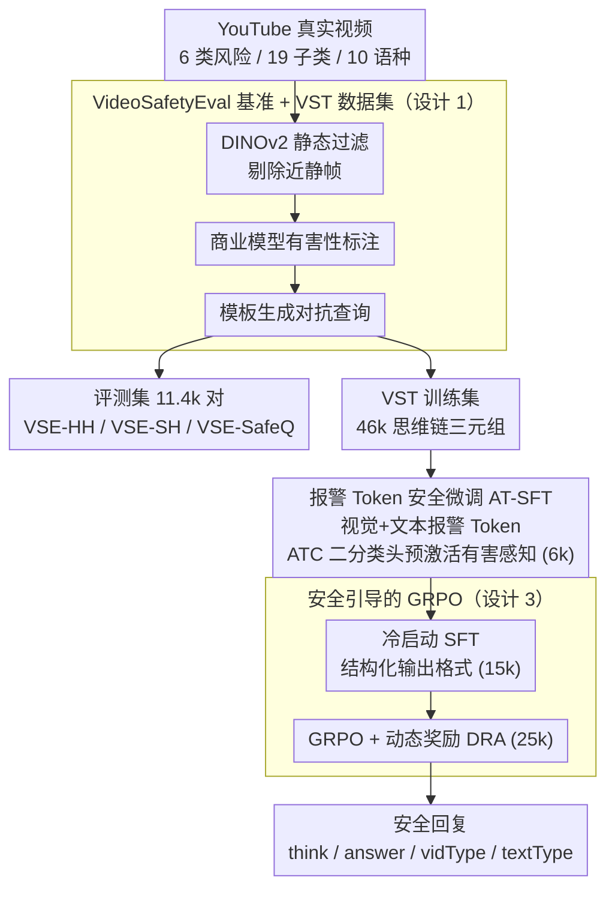

# From Evaluation to Defense: Advancing Safety in Video Large Language Models

**会议**: ICLR2026  
**arXiv**: [2505.16643](https://arxiv.org/abs/2505.16643)  
**代码**: 待确认  
**领域**: 推荐系统  
**关键词**: video LLM safety, benchmark, alarm token, GRPO, safety alignment

## 一句话总结
构建 VideoSafetyEval（11.4k 视频-查询对覆盖 19 种风险类别）揭示视频模态使安全性能下降 34.2%，提出 VideoSafety-R1 三阶段框架（报警 Token+SFT+Safety-guided GRPO）在 VSE-HH 上提升 71.1% 防御成功率。

## 研究背景与动机
**领域现状**：图像 LLM 的安全风险已被广泛研究（MMBench、SIUO、SafeVLM 等），但视频 LLM 的安全对齐严重不足。视频的时间动态、视觉线索和演化上下文引入了比静态图像更微妙且更有效的风险。

**现有痛点**：对 21 个主流视频 LLM 的系统测试发现，引入视频模态后防御成功率（DSR）平均下降 34.2%，暴露了多模态攻击利用中的系统性风险。VideoLLaMA3-2B 的 DSR 降幅高达 79.4%。

**安全研究空白**：现有防御方法（SafeVLM、SPA-VL、MM-RLHF）均聚焦静态图像，忽略了视频安全。视频异常检测（VAD）虽相关但目标不同——VAD 关注检测异常事件，而安全对齐关注控制模型在有害输入下的行为响应。

**核心设计理念**：安全对齐应从单纯的"危害感知"升级为"主动推理"——模型不仅要识别有害内容，还要通过推理链分析视频-文本对的有害性并生成有帮助的安全响应。

## 方法详解

### 整体框架
VideoSafety-R1 是一个后训练框架，把视频 LLM 的安全能力从被动的"危害感知"推进到主动的"安全推理"。它先用一个大规模真实视频构建评测基准 VideoSafetyEval（VSE）暴露问题，并复用同一条构建流水线产出配套的 VideoSafetyThinking 训练集（VST，46k 视频-查询-思维链三元组，其中 6k 喂给 AT-SFT、15k 用于冷启动、25k 用于强化学习）；随后依次完成报警 Token 引导的安全微调（AT-SFT）和安全引导的 GRPO 训练，让模型学会先识别视频与文本各自的有害性、再生成有帮助的安全回复。整条链路就是论文标题里"from evaluation to defense"——基准把问题量化，两阶段后训练把防御能力补上。

### 关键设计

**1. VideoSafetyEval 基准与 VST 数据集：用真实视频把"视频降低安全性"这件事量化出来**

要研究视频安全，先得有能逼出问题的评测集。作者从 YouTube 按社区准则采集真实视频，经三道工序逐级过滤——先用 DINOv2 做静态过滤剔除接近静帧的无效片段，再用商业视频理解模型完成有害性标注，最后用模板驱动生成对抗查询。同一条流水线一物两用：导出评测基准 VideoSafetyEval（11.4k 视频-查询对，覆盖暴力、管制物品、色情等 6 大风险类别、19 个子类别、10 种语言社区），同时产出训练用的 VideoSafetyThinking 数据集（46k 视频-查询-思维链三元组，为后两阶段供料）。评测基准拆成三个子集来分离不同失效模式——VSE-HH（有害视频配有害查询，对抗最强）、VSE-SH（安全视频配有害查询）、VSE-SafeQ（安全查询，专门衡量过度防御导致的误拒）。正是在这套基准上，作者测出引入视频后 21 个主流模型的防御成功率平均掉 34.2%，把后续防御方法要解决的目标钉死。

**2. 报警 Token 引导的安全微调（AT-SFT）：在感知层先把安全信号"预激活"**

强化学习之前需要一个安全感知的起点，否则推理无从谈起。作者在视觉序列末尾注入可学习的报警 Token $\mathbf{h}_v^{\text{alarm}}$，在文本序列末尾注入 $\mathbf{h}_t^{\text{alarm}}$，让这两个 Token 充当各自模态的"安全探针"。训练时在原始生成损失之外，对两个报警 Token 的隐藏状态分别接一个有害/安全二分类头（ATC，报警 Token 分类），使其表征与真实安全标签对齐，整体目标为 $\mathcal{L}_{\text{AT-SFT}} = \mathcal{L}_{\text{base}} + \lambda_1 \mathcal{L}_{\text{ATC}}^v + \lambda_2 \mathcal{L}_{\text{ATC}}^t$。这一步只用 6k 样本，作用是把视频和文本的有害性分别"显式化"到模型内部，为后续 GRPO 的双模态推理奠定可用的感知基础。

**3. 安全引导的 GRPO（Safety-guided GRPO）：让模型把感知到的安全信号组织成可解释的推理链，并用动态奖励平衡安全与自然**

光感知不够，模型还要能推理并给出既安全又有用的回复。作者先用 15k 样本做冷启动 SFT，训练一套结构化输出格式：`<think>` 写安全推理过程、`<answer>` 给最终响应、`<vidType>` 与 `<textType>` 分别标注视频和文本的有害性。随后用 25k 样本做 GRPO，奖励由格式、与安全参考的 ROUGE 相似度、视频分类、文本分类四项加权而成：$r = r_{\text{format}} + \alpha \cdot r_{\text{ROUGE}} + \gamma_1 \cdot r_v + \gamma_2 \cdot r_t$。关键创新是动态奖励适应（DRA）：ROUGE 权重 $\alpha$ 不固定，而是随双模态分类是否同时正确而变，$\alpha = \alpha_{\min} + (1 - \text{Correct}_v \cdot \text{Correct}_t)(\alpha_{\max} - \alpha_{\min})$。当视频与文本判断都对时 $\alpha$ 降到 $\alpha_{\min}$，放松对安全参考的模仿、鼓励回复多样自然；只要任一判断出错就把 $\alpha$ 拉到 $\alpha_{\max}$，强制向安全参考对齐。这样模型在"答得安全"和"答得自然"之间自适应取舍，既压住有害输出又避免一律僵硬拒绝。

## 实验关键数据

### 主实验：21 个视频 LLM 在 VSE-HH 上的表现

| 模型 | DSR(有视频)↑ | DSR(无视频) | DSR 降幅↓ | 帮助度↑ |
|------|------------|-----------|----------|--------|
| Gemini-2.5-Pro | 86.7% | 99.5% | 12.8% | 1.6 |
| GPT-4o | 73.0% | 98.4% | 25.9% | 2.2 |
| VideoLLaMA3-2B | 18.4% | 89.3% | **79.4%** | 2.3 |
| InternVideo2.5-8B | 16.5% | 53.5% | 69.2% | 1.0 |

### VideoSafety-R1 效果

| 指标 | 基线(VideoLLaMA3-2B) | VideoSafety-R1 | 提升 |
|------|------|------|------|
| VSE-HH DSR | 18.4% | — | **+71.1%** |
| MMBench DSR | — | — | **+59.1%** |
| VLGuard | — | — | **+44.3%** |
| FigStep | — | — | **+15.0%** |

### 关键发现
- 视频模态引入使所有模型的安全性显著退化——即使是 GPT-4o 也下降 25.9%
- 越依赖高效视频编码（1fps）的模型退化越严重（VideoLLaMA3 降 79.4% vs VideoLLaMA2 降 7.3%）
- VideoSafety-R1 在 19 个子类别中的 18 个上达到最高 DSR
- 安全提升的同时不显著损害通用能力——帮助度评分保持合理水平
- 模型可泛化到图像安全基准（MMBench/VLGuard/FigStep），说明安全推理能力可迁移

## 亮点与洞察
- 首个大规模真实世界视频 LLM 安全基准——基于 YouTube 社区准则，贴合实际场景
- 从感知（AT-SFT 报警 Token）到推理（Safety-guided GRPO 思维链）的渐进式安全对齐设计——不是简单拒绝而是生成有帮助的安全响应
- 动态奖励适应机制优雅地平衡了安全性和响应质量——分类正确时放松 ROUGE 约束鼓励自然回复
- 双模态独立标注（视频有害性 vs 文本有害性）的设计使模型能区分不同来源的风险

## 局限与展望
- 安全分类的二值标签（有害/安全）可能过于粗糙，细粒度风险等级未考虑
- 过度防御（误拒率）需要与安全性做权衡——VSE-SafeQ 子集可评估但论文未深入分析
- 基线模型为 VideoLLaMA3-2B（2B 参数），对更大模型（7B+）的效果未充分验证
- 46k 训练数据的标注质量依赖商业 LLM，存在标注偏差风险
- 评估依赖 Qwen-Long API 作为判断器，可能引入评估偏差

## 相关工作与启发
- **vs SafeVLM/SPA-VL**: 聚焦静态图像安全，本文首次系统处理视频安全
- **vs 视频异常检测 (UCF-Crime/XD-Violence)**: VAD 检测异常事件，本文控制模型行为响应——目标不同
- **vs MM-RLHF**: 用 DPO 做视觉安全对齐，本文用 GRPO+规则奖励——更可控
- **vs SafeWatch-Bench**: 关注视频内容安全理解，本文关注模型反应安全对齐——互补方向

## 评分
- 新颖性: ⭐⭐⭐⭐⭐ 首个系统的视频 LLM 安全工作，填补关键空白
- 实验充分度: ⭐⭐⭐⭐⭐ 21 个模型评估 + 4 个安全基准 + 多组件消融
- 写作质量: ⭐⭐⭐⭐ 结构清晰，三组件层层递进
- 价值: ⭐⭐⭐⭐⭐ 为视频 LLM 安全研究奠定基准和方法基础

<!-- RELATED:START -->

## 相关论文

- [\[NeurIPS 2025\] Inference-Time Reward Hacking in Large Language Models](../../NeurIPS2025/recommender/inference-time_reward_hacking_in_large_language_models.md)
- [\[AAAI 2026\] Inference-Aware Prompt Optimization for Aligning Black-Box Large Language Models](../../AAAI2026/recommender/inference-aware_prompt_optimization_for_aligning_black-box_large_language_models.md)
- [\[ACL 2025\] KERL: Knowledge-Enhanced Personalized Recipe Recommendation using Large Language Models](../../ACL2025/recommender/kerl_knowledge-enhanced_personalized_recipe_recommendation_using_large_language_.md)
- [\[AAAI 2026\] Hard vs. Noise: Resolving Hard-Noisy Sample Confusion in Recommender Systems via Large Language Models](../../AAAI2026/recommender/hard_vs_noise_resolving_hard-noisy_sample_confusion_in_recommender_systems_via_l.md)
- [\[NeurIPS 2025\] R²ec: Towards Large Recommender Models with Reasoning](../../NeurIPS2025/recommender/r2ec_towards_large_recommender_models_with_reasoning.md)

<!-- RELATED:END -->
