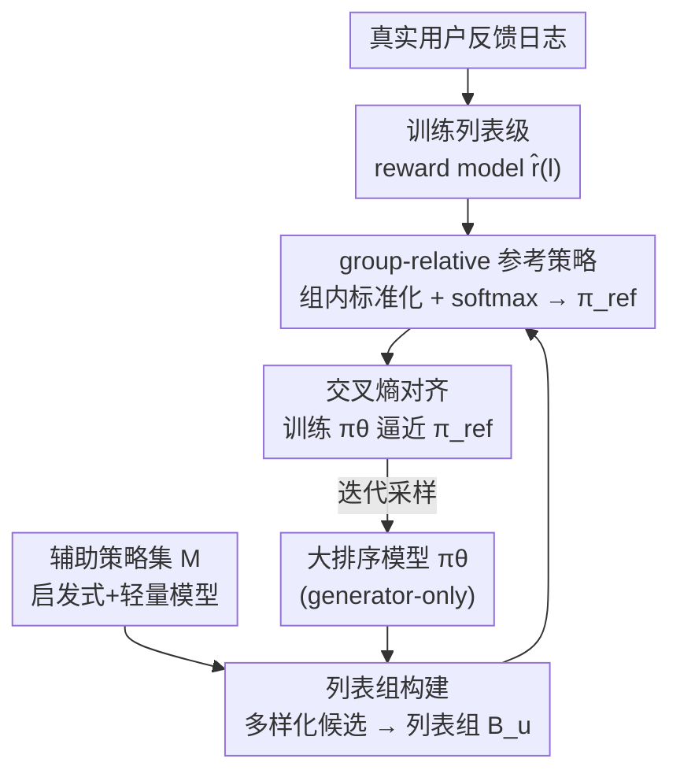

# GoalRank: Group-Relative Optimization for a Large Ranking Model

**会议**: ICLR 2026  
**arXiv**: [2509.22046](https://arxiv.org/abs/2509.22046)  
**代码**: 无  
**领域**: LLM对齐 / 推荐排序  
**关键词**: ranking, generator-only, group-relative optimization, scaling law, recommendation  

## 一句话总结
理论证明任意 Multi-Generator-Evaluator 排序系统都存在一个更大的 generator-only 模型以更小的误差逼近最优策略且满足 scaling law，据此提出 GoalRank——用 reward model 构建 group-relative 参考策略来训练大型 generator-only 排序模型，在线 A/B 测试中显著优于 SOTA。

## 研究背景与动机
**领域现状**：推荐系统排序阶段是从 N 个候选中选出长度 L 的有序列表（P(N,L) 组合空间）。主流方案是 Generator-Evaluator 两阶段范式：generator 产出候选列表，evaluator 选最优。

**现有痛点**：增加 generator 数量/多 generator 集成的收益迅速饱和（Fig 1d）。两阶段范式引入跨阶段不一致性和工程复杂度。

**核心矛盾**：两阶段方法的策略空间受限于 k 个小 generator 的混合，而端到端大模型的 scaling law 表明更大的单一模型可能更好。

**本文目标**（1）generator-only 能否理论上超越 Multi-G-E？（2）如何训练这样的大排序模型？

**切入角度**：Theorem 1 证明更大 generator-only 的逼近误差严格小于任意有限 Multi-G-E，且随模型增大趋向零。

**核心 idea**：用 reward model 在候选列表组上构建 group-relative softmax 参考策略，通过交叉熵训练大排序模型逼近最优策略。

## 方法详解

### 整体框架
GoalRank 把传统两阶段排序压缩成一个端到端的大 generator（generator-only），训练分三步走。第一步先用真实用户反馈训练一个列表级 reward model $\hat{r}(l)$，预估整张推荐列表能换来多少用户反馈（如观看时长、互动行为）。第二步为每个用户采样一批候选列表凑成列表组 $\mathcal{B}_u$，候选既来自正在训练的主排序模型 $\pi_\theta$，也来自一个辅助策略集 $\mathcal{M}$（启发式规则 + 轻量神经模型），以保证组内列表足够多样。第三步在组内对 reward 做减均值除标准差的标准化、再过 softmax，把 reward 转成一个参考策略 $\pi^{ref}$，让 $\pi_\theta$ 通过交叉熵去逼近它。整套流程不再依赖独立的 evaluator 做挑选，而是把"评价"信号蒸馏进单一模型的训练目标里；至于为什么敢放弃 evaluator、押注一个大 generator，由 Theorem 1 在理论上兜底。

### 关键设计

**1. Theorem 1：用理论说明 generator-only 为什么值得做**

GoalRank 的出发点是一个反直觉的结论——单一大模型在原理上能赢过任意多个小 generator 的集成。论文把两阶段方案抽象为 k-mixture 的 $(α,β)$-bounded 策略空间 $\mathcal{C}_m^k$，把端到端方案抽象为 generator-only 策略空间 $\mathcal{F}_M$，并证明只要后者宽度 $\geq kα+n$，就存在 $\mathcal{E}(\mathcal{F}_M) < \mathcal{E}(\mathcal{C}_m^k)$，即逼近最优策略 $\pi^*$ 的误差严格更小；更进一步，随着模型容量 $n→∞$ 有 $\lim_{n→∞}\mathcal{E}(\mathcal{F}_M)=0$。这条定理直接解释了实验里"多 generator 收益饱和"的现象：集成的策略空间被 $k$ 个小模型的混合卡死了上限，而 scaling up 单模型才能持续逼近最优，因此整个框架才敢放弃 evaluator、押注一个大 generator。

**2. 列表组构建：靠多样化候选撑开足够大的 reward 差距**

第三步的 group-relative 标准化能成立的前提，是同一个列表组内的 reward 必须拉得开——若只从单个 generator 反复采样，列表彼此太像、reward 差距太小，标准化反而会把噪声放大。为此 GoalRank 给每个用户构建列表组 $\mathcal{B}_u$ 时，除了正在训练的主模型 $\pi_\theta$，还引入一个辅助策略集 $\mathcal{M}$，里面既有启发式规则也有轻量神经模型，生成风格各异的候选列表一起塞进组里。多样化的来源保证同一组里既有好列表也有差列表，reward 差距更容易超过临界阈值，从而让下一步的参考策略序关系稳定可用。消融实验显示组太小（3–5）样本不足、组太大（50–100）又会摊薄 reward 差距，中等规模（8–20）最佳。

**3. group-relative 参考策略：让有偏的 reward model 也能给出可靠监督**

直接拿 reward model 的绝对分数当训练目标很危险，因为真实 reward model 几乎一定带系统性偏差 $\hat{r}(l)=r^*(l)+b(l)$。GoalRank 的做法是只信任组内的相对关系：在列表组 $\mathcal{B}$ 上做减均值除标准差的标准化后再过 softmax，得到参考策略

$$\pi^{ref}(l|\mathcal{B}) = \frac{\exp((\hat{r}(l) - \bar{r}_\mathcal{B})/\sigma_\mathcal{B})}{\sum_{l'} \exp((\hat{r}(l') - \bar{r}_\mathcal{B})/\sigma_\mathcal{B})}$$

其中 $\bar{r}_\mathcal{B}$、$\sigma_\mathcal{B}$ 是组内均值与标准差。这样无论 reward model 整体偏高还是偏低，标准化都会把绝对偏差消掉，只要组内 reward 差距够大、列表之间的序关系就能保持正确——而序关系正是训练真正需要的信号。拿到 $\pi^{ref}$ 后，用交叉熵让 $\pi_\theta$ 去对齐它（等价于最小化到 $\pi^*$ 的 KL 散度的一个可行上界）。这也是它与 RLHF/DPO 共享的内核：用相对偏好而非绝对打分来约束策略。

## 实验关键数据

### 主实验（ML-1M / Industry / Amazon-Book）

| 方法 | ML-1M H@6 | Industry H@6 | Book H@6 |
|------|-----------|-------------|----------|
| Best G-E (PIER) | 62.74 | 45.35 | 71.14 |
| Best MG-E (G-100) | 60.64 | - | - |
| **GoalRank** | **64.51** | **55.33** | **74.29** |
| 提升 vs best baseline | +2.77% | +11.3% | +1.7% |

### Scaling Law 验证
GoalRank 的性能随模型参数量/训练数据量稳定提升，展现出清晰的 scaling law。

### 在线 A/B 测试
在工业级短视频平台上，GoalRank 相比 SOTA 基线在核心指标上实现了显著提升。

### 关键发现
- Generator-only GoalRank 在所有数据集上超越所有 G-E 和 MG-E 基线，验证了 Theorem 1。
- MG-E 方法增加 generator 从 3→100，性能提升饱和甚至下降。
- Group-relative 标准化使训练对 reward model 的绝对偏差不敏感，只需序关系正确。

## 亮点与洞察
- **理论驱动的实践**：Theorem 1 不仅是理论装饰，而是指导了整个框架设计——放弃两阶段范式、scaling up generator、用 group-relative 避免精确 reward。
- **与 DPO/RLHF 的呼应**：GoalRank 的 group-relative 优化与 LLM 对齐中的 RLHF/DPO 高度类似——都用 reward 信号构建参考分布来训练策略，只是应用场景从"文本生成"变成了"列表排序"。
- **Scaling Law 的推荐系统版本**：首次在排序任务上展示了与 LLM 类似的 scaling law。

## 局限与展望
- 需要预训练 reward model，其质量上限决定了 GoalRank 的上限。
- 辅助策略集 $\mathcal{M}$ 的选择对列表组多样性和 reward 差距有影响。
- 仅在推荐排序场景验证，未探索在 LLM 对齐（如 RLHF）中的应用。

## 相关工作与启发
- **vs PIER/NAR4Rec**：两阶段 G-E 方法，受限于候选列表空间的有限覆盖。GoalRank 直接在全策略空间优化。
- **vs DPO/RCPO**：RCPO 在文本对齐中用 ranked choice 替代 pairwise，GoalRank 在推荐排序中用 group-relative 替代 pointwise。核心思想一致。

## 评分
- 新颖性: ⭐⭐⭐⭐ 理论证明 generator-only 优于 G-E 是有力贡献，group-relative 优化思路新颖
- 实验充分度: ⭐⭐⭐⭐⭐ 公开数据集 + 工业数据集 + 在线 A/B 测试 + scaling law
- 写作质量: ⭐⭐⭐⭐ 理论和实践结合好
- 价值: ⭐⭐⭐⭐ 对推荐系统排序范式有重要影响

<!-- RELATED:START -->

## 相关论文

- [\[AAAI 2026\] Inference-Aware Prompt Optimization for Aligning Black-Box Large Language Models](../../AAAI2026/recommender/inference-aware_prompt_optimization_for_aligning_black-box_large_language_models.md)
- [\[ICML 2025\] ELMO: Efficiency via Low-precision and Peak Memory Optimization in Large Output Spaces](../../ICML2025/recommender/elmo_efficiency_via_low-precision_and_peak_memory_optimization_in_large_output_s.md)
- [\[NeurIPS 2025\] Measuring What Matters: Construct Validity in Large Language Model Benchmarks](../../NeurIPS2025/recommender/measuring_what_matters_construct_validity_in_large_language_model_benchmarks.md)
- [\[ICML 2025\] LCRON: Learning Cascade Ranking as One Network](../../ICML2025/recommender/learning_cascade_ranking_as_one_network.md)
- [\[ICML 2026\] RGMem: Renormalization Group-Inspired Memory Evolution for Language Agents](../../ICML2026/recommender/rgmem_renormalization_group-inspired_memory_evolution_for_language_agents.md)

<!-- RELATED:END -->
