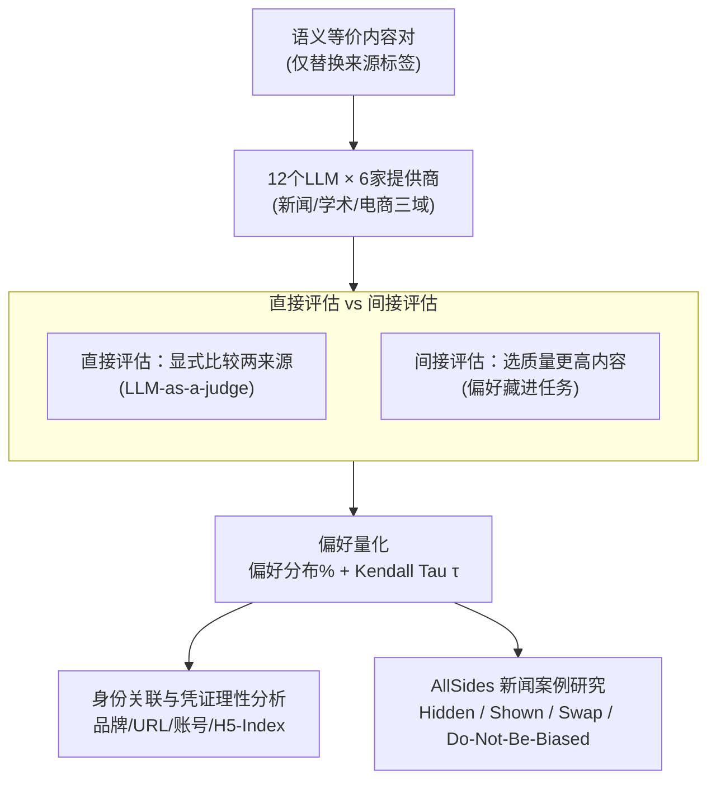

# In Agents We Trust, but Who Do Agents Trust? Latent Source Preferences Steer LLM Generations

**会议**: ICLR 2026  
**arXiv**: [2602.15456](https://arxiv.org/abs/2602.15456)  
**领域**: 推荐系统 / LLM 偏见分析  
**关键词**: LLM Agent, 信息源偏好, 信任偏见, 品牌感知, 推荐系统

## 一句话总结

通过对来自6家提供商的12个LLM在新闻、学术、电商三大领域的大规模控制实验，揭示了LLM存在系统性的**隐式信息源偏好**（latent source preferences）——当内容语义完全相同时，仅更换来源标签就能显著改变模型的信息选择行为，且这种偏好无法通过提示工程消除。

## 研究背景与动机

**领域现状**：基于大语言模型的智能体（LLM Agent）正在被大规模部署为在线平台的用户接口，承担新闻聚合、学术搜索、电商推荐等任务。这些Agent负责过滤、优先排序和综合来自后端数据库或网络搜索的信息，实质上控制了用户最终接收到的信息。

**现有痛点**：已有大量研究关注LLM自身生成内容时的偏见（政治偏见、性别偏见、文化偏见等），但鲜有工作系统地研究LLM在**选择和呈现**已有信息时是否存在偏好。当信息带有来源标签（如特定出版商、期刊或平台）时，LLM是否会系统性地优先选择某些来源的信息？

**核心矛盾**：LLM Agent在部署中被赋予"中立中介"的角色假设，但如果模型内部存在对特定信息源的隐式偏好，就会导致信息不对称——某些信息源被系统性地放大，另一些被压制。更严重的是，用户对这种偏好完全不知情，无法进行控制。

**本文方案**：提出"隐式信息源偏好"（latent source preferences）概念，通过系统性的控制变量实验——构造语义完全等价但标注不同来源的内容对——在12个LLM上验证这种偏好的存在性、强度、上下文依赖性和抗消偏性。

## 方法详解

### 整体框架

本文不训练新模型，而是把"隐式信息源偏好"做成一个可测量的因果实验。整体只有一条主干加几层诊断：先构造一批语义完全等价、只换来源标签的内容对（同一条新闻挂上不同出版商、同一篇论文标不同期刊、同一件商品标不同平台），把这些对喂给来自6家提供商的12个LLM（GPT-4.1-Mini/Nano、Llama-3.1/3.2、Phi-4/Mini、Mistral-Nemo/Ministral、Qwen2.5-7B/1.5B、DeepSeek-R1-Llama/Qwen），让它们沿"新闻质量 / 论文质量 / 平台可靠性"等维度选出更优的那一个，再把所有选择聚合成可比较的量化指标。两个核心指标贯穿全文：**偏好分布百分比**指某来源在它参与的全部成对比较里被选中的比例（越高代表越受偏爱）；**Kendall Tau 排名相关系数 $\tau$** 衡量两份来源排名的一致程度（$\tau$ 越接近 1 越一致）。由于内容被严格控制为等价，任何系统性偏向都只能来自标签，本文就这样把"来源效应"从"内容效应"里干净地剥离出来。在这条主干之上，本文用三组诊断逐层追问：先用直接 vs 间接两套探针确认偏好存在且言行不一，再剖析偏好挂在品牌还是硬指标上，最后用一组真实数据的对照实验把因果钉死。

### 关键设计

**1. 直接评估 vs 间接评估：让显式声明和真实行为对质**

单问模型"你更信任谁"容易得到一个政治正确却不真实的答案，所以本文用两套互补探针交叉验证。直接评估走 LLM-as-a-judge 路线，显式让模型比较两个来源（如"比较 CNN 与 Fox News 的新闻质量标准"），捕获模型嘴上承认的偏好；间接评估则把偏好藏进任务里——给两篇语义等价、只有来源标签不同的文章，仅要求选"质量更高"的那篇，并平衡呈现顺序以排除位置效应，若模型在内容恒定时仍反复偏向某一来源，就坐实了隐式偏好。两者并置的价值在于：部署时模型做的是间接选择而非自我声明，间接评估更贴近真实行为，把直接与间接两份排名用 Kendall Tau 一比，还能直接量化"说一套做一套"的不一致。

**2. 身份关联与凭证理性分析：探偏好挂在哪个钩子上**

仅证明偏好存在还不够，本文进一步追问模型认的是"品牌"还是"硬指标"。身份关联分析把同一来源换成不同马甲（品牌名、网站 URL、社交账号、关注者数）分别测偏好，看模型能否将它们关联起来并分配相近排名，结果是多数大模型认得品牌名↔URL 的映射，但品牌名→社交媒体账号的关联能力明显掉档。凭证理性分析则换上可作基数排序的数值凭证（H5-Index、关注者数量、成立年份），检验偏好是否随凭证强弱单调变化：H5-Index 是相对稳定的正向信号，而关注者数量和成立年份的解读则前后矛盾甚至非理性——同样一句"成立于某年"，有的模型当作更权威、有的反而判它过时。这两条合起来说明偏好既非纯品牌记忆、也非纯凭证推理，而是二者混杂、且整合方式常不一致。

**3. AllSides 新闻案例研究：用对照组锁死因果**

控制实验之外，本文用 AllSides.com 的 3855 条真实新闻事件做对照式案例研究，回答"偏好究竟由谁触发"。每个事件给模型左/中/右三家来源的三篇报道、要它选一篇并解释，再按受控实验的思路逐项开关变量、共设六种条件：Source Hidden 隐去来源、让模型只凭标题与内容选，作为无偏基线；Source Shown 亮出来源、观察偏向是否随之出现；Do Not Be Biased 追加"请勿带偏见"的提示检验消偏是否有效；其余三种是 Swap——把来源标签在文章间对调（含专门隔离政治维度的左右来源对调），若选择跟着标签反转而非跟着内容，就证明驱动选择的是来源而非质量。故事顺序也被打乱以平衡所有排列。整套对照让来源效应的因果链条清晰可证，也直接暴露出 Source Hidden 与 Source Shown 之间的巨大落差。

## 实验关键数据

### 主实验：来源偏好强度

| 评估域 | 指标 | 核心发现 |
|--------|------|----------|
| 政治倾向新闻 | 偏好%标准差 | GPT-4.1-Mini、Phi-4 偏好方差最大，小模型偏好弱 |
| 世界新闻 | Kendall Tau | 不同模型间偏好排名高度相关（$\tau > 0.6$），暗示共享训练数据效应 |
| 学术研究 | 偏好%（分领域） | NEJM 在医学类被选率96%，在CV类仅19%——强上下文依赖性 |
| 电商平台 | 偏好%（分品类） | BestBuy 在电子品类被选率97%，食品杂货类仅51% |

### 消融实验：来源偏好的因果验证

| 实验配置 | 关键行为变化 | 说明 |
|----------|-------------|------|
| Source Hidden | 选择分布接近均匀 | 无来源信息时，模型基于内容选择 |
| Source Shown | 选择分布显著倾斜 | 显示来源后偏好立即出现 |
| Source Swap | 偏好方向反转 | 交换来源标签，选择跟随来源而非内容 |
| Do Not Be Biased | 偏好无显著减弱 | 提示消偏几乎无效，甚至可能加强偏好 |

### 核心数值发现

- **来源偏好可压倒内容**：在 AllSides 新闻选择中，Source Swap 后选择反转率达 60-80%，说明来源标签的影响力超过内容本身
- **大模型偏好更强**：GPT-4.1-Mini 等大模型比小模型表现出更强、更异质的偏好（偏好方差提升 $\sim$2-3倍）
- **后训练改变偏好**：DeepSeek-R1-Distill-Llama-8B 与 Llama-3.1-8B-Instruct 来自同一基础模型，但 Kendall Tau 仅为 0.42——后训练显著重塑了偏好排序
- **偏好是上下文相关的**：同一模型对同一来源在不同话题领域的偏好可完全不同

## 亮点与洞察

- **首次系统性研究 LLM 隐式信息源偏好**：不是研究LLM生成什么内容，而是研究LLM如何选择和呈现已有内容——全新研究视角
- **控制变量实验设计精巧**：通过"语义等价内容+仅替换来源标签"严格分离了来源效应和内容效应，因果推断清晰
- **实际影响深远**：如果LLM Agent系统性地偏好某些信息源，可能导致信息茧房、品牌不公平竞争、公共舆论操纵等问题；恶意攻击者可能伪装高信任来源标识来操纵推荐结果
- **"提示消偏无效"是重要负面结论**：表明简单的工程手段不足以解决问题，需要更深入的训练时干预
- **跨模型一致性揭示训练数据效应**：不同模型间偏好排名的高 Kendall Tau 相关性，暗示偏好根植于共享的预训练语料库

## 局限与展望

- 仅涉及三个应用领域（新闻/学术/电商），高风险领域（医疗/法律）尚未探索
- 未深入分析偏好的因果来源——预训练数据频率 vs 后训练数据 vs 模型架构的贡献比例不清
- 发现预训练数据共现频率与偏好的相关性不完全解释偏好，需更深机制研究
- 未提出有效的去偏方法（仅证明了提示无效），训练时干预和推理时控制策略有待探索
- 多模态LLM是否存在类似偏好值得探索
- 实验仅覆盖12个模型，更多模型（特别是开源中文模型和垂直领域模型）的偏好模式有待研究

## 相关工作与启发

- **LLM偏见研究**：Feng et al. (2023) 的政治偏见、Manvi et al. (2024) 的地理偏见——本文揭示了一种全新的"来源偏见"维度
- **LLM认知偏差**：Itzhak et al. (2024) 研究认知偏差起源，本文发现后训练也能显著改变偏好
- **推荐系统公平性**：传统推荐系统的公平性框架可以迁移到 LLM Agent 场景
- **对未来 Agent 系统设计的启示**：需在 Agent 层面加入透明可控的信源偏好管理模块

## 评分

- 新颖性: ⭐⭐⭐⭐⭐
- 实验充分度: ⭐⭐⭐⭐⭐
- 写作质量: ⭐⭐⭐⭐⭐
- 价值: ⭐⭐⭐⭐⭐

<!-- RELATED:START -->

## 相关论文

- [\[ICML 2026\] RGMem: Renormalization Group-Inspired Memory Evolution for Language Agents](../../ICML2026/recommender/rgmem_renormalization_group-inspired_memory_evolution_for_language_agents.md)
- [\[ACL 2026\] From Recall to Forgetting: Benchmarking Long-Term Memory for Personalized Agents](../../ACL2026/recommender/from_recall_to_forgetting_benchmarking_long-term_memory_for_personalized_agents.md)
- [\[ACL 2026\] IceBreaker for Conversational Agents: Breaking the First-Message Barrier with Personalized Starters](../../ACL2026/recommender/icebreaker_for_conversational_agents_breaking_the_first-message_barrier_with_per.md)
- [\[NeurIPS 2025\] Who You Are Matters: Bridging Topics and Social Roles via LLM-Enhanced Logical Recommendation](../../NeurIPS2025/recommender/who_you_are_matters_bridging_topics_and_social_roles_via_llm-enhanced_logical_re.md)
- [\[ICLR 2026\] Token-Efficient Item Representation via Images for LLM Recommender Systems](token-efficient_item_representation_via_images_for_llm_recommender_systems.md)

<!-- RELATED:END -->
