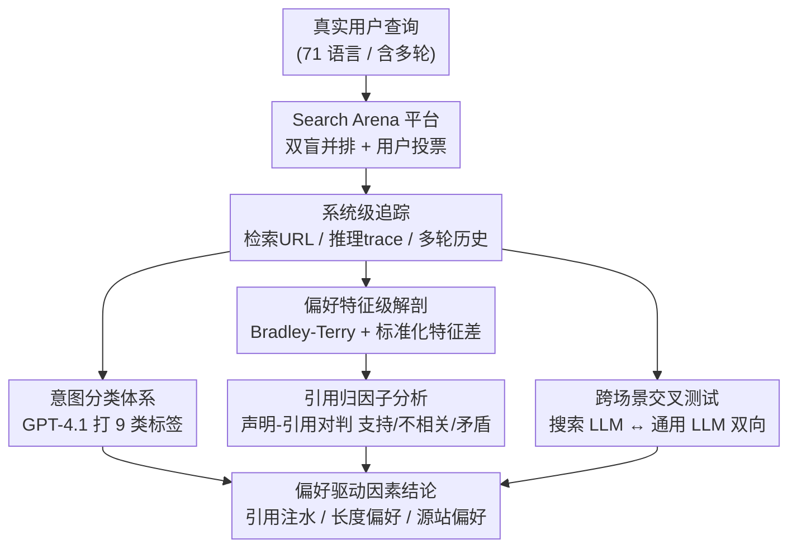

# Search Arena: Analyzing Search-Augmented LLMs

**会议**: ICLR 2026  
**arXiv**: [2506.05334](https://arxiv.org/abs/2506.05334)  
**代码**: [项目页](https://github.com/) (开源数据集)  
**领域**: 推荐系统  
**关键词**: search-augmented LLM, benchmark, human preference, citation analysis, Chatbot Arena

## 一句话总结
构建 Search Arena——首个大规模搜索增强 LLM 人类偏好数据集（24069 对话 + 12652 偏好投票，71 种语言），发现用户偏好受引用数量影响（即使引用不支持声明），社区驱动平台比 Wikipedia 更受偏好，搜索增强不降低通用聊天性能但通用 LLM 在搜索场景显著退化。

## 研究背景与动机
**领域现状**：搜索增强 LLM（如 Perplexity、Gemini Search、ChatGPT Search）结合网络搜索和 LLM 推理日益流行。现有评估基准如 SimpleQA（4326 条）和 BrowseComp（1266 条）是小规模、单轮、英语、事实查询导向的。

**现有痛点**：
   - **覆盖不足**：真实用户查询中事实查询仅占 ~19%，大部分需要信息综合、分析、推荐、创意等综合能力
   - **偏好理解缺失**：不清楚用户在搜索场景中偏好什么——引用的作用？源站的影响？推理的价值？
   - **跨场景评估空白**：搜索 LLM 在通用场景表现如何？通用 LLM 在搜索场景又如何？

**核心矛盾**：搜索增强 LLM 的评估需要大规模、真实、多样的交互数据，但现有数据集是专家构建的小规模数据

**核心 idea**：基于 Chatbot Arena 平台众包收集真实用户与搜索 LLM 的交互+偏好，进行系统分析

## 方法详解

### 整体框架
这篇论文不提新模型，而是搭一个能持续产出真实偏好数据的"竞技场"，再用统计工具把"用户到底偏好什么样的搜索回答"挖出来。整条流水线是：用户提一个真实问题 → Search Arena 平台（挂在 Chatbot Arena 上的独立搜索 tab）匿名并排展示两个搜索增强 LLM（search-augmented LLM）的回答、用户投票选更好的那个 → 平台对每条对话记录完整的系统级追踪（检索 URL、推理 trace、多轮历史）。连续收集约 7 周（3 月 18 日—5 月 8 日）后攒下 24069 条对话、12652 张偏好票，再分三条支线分析这批数据：用意图分类体系量化真实查询的分布、用 Bradley-Terry 模型把成对投票拆成各特征的偏好贡献（其中引用归因是最关键的子分析）、再做搜索↔通用的跨场景交叉测试。三条支线最终汇成"用户到底偏好什么"的结论图谱。

### 关键设计

**1. 竞技场数据集与系统级追踪：让偏好数据不只是"谁赢了"，而是"为什么赢"**

要分析偏好的驱动因素，光知道哪个回答胜出远远不够，必须留下足够细的中间状态。所以平台对每条对话都记录**完整系统追踪**——检索到的 URL 列表、模型推理 trace、最终响应文本、以及多轮对话历史，而不只是 prompt 和答案。正是这套追踪元数据，让后面"引用是否支持声明""源站分布""推理是否过滤了无关来源"这些细粒度分析成为可能（现有基准只存 prompt 和金标准答案，根本做不了）。最终数据覆盖 11650 名用户、136 个国家、71 种语言（英语 58.3%、俄语 11.8%、中文 7.0%）、13 个模型，其中 22.4% 是多轮对话、11% 是多语言查询；相比 SimpleQA（4326 条）和 BrowseComp（1266 条）规模大 5–19 倍，且首次带上偏好投票而非单一金标准答案。

**2. 意图分类体系：先量化真实查询长什么样，才能戳破现有基准的偏科**

现有基准默认"搜索就是查事实"，但真实分布是否如此没人量过。本文先由作者在 100 条样本上人工开放标注、汇总出 9 个意图类别（Factual Lookup、Information Synthesis、Analysis、Recommendation、Explanation、Creative Generation、Guidance、Text Processing、Other），再用 GPT-4.1 把标注扩展到全量对话。标注可靠性在 150 条多语种样本（英、俄、中）上用 Cohen's kappa 校验，模型与人工在 top-2 意图上达到 0.812（强一致）。结果直接证伪了"搜索=查事实"的假设：Factual Lookup 仅占 19.3%，剩下五分之四都需要综合、分析、推荐等高阶能力，且这些复杂查询更长（非事实类平均 66.7 词 vs 事实类 17.2 词）——这正是 SimpleQA、BrowseComp 这类纯事实基准低估搜索 LLM 真实复杂度的根据。

**3. 偏好的特征级解剖与引用归因：把"被偏好"拆成每个特征的边际贡献，揪出引用注水**

这是全文最核心的分析，也是最重要的发现来源。做法是把成对投票建成 Bradley-Terry 模型（沿用 Chatbot Arena 的 Elo 化排名思路），再按 Tianle Li (2024) 的做法把**两条回答在某特征上的标准化差值**作为协变量加入回归——拟合出的系数 $\beta$ 就是该特征对"被偏好"的边际贡献。一般特征上的结论符合直觉：推理模型更受青睐（top-3 模型平均胜率 >60%，其推理 trace 里能观察到重排来源、过滤无关内容的行为），搜索上下文窗口越大越受偏好（sonar-pro 在 high context 下胜率 63.9%、medium 仅 57.6%），回答越长越受偏好（$\beta_{length}=0.334$，但在事实查询子集上这个偏好减到 $0.156$、约为整体的 1/2，说明用户对事实题反而想要简短答案），引用数量本身也正相关（$\beta_{citations}=0.209$）。

真正令人警惕的是**引用归因子分析**。为了搞清"用户在意的是引用数量，还是引用真的支持声明"，本文对约 800 条对话（每个意图类约 100 条）跑一条 LLM 流水线：把每条回答拆成若干「声明—引用」对 $(c_i, u_i)$，再抓取被引网页内容 $D_i$，判定它对声明 $c_i$ 是**支持 / 不相关 / 矛盾**三者之一，得到三元组 $(c_i, u_i, t_i)$；把每条回答里三类的计数作为新协变量加进 Bradley-Terry 模型。结果是：支持型声明-引用对正相关（$\beta_{support}=0.285$），而**不相关型同样正相关（$\beta_{irrelevant}=0.273$）**、几乎与支持型等效，矛盾型则不显著。换句话说，用户基本把引用的"存在"当成了"可信"的代名词，并不区分引用是否真支持声明——模型因此有"注水"引用（编造关联、引用沾边来源）来抬高满意度的动机。源站层面则发现技术平台、社区博客、社交网络的偏好高于 Wikipedia，后者在时效性话题上反而被认为不合适。

**4. 跨场景交叉测试：把搜索能力当成一个可开关的变量，看它在两种场景下的得失**

为回答"搜索增强是否有副作用、通用模型能否兼任搜索"，本文做了双向测试，并用同一套意图分类流水线分析投票分布。一边把搜索增强 LLM 放进通用聊天场景（Text Arena），发现它不仅不降低通用性能，在事实查询上反而显著更受偏好（p=0.012），仅文本处理略有下降（p=0.077）；另一边把通用 LLM 丢进搜索场景，则出现显著退化（p=0.009）——纯靠参数化知识撑不起需要实时信息的搜索任务。结论是搜索增强基本"有利无弊"、可以默认开启，但反过来通用模型并不能平替搜索模型。可信度方面，作者另抽 100 条样本交给 3 名专家独立标注，专家与用户偏好在排除平局后一致率达 68%（随机为 50%），说明众包投票反映的是有意义的质量判断而非噪声。

## 实验关键数据

### 偏好影响因素（Bradley-Terry 系数）

| 特征 | 系数 $\beta$ | 统计显著性 | 含义 |
|------|-------------|-----------|------|
| 回答长度 | 0.334（事实查询子集 0.156） | ✓ | 长回答更受偏好，但事实题偏好简短 |
| 引用数量 | 0.209 | ✓ | 更多引用更受偏好 |
| 支持型声明-引用对 | 0.285 | ✓ | 合理 |
| **不相关型声明-引用对** | **0.273** | ✓ | 令人担忧——几乎与支持型等效 |
| 矛盾型声明-引用对 | 不显著 | — | 用户不因矛盾引用扣分 |
| 搜索上下文大小 | 正相关 | ✓（部分模型） | 更大窗口更好 |
| 推理能力 | 正相关 | ✓ | 推理模型胜率更高 |

### 跨场景分析

| 模型类型 | 搜索场景 | 通用场景 |
|---------|---------|---------|
| 搜索增强 LLM | 正常 | **不降低**（事实查询上还有提升） |
| 通用 LLM | **显著退化**（p=0.009） | 正常 |

### 与现有基准对比

| 基准 | 规模 | 语种 | 多轮 | 意图覆盖 |
|------|------|------|------|---------|
| SimpleQA | 4,326 | 英语 | ✗ | 事实查询 |
| BrowseComp | 1,266 | 英语 | ✗ | 约束型挑战 |
| **Search Arena** | **24,069** | **71** | **✓** | **9 类** |

### 关键发现
- **引用数量偏差**是最重要的发现：用户将引用存在等同于可信度，不区分引用是否支持声明。这对搜索 LLM 的设计有深远影响——模型有动机"注水"引用
- 事实查询仅占真实查询的 1/5，现有基准严重低估了搜索 LLM 的应用复杂度
- 搜索增强是"有利无弊"的——通用性能不降反升且增加了实时性，但反过来通用模型在搜索场景不行
- 社区驱动平台（Reddit 等）比 Wikipedia 更受偏好——可能反映了信息新鲜度和讨论深度的价值

## 亮点与洞察
- **"引用注水"问题的系统性揭示**：这是一个重要的安全/对齐发现——如果不相关引用和正确引用获得几乎相同的偏好加分，搜索 LLM 有动机增加虚假引用来提高用户满意度
- **数据集的独特价值**：完整系统追踪（URL+推理trace+多轮）使得许多下游研究成为可能——引用验证、推理质量评估、搜索策略分析
- **跨场景分析的实践意义**：搜索增强是单向的提升——可以默认开启而不担心退化

## 局限与展望
- 用户偏好本质上是主观的，偏好 ≠ 正确/高质量
- 众包数据可能有选择偏差（使用 Chatbot Arena 的用户群体不代表一般用户）
- 无法控制混杂因素——引用数量与回答长度、搜索深度等特征高度相关
- 分析是相关性而非因果性——需要控制实验来建立因果链
- 13 个模型的覆盖有限，未包含所有主流搜索 LLM

## 相关工作与启发
- **vs SimpleQA/BrowseComp**：规模大 5-19x，多语种多轮多意图，有偏好投票而非金标准答案
- **vs Chatbot Arena**：Search Arena 是专门的搜索 tab，用户期望不同导致查询分布不同
- **vs CORAL/WildChat**：这些数据集无搜索增强和引用元数据

## 评分
- 新颖性: ⭐⭐⭐⭐ 首个大规模搜索增强 LLM 偏好数据集，引用偏差的揭示有创新
- 实验充分度: ⭐⭐⭐⭐⭐ 24K 对话 + 12K 投票 + 多维度深入分析 + 跨场景评估
- 写作质量: ⭐⭐⭐⭐ 分析层层深入，图表丰富
- 价值: ⭐⭐⭐⭐⭐ 对搜索 LLM 评估和设计有深远影响，开源数据集价值极高

<!-- RELATED:START -->

## 相关论文

- [\[ICLR 2026\] RAE: A Neural Network Dimensionality Reduction Method for Nearest Neighbors Preservation in Vector Search](rae_a_neural_network_dimensionality_reduction_method_for_nearest_neighbors_prese.md)
- [\[AAAI 2026\] CroPS: Improving Dense Retrieval with Cross-Perspective Positive Samples in Short-Video Search](../../AAAI2026/recommender/crops_improving_dense_retrieval_with_cross-perspective_positive_samples_in_short.md)
- [\[AAAI 2026\] Semi-Supervised Synthetic Data Generation with Fine-Grained Relevance Control for Short Video Search Relevance Modeling](../../AAAI2026/recommender/semi-supervised_synthetic_data_generation_with_fine-grained_relevance_control_fo.md)
- [\[ICML 2026\] Prompts for Public-Sector LLMs Should Be Governed as Commons](../../ICML2026/recommender/prompts_for_public-sector_llms_should_be_governed_as_commons.md)
- [\[ACL 2026\] MemRec: Collaborative Memory-Augmented Agentic Recommender System](../../ACL2026/recommender/memrec_collaborative_memory-augmented_agentic_recommender_system.md)

<!-- RELATED:END -->
