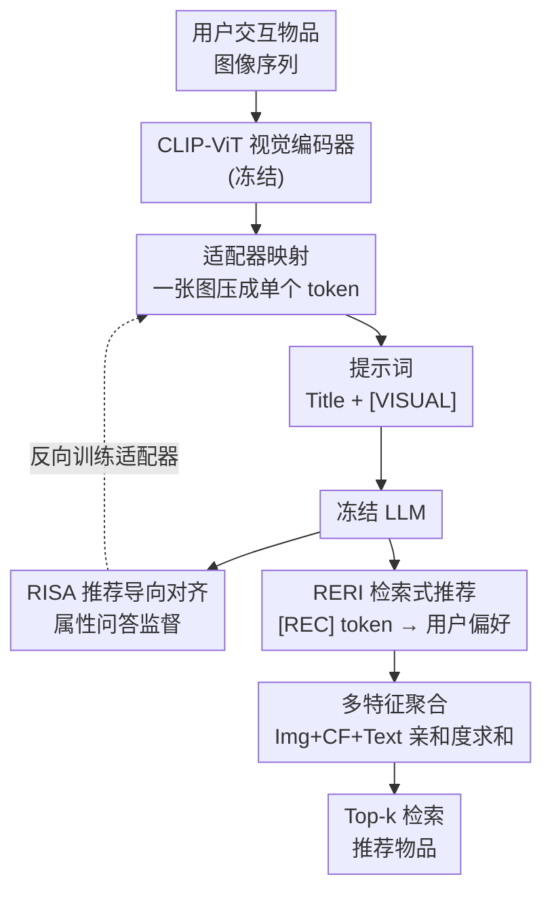

# Token-Efficient Item Representation via Images for LLM Recommender Systems

**会议**: ICLR 2026  
**arXiv**: [2503.06238](https://arxiv.org/abs/2503.06238)  
**代码**: [https://github.com/rlqja1107/torch-I-LLMRec](https://github.com/rlqja1107/torch-I-LLMRec)  
**领域**: LLM NLP / 推荐系统  
**关键词**: LLM推荐系统, 图像表示, Token效率, 多模态对齐, 检索式推荐

## 一句话总结
提出 I-LLMRec，利用商品图像替代冗长文本描述来表示推荐系统中的物品语义，通过 RISA 对齐模块和 RERI 检索模块，在仅用单个token表示物品的同时保留丰富语义，推理速度提升约2.93倍且推荐性能超越文本描述方法。

## 研究背景与动机

**领域现状**：基于LLM的推荐系统需要将物品交互历史转换为自然语言输入。现有方法分两派：属性表示法（Attribute-Based，如品牌+类别，简短但语义有限）和描述表示法（Description-Based，如完整商品描述，语义丰富但token开销巨大）。

**现有痛点**：这两种方法存在**效率与效果的根本权衡**——属性表示法token少但丢失细粒度语义导致推荐性能下降13%+；描述表示法语义丰富但token量大（平均160 tokens/item），LLM推理时间增加2.5倍以上，且复杂度随用户交互序列长度二次增长。

**核心矛盾**：只要物品用自然语言表示，"更丰富的语义表示→更长的输入→更低的效率" 这一矛盾无法避免。

**本文目标** 如何在保留丰富商品语义的同时，大幅减少token占用？

**切入角度**：作者通过CLIP模型测量发现，电商数据集中**商品图像与文本描述之间存在显著的信息重叠**（Amazon Sport/Art数据集相似度约0.31，甚至高于COCO数据集中精心标注的图文对0.26）。这意味着图像可以用极少token承载描述的大部分语义。

**核心 idea**：用单个图像token替代冗长文本描述来表示推荐物品，通过专门的推荐导向对齐策略弥合视觉和语言空间的差距。

## 方法详解

### 整体框架
I-LLMRec 要解决的是"物品语义丰富"和"输入token少"的两难：输入是用户交互过的物品图像序列，输出是下一个该推荐的物品。它的做法是让物品彻底脱离文本描述——每个物品的图像先过冻结的 CLIP-ViT 视觉编码器拿到特征，再由一个可学习的**适配器**压成单个token塞进提示词，整段序列喂给参数冻结的 LLM。但视觉特征天然不在语言空间里，所以用 **RISA** 模块拿推荐相关的属性问答来专门训练这个适配器，让它编码出 LLM 真能读懂的偏好向量；最终的推荐不靠 LLM 生成物品标题，而由 **RERI** 模块改写成检索任务——LLM 末尾吐一个 `[REC]` token 代表用户偏好，与物品视觉特征在共享空间里算亲和度并取 Top-k。这套检索框架还能 plug-and-play 地叠加图像之外的特征（CF、文本），**多特征聚合**后再排序。全程只训练适配器和若干投影器，LLM 始终冻结。

### 关键设计

**1. 图像到LLM的映射：把一张商品图压成一个token**

描述表示法之所以慢，根源在于一个物品就要占平均160个token，交互序列越长LLM的计算量越爆炸。这里的做法是绕过文本：对用户交互的每个物品 $i$，先用冻结的CLIP视觉编码器提取特征 $v_i = V(\mathbf{I}_i) \in \mathbb{R}^{d_v}$，再过一个可学习的适配器网络 $M: \mathbb{R}^{d_v} \rightarrow \mathbb{R}^d$ 把它映射到LLM的词嵌入维度。物品最终以 `Title: ITEM_TITLE, Visual Representation: [VISUAL]` 的提示词形式进入LLM，其中 `[VISUAL]` 这个占位符就被替换成适配后的单个视觉特征。这样物品表示从160 token直接降到1个，序列建模复杂度从 $O((|f(\mathbf{D}_i)||\mathcal{S}_u|)^2 d)$ 这一随描述长度二次膨胀的量级大幅收缩；同时保留约10个token的标题作为基础文本锚点，避免纯视觉表示丢掉物品的字面身份。

**2. 推荐导向的图像-LLM语义对齐（RISA）：让LLM真正"看懂"图里的偏好信号**

单token映射只解决了效率，但通用的视觉-语言对齐（如UniMP依赖的预训练多模态对齐）并不知道推荐场景关心什么。RISA的思路是用推荐任务本身来训练适配器：构造"输入-目标"格式的数据，输入是带图像特征的用户交互提示加上一个关于下一物品属性的问题（如"该用户下一个可能消费什么品牌？"），目标输出就是对应答案。属性有品牌/类别/标题/描述4种，每种配5个问题模板，共20种模板，训练时每步随机抽一种以增加多样性。优化目标是让LLM在给定视觉输入下自回归地生成正确答案：

$$\mathcal{L}_{\text{RISA}} = \max_M \sum_{k=1}^{|y|} \log(P_{\theta,M}(y_k|x, y_{<k}))$$

由于只更新适配器 $M$、LLM保持冻结，这一步等于强迫适配器把图像编码成"能回答推荐问题"的语言空间向量。消融显示它是性能的核心来源——去掉RISA后Sport的Hit@5从0.432掉到0.395。

**3. 基于图像特征的检索式推荐（RERI）：把"生成推荐"换成"检索推荐"**

如果让LLM直接生成推荐物品的标题，无法保证生成的物品真存在于物品池里；而扩展词表去预测物品token又随物品规模膨胀、不可扩展。RERI改用检索的方式绕开这两个坑：在用户交互提示后附加一段指令提示，引导LLM生成一个推荐token [REC]，取它最后一层的隐状态 $h(\text{[REC]})$ 作为用户偏好表示。再通过投影器把用户表示和物品视觉特征映射到同一个共享推荐空间，用亲和度分数

$$r_{u,i}^{\text{Img}} = o_u^{\text{Img}} \circledast o_i^{\text{Img}}$$

衡量用户对每个候选物品的偏好，并以二元交叉熵损失训练。这样推荐结果天然落在真实物品池内，且检索的复杂度不随物品数量线性爆炸，可靠性和效率兼得。

**4. 多特征类型扩展：图像之外再叠ID与文本，互补补盲**

图像特征不是万能的——它在冷启动物品上信息更全，但热门物品上协同信号（CF）往往更强，文本又能提供额外语义。RERI的检索框架天然支持这种扩展：每引入一种特征类型，就再加一对独立的投影器 $(F_u^*, F_i^*)$ 算一份亲和度分数，推理时把多份分数直接相加再取Top-k：

$$rec_u^k = \text{Top-k}(r_{u,i}^{\text{Img}} + r_{u,i}^{\text{CF}} + r_{u,i}^{\text{Text}})$$

其中CF特征来自SASRec的ID嵌入，文本特征来自描述。这种plug-and-play的叠加让不同模态在各自擅长的物品上发挥作用。

### 损失函数 / 训练策略
总训练目标：$\mathcal{L}_{final} = \mathcal{L}_{\text{RISA}} + \mathcal{L}_{\text{RERI}}^{\text{Img}} + \mathcal{L}_{\text{RERI}}^{\text{CF}} + \mathcal{L}_{\text{RERI}}^{\text{Text}}$

所有损失权重固定为1，LLM参数冻结，仅训练适配器 $M$ 和6个投影器。推理时计算三种特征的亲和度分数并求和取Top-k。

## 实验关键数据

### 主实验
在Amazon四个数据集（Sports, Grocery, Art, Phone）上对比CF模型和LLM模型：

| 方法 | 类型 | Sport Hit@5 | Sport NDCG@5 | Art Hit@5 | Phone Hit@5 |
|------|------|-------------|--------------|-----------|-------------|
| SASRec | CF | 0.3841 | 0.3129 | 0.5374 | 0.4366 |
| TALLRec | 属性LLM | 0.3801 | 0.2938 | 0.5663 | 0.4986 |
| A-LLMRec | CF+LLM | 0.4070 | 0.3352 | 0.5681 | 0.4502 |
| TRSR | 描述LLM | 0.4302 | 0.3375 | 0.5841 | 0.5148 |
| UniMP | 图像LLM | 0.4030 | 0.3364 | 0.5315 | 0.4427 |
| **I-LLMRec** | **图像LLM** | **0.4570** | **0.3711** | **0.5883** | **0.5156** |

I-LLMRec 在几乎所有数据集和指标上都优于TRSR（描述方法），同时推理速度快约2.93倍。

### 消融实验

| 配置 | Sport Hit@5 | Sport NDCG@5 | 说明 |
|------|-------------|--------------|------|
| RERI(Img only) | 0.3953 | 0.3043 | 仅图像检索，无对齐 |
| +RISA | 0.4316 | 0.3403 | 加入对齐后提升9.2% |
| RISA+RERI(Img+CF) | 0.4491 | 0.3630 | 多特征进一步提升 |
| Full model (Img+CF+Text) | 0.4570 | 0.3711 | 三特征完整模型 |

### 关键发现
- **RISA模块是核心贡献**：去掉RISA后Hit@5从0.432掉到0.395，说明推荐导向的对齐至关重要
- **图像+描述并不比单独图像更好**（I-LLMRec+D ≈ I-LLMRec），证实图像和描述之间信息高度重叠
- **冷热物品互补**：图像特征在冷启动物品上更优，CF在热门物品上更强，结合使用互补
- **上下文窗口鲁棒性**：当窗口缩小到256 tokens时，TRSR性能剧降但I-LLMRec几乎不受影响
- **噪声鲁棒性**：文本描述中常含HTML标签等噪声，图像天然避免这一问题

## 亮点与洞察
- **信息重叠的逆向利用**：以往多模态推荐将图文信息重叠视为障碍，本文反其道而行，利用这种重叠实现"以少代多"——用1个图像token替代160个文本token。这个视角转换非常巧妙
- **单token表示**：每个物品只用1个图像token就能承载丰富语义，使复杂度与用户序列长度的关系从二次降为近线性
- **检索式推荐框架**：RERI模块的设计可以轻松扩展到任意特征类型，只需添加投影器对。这种plug-and-play的设计可迁移到其他多模态检索场景
- **推荐导向对齐**：RISA不做通用对齐，而是专门为推荐场景设计问答模板。这种任务特定的对齐策略可推广到其他垂直领域（如医疗问答、金融分析）

## 局限与展望
- **图像质量依赖**：当商品图像缺失或质量差时（论文附录讨论了fallback方案），系统性能会受影响
- **数据集局限**：仅在Amazon电商数据集上验证，对于图像信息不丰富的领域（如书籍、音乐）是否有效未知
- **视觉编码器固定**：使用冻结的CLIP-ViT，未探索端到端微调视觉编码器的效果
- **简单的分数聚合**：多特征推理时简单求和，未探索更复杂的融合策略（如attention-based fusion）
- **可改进方向**：可以尝试用更强的视觉模型（如SigLIP-2）或引入时序感知的图像编码来建模用户兴趣演化

## 相关工作与启发
- **vs TALLRec**：TALLRec用属性+标题表示物品做LoRA微调，效率高但语义不足。I-LLMRec用图像弥补了语义缺陷同时保持效率
- **vs TRSR**：TRSR用大模型总结描述再喂给小模型，虽然语义丰富但token开销大且对噪声敏感。I-LLMRec通过图像完全绕过文本描述的问题
- **vs UniMP**：UniMP虽然也用图像但依赖预训练多模态LLM的通用对齐，在推荐场景下表现不如专门设计的RISA对齐
- 这篇论文对"多模态压缩表示"方向有启发：在任何需要长文本输入的LLM应用中，如果存在信息重叠的替代模态，都可以用类似思路压缩输入

## 评分
- 新颖性: ⭐⭐⭐⭐ 视角转换巧妙（信息重叠从障碍变优势），但图像替代文本的想法在多模态VLM中不算全新
- 实验充分度: ⭐⭐⭐⭐⭐ 四个数据集、效率/效果/鲁棒性多维分析、丰富的消融、冷热物品分组分析
- 写作质量: ⭐⭐⭐⭐ 逻辑清晰，motivation图示直观，trade-off分析到位
- 价值: ⭐⭐⭐⭐ 对LLM推荐系统的效率优化有实际意义，2.93倍加速+性能提升是实用的改进

<!-- RELATED:START -->

## 相关论文

- [\[ACL 2025\] CoVE: Compressed Vocabulary Expansion Makes Better LLM-based Recommender Systems](../../ACL2025/recommender/cove_compressed_vocabulary_expansion_makes_better_llm-based_recommender_systems.md)
- [\[AAAI 2026\] RecToM: A Benchmark for Evaluating Machine Theory of Mind in LLM-based Conversational Recommender Systems](../../AAAI2026/recommender/rectom_a_benchmark_for_evaluating_machine_theory_of_mind_in_llm-based_conversati.md)
- [\[AAAI 2026\] Tokenize Once, Recommend Anywhere: Unified Item Tokenization for Multi-domain LLM-based Recommendation](../../AAAI2026/recommender/tokenize_once_recommend_anywhere_unified_item_tokenization_for_multi-domain_llm-.md)
- [\[ICML 2026\] Can Recommender Systems Teach Themselves? A Recursive Self-Improving Framework with Fidelity Control](../../ICML2026/recommender/can_recommender_systems_teach_themselves_a_recursive_self-improving_framework_wi.md)
- [\[AAAI 2026\] Hard vs. Noise: Resolving Hard-Noisy Sample Confusion in Recommender Systems via Large Language Models](../../AAAI2026/recommender/hard_vs_noise_resolving_hard-noisy_sample_confusion_in_recommender_systems_via_l.md)

<!-- RELATED:END -->
