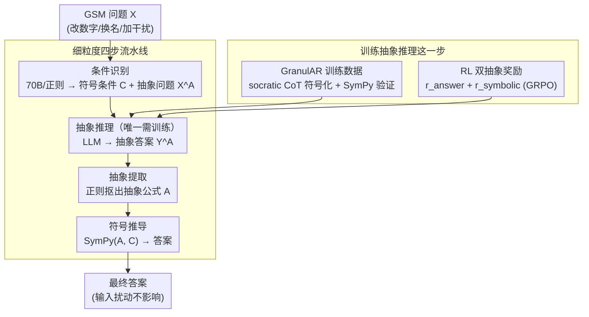

# AbstRaL: Augmenting LLMs' Reasoning by Reinforcing Abstract Thinking

**会议**: ICLR 2026  
**arXiv**: [2506.07751](https://arxiv.org/abs/2506.07751)  
**代码**: 有  
**领域**: 强化学习  
**关键词**: abstract reasoning, reinforcement-learning, GSM robustness, symbolic reasoning, distribution shift

## 一句话总结
提出 AbstRaL，通过强化学习教 LLM 学习推理问题的数学抽象（将具体数字/名称替换为符号变量、提取通用公式），然后用符号求解器推导答案，在 GSM 扰动 benchmark 上几乎完全消除了分布偏移导致的性能下降，并在 OOD 数学/通用推理任务上也有隐式提升。

## 研究背景与动机
**领域现状**：LLM 在 GSM 等小学数学上表现不错，但面对分布偏移（改变数字、改变人名、插入干扰条件）时性能显著下降，暴露了推理的脆弱性。

**现有痛点**：改善鲁棒性的常见方法是合成更多实例化变体来扩充训练数据——但计算成本高且效果有限。另一种方法是抽象推理（CoA、AoT），但现有方法要么依赖 in-context learning（效果差），要么用 SFT 训练（产生的抽象不忠实）。

**核心矛盾**：SFT 的自回归目标迫使模型也学习每个训练样本的具体上下文，阻碍了学习跨实例通用的抽象思维。需要一种训练方式让模型聚焦于抽象结构而非表面上下文。

**本文目标** 如何让 LLM 学会构建忠实的数学抽象，使推理对输入的上下文变化不变？

**切入角度**：不扩充数据，而是直接教 LLM 学习"抽象化"技能——将问题变量化→用符号推理→用求解器算答案。用 RL 而非仅 SFT 来保证抽象的忠实性。

**核心 idea**：用 RL + 细粒度抽象奖励教 LLM "抽象思考"——将具体推理问题转化为符号公式再求解。

## 方法详解

### 整体框架
AbstRaL 想解决的是：LLM 一遇到改数字、换人名、加干扰条件就推理崩溃，根子在于模型把"表面上下文"和"推理结构"混在一起学了。它的思路是让模型先把题目抽象成一组符号公式，再交给确定性的符号求解器算答案——只要抽象写对了，输入怎么变都不影响结果。

为了让模型学得会这种抽象，AbstRaL 把"从问题 $\mathcal{X}$ 推断出抽象 $\mathcal{A}$"拆成一条四步流水线 $\mathcal{X}\to\mathcal{X}^{\mathcal{A}}\to\mathcal{Y}^{\mathcal{A}}\to\mathcal{A}$：先**条件识别**把数值/实体解析成符号条件、得到抽象问题 $\mathcal{X}^{\mathcal{A}}$；再**抽象推理**让 LLM 用符号写出带 CoT 的抽象答案 $\mathcal{Y}^{\mathcal{A}}$；接着**抽象提取**用正则抠出抽象公式 $\mathcal{A}$；最后**符号推导**用 SymPy 把公式连同条件算成答案。这四步里只有第二步"抽象推理"需要训练，GranulAR 数据和 RL 奖励都是为了把这一步教好。

### 关键设计

**1. 细粒度四步流水线：把"从问题推断抽象"拆成模型学得会的子任务**

如果直接让 LLM 从原始题目 $\mathcal{X}$ 一步吐出去掉上下文的抽象 $\mathcal{A}$，模型学不会——它预训练见的几乎都是带具体语境的自然语言，这种跳跃太大。AbstRaL 把它拆成 $\mathcal{X}\to\mathcal{X}^{\mathcal{A}}\to\mathcal{Y}^{\mathcal{A}}\to\mathcal{A}$ 四步，让每一步都贴近模型已有的能力：条件识别和抽象提取分别交给 70B 模型 few-shot prompting 与正则脚本（无需训练），符号推导直接调 SymPy（确定性、零误差），真正交给模型学的只剩"抽象推理"这一步——而且这一步还保留了 CoT 形态（见设计 2），难度进一步降下来。鲁棒性正是这条流水线的副产品：答案由求解器从抽象公式确定性地推出，输入里的数字、人名怎么改，公式结构都不变；模型在写抽象时又被迫只挑"真正参与推理的条件"，无关的干扰条件压根进不了公式——于是各种扰动自然失效。

**2. GranulAR 训练数据：把抽象推理伪装成模型已经熟悉的 CoT**

抽象推理是唯一要训练的一步，但让模型从零学"抽象思考"仍然太难，因为这种格式离它的预训练分布很远。AbstRaL 的做法是改造已有的 socratic CoT 数据：保留原本"先拆子问题、再逐步 CoT 解答"的分解结构，只把推理链里的具体值替换成抽象符号（输入变量记作 `in0`、推导结果记作 `out0`，分别用方括号、双尖括号标出）。改写用 Llama-3.3-70B 作为 oracle 完成，每改完一条再走一遍抽象提取 + SymPy 验证，确认改写后的公式能从条件推出正确答案，验证不过的丢弃。这样得到的训练样本本质上还是模型熟悉的"CoT + 分步"格式，只是把数字换成了符号，学习门槛大幅降低。

**3. RL 双抽象奖励：用两个免训练的奖励逼模型写出忠实抽象**

光靠 SFT 不够——自回归目标会迫使模型连每个样本的具体上下文一起背下来，于是测试时产出的抽象常常被新语境带偏、和题目对不上（不忠实）。AbstRaL 在 SFT 之上再用 GRPO 做 RL，奖励只盯抽象本身对不对，而且两个奖励都不需要额外训练 reward model，只跟金标准比对即可。

其一是**答案正确性奖励** $r_{answer}(\tilde{\mathcal{A}},\mathcal{C},\text{Ans})$：把模型生成的抽象 $\tilde{\mathcal{A}}$ 连同金标准条件 $\mathcal{C}$ 送进 SymPy，能推出正确答案就给正奖励 $r_{correct}$，否则给 0——这是粗粒度的"对/错"信号。其二是**符号距离奖励** $r_{symbolic}$，补上前者的盲区：把 $\tilde{\mathcal{A}}$ 和金标准抽象 $\mathcal{A}$ 都切成符号 token 序列，算二者的编辑距离再归一化，

$$r_{symbolic}(\tilde{\mathcal{A}},\mathcal{A})=r_{max}\cdot\left(1-\frac{\text{EditDistance}(\tilde{\mathcal{A}},\mathcal{A})}{\max_{a\in\{\tilde{\mathcal{A}},\mathcal{A}\}}\text{Len}(a)}\right)$$

即使答案碰巧没算对，只要抽象写得"越接近正确"分数越高，给模型更细粒度的梯度，告诉它离正确抽象还差多远，加速收敛。

### 一个完整示例
拿一道给出数字 12 和 2 的加法题走一遍：**条件识别**把它们解析成 $in0=12$、$in1=2$，并把原题里的"12""2"换成 `[in0]`、`[in1]` 得到抽象问题 $\mathcal{X}^{\mathcal{A}}$；**抽象推理**（训练后的 LLM）顺着 CoT 写出 `<<out0 = in0 + in1>>` 这样的符号推导，得到抽象答案 $\mathcal{Y}^{\mathcal{A}}$；**抽象提取**用正则把双尖括号里的公式抠出来，组成抽象 $\mathcal{A}$：`out0 = in0 + in1`；**符号推导**把 $\mathcal{A}$ 和条件代入 SymPy，算出 14。此时把题里的 12、2 换成任意别的数字、或多加一句无关的干扰条件，前三步产出的公式结构都不变，求解器照样算对——这就是鲁棒性的来源。

### 损失函数 / 训练策略
两阶段训练：先在 GranulAR 数据上用因果语言建模损失做 SFT，再用 GRPO 做 RL，奖励为 $r_{answer} + r_{symbolic}$。训练数据由 Llama-3.3-70B 改写 socratic 版 GSM8K 构建，方法在 Qwen2.5、Llama3、Mathstral 系列（0.5B–7B）上验证。

## 实验关键数据

### 主实验（GSM 鲁棒性）

| 方法 | GSM-Symbolic Vary Both | Δ↓ | GSM-Plus Distract | Original |
|------|----------------------|---|-------------------|----------|
| CoT-8S (Qwen-0.5B) | 34.0 | 10.6 | 22.7 | 42.4 |
| CoT-RL | 32.3 | 7.77 | 15.2 | 38.0 |
| SyReLM | 36.8 | 5.54 | 21.1 | 41.5 |
| **AbstRaL** | **44.6** | **-1.27** | **25.3** | **46.3** |

### 关键发现
- **Δ < 0**：AbstRaL 在变体上的性能*高于*原始问题！说明抽象化不仅消除了分布偏移，还提升了基础推理
- 在 Qwen2.5-Math-7B 上，AbstRaL 也显著提升鲁棒性，且 GSM-Plus Distract 上提升最大——因为抽象化天然忽略干扰条件
- SFT-only（无 RL）产生的抽象经常不忠实——与问题不对齐。RL 通过奖励信号纠正了这个问题
- OOD 迁移效果：AbstRaL 在 AIME（数学竞赛）和 BBH（通用推理）上也有零样本提升——说明抽象思维能力具有跨领域泛化性

## 亮点与洞察
- **"抽象化"是比"实例化"更高效的提升推理鲁棒性策略**：不需要合成大量变体数据，直接教模型学习通用模式。类比：不是教模型做更多加法题，而是教它"加法"这个概念
- **RL 对抽象学习的独特价值**：SFT 被迫学习每个样本的表面上下文（自回归目标的固有缺陷），RL 的奖励函数可以专注于抽象的结构正确性
- **符号距离奖励的细粒度信号**：不只是"对/错"的二元奖励，而是告诉模型"有多接近正确的抽象"——加速学习收敛

## 局限与展望
- 目前仅在 GSM（小学数学）上验证，更复杂的数学问题（如需要几何推理、证明）的抽象化可能更困难
- 条件识别步骤依赖 70B 模型的 few-shot prompting，小模型自主做条件识别的能力未充分探索
- SymPy 求解器对非方程类问题（如组合计数、概率）的覆盖有限
- 训练数据依赖 oracle LLM 改写的质量

## 相关工作与启发
- **vs CoA / AoT（抽象推理方法）**: 这些方法用 in-context learning 做抽象，效果差。AbstRaL 用 SFT+RL 训练，大幅优于它们
- **vs 数据增强策略**: 合成更多实例需要大量数据和计算。AbstRaL 用相同的训练集直接学习抽象，更高效
- **vs CoT-RL（标准 RL）**: CoT-RL 在原始 GSM 上也用 RL 但不学抽象，鲁棒性提升有限。AbstRaL 的抽象化是关键差异

## 评分
- 新颖性: ⭐⭐⭐⭐⭐ "教模型学抽象而非学更多实例"的理念很有原创性
- 实验充分度: ⭐⭐⭐⭐⭐ 多模型、多规模、两个鲁棒性 benchmark、OOD 迁移、详细消融
- 写作质量: ⭐⭐⭐⭐⭐ 动机清晰，框架图示直观
- 价值: ⭐⭐⭐⭐⭐ 为推理鲁棒性提供了新范式，抽象思维的可迁移性尤其有价值

<!-- RELATED:START -->

## 相关论文

- [\[ICLR 2026\] Reasoning Boosts Opinion Alignment in LLMs](reasoning_boosts_opinion_alignment_in_llms.md)
- [\[ICLR 2026\] Thinking on the Fly: Test-Time Reasoning Enhancement via Latent Thought Policy Optimization](thinking_on_the_fly_test-time_reasoning_enhancement_via_latent_thought_policy_op.md)
- [\[AAAI 2026\] Thinker: Training LLMs in Hierarchical Thinking for Deep Search via Multi-Turn Interaction](../../AAAI2026/reinforcement_learning/thinker_training_llms_in_hierarchical_thinking_for_deep_search_via_multi-turn_in.md)
- [\[NeurIPS 2025\] NoisyRollout: Reinforcing Visual Reasoning with Data Augmentation](../../NeurIPS2025/reinforcement_learning/noisyrollout_reinforcing_visual_reasoning_with_data_augmenta.md)
- [\[ICLR 2026\] Routing, Cascades, and User Choice for LLMs](routing_cascades_and_user_choice_for_llms.md)

<!-- RELATED:END -->
