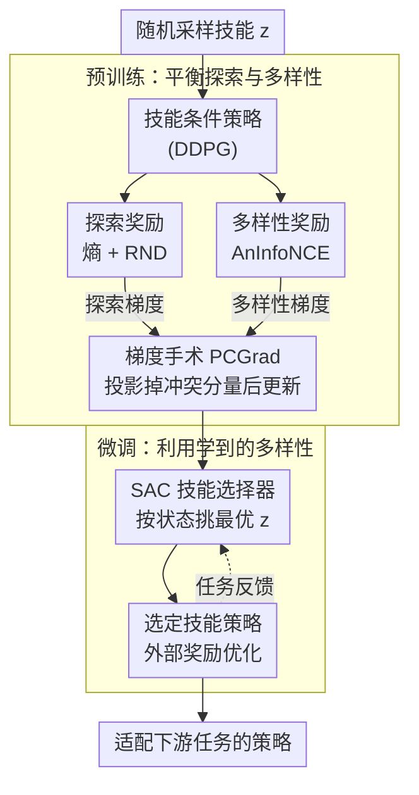

# AMPED: Adaptive Multi-objective Projection for balancing Exploration and skill Diversification

**会议**: ICLR 2026  
**arXiv**: [2506.05980](https://arxiv.org/abs/2506.05980)  
**代码**: [https://github.com/Cho-Geonwoo/amped](https://github.com/Cho-Geonwoo/amped)  
**领域**: 强化学习 / 技能发现  
**关键词**: 无监督技能学习, 梯度手术, 探索-多样性平衡, 技能选择器, 多目标RL  

## 一句话总结
提出AMPED框架，在技能预训练阶段用梯度手术（PCGrad）平衡探索（熵+RND）和技能多样性（AnInfoNCE）之间的梯度冲突，在微调阶段用SAC-based技能选择器自适应选择最优技能，在Maze和URLB基准上超越DIAYN/CeSD/CIC等SBRL基线。

## 研究背景与动机

**领域现状**：基于技能的强化学习（SBRL）通过预训练技能条件策略实现快速适应，但有效的技能学习需要同时最大化探索（覆盖更多状态）和技能多样性（技能间可区分）。

**现有痛点**：两个目标天然冲突——MI驱动的多样性目标导致过早特化（限制探索），而熵驱动的探索牺牲技能可区分性。现有方法（CeSD、ComSD）直接加和奖励信号，没有系统处理梯度冲突。

**核心矛盾**：探索梯度推动agent访问更广区域，多样性梯度推动agent使不同技能分离——两者更新方向可能完全相反，naive求和导致低效学习。

**本文目标**：在多目标RL框架下系统解决探索与多样性的梯度冲突，并在微调阶段充分利用学到的技能多样性。

**切入角度**：将探索和多样性视为两个独立的优化目标，用PCGrad梯度手术移除冲突梯度分量，同时引入学习型技能选择器替代随机选择。

**核心 idea**：用梯度手术解决预训练中的梯度冲突+用学习型选择器在微调时利用多样性。

## 方法详解

### 整体框架
AMPED 想解决的是无监督技能学习里一个绕不开的矛盾：要学出"好用"的技能，既得让 agent 探索得足够广（覆盖更多状态），又得让不同技能彼此可区分（多样性），可这两个目标的梯度方向常常是打架的。AMPED 把整个流程拆成两个阶段来回应这件事。**预训练阶段**，agent 以随机采样的技能 $z$ 为条件，同时收到两路内在奖励——探索奖励（熵 + RND）和多样性奖励（AnInfoNCE）；关键在于它不把两路奖励直接相加，而是分别算出各自的梯度，用 PCGrad 梯度手术把互相冲突的分量投影掉再更新策略，从而让探索和多样性同时推进。**微调阶段**，一个用 SAC 训练的技能选择器根据当前状态和下游任务反馈，自适应地挑出最合适的预训练技能，再用外部任务奖励进一步优化策略，把预训练攒下的多样性真正变现成下游收益。

### 关键设计

**1. 探索奖励（熵 + RND）：让 agent 把状态空间铺得更开**

探索这一侧的奖励由两项线性组合而成，$r_{\text{exploration}} = \alpha \cdot r_{\text{entropy}} + \beta \cdot r_{\text{rnd}}$。前一项是状态熵，沿用 CIC 的粒子法用 k-近邻距离来估计——某状态周围越空旷、k 近邻越远，熵越高，鼓励 agent 往没去过的地方走；后一项是 RND 的预测误差，用一个固定的随机目标网络和一个在线预测网络的差 $\|f_\theta(s) - f_{\text{target}}(s)\|^2$ 来衡量状态的新鲜度，误差越大说明越没见过。两项之所以要一起用，是因为适用区间互补：熵估计在 replay buffer 较小时可靠，但 buffer 变大后 k-近邻复杂度爬到 $O(n\log n)$（论文实际只用最近 5000 个状态来截断），而 RND 复杂度只有 $O(n)$、但训练早期预测网络还没收敛、信号噪声大。前者管早期、后者管后期，叠加起来才是稳健的探索信号。

**2. 多样性奖励（AnInfoNCE）：让不同技能产生彼此可区分的轨迹**

多样性这一侧沿用 SBRL 基于互信息（mutual information, MI）的范式，具体借用 BeCL 的目标 $I(S^{(1)}, S^{(2)})$——让同一技能产生的状态聚在一起、不同技能产生的状态彼此推开，比 CeSD 那种"只要不重叠就行"的启发式惩罚区分力更强（后者无法分辨"略微分离"和"强烈分离"的技能）。真正的改动在 MI 的估计器：AMPED 不用普通 InfoNCE，而换成各向异性的 AnInfoNCE，它在对比损失里引入一个可学习的对角矩阵 $\hat{\Lambda}$ 给嵌入空间的不同方向加权（$\|x\|_{\hat\Lambda}^2 = x^\top \hat\Lambda x$），从而捕捉潜在因子的非对称性。这是 AnInfoNCE 首次被用到技能多样性上，实验显示它给出的 MI 估计比标准 InfoNCE 更准、技能分得更开。

**3. 梯度手术（PCGrad）：从根上消解探索与多样性的方向冲突**

这是 AMPED 的核心。探索梯度推 agent 去访问更广的区域，多样性梯度推不同技能彼此分离，两者的更新方向常常相反——AMPED 实测在 URLB 上探索/多样性梯度的冲突比例高达约 0.9997（Walker/Quadruped 几乎每个 minibatch 样本都冲突），直接把两路奖励 naive 加和（CeSD、ComSD 的做法）只会让冲突分量互相抵消、学习效率极低。AMPED 改成在梯度层面动手术：分别算出探索梯度 $g_{\text{explore}}$ 和多样性梯度 $g_{\text{diverse}}$，一旦检测到二者点积 $g_1 \cdot g_2 < 0$（即存在冲突），就以概率 $p$ 把其中一个投影到另一个的正交补空间，

$$g_1' = g_1 - \frac{g_1 \cdot g_2}{\|g_2\|^2} g_2$$

减掉它在对方方向上的干扰分量，再把两个梯度（一个已投影）相加去更新。这样修改后的梯度至少不会再拖另一个目标的后腿，两个目标得以同时推进。论文坦言更复杂的多目标方法也有，但选了最朴素的 PCGrad 图个简单好集成，实测已足够有效。

**4. SAC 技能选择器：让微调阶段真正用上预训练的多样性**

预训练辛苦学到的技能多样性，如果微调时还像 DIAYN、CeSD 那样随机挑技能，就被白白浪费了。AMPED 把"挑哪个技能"本身建模成一个强化学习问题：选择器 $p(z\mid s)$ 观察当前状态、采样一个技能 $z$，让对应技能条件策略去执行，再用下游任务的外部奖励同时更新选择器和策略（用 SAC，配 $\epsilon$-greedy 且 $\epsilon$ 随训练衰减来权衡试新技能与用好技能，评估时退化成贪心确定性选择）。这样它会逐渐学会针对具体任务挑出最合适的预训练技能，把多样性从"潜在资产"变成"实际收益"。论文用 Theorem 1 给这条设计兜了个底：定义技能间最小总变差距离 $\delta$ 和最佳技能与目标策略的距离 $\varepsilon$，只要裕度 $\Delta = \delta - 2\varepsilon > 0$，贪心选择器选错最优技能的概率随样本数指数下降——换算成样本量即 $n = O\big(\frac{1}{\Delta^2}(S\log 2 + \log H)\big)$。技能越多样（$\delta$ 越大、$\Delta$ 越大），选对所需的微调样本就越少，这就把"为什么要追求技能多样性"形式化地讲清了。

## 实验关键数据

### Maze环境
AMPED同时实现高状态覆盖和技能分离——CeSD覆盖好但技能混合，BeCL技能分离强但覆盖有明显空缺。

### URLB基准（统计显著性改进）
AMPED在多个URLB任务上取得最高return，超越DIAYN、CIC、CeSD、BeCL、ComSD、RND、APT等基线。

### 消融实验
- 去掉梯度手术 → 性能显著下降
- 去掉RND → 复杂环境探索不足
- 去掉AnInfoNCE → 技能区分度差
- 去掉技能选择器（用随机选择）→ 微调效率下降
- 每个组件都有正向贡献

### 关键发现
- 梯度手术是最关键的组件——直接解决了探索和多样性的核心冲突
- 学习型技能选择器 vs 随机选择在微调阶段差异显著——多样性只有被"利用"才有价值
- Theorem 1的理论预测与实验一致：技能越多样，微调收敛越快

## 亮点与洞察
- **将探索-多样性冲突形式化为多目标梯度冲突**是核心洞察——之前的work只认识到两者难以同时优化，但没有用梯度分析找到原因
- **Theorem 1**提供了"多样性→样本效率"的形式化证明——解答了"为什么要追求技能多样性"这个基本问题
- 整个pipeline逻辑清晰：预训练阶段平衡两个目标→微调阶段利用学到的多样性，形成闭环

## 局限与展望
- PCGrad的成对投影在目标数增多时扩展性受限
- 仅验证了连续控制任务（MuJoCo/Maze），离散动作空间和高维观察空间未测试
- 技能选择器本身也需要从头训练，增加了微调成本
- α和β（探索奖励权重）仍需手动调参
- 未与hierarchical RL方法对比

## 相关工作与启发
- **vs CeSD**: CeSD直接加和探索和多样性奖励，无梯度冲突处理；AMPED用梯度手术系统解决
- **vs DIAYN**: DIAYN纯MI驱动，探索不足；AMPED显式加入探索目标
- **vs CIC**: CIC用对比学习做探索，但不做技能多样性；AMPED两者兼顾

## 评分
- 新颖性: ⭐⭐⭐⭐ 梯度手术在SBRL中的应用+学习型技能选择器的组合有创新
- 实验充分度: ⭐⭐⭐⭐ Maze+URLB+全面消融+理论验证，较完整
- 写作质量: ⭐⭐⭐⭐ 问题动机清晰，Figure 1-3直观有力
- 价值: ⭐⭐⭐⭐ 对SBRL领域的探索-多样性平衡提供了系统解决方案

<!-- RELATED:START -->

## 相关论文

- [\[ICLR 2026\] Self-Improving Skill Learning for Robust Skill-based Meta-Reinforcement Learning](self-improving_skill_learning_for_robust_skill-based_meta-reinforcement_learning.md)
- [\[ICLR 2026\] Robust Multi-Objective Controlled Decoding of Large Language Models](robust_multi-objective_controlled_decoding_of_large_language_models.md)
- [\[ICLR 2026\] Controllable Exploration in Hybrid-Policy RLVR for Multi-Modal Reasoning](controllable_exploration_in_hybrid-policy_rlvr_for_multi-modal_reasoning.md)
- [\[ICLR 2026\] Unsupervised Learning of Efficient Exploration: Pre-training Adaptive Policies via Self-Imposed Goals](unsupervised_learning_of_efficient_exploration_pre-training_adaptive_policies_vi.md)
- [\[ICLR 2026\] RLP: Reinforcement as a Pretraining Objective](rlp_reinforcement_as_a_pretraining_objective.md)

<!-- RELATED:END -->
