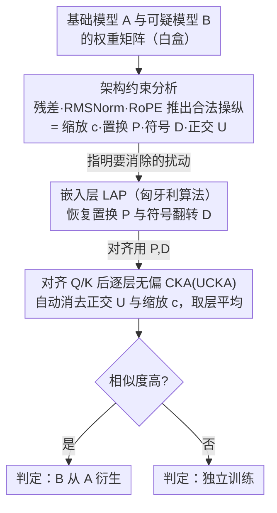

# AWM: Accurate Weight-Matrix Fingerprint for Large Language Models

**会议**: ICLR 2026  
**arXiv**: [2510.06738](https://arxiv.org/abs/2510.06738)  
**代码**: [https://github.com/LUMIA-Group/AWM](https://github.com/LUMIA-Group/AWM)  
**领域**: 强化学习  
**关键词**: model fingerprinting, intellectual property, weight manipulation, CKA, linear assignment problem  

## 一句话总结
提出 AWM，一种无需训练的 LLM 权重矩阵指纹方法，利用线性分配问题（LAP）恢复嵌入层的置换和符号翻转，再用无偏 CKA 消除 Q/K 矩阵的正交变换影响，在 150 对 LLM 上实现完美 AUC（1.0），对 SFT、持续预训练（5.5T token）、RL、多模态扩展、剪枝、upcycling 六类后训练均鲁棒，30 秒内完成。

## 研究背景与动机
**领域现状**：LLM 训练成本极高，保护知识产权至关重要。需要判断一个可疑模型是从头训练还是从已有基础模型衍生。

**现有痛点**：模型常经历大量后训练（SFT、continued pretraining、RL、多模态扩展、剪枝、upcycling），参数变化巨大。水印方法需要额外训练且会损害性能。现有指纹方法（HuRef）对持续预训练不鲁棒，REEF 假阳率高。

**核心矛盾**：恶意行为者可以通过缩放、置换、剪枝甚至旋转权重矩阵来掩盖模型来源，但这些操作要保持模型性能不变。如何从这种约束中提取不变指纹？

**本文目标** 设计一种对所有常见后训练方式和权重操纵都鲁棒的指纹方法，同时保持低假阳率和高计算效率。

**切入角度**：系统分析 Transformer 各组件（残差连接、RMSNorm、RoPE）对权重操纵的约束——证明在保持模型输出不变的前提下，Q/K 矩阵只能承受特定的变换形式（置换+符号翻转+正交变换+误差），然后针对性地消除这些变换。

**核心 idea**：通过分析 Transformer 架构对权重操纵的结构约束，设计出理论上免疫所有可行操纵的指纹方法。

## 方法详解

### 整体框架
AWM 要回答一个二选一的问题：可疑模型到底是从某个基础模型偷改来的，还是从头独立训练的？难点在于攻击者可以缩放、置换、剪枝甚至旋转权重矩阵来掩盖来源，但前提是模型输出不能变。AWM 的思路是先把这些「合法操纵」的形式从架构里推导清楚，再逐一消掉。整体先做一次架构约束分析，把合法操纵锁定成缩放 $c$、置换 $P$、符号翻转 $D$、正交变换 $U$ 四类；随后流程分两步走：先在两个模型共享词表的嵌入矩阵上，用线性分配问题（Linear Assignment Problem, LAP，由匈牙利算法求解）恢复出列置换矩阵 $P$ 和符号翻转矩阵 $D$；再拿这对 $P,D$ 把 Q/K 矩阵对齐回去，最后用无偏 CKA 逐层算相似度——CKA 本身就免疫正交变换和缩放，所以剩下那部分扰动不用显式去解，取层平均得到相似度后按阈值判定衍生还是独立训练。

### 关键设计

**1. 从架构约束反推合法操纵空间：先搞清攻击者能做什么**

现有指纹方法（HuRef、REEF）多是经验性地挑某个权重不变量当指纹，遇到没见过的操纵就失效。AWM 反过来，从第一性原理推导：在保持模型输出不变的前提下，权重到底只能被改成什么样。三层约束逐步收紧——残差连接要求任何操纵必须能在各组件之间一致传播（Prop 4.2）；RMSNorm 的归一化进一步把嵌入层的可行变换锁死为 $R_{emb} = cPD$，即只能是缩放、列置换、符号翻转的组合（Thm 4.3）；RoPE 与 attention score 的结构再把 Q/K 矩阵的操纵约束成

$$W_B = c^{-1}D^TP^TW_A^TU^T + E$$

其中 $U$ 是一个正交变换、$E$ 是后训练带来的误差项（Thm 4.4）。这套推导的价值在于：它把"指纹该消掉哪些扰动"从启发式猜测变成了有定理支撑的清单——$c$（缩放）、$P$（置换）、$D$（符号）、$U$（正交）四类，后面两个设计就分别对付嵌入层的 $P,D$ 和 Q/K 的 $U$。

**2. 用线性分配恢复嵌入层的置换与符号**

嵌入矩阵每一行对应一个 token，攻击者没法混合行（会破坏词表对应关系），列操纵又被上面的 Thm 4.3 限死成 $cPD$，这给了恢复 $P,D$ 一个干净的切入口。AWM 在两个模型的嵌入列向量之间构建一个绝对余弦相似度矩阵，把"哪一列对应哪一列"变成一个二分图最优匹配问题，用匈牙利算法求解最优列匹配，得到置换矩阵 $P$；再看匹配位置上余弦相似度的正负号，恢复出符号翻转矩阵 $D$。取绝对值做匹配、再单独读符号，正好把置换和符号翻转两件事解耦开。当两个模型层数不同时，同样用层级 LAP 匹配把层对齐起来。

**3. 用无偏 CKA 绕开正交变换，无需显式求解 $U$**

恢复出 $P,D$ 后把 Q/K 矩阵对齐，剩下的扰动主要是那个正交矩阵 $U$。$U$ 有 $d^2$ 个自由参数，在高维 hidden size 下显式恢复既不现实也不稳定。AWM 的关键观察是：CKA（centered kernel alignment）天生不变于正交变换和常数缩放（Thm 3.1），所以根本不用去解 $U$——直接对对齐后的 Q/K 矩阵算 CKA，$U$ 和缩放 $c$ 自动被消掉。为避免有限样本下 CKA 的估计偏差，这里用的是无偏版本 UCKA。最终的模型相似度就是所有层 Q/K 矩阵 UCKA 值的平均。这一步把"对付高维正交扰动"从一个棘手的优化问题变成了一个免参数的度量选择。

### 损失函数 / 训练策略
无需训练（training-free），不改动也不损害模型性能。只需白盒访问两个模型的权重矩阵，整个计算在单张 NVIDIA 3090 上 30 秒内完成。

## 实验关键数据

### 主实验（150 对 LLM）

| 指标 | AWM | HuRef | REEF |
|------|-----|-------|------|
| AUC | **1.0** | ~0.85 | ~0.90 |
| pAUC (FPR<5%) | **1.0** | 低 | 低 |
| TPR@1%FPR | **1.0** | 低 | 低 |

### 鲁棒性（60 对 offspring model pairs）

| 后训练类型 | AWM | HuRef | REEF |
|-----------|-----|-------|------|
| SFT | ✅ (≥99.9%) | ✅ | ✅ |
| 持续预训练 (5.5T tokens) | ✅ | ❌ 失败 | 部分 |
| RL (PPO/DPO) | ✅ | ✅ | ✅ |
| 多模态扩展 | ✅ | - | 部分 |
| 剪枝 | ✅ | ❌ 失败 | 部分 |
| Upcycling | ✅ | - | 部分 |

### 关键发现
- 所有 offspring 模型的相似度 ≥99.9%，所有独立模型的相似度 ≤0.7%——分离度极高，零假阳风险
- HuRef 对持续预训练和剪枝不鲁棒，REEF 在独立模型对上常出现高假阳率
- 30 秒完成 (NVIDIA 3090)——比需要推理的黑盒方法快几个数量级
- 方法对不同层数的模型也有效（通过层级 LAP 匹配解决）

## 亮点与洞察
- **从第一性原理推导指纹**：不是经验性地选择特征，而是系统分析 Transformer 每个组件对权重操纵的约束，推导出理论上完备的指纹方案——这种分析方法本身很有价值
- **CKA 的巧妙应用**：利用 CKA 的正交不变性来消除 RoPE 引入的正交变换，避免了显式恢复高维正交矩阵的不可行性
- **实用性极强**：30 秒、单 GPU、无需训练、不损害性能、零假阳率——完全满足实际部署需求

## 局限与展望
- 仅适用于 decoder-only Transformer 架构，encoder-decoder 或 SSM 架构需要重新分析
- 假设可疑模型的操纵以保持输出不变为前提，如果攻击者愿意接受一定性能损失则可能绕过
- 对完全重新训练的模型可能产生低相似度——但这是预期行为（不是从基础模型衍生的）
- 需要白盒访问（模型权重），不适用于 API-only 的 MaaS 场景

## 相关工作与启发
- **vs HuRef**: HuRef 也基于权重不变量，但对持续预训练不鲁棒。AWM 通过更完整的操纵分析和无偏 CKA 解决了这个问题
- **vs REEF**: REEF 基于表示空间几何相似度，但假阳率高。AWM 直接在权重空间操作，分离度大幅提升
- **vs 水印方法**: 水印需要额外训练且可能损害性能，AWM 是后验的、无损的

## 评分
- 新颖性: ⭐⭐⭐⭐⭐ 从 Transformer 架构约束推导指纹的方法论非常新颖
- 实验充分度: ⭐⭐⭐⭐⭐ 150 对模型、6 类后训练、完美指标
- 写作质量: ⭐⭐⭐⭐⭐ 理论推导严谨，实验全面
- 价值: ⭐⭐⭐⭐⭐ LLM 知识产权保护的实用利器

<!-- RELATED:START -->

## 相关论文

- [\[ICLR 2026\] Robust Multi-Objective Controlled Decoding of Large Language Models](robust_multi-objective_controlled_decoding_of_large_language_models.md)
- [\[ICLR 2026\] VerifyBench: Benchmarking Reference-based Reward Systems for Large Language Models](verifybench_benchmarking_reference-based_reward_systems_for_large_language_model.md)
- [\[ICLR 2026\] Post-training Large Language Models for Diverse High-Quality Responses](post-training_large_language_models_for_diverse_high-quality_responses.md)
- [\[ICLR 2026\] TROLL: Trust Regions improve Reinforcement Learning for Large Language Models](troll_trust_regions_improve_reinforcement_learning_for_large_language_models.md)
- [\[ICLR 2026\] GraphOmni: A Comprehensive and Extensible Benchmark Framework for Large Language Models on Graph-theoretic Tasks](graphomni_a_comprehensive_and_extensible_benchmark_framework_for_large_language_.md)

<!-- RELATED:END -->
