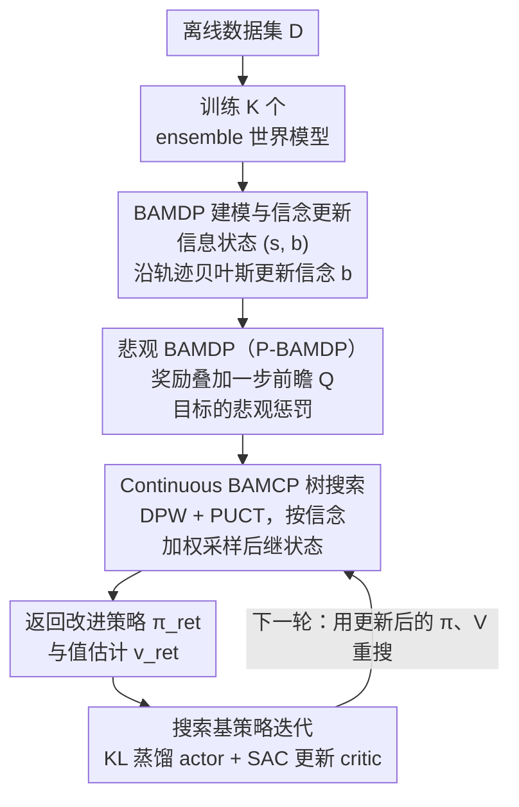

# BA-MCTS: Bayes Adaptive Monte Carlo Tree Search for Offline Model-based RL

**会议**: ICLR 2026  
**arXiv**: [2410.11234](https://arxiv.org/abs/2410.11234)  
**代码**: 无  
**领域**: 强化学习 / 离线 RL / 模型基方法  
**关键词**: 离线 RL, 基于模型的强化学习, Bayes Adaptive MDP, MCTS, 不确定性量化, deep ensemble

## 一句话总结
首次将贝叶斯自适应 MDP（BAMDP）引入离线模型基 RL，提出 Continuous BAMCP 解决连续状态/动作空间的贝叶斯规划，结合悲观奖励惩罚和搜索基策略迭代（"RL + Search"范式），在 D4RL 12 个任务上显著超越 19 个基线（Cohen's $d > 1.8$），并成功应用于核聚变 tokamak 控制。

## 研究背景与动机
**领域现状**：离线 MBRL 从静态数据集学习 ensemble 世界模型，用模型 rollout 优化策略。MOBILE、CBOP、RAMBO 等是 SOTA 方法。

**现有痛点**：
   - 多个 MDP 在离线数据集上行为相同但在 OOD 区域不同——需要处理模型不确定性
   - 现有方法**统一对待** ensemble 成员（如均匀采样一个模型做预测），未利用动态信念更新
   - 不同 ensemble 成员在不同状态-动作区域的准确度不同，但缺乏机制让 agent 适应性地信任更精确的成员

**核心矛盾**：BAMDP 提供了原理化的不确定性处理框架（通过贝叶斯后验动态更新模型信念），但现有 BAMCP 算法仅适用于离散空间且需要真实世界模型

**核心 idea**：将离线 MBRL 建模为 BAMDP + 提出连续空间 BAMCP + 悲观奖励惩罚 + 搜索结果蒸馏到策略网络——实现 "RL + Search"（类似 AlphaZero）的离线 MBRL 范式

## 方法详解

### 整体框架
这篇论文要解决的是离线模型基 RL 里一个被长期忽视的问题：从静态数据集学出来的是一**组** ensemble 世界模型，它们在数据覆盖区域行为一致、在 OOD 区域却各执一词，可现有方法要么均匀采样一个成员、要么静态地加个悲观惩罚，始终没让 agent 学会"此时此地该信哪个模型"。BA-MCTS 的整体思路是把离线 MBRL 重新建模成一个贝叶斯自适应 MDP（BAMDP），让"对模型的信念"成为状态的一部分并在规划过程中动态更新。

具体流程是：先在离线数据集 $\mathcal{D}_\mu$ 上训练 $K$ 个 ensemble 世界模型 $\{(\mathcal{P}_\theta^i, \mathcal{R}_\theta^i)\}_{i=1}^K$；再以这组模型构建一个带悲观奖励惩罚的 BAMDP（把"对模型的信念"塞进状态、并对不确定区域加惩罚）；然后对每个采样到的状态，用 Continuous BAMCP 做一次带信念更新的树搜索，得到改进的策略与值估计；最后把搜索结果蒸馏回 actor-critic，并用更新后的网络驱动下一轮搜索，如此循环做策略迭代。这是一套把 AlphaZero 式"RL + Search"搬到离线连续控制上的范式。

### 关键设计

**1. BAMDP 建模与信念更新：让"信哪个模型"成为可学习的状态变量**

针对的痛点是 ensemble 成员在不同区域准确度不同、但现有方法对它们一视同仁。BA-MCTS 把信息状态写成 $(s, b)$，其中 $s$ 是物理状态、$b$ 是当前对各 ensemble 成员的信念分布。规划起点用均匀先验 $b_0 = [1/K, \ldots, 1/K]$（因为 ensemble 是 IID 采样的），每走一步根据观测到的转移和奖励做贝叶斯更新（Eq. 4）：

$$b'(\theta)(i) \propto b(\theta)(i) \cdot \mathcal{P}_\theta^i(s'|s,a) \cdot \mathcal{R}_\theta^i(r|s,a)$$

也就是说，预测越准确的成员会在后续规划中被赋予越高的权重。这与"均匀采样 ensemble"的做法有本质区别——agent 能沿着每条轨迹针对性地信任最精确的那个模型，而不是把不确定性当成一个固定的启发式去处理。

**2. 悲观 BAMDP（P-BAMDP）：在所有模型都不准的区域兜底**

即便 BAMDP 能适应性地选信更靠谱的模型，仍会遇到所有 ensemble 成员都不准的 OOD 区域，光靠信念更新救不了。P-BAMDP 在奖励上叠一层悲观惩罚（Eq. 5），和信念机制一起构成搜索所求解的"环境"：

$$\tilde{r} = r - \lambda \cdot \text{std}[r^i + \gamma \mathbb{E}_{s'^i, a'} Q_{\psi^-}(s'^i, a')]_{i=1}^K$$

值得注意的是惩罚的对象——它不像 MOPO/MOReL 那样只惩罚 next-state 预测的分歧，而是惩罚**一步前瞻 Q 值目标**在各成员上的标准差。这个量更直接地刻画了 agent 在某个状态-动作对上整体的不确定性，因此对高风险区域的抑制更贴切，相当于给信念机制加了一道安全阀。

**3. Continuous BAMCP：把贝叶斯规划从离散空间推到连续随机控制**

原始 BAMCP（Guez 2013）只能处理离散空间且依赖真实世界模型，没法直接用在连续状态/动作的离线 MBRL 上。这里的关键是引入 Double Progressive Widening (DPW)：搜索树为每个节点维护一个有限的子节点列表，按访问计数 $\lfloor N^{\alpha} \rfloor$ 控制扩展速率，新动作或新后继状态只有在该节点被访问足够多次后才添加进来，从而在连续空间里把分支因子约束住。但 DPW 一引入，原始 BAMCP 赖以成立的 root sampling 就失效了——Lemma A.1 的等式不再成立，所以选择规则改成 PUCT。在状态扩展（StatePW）时，后继状态按当前信念加权采样 $s' \sim \sum_i b(\theta)(i) \mathcal{P}_\theta^i(\cdot|s,a)$，并在每次转移后立刻更新信念（呼应设计 1 的贝叶斯更新）。论文进一步证明了这个规划器的一致性，即它能收敛到近贝叶斯最优策略。

**4. 搜索基策略迭代（"RL + Search"）：把搜索的强信号蒸馏成可部署的网络**

纯搜索每次只能对单个状态给出决策，无法泛化、也没法实时部署。BA-MCTS 借鉴 AlphaZero，把 Continuous BAMCP 的搜索结果蒸馏回 actor-critic：对每个采样状态 $s$，搜索按访问计数返回一个改进策略 $\pi_{ret}(a|s)$，actor 用 KL 散度 $D_{KL}(\pi_{ret} \| \pi)$ 向它对齐；同时搜索返回的值估计 $v_{ret}$ 以 SAC 风格更新 critic。搜索在这里扮演的是"更强的策略评估与改进算子"，蒸馏之后网络既继承了搜索的质量、又获得了泛化和实时推理能力，整套循环就构成了离线 MBRL 版的策略迭代。

### 损失函数 / 训练策略
- 世界模型：用 NLL 损失训练 Gaussian mixture 动态模型 ensemble（$K$ 个成员）
- Actor：$\mathcal{L}_{actor} = D_{KL}(\pi_{ret} \| \pi)$
- Critic：标准 SAC 软 Q 损失 + 悲观惩罚
- 搜索参数：$E$ 次模拟，深度 $d_{max}$，DPW 参数 $\alpha, \beta$

## 实验关键数据

### 主实验（D4RL MuJoCo, 12 个任务）

| 任务 | BA-MCTS | MOBILE | CBOP | RAMBO | COMBO |
|------|---------|--------|------|-------|-------|
| Hopper-medium | **103.9** | 102.5 | 98.7 | 92.8 | 97.2 |
| Walker2d-med-replay | **91.4** | 85.1 | 74.6 | 85.0 | 56.0 |
| **平均 (12 任务)** | **80.3** | 76.5 | 73.9 | 68.9 | — |

Cohen's $d > 1.8$（vs 所有有标准差的 19 个基线）——统计显著性极高（$d > 0.8$ 即为 large effect）。

### Tokamak 控制（核聚变，3 个任务）

| 任务 | BA-MCTS | MOBILE | CBOP | SAC-10 |
|------|---------|--------|------|--------|
| 等离子体温度追踪 | **最优** | — | — | — |
| 形状控制 | **最优** | — | — | — |
| 综合控制 | **最优** | — | — | — |

高随机性真实物理系统上的成功验证——展示了方法的鲁棒性。

### 消融实验

| 配置 | 效果 | 说明 |
|------|------|------|
| 去除 BAMDP（均匀采样 ensemble） | 明显下降 | 信念适应的核心价值 |
| 去除悲观惩罚 | 下降 | OOD 区域需要安全保障 |
| 去除搜索（纯 RL） | 下降 | 搜索提供更强的策略改进信号 |
| 搜索深度 $d_{max}$ 增大 | 性能提升但计算成本增加 | trade-off |

### 关键发现
- BAMDP 信念更新让 agent 沿轨迹"学习"哪个 ensemble 成员更可靠——在 OOD 边界区域尤其重要
- "RL + Search"范式成功从棋类游戏（AlphaZero）迁移到连续控制——搜索结果蒸馏到网络的策略迭代有效
- 短视野 rollout（$H$ 较小）+ 值网络作为终端估计，有效控制了模型误差累积
- Tokamak 验证显示方法可用于真实物理系统的高随机性控制

## 亮点与洞察
- **BAMDP 在离线 RL 中的首次应用**是概念性贡献——用贝叶斯框架将"ensemble 不确定性"从启发式处理提升到原理化框架。信念更新让 agent 获得了"哪个模型更靠谱"的动态判断能力
- **"RL + Search" 范式的迁移**：AlphaZero 的核心思想（搜索提供强监督信号 → 蒸馏到网络 → 迭代改进）成功应用于连续控制——这可能开启离线 MBRL 的新范式
- **理论一致性证明**：Continuous BAMCP 的收敛性证明为连续 BAMDP 规划提供了理论基础

## 局限与展望
- MCTS 规划的计算成本高——每个状态需要 $E$ 次模拟，可能限制实时应用
- 搜索深度 $d_{max}$ 有限，模型误差仍会累积
- Ensemble 大小 $K$ 固定（通常 7），更丰富的后验近似（如贝叶斯神经网络）可能更好
- 未在视觉观测（高维状态空间）上测试
- DPW 参数 $\alpha, \beta$ 需要调优

## 相关工作与启发
- **vs MOBILE/CBOP/RAMBO**：这些方法使用 ensemble 但均匀对待成员或仅做静态悲观惩罚；BA-MCTS 动态更新信念 + 搜索基规划，彻底不同的范式
- **vs BAMCP (Guez 2013)**：原始 BAMCP 限于离散空间 + 需要真实模型；Continuous BAMCP 扩展到连续空间 + 用学到的模型
- **vs AlphaZero**：BA-MCTS 是 "AlphaZero for offline MBRL"——搜索 + 蒸馏 + 迭代，但增加了贝叶斯信念和悲观性

## 评分
- 新颖性: ⭐⭐⭐⭐⭐ 首次将 BAMDP + 连续 BAMCP + 悲观惩罚 + 搜索基策略迭代统一到离线 MBRL
- 实验充分度: ⭐⭐⭐⭐⭐ D4RL 12 任务新 SOTA + tokamak 应用 + Cohen's d 显著性分析 + 充分消融
- 写作质量: ⭐⭐⭐⭐ 理论严谨，算法描述清晰
- 价值: ⭐⭐⭐⭐⭐ 为离线 MBRL 引入了新范式（BAMDP + "RL + Search"），影响深远

<!-- RELATED:START -->

## 相关论文

- [\[ICLR 2026\] ROMI: Model-based Offline RL via Robust Value-Aware Model Learning with Implicitly Differentiable Adaptive Weighting](model-based_offline_rl_via_robust_value-aware_model_learning_with_implicitly_dif.md)
- [\[ICML 2026\] Reinforced Sequential Monte Carlo for Amortised Sampling](../../ICML2026/reinforcement_learning/reinforced_sequential_monte_carlo_for_amortised_sampling.md)
- [\[NeurIPS 2025\] Sequential Monte Carlo for Policy Optimization in Continuous POMDPs](../../NeurIPS2025/reinforcement_learning/sequential_monte_carlo_for_policy_optimization_in_continuous_pomdps.md)
- [\[ICLR 2026\] Regret-Guided Search Control for Efficient Learning in AlphaZero](regret-guided_search_control_for_efficient_learning_in_alphazero.md)
- [\[ICLR 2026\] Less is More: Clustered Cross-Covariance Control for Offline RL](less_is_more_clustered_cross-covariance_control_for_offline_rl.md)

<!-- RELATED:END -->
