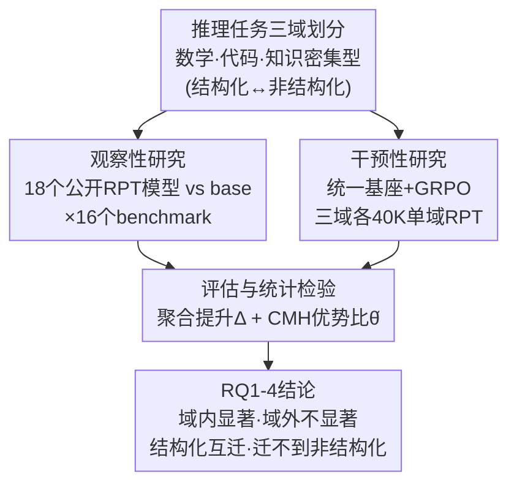

# Breaking Barriers: Do Reinforcement Post Training Gains Transfer To Unseen Domains?

**会议**: ICLR2026  
**arXiv**: [2506.19733](https://arxiv.org/abs/2506.19733)  
**代码**: 待确认  
**领域**: 强化学习  
**关键词**: 强化后训练(RPT), RLVR, 跨域泛化, 结构化推理, 非结构化推理, LLM

## 一句话总结
通过观察性研究（18 个开源 RPT 模型）和干预性研究（单域 GRPO 训练），系统揭示了强化后训练（RPT/RLVR）的泛化局限：RPT 在训练域内提升显著，但跨域泛化不一致——结构化域（数学↔代码）可互相迁移，但无法泛化到非结构化域（法律/金融/医疗），且这一结论跨算法、模型规模和训练步数保持一致。

## 研究背景与动机

**领域现状**：RPT（尤其是 RLVR）近期在数学和代码推理上取得了惊人进展——Gemini 3 Pro 在 AIME 2025 达到 100%，Claude Opus 4.5 在 SWE-bench 达 81%，GPT-5.2-Pro 在 GPQA Diamond 达 93.2%。这些模型通常在多域混合数据上后训练。

**核心问题**：RPT 带来的推理能力提升是否像预训练那样具有广泛的领域泛化性？现有工作几乎只在训练域内评估 RPT 模型，缺乏系统性的跨域分析。

**研究挑战**：(1) 现有 RPT 模型使用不同的算法、超参数和多域数据，难以隔离 RPT 本身的效果；(2) 需要同时覆盖结构化（数学、代码）和非结构化（法律、金融、医疗）推理任务。

**核心设计**：采用"观察性+干预性"两阶段研究范式——先广泛评估现有模型发现趋势，再通过受控实验验证因果关系。

## 方法详解

### 整体框架

这是一篇实证研究，核心是回答"RPT 的推理增益能否迁移到训练域之外"这一问题，并把它拆成四个递进的研究问题：增益能否跨域迁移（RQ1）、推理结构相似性如何影响泛化（RQ2）、同一大域内子任务间泛化如何（RQ3）、这种泛化规律是否随算法/模型规模/训练步数变化（RQ4）。为了既看到普遍趋势又能锁定因果，作者采用"观察性 + 干预性"的双阶段设计：先在 18 个公开 RPT 模型上做大范围横向对比发现现象，再用统一基座、统一算法的单域受控训练隔离出 RPT 本身的作用，两路证据汇总到同一套带统计检验的评估指标上，最后回答四个研究问题。

### 关键设计

**1. 三域分类与结构化/非结构化之分：给"跨域"一个可操作的坐标系**
要谈泛化首先要定义"域"。作者把推理任务划成三大域——**数学**（GSM8K、MATH-500、AIME 2024、AMC 2023）、**代码**（MBPP、HumanEval、BigCodeBench、LiveCodeBench、USACO、Codeforces、Polyglot）、以及**知识密集型推理**（PubMedQA、MedQA、TabFact、LegalBench、FinBench）。更关键的是给出一条贯穿全文的区分维度：数学与代码属于**结构化推理**，遵循确定性逻辑步骤和精确语法；法律/金融/医疗属于**非结构化推理**，需要上下文敏感、依赖世界知识、要处理歧义。正是这条结构化—非结构化的轴线，后面解释了为什么数学和代码能互迁、却都迁不到知识域。

**2. 观察性研究：用 18 个公开模型先把现象看清楚**
作者从 Hugging Face 系统性地把候选 RPT 模型从 466 个逐层筛到 31 个再到 18 个，筛选条件是 RPT 数据公开、参数量落在 1.5B–14B、且基座不是纯预训练模型（保证 RPT 是唯一变量来源）。每个模型都与其对应的 base 模型在 16 个 benchmark 上逐一对比，覆盖数学、代码、法律、金融、医疗。这一步的价值在于范围广、模型多样，能暴露出跨算法、跨规模都成立的普遍趋势，但因为各模型算法和数据各异，单靠它还无法断言因果。

**3. 干预性研究：单域受控训练隔离 RPT 的真实因果**
为了排除"是不同算法/数据造成差异"的干扰，作者把所有变量钉死：基座统一为 DeepSeek-R1-Distill-Qwen-1.5B，算法统一用 GRPO（组相对策略优化）且超参完全一致，唯一不同的是训练数据——在三个互不相交、各 40K 样本的数据集（数学 / 代码 / 知识密集型）上分别做 RPT。这样三个模型之间唯一的差别就是训练域，任何域外表现差异都只能归因于 RPT 数据域本身。作者还补做了 DAPO 算法、2 epoch、以及 Llama-3.2-3B-Instruct 基座的复现，以确认结论不依赖某一特定配置。

**4. 评估指标与统计检验：不止看点估计，还要看显著性**
泛化好坏需要量化。作者定义**聚合准确率提升** $\Delta_{i,j}^{(\mathcal{D})}$，即 RPT 模型相对 base 在某域上加权平均的 pass@1 改进，用来衡量增益幅度。但点估计容易被噪声误导，于是引入 **Cochran-Mantel-Haenszel（CMH）检验**，计算跨 benchmark 的共同优势比 $\hat{\theta}$ 并以 $p<0.05$ 标注显著性——$\hat{\theta}$ 越接近 1 说明 RPT 几乎没带来真实优势。为压低方差，AMC/AIME 这类小 benchmark 重复 16 次取平均，其余跑 1 次。正是这套假设检验框架让"OOD 增益不显著"成为有统计支撑的结论，而非仅凭一个偏低的数字。

## 实验关键数据

### RQ1：RPT 不能泛化到任意未见域

| 指标 | 域内 (ID) 平均 | 域外 (OOD) 平均 |
|------|--------------|----------------|
| $\Delta$ (pass@1 %) | +2.87 | **-3.19** |
| Odds ratio $\hat{\theta}$ | 3.10 | 1.32 |

- 典型案例：DeepScaleR-1.5B 在数学域 +5.1%，其他域仅 +1.7%（3 倍下降）
- 极端案例：AZR-Coder-7B（几乎零数据后训练）在代码域 +30.12%，域外 **-23.31%**
- 单域干预实验中，无论数学、代码还是知识 RPT，均无统计显著的 OOD 提升

### RQ2：结构化域间可互迁，跨类型不行

| 训练域 → 测试域 | 数学 | 代码 | 知识密集型 |
|---------------|------|------|-----------|
| **数学 RPT** | +2.18% | +4.77% | -0.27% |
| **代码 RPT** | +15.44% | +9.49% | -0.27% |
| **知识 RPT** | +21.40%* | +12.16%* | 下降 |

- 数学→代码和代码→数学双向有效，且数学→代码迁移更强（数学是更基础的结构化推理）
- 结构化域→知识密集型域：无统计显著提升，甚至下降
- **反直觉发现**：知识密集型→结构化域反而有显著正迁移，暗示非结构化推理是结构化推理的"超集"

### RQ3：域内子域泛化取决于结构相似性

- 结构化域内泛化良好（数学各子任务间、代码各子任务间一致提升）
- 非结构化域内泛化差：Fino1-8B（金融 RPT）在 PubMedQA -2%，LegalBench -1.6%，TabFact **-15.8%**
- 干预实验中 Knowledge-RPT 在知识域整体也出现下降，说明非结构化任务间缺乏共享逻辑模板

### RQ4：泛化性限制跨配置保持一致

| Base + 算法 | $\Delta^{(ID)}$ | $\Delta^{(OOD)}$ | Gap |
|------------|-----------------|-------------------|-----|
| DS-Qwen-1.5B + GRPO | +3.13 | **-1.81** | 4.94 |
| Llama-3.2-3B + GRPO | +6.47 | +1.41 | 5.06 |
| DS-Qwen-1.5B + DAPO | +3.96 | **-1.27** | 5.23 |

- 不同 RL 算法（GRPO vs DAPO）、不同基座模型、更多训练步数均呈现相同模式
- ID-OOD gap 随训练步数增加而增大并最终稳定
- 更大模型参数量使 ID 增益比 OOD 增益多增长 16.5%，加剧过拟合

## 亮点与洞察

- **"观察+干预"的实验设计范式**：先用 18 个模型的广泛观察发现趋势，再用受控单域训练验证因果关系，研究设计严谨
- **非结构化→结构化正迁移的反直觉发现**：知识 RPT 模型在数学域上甚至有统计显著提升，暗示广泛知识推理某种程度上"包含"了结构化推理能力
- **结构化推理的层次性**：数学→代码迁移比代码→数学更强，反映数学推理是更基础的能力
- **极少数据也能造成域外损害**：AZR-Coder 几乎没有训练数据就导致 OOD -23%，说明 RPT 本身（而非过拟合）是泛化失败的原因
- **CMH 统计检验的使用**：引入标准化的假设检验框架而非仅看点估计，增强了结论可信度

## 局限与展望

- 干预实验仅使用 1.5B 模型，更大模型（7B+）的单域 RPT 实验缺失
- 知识密集型推理的训练数据由 o3-mini 过滤去除数学/代码内容，过滤质量可能影响结论
- 未探讨 SFT + RPT 联合训练的泛化情况，仅聚焦纯 RLVR
- 非结构化域的 benchmark 较少（仅 5 个），且部分（如 TabFact）是否真正代表"非结构化推理"可讨论
- 未分析 RPT 过程中模型内部表征的变化（如探针分析），缺乏机制层面的解释
- 所有实验基于开源模型，闭源 RPT 模型（如 o1、DeepSeek-R1 完整版）的泛化行为可能不同

## 相关工作与启发

- **vs DeepSeek-R1/o1 系列**：这些模型在多域混合数据上 RPT，看似全面提升，但因 ID/OOD 混合无法区分真正的泛化。本文通过单域实验揭示了泛化的局限
- **vs RPT 局限性研究（Yue et al., Ma et al.）**：先前工作质疑 RPT 在推理质量、计算效率等方面的问题，本文是首个系统研究 RPT 数据域泛化性的工作
- **vs 预训练的泛化性**：预训练通过海量多样数据获得广泛泛化能力，RPT 的泛化性远不如预训练，说明后训练阶段的"推理学习"本质上是域特定的模式强化
- **对实践的启示**：RPT 在部署时应针对目标域定制训练数据；期望通过数学/代码 RPT 获得法律/医疗推理能力是不现实的

## 评分
- 新颖性: ⭐⭐⭐⭐ 首个系统性研究RPT跨域泛化的工作，实验设计精良
- 实验充分度: ⭐⭐⭐⭐⭐ 18个模型×16个benchmark，观察+干预双验证，跨算法/模型/步数消融
- 写作质量: ⭐⭐⭐⭐ 结构清晰，RQ驱动，统计检验严谨
- 价值: ⭐⭐⭐⭐⭐ 对RPT社区有重要警示意义，揭示了被广泛忽略的泛化瓶颈

<!-- RELATED:START -->

## 相关论文

- [\[ICLR 2026\] Post-training Large Language Models for Diverse High-Quality Responses](post-training_large_language_models_for_diverse_high-quality_responses.md)
- [\[ACL 2026\] Scaling Behaviors of LLM Reinforcement Learning Post-Training: An Empirical Study](../../ACL2026/reinforcement_learning/scaling_behaviors_of_llm_reinforcement_learning_post-training_an_empirical_study.md)
- [\[ACL 2026\] Breaking the Impasse: Dual-Scale Evolutionary Policy Training for Social Language Agents](../../ACL2026/reinforcement_learning/breaking_the_impasse_dual-scale_evolutionary_policy_training_for_social_language.md)
- [\[ICML 2026\] Provable Benefit of Curriculum in Transformer Tree-Reasoning Post-Training](../../ICML2026/reinforcement_learning/provable_benefit_of_curriculum_in_transformer_tree-reasoning_post-training.md)
- [\[ICML 2026\] How Reasoning Evolves from Post-Training Data: An Empirical Study Using Chess](../../ICML2026/reinforcement_learning/how_reasoning_evolves_from_post-training_data_an_empirical_study_using_chess.md)

<!-- RELATED:END -->
