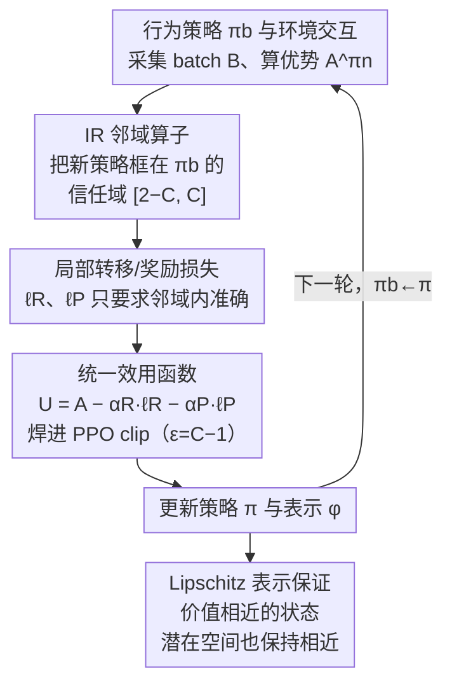

# Deep SPI: Safe Policy Improvement via World Models

**会议**: ICLR 2026  
**arXiv**: [2510.12312](https://arxiv.org/abs/2510.12312)  
**领域**: 强化学习 / 安全策略改进 / 世界模型  
**关键词**: safe policy improvement, world model, representation learning, PPO, importance ratio

## 一句话总结

构建了安全策略改进（SPI）的理论框架，将世界模型和表示学习与策略更新保证统一起来：通过基于重要性比率的邻域算子约束策略更新，确保单调改进和收敛；结合局部转移/奖励损失控制世界模型质量和表示稳定性，提出 DeepSPI 算法在 ALE-57 基准上匹配或超越 PPO 和 DeepMDP。

## 研究背景与动机

**现状**: 安全策略改进（SPI）通过约束策略更新来避免灾难性退化，提供理论保证。但经典SPI方法仅适用于离线、表格化RL，要求穷举状态-动作覆盖，无法扩展到高维连续空间。

**痛点1 — OOT问题**: 当策略偏离行为策略（behavioral policy）和世界模型的训练分布时，模型可能在未探索区域产生"幻觉"，导致策略更新失败。例如，模型错误地为未访问状态赋予高奖励（如给一个该产生负奖励的状态标注奖励+20）。

**痛点2 — 混淆策略更新**: 当策略和表示同时更新时，不良的表示可能将本不相同的状态合并为同一潜在表示。如果在合并表示上改变策略选择，可能在实际中的某些状态产生灾难性负奖励。

**核心idea**: 将重要性比率（IR）约束作为策略更新的邻域算子，限制新策略与行为策略的偏差在 $[2-C, C]$ 范围内。结合局部奖励和转移损失，同时保证：(1) 世界模型在策略邻域内准确，(2) 表示学习保持Lipschitz稳定性。

## 方法详解

### 整体框架

DeepSPI 想解决的事很具体：把过去只在离线、表格化场景成立的安全策略改进（safe policy improvement, SPI）保证，搬到在线、高维的深度 RL 里。难点在于在线设置有两个隐患——世界模型在没探索过的区域"幻觉"（OOT 问题），以及表示和策略同步更新时把本该区分的状态混淆掉（confounding 问题）。

DeepSPI 的整体思路是给标准 PPO 训练循环装上一道"安全闸门"。每一轮先用当前（行为）策略和环境交互、采集一批数据并照常算优势函数 $A^{\pi_n}$；与此同时，世界模型在这批数据覆盖的局部区域上算出转移/奖励损失，再把这两个损失直接减进优势、拼成一个统一效用 $U$，用 $U$ 替换 PPO 目标里所有的 $A$。PPO 自带的 clip 机制此时正好充当重要性比率（importance ratio, IR）邻域算子的近似，把每步更新框在行为策略附近的信任域内。这样一来，策略和表示即便同步更新，也始终待在世界模型可靠的范围里，OOT 和 confounding 两个隐患被同一套约束一起摁住，同时还能证明出表示保持良好结构。下面四个设计对应论文的四个定理，自上而下贯穿这个训练循环：

### 关键设计

**1. IR 邻域算子：用重要性比率把策略更新框在行为策略附近**

经典 SPI 之所以扩不到高维空间，是因为它要求对所有状态-动作对穷举覆盖、误差界要全局成立。DeepSPI 换了个度量：用新旧策略在每个状态-动作上的概率比（重要性比率）的上下确界来刻画偏差，并据此定义信任域 $\mathcal{N}^C(\pi) = \{ \pi' \in \Pi \mid 2 - C \leq D_{\text{IR}}^{\inf}(\pi, \pi') \leq D_{\text{IR}}^{\sup}(\pi, \pi') \leq C \}$，其中常数 $C \in (1, 2)$ 是探索-利用的旋钮，$C$ 越大允许偏离越大。每一步只在这个邻域里挑最大化优势的新策略：

$$\pi_{n+1} = \arg\sup_{\pi' \in \mathcal{N}^C(\pi_n)} \mathbb{E}_{s \sim \mu_{\pi_n}} \mathbb{E}_{a \sim \pi'} A^{\pi_n}(s, a)$$

由于偏差被卡死在 $[2-C, C]$ 内，新策略访问的状态分布始终与行为策略（也就是世界模型的训练分布）重叠，模型没机会在未探索区"画饼"。**定理 1** 证明这一更新方案是镜像学习（mirror learning）的一个实例，因此价值序列 $\{V^{\pi_n}\}$ 单调改进并收敛到最优 $V^*$。

**2. 局部转移/奖励损失：只要求世界模型对策略邻域准确**

要求世界模型全局准确既不现实也没必要——DeepSPI 只让它在当前策略会访问的局部区域准。它用一批数据 $\mathcal{B}$ 上的局部奖励损失和（基于 Wasserstein 距离 $\mathcal{W}$ 的）转移损失来刻画模型质量：

$$L_R^\mathcal{B} = \mathbb{E}_{s,a \sim \mathcal{B}} |R(s,a) - \bar{R}(\bar{s}, a)|, \quad L_P^\mathcal{B} = \mathbb{E}_{s,a \sim \mathcal{B}} \mathcal{W}\big(\phi_\sharp P(\cdot|s,a),\, \bar{P}(\cdot|\phi(s), a)\big)$$

这两个损失都是局部的、可用随机梯度下降优化。**定理 2** 证明只要 IR 偏差严格小于 $1/\gamma$，真实环境与世界模型之间的回报差异就被这两个局部损失（及平均回合长度、Lipschitz 常数等）线性控制住；**定理 3**（Deep, Safe Policy Improvement）进一步把这个界转成安全改进保证：$\rho(\bar{\pi}\circ\phi, \mathcal{M}) - \rho(\pi_b, \mathcal{M}) \geq \rho(\bar{\pi}, \bar{\mathcal{M}}) - \rho(\bar{\pi}_b, \bar{\mathcal{M}}) - \zeta$，其中建模误差 $\zeta$ 随局部损失减小而减小。也就是说——局部准确 + 邻域约束就足以保证"在世界模型里改策略，在真实环境里不会更糟"，正面解决了 OOT 隐患。

**3. 统一效用函数：把模型损失焊进优势函数**

光把局部损失当辅助项加到 PPO 目标上并不够：更新表示 $\phi$ 去最小化这些损失时，梯度可能反过来把策略 $\bar{\pi}\circ\phi$ 顶出安全邻域。DeepSPI 的做法是把损失直接减进优势函数、拼成一个统一效用：

$$U^{\pi_n}(s, a, s') = A^{\pi_n}(s, a) - \alpha_R \cdot \ell_R(s, a) - \alpha_P \cdot \ell_P(s, a, s')$$

其中 $\ell_R$、$\ell_P$ 是逐转移的奖励/转移损失（期望下恢复出 $L_R$、$L_P$），权重 $\alpha_R, \alpha_P \in (0, 1]$。再用 $U$ 替换 PPO 目标里所有出现 $A$ 的地方。由于 PPO 的 clip 对 $U$ 同样生效（取 $\epsilon = C - 1$ 时，clip 正好等价于把 IR 软约束在 $[2-C, C]$），策略更新本身就内生地权衡了模型损失，表示与策略不再各拉各的、自然落在同一个安全方向上。这就是把前面的理论变成可跑算法的关键一步。

**4. Lipschitz 表示保证：防止状态被错误合并**

confounding 更新的根源，是坏表示把本该区分的状态压成同一个潜在点，于是在这个合并点上改策略会在某些真实状态里酿成灾难性负奖励。**定理 4** 证明当上述局部损失足够小时，更新后的表示以高概率保持近似 Lipschitz 性：

$$|V^{\bar{\pi}}(s_1) - V^{\bar{\pi}}(s_2)| \leq K_V \cdot \bar{d}(\phi(s_1), \phi(s_2)) + \varepsilon$$

直观说就是价值相近的状态在潜在空间里也保持接近、价值差大的状态不会被强行拉拢，从而避免表示坍塌。注意这个保证和设计 2 的世界模型质量同出一源——都来自最小化那两个局部损失，只是一个界住模型回报误差（治 OOT）、一个界住表示坍塌（治 confounding）。实践中需要 GroupSort 等架构来真正约束住 Lipschitz 常数。

## 实验关键数据

### ALE-57 聚合结果

| 指标 | PPO | DeepMDP | **DeepSPI** |
|------|-----|---------|-------------|
| Mean | 基准 | 略优于PPO | **最优** |
| Median | 基准 | 与PPO相当 | **最优** |
| IQM | 基准 | 略优于PPO | **最优** |
| Optimality Gap↓ | 基准 | 略低于PPO | **最低** |

### 消融: 世界模型质量（训练过程中位数损失）

| 指标 | DeepMDP | **DeepSPI** |
|------|---------|-------------|
| 转移损失 $L_P$↓ | 较高 | **更低** |
| 奖励损失 $L_R$↓ | 相当 | **相当** |

### Toy Maze 示例验证

| 方法 | 从初始状态I的回报 | ⋆状态表示距离 |
|------|-----------------|-------------|
| PPO | ~4.8（表示坍塌，只能选"右"） | ~0（合并） |
| **DeepSPI** | **~8**（区分顶/底⋆，正确选择"上"） | **>0（分离）** |

### 关键发现

- DeepSPI 在 ALE-57 所有聚合指标上匹配或超越 PPO 和 DeepMDP
- DeepSPI 的转移损失一致更低，表明学到了更准确的世界模型
- 在精心设计的Toy Maze中，DeepSPI 成功避免了表示坍塌，回报提升约67%
- 未发现转移损失和奖励损失之间的竞争关系（与离线设置不同）
- DreamSPI（纯模型基规划变体）在部分环境中展现了可行性

## 亮点与洞察

1. **理论-实践桥梁**: 将离线SPI的严格保证扩展到在线深度RL，4个定理层层递进构建完整框架
2. **OOT和混淆更新的统一解决**: 两个看似不同的问题通过同一个IR邻域约束机制同时解决
3. **嵌入式辅助损失**: 将模型损失嵌入advantage而非独立优化，防止表示更新推动策略出界——相比DeepMDP的独立辅助损失更原则性
4. **PPO的理论根基**: 证明PPO的clip机制实质上是邻域约束的松弛版本，为其成功提供了SPI视角的解释

## 局限与展望

- 聚合结果中与PPO/ DeepMDP的差异需要仔细看置信区间，在部分单独环境上可能无显著差异
- Lipschitz约束需额外架构设计（GroupSort网络），增加了实现复杂度
- DreamSPI（纯模型基规划）性能不及在线方法，说明on-policy的世界模型学习+规划仍有挑战
- 仅在Atari环境测试，连续控制任务（如MuJoCo）的适用性未验证
- 理论需要 $\gamma > 1/2$ 和 $K_{\bar{P}}^{\bar{\pi}} < 1/\gamma$ 等假设，实践中可能不总满足

## 相关工作与启发

- 与经典SPI方法（SPIBB、Laroche等）的关系：从离线表格化扩展到在线深度设置
- 与DeepMDP（Gelada等2019）直接对比：后者不约束策略更新的影响，因此无SPI保证
- 与PPO/TRPO的正式联系：证明IR邻域约束是clip操作的严格版本
- 与bisimulation（Castro等）的连接：表示保证与状态抽象中的等价性概念相通

## 评分

- **新颖性**: ⭐⭐⭐⭐⭐ — 首次将SPI保证扩展到在线深度RL的世界模型+表示学习设置
- **实验充分度**: ⭐⭐⭐⭐ — ALE-57全面但仅限Atari域
- **写作质量**: ⭐⭐⭐⭐ — 理论推导严谨，示例直观，但数学密度较高
- **价值**: ⭐⭐⭐⭐⭐ — 为深度RL中的安全性提供了坚实的理论基础和实用算法

<!-- RELATED:START -->

## 相关论文

- [\[ICLR 2026\] One Model for All Tasks: Leveraging Efficient World Models in Multi-Task Planning](one_model_for_all_tasks_leveraging_efficient_world_models_in_multi-task_planning.md)
- [\[ICLR 2026\] Understanding and Improving Hyperbolic Deep Reinforcement Learning](understanding_and_improving_hyperbolic_deep_reinforcement_learning.md)
- [\[ICML 2025\] PIGDreamer: Privileged Information Guided World Models for Safe Partially Observable RL](../../ICML2025/reinforcement_learning/pigdreamer_privileged_information_guided_world_models_for_safe_partially_observa.md)
- [\[ICLR 2026\] WIMLE: Uncertainty-Aware World Models with IMLE for Sample-Efficient Continuous Control](wimle_uncertainty-aware_world_models_with_imle_for_sample-efficient_continuous_c.md)
- [\[CVPR 2026\] GeoWorld: Geometric World Models](../../CVPR2026/reinforcement_learning/geoworld_geometric_world_models.md)

<!-- RELATED:END -->
