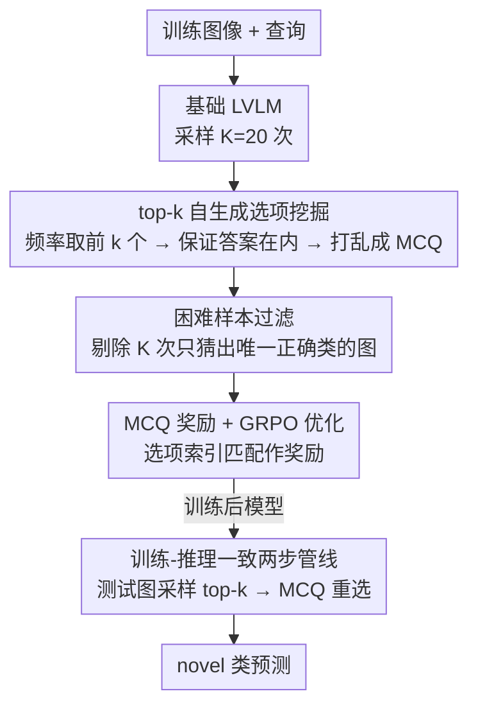

# DiVE-k: Differential Visual Reasoning for Fine-grained Image Recognition

**会议**: ICLR2026  
**arXiv**: [2511.18305](https://arxiv.org/abs/2511.18305)  
**代码**: [raja-kumar/DiVE-k](https://github.com/raja-kumar/DiVE-k)  
**领域**: 强化学习  
**关键词**: fine-grained recognition, reinforcement-learning, GRPO, visual reasoning, multiple-choice question, LVLM

## 一句话总结

提出 DiVE-k 框架，利用大视觉语言模型自身的 top-k 生成结果构造选择题，通过 GRPO 强化学习训练模型进行差异化视觉推理，在细粒度图像识别的 base-to-novel 泛化上大幅超越现有方法。

## 背景与动机

大视觉语言模型（LVLM）虽然拥有丰富的文本知识，但在细粒度图像识别中表现不佳，难以区分视觉上高度相似的类别。作者观察到两个关键现象：

1. **Pass@1 与 Pass@K 之间存在巨大差距**：模型在 K 次采样中往往能覆盖正确答案，但 Pass@1 准确率却很低。这说明模型过度依赖粗粒度的显著特征，而缺乏精细的差异化推理能力。
2. **LVLM 实际上包含了细粒度类别的详细知识**（如部件属性、外观描述），但现有方法未能有效激发这些知识用于区分相似类别。

现有的基于强化学习的方法如 ViRFT 使用精确字符串匹配作为奖励信号，存在三个问题：(a) 脆弱的字符串匹配（科学名/俗名不一致）；(b) 鼓励死记硬背训练类别名称；(c) 无法激励属性级别的差异化推理。这些缺陷导致从 base 类到 novel 类的泛化能力差。

## 核心问题

如何让 LVLM 在细粒度图像识别中进行有效的差异化推理（differential reasoning），即在多个视觉相似的候选类别中，通过比较关键区分属性来选出正确答案，并且这种推理能力能泛化到训练未见过的新类别？

## 方法详解

### 整体框架

DiVE-k 想解决的是：大视觉语言模型（LVLM）在细粒度识别上"答案其实采得到、却一次答不准"，开放式生成又让 RL 奖励卡在脆弱的字符串匹配上。它的做法是把开放式识别重构成一个由模型自己出题的闭集选择题——先用基础 LVLM 对每张图多次采样，把模型自己最常猜错的 top-k 类别拼成一道多选题（MCQ），过滤掉毫无歧义的简单图，再用 GRPO 在这些 hard-negative 上训练模型做属性级的差异化推理。关键之处在于训练和推理共享同一条"采样选项 → MCQ 重选"两步管线，奖励因此从"字符串是否匹配"退化成"选项索引是否正确"，既可靠又难以靠死记类别名取巧。

### 关键设计

**1. top-k 自生成选项挖掘：让模型自己暴露混淆点**

现有 RL 方法（如 ViRFT）用固定或随机的负类构造任务，要么太简单、要么与图像无关，激不出差异化推理。DiVE-k 改为让模型自己出干扰项：对每张训练图像 $I$ 和查询 $q$ 用基础模型 $\pi_\theta$ 采样 $K=20$ 次，统计所有预测类别的出现频率，取最频繁的前 $k=\min(5,|\mathcal{C}|)$ 个组成选项集 $\mathcal{O}_{top\text{-}k}$；若正确答案没被采到，就替换掉频率最低的那个选项以保证答案在内，最后随机打乱编号为标准 A/B/C 形式。这些选项正是模型自身困惑分布的众数，天然就是视觉上高度相似的 hard-negative，迫使模型去比较细粒度区分属性（花序形态、喙形等），而不是只看显著特征蒙一个。

**2. 困难样本过滤：把训练算力集中在真正混淆的图像上**

如果模型 $K$ 次采样只吐出唯一的正确类别，说明这张图对模型已毫无难度，继续拿它训练只会强化已有的简单捷径、稀释差异化推理的梯度信号。DiVE-k 直接剔除这类样本，只保留采样结果中存在歧义的图像进入训练集，让 GRPO 的更新集中在差异化推理真正起作用的 hard 案例上。

**3. MCQ 奖励 + GRPO 优化：绕开字符串匹配的脆弱性**

把答案压成一个选项索引后，奖励判定就不再受科学名/俗名等字符串不一致的影响。在构造好的 MCQ 数据集 $\mathcal{D}=\{(I,q,\mathcal{O}_{enum},\hat{a})\}$ 上，每个样本生成 $N$ 个 rollout，奖励由两项构成：MCQ 奖励 $r_{mcq}$ 在模型选中正确选项时为 1.0、否则 0.0；格式奖励 $r_{format}$ 鼓励模型规范输出 `<think>` 与 `<answer>` 标签，二者按下式加权

$$r=\lambda_f\, r_{format}+\lambda_m\, r_{mcq}$$

再送入标准 GRPO：每组 rollout 内标准化得到 advantage

$$A_i=\frac{r_i-\text{mean}\{r_1,\dots,r_N\}}{\text{std}\{r_1,\dots,r_N\}+\delta}$$

由于奖励只看选项是否选对，它既不会因字符串不一致而误判，也不会奖励对训练类别名的死记硬背，而是直接激励"在候选间比较关键属性"的推理过程——这正是 ViRFT 记忆化、泛化差的根因所在。

**4. 训练-推理一致的两步管线：让评测真实反映 novel 泛化**

推理时复用与训练相同的流程：先用训练后的模型对测试图采样 $K$ 次得到 top-k 选项，再把选项组成 MCQ 重新提示模型作答。与训练唯一的不同是推理阶段不会人为塞入 ground-truth，完全依赖模型自己的候选集。这一致性保证了"训练时学的差异化比较能力"在推理时被原样调用，从而真实反映对训练未见类别（novel 类）的泛化，而不是靠任何测试侧的信息泄露。

## 实验关键数据

### 实验设置
- 基础模型：Qwen2.5-VL-7B-Instruct
- 数据集：OxfordFlowers-102、CUB-200、OxfordPets-37、StanfordCars-196、FGVC Aircraft-100
- 训练：3 张 A6000 GPU，batch size 6，GRPO rollout 4 个
- 评估指标：Base/Novel 准确率及其 Harmonic Mean (HM)

### Base-to-Novel 泛化（表 1）

| 方法 | Base | Novel | HM |
|------|------|-------|-----|
| QWEN2.5-VL-7B | 68.9 | 70.5 | 69.7 |
| ViRFT | 73.0 | 74.2 | 73.6 |
| **DiVE-k** | **80.8** | **78.8** | **79.8** |

DiVE-k 相比 ViRFT 在 HM 上提升 **+6.2%**，相比 QWEN2.5-VL-7B 提升 **+10.1%**。CUB 数据集上提升最显著（HM +14.9）。性能接近 Gemini2.5-flash-lite（80.0 HM），略低于 GPT-5-mini（83.4 HM）。

### 混合数据集泛化（表 2）
单一模型在所有数据集的 base 类混合训练后，DiVE-k 达到 HM 78.7，比 ViRFT 高 +4.0，比 QWEN2.5 高 +9.0。ViRFT 使用两步推理后在 novel 类上甚至不如原始 QWEN2.5（76.2 vs 77.0），而 DiVE-k 达到 78.8。

### Few-shot（4-shot，表 3）
DiVE-k 平均准确率 74.75%，相比 ViRFT 提升 +7.73%，相比 QWEN2.5 提升 +10.85%。

## 亮点

1. **巧妙的训练信号设计**：将模型自身的 top-k 预测作为 MCQ 选项，既提供了有意义的 hard-negative（来自模型自身的困惑分布），又构造了简单可验证的奖励信号，避免了字符串匹配的脆弱性。
2. **差异化推理的涌现**：通过 MCQ 训练，模型学会了比较候选类别之间的细粒度属性差异（如花朵的花序形态、鸟类的喙形），而非仅依赖粗粒度特征。
3. **解决了 ViRFT 的记忆化问题**：ViRFT 在 novel 类上几乎无提升（使用两步推理后 77.0→77.1），而 DiVE-k 在 novel 类上有实质性提升（+1.8），说明学到的是泛化推理而非类别名称记忆。
4. **消融设计清晰**：对选项生成策略（random vs text-emb vs top-k）、视觉/文本组件的作用、$K$ 值的影响均有详细消融，论证充分。

## 局限与展望

1. **OxfordPets 上小幅回退**：在 Pet 数据集上 DiVE-k 略低于 ViRFT（HM 91.6 vs 92.9），作者认为更多选项导致第二步出错概率增加。对于已经较简单的数据集，MCQ 反而引入了不必要的干扰。
2. **两步推理增加计算开销**：推理时需要 $K$ 次采样再做一次选择，相比单次推理的计算量增大约 $K+1$ 倍，实际部署可能是瓶颈。
3. **仅在 Qwen2.5-VL-7B 上验证**：虽附录提到了 Gemma-3 的实验，但缺乏更大规模模型（如 72B）的验证，方法是否在更强基础模型上仍有收益有待确认。
4. **选项数目固定为 5**：$m=5$ 作为固定超参数，不同数据集可能有不同最优值（如 Pet 上 $K=2$ 时最佳），自适应选项数目可能进一步提升性能。
5. **离线选项生成与在线训练的一致性**：随着训练进行模型分布发生变化，但 top-k 选项是用初始模型离线生成的，可能存在分布漂移问题。

## 与相关工作的对比

| 方法 | 核心思路 | 奖励信号 | Novel 泛化 |
|------|---------|---------|-----------|
| CLIP | 视觉-文本嵌入匹配 | 无（零样本） | 有限 |
| Prompt Learning | 学习文本提示向量 | 交叉熵 | 中等 |
| FuDD | LLM 生成离线判别特征配合 VLM | 无 RL | 固定策略 |
| ViRFT | 开放式生成 + 精确字符串匹配奖励 | 脆弱 | 弱（记忆化） |
| SFT (Full) | 监督微调 | 交叉熵 | 极差（Novel -33.5%） |
| **DiVE-k** | top-k MCQ + GRPO | 简单可验证 | **强** |

DiVE-k 的关键区别在于将开放式分类问题转化为模型自生成的闭集选择问题，同时利用 MCQ 格式使奖励信号从"字符串匹配"简化为"选项索引匹配"，从根本上解决了奖励脆弱性和记忆化问题。

## 启发与关联

1. **top-k self-refinement 范式**：利用模型自身的输出分布作为训练信号的思路可推广到其他分类任务（医学图像、遥感等），甚至可用于 VQA 中的多选题训练。
2. **MCQ 作为通用推理界面**：将开放式生成问题重构为 MCQ 的思路值得借鉴——MCQ 格式天然提供可验证奖励，降低 RL 训练难度。
3. **与 Best-of-N 采样的联系**：DiVE-k 的推理管线类似 best-of-N 但更进一步——不是简单多数投票，而是将候选集交给模型做显式的属性级比较推理。
4. **Hard-negative 挖掘的自动化**：从模型自身采样中自动获取困难负样本，无需外部标注或特征检索，方法简洁优雅。

## 评分
- 新颖性: ⭐⭐⭐⭐ — top-k 自生成 MCQ + RL 的组合新颖，解决了 ViRFT 的关键缺陷
- 实验充分度: ⭐⭐⭐⭐ — 5 个数据集 × 3 种设置 + 详细消融，但模型规模验证不足
- 写作质量: ⭐⭐⭐⭐ — 动机清晰，图示直观，对比实验设计合理
- 价值: ⭐⭐⭐⭐ — 提出了实用的细粒度识别 RL 训练范式，泛化能力验证充分

<!-- RELATED:START -->

## 相关论文

- [\[ICLR 2026\] RewardMap: Tackling Sparse Rewards in Fine-grained Visual Reasoning via Multi-Stage Reinforcement Learning](rewardmap_tackling_sparse_rewards_in_fine-grained_visual_reasoning_via_multi-sta.md)
- [\[ICLR 2026\] PreferThinker: Reasoning-based Personalized Image Preference Assessment](preferthinker_reasoning-based_personalized_image_preference_assessment.md)
- [\[ICLR 2026\] Reasoning as Representation: Rethinking Visual Reinforcement Learning in Image Quality Assessment](reasoning_as_representation_rethinking_visual_reinforcement_learning_in_image_qu.md)
- [\[CVPR 2026\] Specificity-aware Reinforcement Learning for Fine-grained Open-world Classification](../../CVPR2026/reinforcement_learning/specificity-aware_reinforcement_learning_for_fine-grained_open-world_classificat.md)
- [\[ICLR 2026\] LoongRL: Reinforcement Learning for Advanced Reasoning over Long Contexts](loongrl_rl_for_reasoning_long_contexts.md)

<!-- RELATED:END -->
