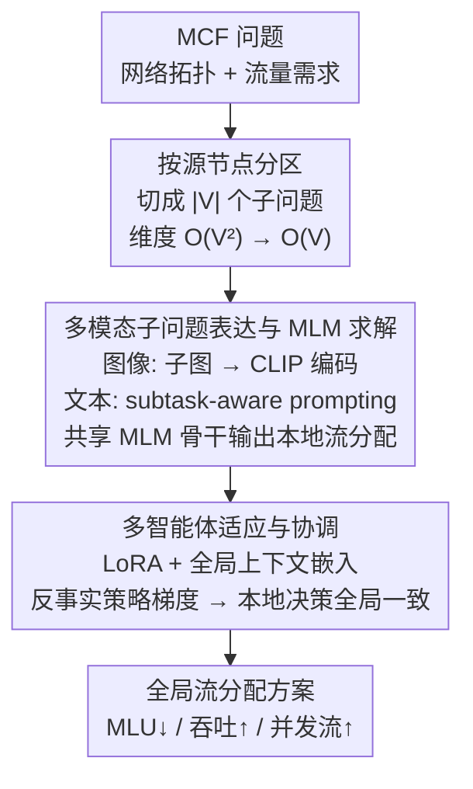

# Divide, Harmonize, Then Conquer It: Shooting Multi-Commodity Flow Problems with Multimodal Language Models

**会议**: ICLR 2026  
**arXiv**: [2602.11057](https://arxiv.org/abs/2602.11057)  
**代码**: [GitHub](https://github.com/Y-debug-sys/Pram)  
**领域**: 强化学习  
**关键词**: 多商品流, 多模态语言模型, 多智能体强化学习, 网络优化, 分区求解

## 一句话总结

提出 Pram 框架，首次利用多模态语言模型（MLM）求解多商品流（MCF）问题，通过分区将原问题分解为子问题，以多智能体强化学习（MARL）协调各子问题的全局一致性，理论证明收敛到最优解，实测速度比 LP 快 1-2 个数量级且性能接近最优。

## 研究背景与动机

多商品流（MCF）问题是网络流和组合优化的基本课题，在交通、通信、物流等领域有广泛应用。问题目标包括最小化最大链路利用率（MLU）、最大化吞吐量和最大化并发流。

现有方法面临两大痛点：

**LP 求解器的扩展性瓶颈**：LP 求解复杂度约 $\mathcal{O}(d^{2.3729})$，当变量规模达到百万级时运行时间过长（小时级别），且需准确预测未来需求

**ML 方法的局限性**：(a) GNN/RL 等专用网络工程成本高、需反复调参；(b) 对未见环境泛化差；(c) 输出维度随节点数平方增长（$\mathcal{O}(|\mathcal{V}|^2)$），仍有维度诅咒

核心洞察：**分而治之**——将 MCF 分解为子问题可将变量减少 $k^2$ 倍，而 MLM 强大的数学推理和泛化能力可替代专用网络，不需频繁重训练。

## 方法详解

### 整体框架

Pram（Partitioned Resource Allocation with MLMs）遵循"分、和、克"三步：先按源节点把整张网络切成 $|\mathcal{V}|$ 个子问题（**按源节点分区**），把每个子问题表达成图像+文本两种模态、交给一个共享的多模态语言模型骨干求解、给出本地流分配（**多模态子问题表达与 MLM 求解**），最后用多智能体强化学习让这些本地决策在全局上彼此协调一致（**多智能体适应与协调**）。三步串起来把原本 $\mathcal{O}(|\mathcal{V}|^2)$ 的求解维度降到 $\mathcal{O}(|\mathcal{V}|)$，同时借 MLM 的推理与泛化能力替掉手工设计的专用网络。

### 关键设计

**1. 按源节点分区：把维度诅咒按源节点拆开**

MCF 的输出维度随节点数平方增长，直接端到端学习既难训练又会爆显存（消融里不分区版在大网络上吃掉 31.6 GB 显存、根本跑不起来）。Pram 选择在源节点这一粒度上切分——每个源节点连同它发往全网其他节点的需求构成一个子问题，于是模型复杂度从 $\mathcal{O}(|\mathcal{V}|^2)$ 降到 $\mathcal{O}(|\mathcal{V}|)$。这正是"分而治之"：分区让单个子问题的变量规模数量级缩小，整体上把一个难以直接求解的大问题拆成 $|\mathcal{V}|$ 个同构的小问题，与 POP 用分区加速 LP 子求解的思路一脉相承，区别是后续不再交给 LP、而是交给下面的 MLM。

**2. 多模态子问题表达与 MLM 求解：让通用大模型"看懂"并求解网络子问题**

分出来的子问题需要一个能跨拓扑泛化、又不必为每种网络重新做网络工程的求解器——这是 GNN/RL 专用网络做不好的（成本高、需反复调参、换环境就退化）。Pram 把每个子问题表达成 MLM 天然能吃的两种模态：图像模态把从该源节点出发到所有目标节点的路由链路绘成一张子图，经 CLIP 视觉编码器送入 MLM，让模型"看见"网络拓扑结构；文本模态则用 subtask-aware prompting，把每条需求和它的子任务描述（源节点信息、历史滚动平均需求等）配对成提示词。之所以用 MLM 而非专门网络，是因为大规模预训练带来的涌现数学推理与跨拓扑泛化能力，让同一个骨干无需为每种结构重新设计调参，又能原生处理"图像+文本"混合输入、直接吐出本地流分配。消融中把 MLM 换成 GNN+FC 后性能显著下降（尤其 MLU），印证了这一选择。

**3. 多智能体适应与协调：共享骨干下让子智能体彼此对齐全局**

所有子问题共用同一个 MLM 骨干、却各自只看到本地观测，关键问题是如何在不为每个子问题各训一个大模型的前提下完成通信。Pram 从两个层面做适配：模型内部用 **LoRA** 低秩矩阵微调 MLM 的注意力权重，只引入极少额外参数；模型外部受上下文学习（ICL，in-context learning）启发，引入一组可学习的"全局上下文"嵌入作为输入提示前缀，这些上下文参数充当 query，通过多头交叉注意力与冻结的 tokenizer 嵌入矩阵对齐，从而把全局信息蒸馏进每个子智能体的提示里。这样所有子智能体既共享一份骨干和上下文、参数量不随网络规模增长，又能感知本地之外的全局态势，实现协调而非各自为政。可视化显示学到的上下文嵌入与 Flow、Demand、Capacity 等 MCF 核心词汇高度相关，说明它确实学到了任务语义；消融里去掉 Context、LoRA 或整套 MARL 协调都会让性能下降。

### 损失函数 / 训练策略

适配训练采用反事实策略梯度（Counterfactual Policy Gradient）。MCF 有一个关键的单步特性——一次流分配动作不会改变后续状态，因此期望回报退化为即时奖励 $R(s,a)$，省去了多步 RL 的信用分配难题。每个子智能体 $i$ 的优势用反事实基线衡量，即把自己的动作替换成按当前策略采样的其他动作、看奖励变化多少：$A_i(s,a) = R(s,a) - \sum_{a_i'} \pi_\theta(a_i'|s_i) R(s,(a_{-i},a_i'))$，其中基线项由蒙特卡洛采样近似；据此得到策略梯度 $g = \mathbb{E}_\pi[\sum_i A_i(s,a) \nabla_\theta \log \pi_\theta(a_i|s_i)]$。

方法还有一条完整的理论闭环为其撑腰：MCF 目标关于路径权重具有凸性/凹性，存在步长 $\eta>0$ 使梯度下降有限步收敛到最优（定理 1）；在有界奖励和 Hessian 假设下 Pram 的策略迭代收敛、期望梯度趋于零（引理 1）；而一个经适配的常数深度、常数宽度 MLM 可在前向传播中模拟多步梯度下降更新——即 MLM 通过 ICL 机制在 token 空间里隐式执行优化（定理 2）。三者串起来解释了为什么"让 MLM 求解 MCF 子问题"在理论上能逼近最优。

## 实验关键数据

### 主实验：真实数据集

| 方法 | MLU (↓) | Total Flow (↑) | Concurrent Flow (↑) | 需真实需求 |
|------|---------|----------------|---------------------|-----------|
| LP (Gurobi) | 最优基准 | 最优基准 | 最优基准 | 是 |
| Pram | **第二名** (部分超LP) | **第二名** | **第二名** | 否 |
| DRL | 差 (训练不稳定) | 差 | 差 | 否 |
| POP | 次差 | 次差 | 次差 | 是 |
| LP-top | 接近LP但不稳定 | 接近LP | 接近LP | 是 |

关键发现：Pram 在 MLU 指标上甚至超过 LP（CERNET 低 21%，GÉANT 低 45%），这与 MLU 更强的凸性一致。

### 主实验：大规模数据集（100-800 节点）

| 拓扑 | 节点数 | Pram 时间 | LP 时间 | 加速比 | Pram 相对 LP 性能 |
|------|-------|----------|---------|-------|-----------------|
| GtsCe | ~100 | 快 | 慢 | ~10× | >90% |
| Colt | ~150 | 快 | 慢 | ~50× | >90% |
| Kdl | 754 | <25s | ~2500s | **100×** | >90% |

Pram 在最大拓扑（754 节点，190 万路径权重）上比 LP 快 100 倍。平均超过 HARP 6.1%/16.6%/24.8%（MLU/吞吐/并发流），超过 Aether 17.2%/7.3%/13.5%。

### 消融实验

| 变体 | 说明 | 效果 |
|------|------|------|
| w/o MLM | 替换为 GNN+FC | 性能显著下降，尤其 MLU |
| w/o Context | 移除全局上下文嵌入 | 性能下降 |
| w/o LoRA | 移除低秩适配器 | 性能下降 |
| w/o MARL | 直接端到端微调 | 性能下降 |
| w/o Partition | 不分区 | 小网络稍优，大网络无法运行(31.6GB) |

### 关键发现

- **泛化性强**：链路故障下性能下降 <10%；流量波动 $\alpha=2$ 时下降 <15%
- **参数高效**：LoRA+Context 参数不随网络规模增长，无分区版本参数量接近全参数微调
- 可视化表明学到的上下文嵌入与 MCF 相关词汇（Flow、Demand、Capacity）高度相关

## 亮点与洞察

1. **分区 + MLM** 的组合：分区解决维度爆炸，MLM 提供推理和泛化，两者互补
2. **理论闭环**：MCF 凸性 → GD 收敛 → MLM 模拟 GD → MARL 收敛，逻辑完整
3. **工程实用**：目标无关（agnostic），无缝集成到主流流分配系统，代码开源
4. 反事实策略梯度天然适合 MCF 单步特性，避免多步 RL 的信用分配困难

## 局限与展望

1. 微调仍然资源密集，即使截断骨干只用前 8 层
2. 视觉编码方案可能引入偏差（子图绘制方式影响信息保真度）
3. 当前关注静态需求分配，动态在线场景有待探索
4. 分区粒度固定为源节点级，自适应分区策略可能进一步提升效率

## 相关工作与启发

- 与 POP (Cohen et al. 2021) 的分区思路一致但由 MLM 替代 LP 子求解器
- LoRA + ICL Context 的组合为"适配预训练大模型到领域优化任务"提供了轻量范式
- 对"LLM 作为优化器"思路提供了理论化的新实例
- MARL 反事实梯度可推广到其他单步决策的多智能体协调问题

## 评分

- 新颖性: ⭐⭐⭐⭐⭐
- 实验充分度: ⭐⭐⭐⭐⭐
- 写作质量: ⭐⭐⭐⭐
- 价值: ⭐⭐⭐⭐⭐

<!-- RELATED:START -->

## 相关论文

- [\[ICLR 2026\] Transitive RL: Value Learning via Divide and Conquer](transitive_rl_value_learning_via_divide_and_conquer.md)
- [\[ICLR 2026\] InFOM: Intention-Conditioned Flow Occupancy Models](infom_intention_flow_occupancy.md)
- [\[ICLR 2026\] Robust Multi-Objective Controlled Decoding of Large Language Models](robust_multi-objective_controlled_decoding_of_large_language_models.md)
- [\[ICLR 2026\] Towards Strategic Persuasion with Language Models](towards_strategic_persuasion_with_language_models.md)
- [\[CVPR 2026\] See It, Say It, Sorted: An Iterative Training-Free Framework for Visually-Grounded Multimodal Reasoning in LVLMs](../../CVPR2026/reinforcement_learning/see_it_say_it_sorted_an_iterative_training-free_framework_for_visually-grounded_.md)

<!-- RELATED:END -->
