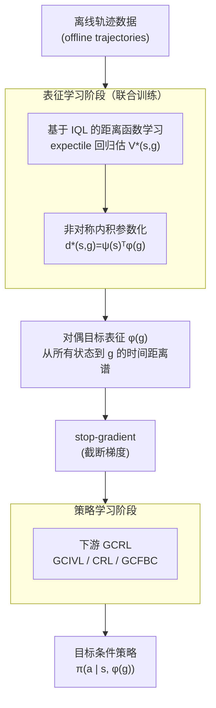

# Dual Goal Representations

**会议**: ICLR 2026  
**arXiv**: [2510.06714](https://arxiv.org/abs/2510.06714)  
**代码**: 无  
**领域**: 强化学习 / 目标条件RL  
**关键词**: goal-conditioned RL, dual goal representation, 时间距离, 非对称内积参数化, OGBench

## 一句话总结

提出"对偶目标表征"（dual goal representation），用"所有状态到目标状态的时间距离集合"来编码目标，理论证明该表征对最优策略恢复是充分的且天然过滤外生噪声，并设计基于非对称内积参数化的实用学习算法，在 OGBench 20 个任务上作为可插拔模块一致提升三种主流离线 GCRL 方法的性能。

## 研究背景与动机

**领域现状**：目标条件强化学习（GCRL）要求智能体学会从任意状态到达任意目标状态。现有方法通常直接将原始状态观测（如像素图像、全关节角状态向量）作为目标输入策略网络，或者用度量学习方法（TCN、VIP、HILP 等）学习一个状态嵌入空间，在嵌入空间中用 L2 范数度量状态间距离。

**现有痛点**：原始观测中包含大量与"如何到达目标"无关的信息——背景纹理、光照变化、无关物体的位置等外生噪声（exogenous noise）。现有度量学习方法虽然能学到状态嵌入，但 L2 范数参数化存在结构性限制：它天然是对称的（$\|f(s)-f(g)\| = \|f(g)-f(s)\|$），而真实时间距离往往是非对称的（例如"把方块扔下去"远比"把方块捡起来"快）；此外，L2 范数受三角不等式约束，表达力受限，无法任意逼近真实的时间距离函数。

**核心矛盾**：现有目标表征要么信息冗余（原始观测含噪声）、要么受限于参数化形式的表达力不足（L2 度量不构成万能逼近器）。缺乏一个既有理论保证、又具实用性的目标表征学习框架。

**本文目标** (1) 形式化定义什么是"好的目标表征"，并给出理论性质保证；(2) 设计一种表达力更强的参数化方式来实际学习该表征；(3) 让表征学习模块能插入任意现有 GCRL 算法。

**切入角度**：作者观察到，如果两个目标状态从环境中所有其他状态出发到达它们的时间距离分布完全相同，那么这两个目标在"可达性"意义上是等价的——不管原始观测如何不同。这就自然地引出一种"对偶"视角：不直接编码目标本身的特征，而是通过目标与所有状态的关系来间接刻画目标。

**核心 idea**：用"从所有状态到目标的时间距离集合"作为目标的表征——这种表征理论上对最优策略恢复充分、对外生噪声不变，实际中通过非对称内积参数化高效学习。

## 方法详解

### 整体框架

方法分为两个阶段并行训练。**阶段一（表征学习）**：使用离线轨迹数据，通过目标条件 IQL（Implicit Q-Learning）训练一个参数化的距离函数 $d^*(s,g) \approx \psi(s)^\top \phi(g)$，其中 $\psi$ 是状态编码器、$\phi$ 是目标编码器；这个非对称内积形式既是学习目标也是表征载体，训练后从中提取目标编码器输出 $\phi(g)$ 作为"对偶目标表征"。**阶段二（策略学习）**：把 $\phi(g)$ 当成目标的压缩表征（梯度截断），输入任意下游 GCRL 算法（如 GCIVL、CRL、GCFBC），以 $\pi(a|s, \phi(g))$ 的形式训练策略。两阶段共用同一批数据、联合梯度更新（不是先预训练再微调），state-based 任务共训练 1M 步。

### 关键设计

**1. 对偶目标表征：用"到目标的距离谱"代替目标本身的特征**

传统表征编码的是状态自身的特征——"这个位置有什么"，于是不可避免地把背景、纹理、无关物体一起编进去。对偶表征换了个视角：不问目标 $g$ 长什么样，而问"从环境中各个状态出发到达 $g$ 各要多远"。形式上，$g$ 的对偶表征定义为 $\phi^\vee(g) = [d^*(s_1,g), d^*(s_2,g), \dots, d^*(s_K,g)]^\top$，即从 $K$ 个参考状态到 $g$ 的最优时间距离拼成的向量；在有限状态 MDP 里它正好是距离矩阵的一列。这样定义的好处是天然只保留"怎么到达"这部分控制相关信息——两个观测看着完全不同的目标，只要从所有状态过去的时间距离谱一致，它们在可达性意义上就是等价的，外生噪声因此被自动滤掉。连续空间里没法真去枚举所有状态，于是用参数化 $\psi(s)^\top\phi(g)$ 把"所有状态到 $g$ 的距离"隐式编码进 $\phi(g)$：拿到 $\phi(g)$ 后，与任意 $\psi(s)$ 做一次内积就能恢复出对应的距离。

**2. 非对称内积参数化：唯一能当万能逼近器的那一种**

距离函数到底用什么形式去拟合，直接决定了表征的上限。本文把 $d^*(s,g)$ 建成 $\psi(s)^\top\phi(g)$——状态编码器 $\psi$ 和目标编码器 $\phi$ 各自独立、互不共享，分别把 $s$ 和 $g$ 映到 $N$ 维向量后做内积。为什么非这种形式不可？作者把候选摆成四种对照：(1) 对称 L2 $\|\phi(s)-\phi(g)\|$、(2) 非对称 L2 $\|\psi(s)-\phi(g)\|$、(3) 对称内积 $\phi(s)^\top\phi(g)$、(4) 非对称内积 $\psi(s)^\top\phi(g)$。真实时间距离往往是非对称的（"把方块扔下去"远比"把方块捡起来"快，即 $d^*(s,g)\neq d^*(g,s)$），这一下就排除了对称的 (1) 和 (3)；而 L2 范数还受三角不等式约束，表达力封顶。最终只有 (4) 是万能逼近器——这点 METRA 已经证过，给定足够大的 $N$ 就能任意精确逼近任意连续函数，前三种作者都给了形式化反例说明做不到。

**3. 基于 IQL 的距离函数学习：把"距离"等价成"最优值函数"来估**

有了参数化形式，还得能从离线轨迹里把 $\psi$ 和 $\phi$ 学出来。本文把时间距离 $d^*(s,g)$ 等价转写成最优值函数 $V^*(s,g)$（取负号），转而用 Implicit Q-Learning 来近似它。IQL 靠 expectile regression 从离线数据估计最优值函数，好处是全程不查询未见过的 $(s,a)$ 对，回避了离线 RL 的外推爆炸问题。网络上就是 $s$ 过 $\psi$、$g$ 过 $\phi$ 各自映到 $N$ 维，内积 $\psi(s)^\top\phi(g)$ 直接吐出距离估计。选 IQL 的理论理由也很硬：当 expectile $\tau\to 1$ 且数据覆盖充分时它能精确恢复 $V^*$，于是所学表征在极限情形下有正确性保证。

### 损失函数 / 训练策略

训练使用 IQL 的标准损失：结合 expectile regression 损失学习值函数 $V$、TD 损失学习 Q 函数、以及 advantage-weighted regression 学习策略。距离函数的参数化为 $\psi(s)^\top\phi(g)$ 的双线性形式。表征 $\phi(g)$ 在送入下游 GCRL 算法时梯度被截断（stop-gradient），即下游策略 $\pi(a|s,\phi(g))$ 不会反向传播梯度到 $\phi$。这是因为策略学习需要的信息比目标表征更丰富（例如 antmaze 中目标表征只需编码 x-y 位置，但策略需要知道全部关节角），让下游算法学习自己的值函数和策略更为有效——这也被 Table 5 消融实验所验证。

## 实验关键数据

### 主实验

实验在 OGBench 任务套件的 20 个任务上进行，包含 13 个 state-based 任务和 7 个 pixel-based 任务。Dual 表征与三种下游 GCRL 算法（GCIVL、CRL、GCFBC）结合，对比基线包括：原始表征（Original）、TCN、VIP、HILP 等度量学习方法。

| 方法 | 下游算法 | State-based (13 tasks) 平均 | Pixel-based (7 tasks) 平均 | 特点 |
|------|---------|---------------------------|--------------------------|------|
| Original（无表征） | GCIVL / CRL / GCFBC | 基准线 | 基准线（可用 early fusion） | 无表征瓶颈 |
| TCN | GCIVL / CRL / GCFBC | 中等 | 中等 | 对称 L2 |
| VIP | GCIVL / CRL / GCFBC | 中等 | 中等 | 对称 L2 |
| HILP | GCIVL / CRL / GCFBC | 较好 | 中等 | 对称 L2 |
| **Dual（本文）** | GCIVL / CRL / GCFBC | **最好或并列最好** | **多数任务最好** | 非对称内积，万能逼近 |

在 state-based 任务中，Dual 表征在多数任务上获得最佳或并列最佳性能。在 pixel-based 任务中，Dual 表征在大部分任务上也最优，但所有表征学习方法在 visual puzzle 类任务上都表现不佳——这是因为表征学习方法使用 late fusion（先分别编码 $s$ 和 $g$ 再组合），而 Original 基线可以用 early fusion（先 concat 再编码），puzzle 任务需要精确的像素级对齐信息。

### 消融实验：参数化形式对比

作者对比了四种参数化形式在 13 个 state-based 任务上的平均性能和距离函数精度（以单独训练的 monolithic 值函数 $V(s,g)$ 为"oracle"，计算均方误差）：

| 参数化形式 | 万能性 | 距离误差 (↓) | 平均性能 (↑) | 说明 |
|-----------|--------|-------------|-------------|------|
| (1) 对称 L2 $\|\phi(s)-\phi(g)\|$ | ✗ | 中等 | 中等 | 无法建模非对称距离，受三角不等式约束 |
| (2) 非对称 L2 $\|\psi(s)-\phi(g)\|$ | ✗ | 中等 | 中等 | 仍受范数结构约束 |
| (3) 对称内积 $\phi(s)^\top\phi(g)$ | ✗ | 最高 | 最低 | 强制对称 $d(s,g)=d(g,s)$，最差 |
| **(4) 非对称内积 $\psi(s)^\top\phi(g)$** | **✓** | **最低** | **最高** | 无结构约束，表达力最强 |

关键发现：距离误差排名 (3) > (1) ≈ (2) > (4) 与性能排名完全一致，证实了"更精确的距离估计 → 更好的目标表征 → 更好的策略性能"这一因果链条。

### 其他消融与分析

| 实验 | 结论 |
|------|------|
| 直接从 $\psi(s)^\top\phi(g)$ 提取策略 vs 训练独立 GCRL (Table 5) | 独立 GCRL 显著更优；距离函数足以学好表征，但不够精确到直接用于控制 |
| 表征维度 $N \in \{32, 64, 256\}$ | 内积形式：$N$ 增大→误差下降→性能提升；度量形式：$N$ 增大后误差趋于饱和，因受三角不等式限制 |
| 噪声鲁棒性 (Figure 4) | 在评估时向目标添加高斯噪声，Dual 表征相比 Original 的性能衰减明显更小 |
| 2× 训练步数消融 | Original 用 2M 步训练仍不如 Dual 用 1M 步，说明表征瓶颈的优势不是简单增加训练量能弥补的 |

### 关键发现

- **可插拔性强**：Dual 表征与 GCIVL、CRL、GCFBC 三种算法组合均有提升，说明方法的通用性
- **非对称性至关重要**：对称参数化（无论 L2 还是内积）在性能和精度上均显著不如非对称内积，这符合真实环境中时间距离的非对称性质（如 antmaze 中不同方向通行难度不同）
- **表征 ≠ 控制**：$\phi(g)$ 作为目标表征虽好，但从 $\psi(s)^\top\phi(g)$ 直接提取策略效果差——因为策略学习需要比目标表征更丰富的状态信息
- **维度缩放行为不同**：内积参数化能随 $N$ 增大持续受益，而度量参数化因结构约束存在"天花板效应"

## 亮点与洞察

- **"用关系定义实体"的对偶视角**极为优雅：不编码目标本身是什么，而是编码"从哪里来要多远"——这一思想类似于图论中用距离向量唯一确定节点。关键洞察是这种关系型表征天然只保留控制相关信息，而过滤掉与动力学无关的外生噪声
- **非对称内积的万能性 vs 度量的非万能性**是本文最具技术深度的贡献。作者不仅用 METRA 的理论结果支持了内积的万能性，还构造了反例形式化证明 L2 范数（包括非对称变体）不是万能逼近器，为参数化选择提供了严格的理论依据
- **"表征足以恢复策略，但不足以直接提取策略"**这一看似矛盾的结论其实很深刻：表征的充分性是信息论意义上的（信息包含），而策略提取还需要内积形式有足够的函数逼近精度来进行 argmax 操作，两者要求不同

## 局限与展望

- **理论与实践存在 gap**：不变性和充分性定理（Theorem 3.1, 3.2）是针对理想的无穷维对偶表征证明的，实际使用有限维 $\phi(g)$ 时理论保证并不严格成立。正当性主要靠实验验证，缺乏有限样本/有限维的理论分析
- **噪声鲁棒性验证不够强**：理论基于 Ex-BCMP 模型（要求内生/外生状态的观测支持不相交），但实验仅用简单的高斯噪声验证。更有说服力的测试应使用结构化干扰（如背景中移动的无关物体、变化的纹理），而非加性噪声
- **Pixel 任务的 early/late fusion 问题**：所有表征方法使用 late fusion，而 Original 基线可用 early fusion——这使得 pixel 任务的比较不完全公平。作者承认可通过 state-aware 表征或信息瓶颈来缓解，但留待未来工作
- **仅验证离线设定**：整个框架依赖离线收集的轨迹数据，在线学习场景中表征和策略是否仍能有效联合训练尚不清楚
- **无真实机器人实验**：OGBench 虽然多样（20 个任务），但仍然是仿真环境

## 相关工作与启发

- **vs TCN/VIP/HILP**：这些方法同样学习状态/目标嵌入用于 GCRL，但使用对称 L2 范数参数化，表达力受限。Dual 表征的核心区别在于 (1) 只学目标编码器 $\phi(g)$ 而非同时学状态表征、(2) 使用万能逼近器形式的内积参数化、(3) 有不变性和充分性的理论保证
- **vs Quasimetric RL（QRL）**：QRL 也学习非对称距离，但使用满足三角不等式的拟度量参数化。Dual 表征放弃了三角不等式约束换取了万能逼近性，实验表明这一 trade-off 是值得的
- **vs Contrastive RL (CRL)**：CRL 用对比学习目标训练值函数，可以用其内部的目标编码器作为表征。Dual 表征可以叠加在 CRL 之上作进一步改进

## 评分

- 新颖性: ⭐⭐⭐⭐ 对偶视角和万能逼近器论证的组合很新颖，但实现层面与已有度量学习方法的区别主要在参数化形式
- 实验充分度: ⭐⭐⭐⭐ 20 个任务、3 种下游算法、详细消融，但噪声测试过于简单、缺真机实验
- 写作质量: ⭐⭐⭐⭐ 理论与实践的衔接清晰，但多位审稿人反映 Section 4 的实现细节初版不够清楚
- 价值: ⭐⭐⭐⭐ 可插拔模块对 GCRL 社区有直接实用价值，理论分析也为未来研究提供了指导框架

<!-- RELATED:START -->

## 相关论文

- [\[ICLR 2026\] Dual-Robust Cross-Domain Offline Reinforcement Learning Against Dynamics Shifts](dual-robust_cross-domain_offline_reinforcement_learning_against_dynamics_shifts.md)
- [\[ICML 2026\] Laplacian Representations for Decision-Time Planning](../../ICML2026/reinforcement_learning/laplacian_representations_for_decision-time_planning.md)
- [\[ICML 2026\] Quantifying and Optimizing Simplicity via Polynomial Representations](../../ICML2026/reinforcement_learning/quantifying_and_optimizing_simplicity_via_polynomial_representations.md)
- [\[ICLR 2026\] DVLA-RL: Dual-Level Vision-Language Alignment with Reinforcement Learning Gating for Few-Shot Learning](dvla-rl_dual-level_vision-language_alignment_with_reinforcement_learning_gating_.md)
- [\[AAAI 2026\] First-Order Representation Languages for Goal-Conditioned RL](../../AAAI2026/reinforcement_learning/first-order_representation_languages_for_goal-conditioned_rl.md)

<!-- RELATED:END -->
