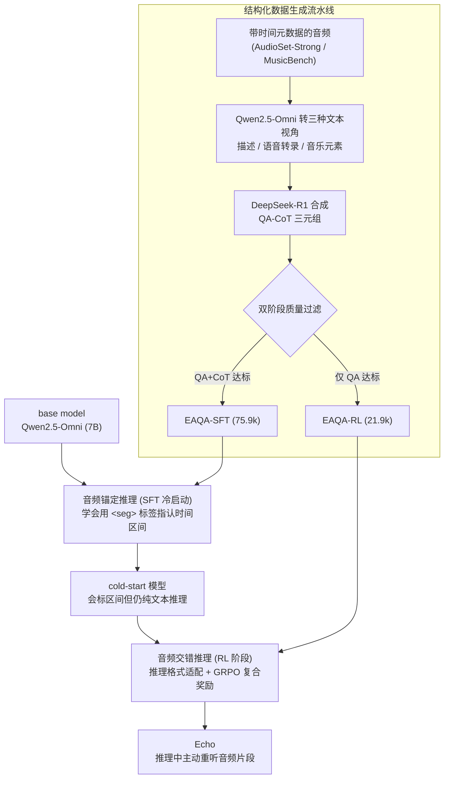

# Echo: Towards Advanced Audio Comprehension via Audio-Interleaved Reasoning

**会议**: ICLR 2026  
**arXiv**: [2602.11909](https://arxiv.org/abs/2602.11909)  
**代码**: [GitHub](https://github.com/wdqqdw/Echo)  
**领域**: 强化学习  
**关键词**: 音频理解, 大型音频语言模型, 音频交错推理, 强化学习, 思维链

## 一句话总结

提出音频交错推理（audio-interleaved reasoning）新范式，将音频视为推理过程中的主动组件而非静态上下文，使 LALM 在推理时动态定位并重新聆听音频片段。通过 SFT+RL 两阶段训练框架和结构化数据生成流水线，构建 Echo 模型，在专家级和通用音频理解基准上超越 GPT-4o 和 Gemini-2.0-Flash。

## 研究背景与动机

大型音频语言模型（LALM）在基础音频任务（语音识别、声音分类、音乐分析）上表现出色，但面对需要精细解读和推理的复杂音频仍有明显差距。

现有推理方式——**音频条件文本推理**（audio-conditioned text reasoning）——存在根本性的信息瓶颈：

1. 音频通过一次性编码转化为上下文嵌入，之后推理完全在文本模态中展开
2. 音频是连续信号，承载比文本更丰富和细粒度的信息，一次编码难以保留所有细微细节
3. 实验证据：在推理过程中，LALM 对音频 token 的注意力在前 25 步后迅速降至 <5%

**人类认知启发**：人类听觉涉及循环重听关键声学片段，由听觉工作记忆和自上而下注意控制驱动。本文模拟这一机制，让 LALM 在推理中主动重听音频。

核心对比：从"思考关于音频"到"**用音频思考**"——类似视觉推理领域从"thinking about images"到"thinking with images"的范式转变。

## 方法详解

### 整体框架

Echo 想解决的核心矛盾是：现有 LALM 把音频一次性编码成上下文嵌入后，推理就完全在文本里进行，注意力很快不再回看音频，丰富的声学细节被白白丢掉。Echo 的思路是让音频成为推理过程中的"主动组件"——模型在思考时能动态定位并**重新聆听**关键片段。

整条 pipeline 从 Qwen2.5-Omni (7B) 这个 base model 出发，分两阶段改造。第一阶段（SFT 冷启动）用音频锚定的 CoT 数据微调，教模型在推理文本里用 `<seg>start, end</seg>` 标签指认要回看的时间区间，得到一个会"标区间"但推理仍困在文本里的冷启动模型。第二阶段先做**推理格式适配**——每当解码出一对 `<seg>` 标签就暂停，把对应音频片段裁剪成 token 插回序列，让推理真正变成文本与音频交替的多模态过程——再用强化学习激励模型学会有意义地反复回听。两阶段所需的高质量训练数据全部由一条"音频→多视角文本→LLM 合成 QA-CoT"的自动流水线产出，分流成 SFT 集与 RL 集。

### 关键设计

**1. 音频锚定推理（SFT 冷启动）：让模型先学会在文本里指认音频片段**

基于 Qwen2.5-Omni (7B) 初始化的模型天然倾向纯文本推理，不会主动回看音频，因此第一步只解决"指认"问题。每个 SFT 样本由多模态输入 $(A, q)$（音频加问题）和标准答案 $(c, a)$（CoT 加最终答案）组成，关键在于 CoT 中密集嵌入 `<seg>start, end</seg>` 标签对来引用音频片段——每个引用前给出调用理由、后接基于该片段的细粒度分析，从而把"何时该回看、回看哪段、看出什么"显式写进监督信号。训练用标准交叉熵 $\mathcal{L}_\text{SFT}(\theta) = -\frac{1}{n}\sum_{t=1}^n \log \pi_\theta(y_{i,t}^*|x_i, y_{i,<t}^*)$，产出一个能准确标注时间区间、但推理仍停留在文本模态的冷启动模型（论文称这种中间形态为音频锚定推理 audio-grounded reasoning）。

**2. 音频交错推理（RL 阶段）：把时间标签真正变成回听动作**

冷启动模型只会"说"要看哪段，却没真的重新听，信息瓶颈依旧。推理格式适配解决这一断层：每当模型生成一对 `<seg>` 标签就暂停解码，从原始音频中裁剪对应片段 $A_{s:e}$，把它的 token 拼到当前文本输出之后形成增强输入 $x_i' = (x_i \oplus o \oplus A_{s:e})$ 再喂回模型继续生成，如此循环直到 `<eos>`——推理因此从单模态文本变成文本与音频交替的多模态过程，且损失计算时忽略所有插入的音频 token。但仅靠格式适配，冷启动模型还不擅长处理交错的音频-文本序列，于是用复合奖励 $\mathcal{R}(\tau) = \mathcal{R}_\text{format} + \mathcal{R}_\text{consist} + \mathcal{R}_\text{acc} + \mathcal{R}_\text{seg}$ 引导行为：格式奖励 $\mathcal{R}_\text{format}=0.5$ 要求正确使用封装标签，一致性惩罚 $\mathcal{R}_\text{consist}$ 对 `</seg>` 后语义断裂（下一个 token 是大写字母或 `<`）每次扣 0.1、最多累计 -0.5，准确性奖励 $\mathcal{R}_\text{acc}=0.5$ 给答对，片段奖励 $\mathcal{R}_\text{seg}=0.5$ 仅在答对**且**至少引用一个片段时发放、否则为 0——后两者联手保证模型不是靠猜对而是靠真回听拿分。优化用 GRPO，每个 query 采样 $G=8$ 个候选、用组内归一化奖励 $A_g = (\mathcal{R}(\tau_g) - \text{mean}(\mathcal{R}))/\text{std}(\mathcal{R})$ 算优势，配 PPO 风格裁剪与 KL 约束：

$$\mathcal{L}_\text{RL}(\theta) = -\frac{1}{G}\sum_{g=1}^G \frac{1}{|\tau_g|}\sum_{t=1}^{|\tau_g|} [\min(\rho_{g,t} A_g, \text{clip}(\rho_{g,t}, 1\pm\epsilon) A_g) - \beta D_\text{KL}(\pi_\theta||\pi_\text{ref})]$$

**3. 结构化数据生成流水线：用时间元数据自动批量造带 `<seg>` 标注的 CoT**

音频交错推理依赖大量"引用前有理由、引用后有分析"的高质量 CoT，而现有 Audio-QA 数据集普遍难度不足、又缺含细粒度音频引用的标准 CoT，人工标注更不现实，于是从 AudioSet-Strong、MusicBench 等自带时间元数据的数据集出发自动合成：先用 Qwen2.5-Omni 把每段音频转成全面描述、语音转录、音乐元素三种文本视角（连同时间元数据构成对原音频的文本化模拟），再把这些文本喂给 DeepSeek-R1 合成需要细粒度时间分析的 QA-CoT 三元组，最后做双阶段质量过滤——QA 与 CoT 都达标的进 SFT 集、只有 QA 达标的进 RL 集，最终得到 EAQA-SFT（75.9k 含 CoT）和 EAQA-RL（21.9k 不含 CoT）两套数据，分别喂给上述两个阶段。

## 实验关键数据

### 主实验：MMAR 专家级音频推理

| 模型 | 大小 | Sound | Music | Speech | 混合模态均值 | 总均值 |
|------|------|-------|-------|--------|-----------|--------|
| Qwen2.5-Omni | 7B | 58.79 | 40.78 | 59.86 | ~58 | 57.33 |
| GPT-4o-Audio | - | 53.94 | 50.97 | 70.41 | ~65 | 64.09 |
| Gemini-2.0-Flash | - | 61.21 | 50.97 | 72.11 | ~70 | 67.90 |
| Audio-Thinker | 7B | 68.48 | 53.88 | 64.29 | ~70 | 67.25 |
| **Echo** | **7B** | 67.27 | **60.68** | **69.39** | ~71 | **69.99** |

Echo 以 7B 开源模型超越 GPT-4o-Audio (+5.9%) 和 Gemini-2.0-Flash (+2.1%)。

### 主实验：MMAU 通用音频理解

| 模型 | MMAU-mini Avg | MMAU Avg |
|------|-------------|----------|
| Qwen2.5-Omni (7B) | 71.53 | 71.00 |
| Audio-Thinker (7B) | 78.00 | 75.39 |
| Gemini-2.5-Pro | 71.60 | 69.36 |
| **Echo (7B)** | **80.41** | **76.61** |

在 MMAU-mini 上超过 Audio-Thinker +2.41%，MMAU 上 +1.22%。

### 训练框架消融（MMAR 均值准确率）

| 模型 | SFT数据 | RL数据 | 推理格式 | 准确率 |
|------|--------|-------|---------|-------|
| Base Model | - | - | 文本条件 | 51.80% |
| Cold-Start | EAQA-SFT | - | 音频锚定 | 56.77% |
| Cold-Start | EAQA-SFT | - | 音频交错 | 52.26% |
| Echo | EAQA-SFT | EAQA-RL | 音频交错 | **69.99%** |
| Direct RL | - | EAQA-RL | 文本条件 | 63.15% |

### 关键发现

- **推理格式对比**：沿 E→B'→D 轨迹，音频参与程度越高性能越好，且输出长度和延迟保持可比
- **训练动态**：RL 过程中模型稳定在每次引用 ~1.9 个片段、平均时长 3.0s、片段重叠度仅 ~0.1
- **片段覆盖**：99.4% 的响应至少重听一个片段，78.0% 重听两个以上，片段均匀分布在音频时间线上
- **技能提升**：多说话者角色映射 +37.0%，基于事件的声音推理 +20.8%，情感状态总结 +20.5%
- **泛化性**：尽管 SFT 数据仅覆盖前 10 秒，Echo 能在更长音频中准确定位信息片段

## 亮点与洞察

1. **范式创新**："用音频思考"而非"思考关于音频"，将音频从静态上下文提升为主动推理组件
2. 注意力分析提供了直观证据：音频交错推理使音频 token 注意力从 <5% 提升到 10-14%（Δ+140%）
3. 推理格式适配的工程设计简洁有效——仅需在 `<seg>` 标签处暂停插入音频 token
4. 一致性奖励 $\mathcal{R}_\text{consist}$ 和片段奖励 $\mathcal{R}_\text{seg}$ 的设计巧妙，有效引导模型学会有意义的重听行为

## 局限与展望

1. 当前重听实现较简单，可探索慢放、频段隔离等更高级的音频操作
2. EAQA-SFT 的 CoT 标注自动生成自固定时间元数据，缺乏人工启发式
3. 受限于 DeepSeek-R1 的 "反刍" 倾向，数据可能存在推理路径多样性不足问题
4. 计算开销：每次重听需重新处理音频 token，推理延迟约 2.12s（vs基线 1.18s）

## 相关工作与启发

- 类比视觉推理领域的演进：从 Multimodal CoT 到 visual grounding reasoning 到直接插入图像 patch
- 与 Audio-Reasoner (SFT 路线) 和 Omni-R1 (RL 路线) 互补，Echo 证明了两阶段 SFT+RL 的优越性
- 数据生成流水线的 "音频→多视角文本→LLM 合成 QA-CoT" 可推广到视频等其他模态
- GRPO + 多组件奖励的设计模式在多模态 RL 中有广泛适用性

## 评分

- 新颖性: ⭐⭐⭐⭐⭐ (音频交错推理是全新范式)
- 实验充分度: ⭐⭐⭐⭐⭐ (3 个基准，详细消融，训练动态分析)
- 写作质量: ⭐⭐⭐⭐⭐ (结构清晰，图表精美，分析深入)
- 价值: ⭐⭐⭐⭐⭐ (为音频理解开辟新方向，实验证据充分)

<!-- RELATED:START -->

## 相关论文

- [\[ICLR 2026\] LoongRL: Reinforcement Learning for Advanced Reasoning over Long Contexts](loongrl_rl_for_reasoning_long_contexts.md)
- [\[ICLR 2026\] LadderSym: A Multimodal Interleaved Transformer for Music Practice Error Detection](laddersym_a_multimodal_interleaved_transformer_for_music_practice_error_detectio.md)
- [\[NeurIPS 2025\] Incentivizing Reasoning for Advanced Instruction-Following of Large Language Models](../../NeurIPS2025/reinforcement_learning/incentivizing_reasoning_for_advanced_instruction-following_of_large_language_mod.md)
- [\[ICLR 2026\] Reasoning Boosts Opinion Alignment in LLMs](reasoning_boosts_opinion_alignment_in_llms.md)
- [\[ICLR 2026\] RM-R1: Reward Modeling as Reasoning](rm-r1_reward_modeling_as_reasoning.md)

<!-- RELATED:END -->
