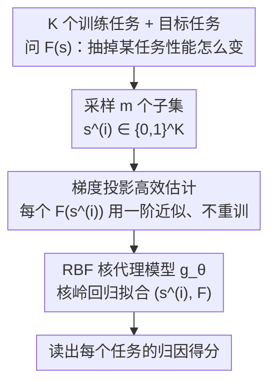

# Efficient Estimation of Kernel Surrogate Models for Task Attribution

**会议**: ICLR 2026  
**arXiv**: [2602.03783](https://arxiv.org/abs/2602.03783)  
**代码**: [https://github.com/VirtuosoResearch/Kernel-surrogate-models](https://github.com/VirtuosoResearch/Kernel-surrogate-models)  
**领域**: 强化学习  
**关键词**: task attribution, kernel surrogate model, influence function, data attribution, kernel ridge regression

## 一句话总结
提出核代理模型（KernelSM）用于任务归因，通过 RBF 核岭回归捕获任务间的非线性交互效应，结合梯度投影的高效估计算法避免重复训练，在数学推理、上下文学习和多目标 RL 等场景下相比线性代理和影响函数基线提升 25% 相关性。

## 研究背景与动机

**领域现状**：现代 AI 系统（如 LLM）在多样化任务上同时训练。量化每个训练任务对目标任务的影响（task attribution）是可解释性的核心问题。现有方法包括：留一法（LOO）重训练（精确但计算不可行）、影响函数（需要 Hessian 计算）、线性代理模型（通过随机子集采样拟合线性函数）。

**现有痛点**：线性代理模型只能捕获一阶加性效应,无法表达任务间的非线性交互——如协同效应（两个任务一起训练效果 > 各自效果之和）、对抗效应、XOR 型效应。这些交互在决策边界附近训练样本中特别显著。

**核心矛盾**：更强的代理模型（如核方法）需要在更多子集上评估模型性能 $F(\mathbf{s})$，每个子集都需要完整训练一次——计算开销不亚于 LOO。

**本文目标**：(1) 统一分析线性代理与影响函数的关系；(2) 设计能捕获非线性交互的代理模型；(3) 高效估计，避免重复训练。

**切入角度**：先通过二阶 Taylor 展开证明线性代理 ≈ 影响函数（当二阶交互小时），暴露线性代理的局限性。然后用 RBF 核升级代理模型，利用一阶梯度近似避免重复训练。

**核心 idea**：用梯度投影的一阶近似高效构造核代理模型，以 < 2% 的相对误差捕获任务间非线性交互。

## 方法详解

### 整体框架
任务归因要回答的问题是：把 K 个训练任务里的某一个抽掉，目标任务的性能会怎么变？最干净的做法是对每个子集都重训一遍模型再读性能 $F(\mathbf{s})$（$\mathbf{s} \in \{0,1\}^K$ 是「哪些任务参与训练」的二元指示向量），但这等价于 LOO，计算上不可行。本文的思路是用一个代理模型 $g_\theta$ 去拟合 $F$：先采样 m 个子集向量 $\mathbf{s}^{(i)}$，对每个子集**不重训而是用梯度近似**快速估出 $F(\mathbf{s}^{(i)})$，再把这些 $(\mathbf{s}^{(i)}, F(\mathbf{s}^{(i)}))$ 对喂给一个 RBF 核岭回归 $g_\theta: \{0,1\}^K \to \mathbb{R}$，最后从拟合出的核模型里读出每个任务的归因得分。关键是把代理模型从线性升级成核模型，从而能装下任务间的非线性交互，同时靠一阶梯度近似把核方法本该爆炸的训练成本压回到和线性代理同一量级。

（理论上的「统一分析」是上图为何选核模型 D 而非线性模型的依据——它诊断出线性代理与影响函数同属一阶、装不下交互，故不单列为数据流节点。）

### 关键设计

**1. 线性代理与影响函数的统一分析：先把旧方法的天花板讲清楚**

要论证「为什么需要核」，得先说明线性代理到底差在哪。本文对子集性能 $F(\mathbf{s})$ 在某个工作点 $\mathbf{s}^*$ 做二阶 Taylor 展开，再代入线性回归的拟合目标，用 delta method 分析回归系数的极限。Proposition 3.1 给出回归系数 $\hat{\beta}$ 与一阶梯度加二阶修正项之间的偏差界 $\|\hat{\beta} - \nabla_\mathbf{s} F(\mathbf{s}^*) - \text{二阶修正项}\| \lesssim c_3 K^{3/2} p^{-1}$。这条结果一举把两个旧方法绑在了一起：当二阶交互（Hessian $\mathbf{H}_\mathbf{s}$ 的范数）很小时，线性代理系数恰好收敛到一阶梯度，而一阶梯度正是影响函数所刻画的量——也就是说**线性代理 ≈ 影响函数**。反过来，一旦 $\mathbf{H}_\mathbf{s}$ 的范数不可忽略，两者就**同时失准**，因为它们本质上都只到一阶。这暴露的不是某个方法的实现缺陷，而是「一阶建模」这一整类方法的共同天花板。

**2. RBF 核代理模型（KernelSM）：用核把非线性交互装进代理**

既然瓶颈在一阶，自然的升级就是换一个能表达高阶项的代理。KernelSM 把线性回归换成核岭回归：

$$g_\theta(\mathbf{s}) = \sum_i \theta_i\, k(\mathbf{s}^{(i)}, \mathbf{s}), \qquad k(\mathbf{s}^{(a)}, \mathbf{s}^{(b)}) = \exp(-\gamma \|\mathbf{s}^{(a)} - \mathbf{s}^{(b)}\|^2)$$

系数有闭式解 $\theta = (\mathcal{K} + \lambda I)^{-1} \mathbf{F}$（$\mathcal{K}$ 是核矩阵，$\mathbf{F}$ 是各子集性能向量）。选 RBF 核有两层考虑：一是它在二元空间 $\{0,1\}^K$ 上具备万能逼近性，足以表达协同、对抗、XOR 这类线性模型根本写不出来的交互；二是几何直觉天然契合子集空间——两个子集的欧氏距离平方在 $\{0,1\}^K$ 上正好等于 Hamming 距离，于是 RBF 核退化成基于 Hamming 距离的热核，含义是「只差少数几个任务的子集应当有相近的性能」，这正是任务归因里合理的归纳偏置。

**3. 梯度投影高效估计：让核方法的成本回到线性量级（核心贡献）**

核代理本身不难，难的是怎么拿到那 m 个 $F(\mathbf{s}^{(i)})$——如果每个子集都老老实实重训一次，开销又退回 LOO。本文的破局点是**根本不重训**，而是在预训练权重 $W_0$ 处对模型做一阶展开 $f_W(x) \approx f_{W_0}(x) + \langle \nabla f_{W_0}(x), W - W_0 \rangle$。对每个子集 $\mathbf{s}^{(i)}$，把投影后的梯度当作特征，解一个多项 logistic 回归求出该子集对应的最优权重扰动 $Z^*_{\mathbf{s}^{(i)}}$，再代回展开式得到性能估计 $\hat{f}(x) = f_{W_0}(x) + \langle \nabla f_{W_0}(x), Z^*_{\mathbf{s}^{(i)}} \rangle$。这样梯度 $\nabla f_{W_0}$ 只在 $W_0$ 处算一次，之后所有子集的估计都退化成 CPU 上的线性代数。为了让回归本身也不慢，还用高斯随机卷积把高维梯度投影到低维空间，整个求解只需几秒。经验上这套一阶近似的相对误差 < 2%，意味着省掉重训几乎不损失精度——这是 KernelSM 能在和线性代理同一成本下跑起来的根本原因。

### 损失函数 / 训练策略
核岭回归目标：$\min_{g_\theta} \sum_{i=1}^m (F(\mathbf{s}^{(i)}) - g_\theta(\mathbf{s}^{(i)}))^2 + \lambda \|g_\theta\|^2_\mathcal{K}$

正则项 $\lambda \|g_\theta\|^2_\mathcal{K}$ 控制核模型复杂度，超参 $\lambda$（正则强度）与 $\gamma$（RBF 带宽）通过交叉验证选择。

## 实验关键数据

### 主实验

| 方法 | CIFAR-10 相关↑ | 模算术 相关↑ | ICL 相关↑ | 多目标RL 相关↑ |
|------|--------------|-----------|---------|------------|
| Influence Function | ~0.74 | ~0.55 | ~0.72 | ~0.65 |
| Linear Surrogate | ~0.76 | ~0.58 | ~0.75 | ~0.68 |
| **KernelSM** | ~0.82 | ~0.80 | ~0.88 | ~0.73 |

KernelSM 比线性基线和影响函数提升 25% 相关性（与 LOO 真值对比）。模算术任务上提升最大（42%），因为 XOR/除法等运算有强非线性交互。

### 消融实验

| 核函数 | CIFAR-10 残差↓ | 模算术 残差↓ |
|--------|-------------|-----------|
| Linear | 4.4±0.9 | 4.6±1.3 |
| **RBF** | **1.0±0.0** | **1.5±0.4** |

| 任务 | 一阶近似相对误差 |
|------|--------------|
| CIFAR-10 | 1.02±0.69% |
| 模算术 | 2.40±2.17% |
| ICL | 0.51±0.04% |
| 多目标RL | 0.43±0.73% |

### 关键发现
- **非线性交互普遍存在**：RBF 核的残差误差是线性模型的 1/4~1/3，说明任务间非线性交互不可忽略
- **一阶梯度近似足够准确**：在各种任务和模型规模（含 34B 参数 LLM）上，相对误差 < 2%
- **下游任务选择获益**：用 KernelSM 做 ICL 示例选择和多目标优化的任务选择，比线性方法 loss 降低 40%
- 线性代理和影响函数在一阶近似下确实等价（Pearson相关 0.96-0.98）

## 亮点与洞察
- **统一理论**：首次通过二阶 Taylor 展开严格证明了线性代理模型与影响函数的等价条件，并揭示了两者共同的局限——都无法捕获任务交互
- **梯度投影的高效估计**：精妙地绕过了核方法的计算瓶颈——一阶Taylor近似 + 随机投影降维，使得核代理模型的实际计算开销与线性模型可比
- **RBF 核的几何直觉**：在二元子集空间 $\{0,1\}^K$ 上，RBF 核等价于基于 Hamming 距离的热核——这意味着相似的训练子集（差异少数任务）应有相似的性能，这是合理的归纳偏置

## 局限与展望
- 一阶近似在预训练权重 $W_0$ 附近有效，但如果微调幅度大（如全量微调大模型），近似误差可能显著增大
- 核代理模型的表达能力受限于样本数 m 的大小——对于任务数 K 很大的场景，需要足够多的子集采样
- 未探索深度核或神经切线核等更强的核函数
- 仅在任务级归因验证，未扩展到样本级数据归因（虽然理论框架通用）
- 目前的评估指标主要是与 LOO 真值的相关性，未验证核归因在实际模型调试/数据清洗中的实用价值

## 相关工作与启发
- **vs DataModels (Ilyas et al. 2022)**: DataModels 用线性回归做数据归因，KernelSM 是其核方法推广
- **vs Influence Functions (Koh & Liang 2017)**: 本文证明影响函数 ≈ 线性代理的一阶近似，KernelSM 才能捕获二阶效应
- **vs TRAK (Park et al. 2023)**: TRAK 也使用梯度特征做数据归因，但仍是线性模型；KernelSM 用 RBF 核捕获非线性

## 评分
- 新颖性: ⭐⭐⭐⭐ 核方法用于任务归因的思路自然且有理论支撑，高效估计算法是关键贡献
- 实验充分度: ⭐⭐⭐⭐⭐ 涵盖分类、数学推理、ICL、RL 等多种场景，消融全面
- 写作质量: ⭐⭐⭐⭐ 理论和实验组织得当，但部分证明细节过于压缩
- 价值: ⭐⭐⭐⭐ 为任务归因提供了更强的工具，下游应用（任务选择）效果显著

<!-- RELATED:START -->

## 相关论文

- [\[ICLR 2026\] Pruning as a Cooperative Game: Surrogate-Assisted Layer Contribution Estimation for Large Language Models](remix_reinforcement_routing_for_mixtures_of_loras_in_llm_finetuning.md)
- [\[ICLR 2026\] One Model for All Tasks: Leveraging Efficient World Models in Multi-Task Planning](one_model_for_all_tasks_leveraging_efficient_world_models_in_multi-task_planning.md)
- [\[ICLR 2026\] Optimistic Task Inference for Behavior Foundation Models](optimistic_task_inference_behavior_models.md)
- [\[ICLR 2026\] WIMLE: Uncertainty-Aware World Models with IMLE for Sample-Efficient Continuous Control](wimle_uncertainty-aware_world_models_with_imle_for_sample-efficient_continuous_c.md)
- [\[ICML 2026\] d2: Improving Reasoning in Diffusion Language Models via Trajectory Likelihood Estimation](../../ICML2026/reinforcement_learning/d2_improving_reasoning_in_diffusion_language_models_via_trajectory_likelihood_es.md)

<!-- RELATED:END -->
