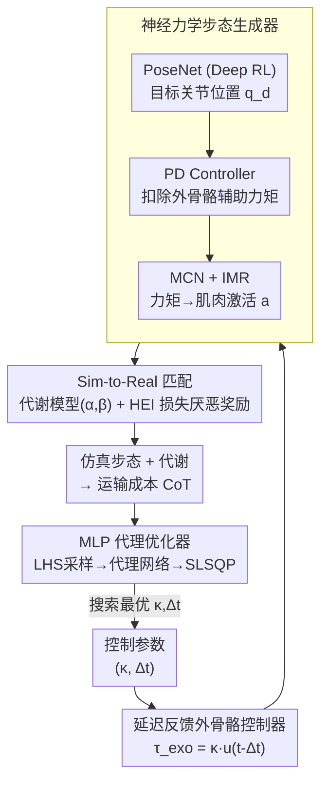

# Exo-Plore: Exploring Exoskeleton Control Space through Human-Aligned Simulation

**会议**: ICLR2026  
**arXiv**: [2601.22550](https://arxiv.org/abs/2601.22550)  
**代码**: [项目页](https://daebangstn.github.io/exo-plore/)  
**领域**: 强化学习  
**关键词**: exoskeleton optimization, neuromechanical simulation, deep reinforcement learning, human-in-the-loop, surrogate optimization  

## 一句话总结

提出 Exo-plore 框架，通过神经力学仿真与深度强化学习相结合，无需真人实验即可优化髋关节外骨骼控制参数，并能推广到病理步态场景。

## 背景与动机

外骨骼在增强人体移动能力方面展现出巨大潜力，但为用户提供恰当的辅助仍然是一个难题。当前最先进的方法——Human-in-the-Loop Optimization (HILO)——需要参与者穿戴外骨骼行走数小时来迭代优化控制参数。这形成了一个悖论：最需要外骨骼辅助的人群（如行动障碍患者）恰恰最难承受这种高强度的优化实验。

此外，人体会主动适应外骨骼施加的外力，改变步态模式和肌肉协调方式，导致基于"固定步态"假设的预测往往失准。现有的神经力学仿真方法要么依赖动作捕捉数据的跟踪来处理大规模观测/动作空间，要么依赖手工设计的生物启发式控制器，泛化能力有限。缺乏一个统一框架来同时实现：(i) 拟合已观测到的人体适应行为，和 (ii) 预测未观测辅助条件下的响应。

## 核心问题

如何在不进行真人实验的前提下，通过仿真精确模拟人体对外骨骼辅助力的适应性响应，从而高效优化外骨骼控制参数？特别是如何将这种能力推广到病理步态场景，为行动障碍人群提供个性化辅助方案？

## 方法详解

### 整体框架

Exo-plore 把"优化外骨骼"这件需要真人反复试穿的事搬进了仿真器。整条流水线分两段：前段是一个**神经力学步态生成器**，用 Deep RL 驱动的"虚拟人"在给定的外骨骼辅助力下真实地走起来，输出步态与代谢响应；后段是一个**外骨骼优化器**，在生成器吐出的仿真数据上搜索使代谢运输成本（Cost of Transport, CoT）最低的控制参数。整套方法成立的前提是仿真里的虚拟人既能复现已观测到的人体适应行为、又能外推到没测过的辅助条件——为此它一头靠延迟反馈控制把待优化的辅助策略压成两个旋钮，一头靠代谢模型调参和损失厌恶奖励把仿真行为拉回真人数据，这样优化才不需要把患者拉来走几个小时。

### 关键设计

**1. 延迟反馈外骨骼控制器：把待优化的辅助策略压成两个可搜索参数**

优化的第一关是辅助策略本身维度太高，没法直接在仿真里搜。本文用延迟反馈控制把它压缩：髋关节辅助力矩取 $\tau_{\text{exo}}(t) = \kappa \cdot u(t - \Delta t)$，其中控制信号 $u(t) = \sin(\theta_r) - \sin(\theta_l)$ 来自左右髋关节角度差，$\kappa$ 是增益（等效刚度），$\Delta t$ 是时间延迟。这样整个辅助策略只剩 $(\kappa, \Delta t)$ 两个旋钮，优化问题退化成在二维参数空间里找让 CoT 最小的点——既贴合真实外骨骼硬件的工作方式，又把后段优化器的搜索空间收得足够小。

**2. 神经力学步态生成器：让虚拟人主动适应外力而非死板跟踪动捕**

有了辅助力矩，还得让虚拟人"穿着外骨骼"自然地走，且能在没测过的辅助力下自发改变步态——这是固定步态假设做不到的。人体控制器由三块串联：PoseNet 用 Deep RL 学出 PD 目标关节位置 $\mathbf{q}_d$，PD Controller 据此生成关节力矩并扣除外骨骼施加的辅助力，Muscle Coordination Network（MCN）再通过监督学习把目标力矩映射成肌肉激活值 $\mathbf{a}$。训练用总奖励 $r_{\text{total}} = w_{\text{gait}} r_{\text{gait}} + w_{\text{arm}} r_{\text{arm}} + w_{\text{energy}} r_{\text{energy}} + w_{\text{HEI}} r_{\text{HEI}}$，分别鼓励跟随目标步态、抑制不自然手臂摆动、正则化能耗、以及建模人-外骨骼交互；MCN 的损失里还加了**肌肉内部正则化器（IMR）**，让同一解剖肌肉群内的线肌肉保持协调一致的激活模式。因为人体被建模成"为省力而主动调整动作"的优化器而非跟踪固定轨迹，它在新的辅助力下就会自发改变步态。

**3. Sim-to-Real 匹配：靠代谢模型调参和损失厌恶奖励把仿真拉回真人数据**

虚拟人会走还不够，它走得像不像真人才决定优化结果可不可信，这需要两处对齐。其一是代谢能量模型，把消耗建模为 $\frac{d}{dt}\text{MEE} = \sum_i m_i^\alpha a_i^\beta$，用 Algorithm 1、2 搜索指数 $(\alpha, \beta)$，使仿真的 Preferred Walking Speed（PWS）匹配真人数据，最终定为 $(\alpha, \beta) = (1.5, 1.0)$。其二是人-外骨骼交互（HEI）奖励，基于**阻力最小化假设**设计，借用行为经济学里"人对损失比收益更敏感"的损失厌恶（Loss Aversion）思路：

$$r_{\text{HEI}} = 1 + \frac{1}{\kappa} \sum_{k \in \{L,R\}} \min(0, P_k)$$

一旦外骨骼对人体做负功（阻力功率 $P_k < 0$），奖励就跌破 1，逼策略主动调整运动学去躲开阻力——这恰好再现了真人实验中观察到的适应行为，而只奖励正向助力是复现不出来的。

**4. MLP 代理优化器：用数据充裕的仿真喂一个比高斯过程更能扩展的代理网络**

到了后段优化，数据来源从"昂贵的真人试穿"变成"廉价的仿真采样"，瓶颈也随之改变，所以本文弃用高斯过程、改训一个 MLP 代理网络（Surrogate Network）拟合控制参数到 CoT 的映射，正好发挥神经网络在大样本下的数据吞吐优势。参数空间用 Latin Hypercube Sampling（LHS）采样以避开网格采样的混叠效应；代理损失同时含抗离群值的 Huber Loss、平滑 CoT 景观的梯度惩罚、以及 L1/L2 正则；最后用 SLSQP 加 trust-region 梯度优化在拟合出的平滑景观上求出最优 $(\kappa, \Delta t)$。

## 实验关键数据

### 无辅助步态验证

- 关节运动学（踝、膝、髋）与真人实验数据（Boo et al., 2025）定性匹配
- 肌肉激活模式在没有显式约束的情况下与人体 EMG 信号相似
- Walking speed - CoT 曲线与 Browning et al. (2006) 数据趋势一致，PWS 预测准确

### 辅助步态验证

- 控制参数 $(\kappa, \Delta t) = (8\text{Nm}, 0.25\text{s})$ 下，助力力矩/功率随步行速度的缩放趋势与 Lim et al. (2019b) 一致
- HEI 奖励 vs 无 HEI：在 4 km/h 下，真人实验中延迟从 0.05s 增加到 0.25s 时助力功率增加 1.88 倍，HEI 奖励得到 1.73 倍（相关系数 0.83），无 HEI 仅 0.67 倍（相关系数 0.69）
- 最大代谢降低率与真人实验最接近的是 HEI 奖励方案

### 控制参数优化

- 健康人群：最优延迟 $\Delta t$ 随步行速度增加而单调递减
- 病理步态：在 5 种病理步态（equinus、waddling、crouch、calcaneal、foot drop）中，4 种的最优增益 $\kappa$ 与病理严重程度呈强线性关系
- Foot drop 因频繁的脚趾-地面碰撞导致步态变异性过大，未能稳定收敛

## 亮点

- **填补关键空白**：首个将神经力学仿真 + Deep RL 框架统一用于拟合与预测外骨骼辅助条件的工作，真正做到"无需真人实验的外骨骼优化"
- **HEI 奖励设计巧妙**：借鉴行为经济学中的损失厌恶原理，用阻力最小化假设建模人类适应行为，简洁但有效
- **Sim-to-Real 匹配严谨**：不仅对比运动学，还细致验证了助力力矩/功率缩放、肌肉激活模式、地面反力等多维度指标
- **病理步态泛化**：展示了病理严重程度与最优辅助的线性关系，具有直接的临床意义
- **代理网络方案实用**：用 MLP + LHS + 梯度惩罚替代 GP，在数据充裕场景下更高效且可扩展

## 局限与展望

- **缺乏真人验证**：仿真优化的控制参数尚未在真实人类（尤其是患者群体）上验证
- **奖励模型简化**：HEI 奖励基于单一假设，可能无法捕获人类适应行为的全部复杂性
- **缺乏个性化**：未针对特定受试者的运动控制特征进行个性化建模
- **肌肉动力学近似**：使用刚性肌腱和简化的肌肉模型，可能无法捕捉个体差异
- **Foot drop 失败**：5 种病理步态中有 1 种未能成功优化，说明框架在高变异性场景下的局限
- **简化脚部模型**：盒状刚性脚部导致低速下步频预测偏高

## 与相关工作的对比

| 方法 | 特点 | 局限 |
|------|------|------|
| HILO (Zhang et al., 2017; Slade et al., 2024) | 基于真人实验的迭代优化 | 需数小时行走，不适合行障患者，迭代次数 <30 |
| Luo et al. (2024) | Deep RL + 外骨骼，发表于 Nature | 依赖模仿策略，限制了对未见条件的适应，未与真人数据验证相关性 |
| Generative GaitNet (Park et al., 2022) | Deep RL 步态生成 | 未考虑外骨骼辅助和病理步态 |
| **Exo-plore（本文）** | 拟合+预测统一框架，HEI 奖励，代理优化 | 尚无真人验证，肌肉模型简化 |

## 启发与关联

- **Loss Aversion 引入机器人学**：将行为经济学概念用于建模人机交互奖励，这种跨学科思路值得在其他 HRI 场景（如辅助机器人、假肢控制）中借鉴
- **代理网络 vs GP**：在数据充裕的仿真场景下，MLP 代理网络 + 梯度惩罚的组合比传统 Bayesian Optimization 更合适，这一经验可迁移到其他仿真优化问题
- **病理步态线性关系**：如果线性关系在真人实验中被验证，可以极大简化临床外骨骼参数设定流程——只需知道病理严重程度即可快速推算最优参数

## 评分
- 新颖性: 8/10 — 首次将 sim-to-real 匹配的神经力学仿真框架用于外骨骼控制优化，HEI 奖励设计新颖
- 实验充分度: 8/10 — 多维度验证与消融实验充分，但缺乏真人实验验证
- 写作质量: 9/10 — 结构清晰，方法描述详细，算法伪代码规范
- 价值: 8/10 — 对外骨骼辅助领域有重要意义，病理步态泛化具有临床前景

<!-- RELATED:START -->

## 相关论文

- [\[NeurIPS 2025\] Learning Human-Like RL Agents through Trajectory Optimization with Action Quantization](../../NeurIPS2025/reinforcement_learning/learning_human-like_rl_agents_through_trajectory_optimization_with_action_quanti.md)
- [\[ICLR 2026\] MARS-Sep: Multimodal-Aligned Reinforced Sound Separation](mars-sep_multimodal-aligned_reinforced_sound_separation.md)
- [\[ICLR 2026\] Shop-R1: Rewarding LLMs to Simulate Human Behavior in Online Shopping via Reinforcement Learning](shop-r1_rewarding_llms_to_simulate_human_behavior_in_online_shopping_via_reinfor.md)
- [\[ACL 2026\] Semantic-Space Exploration and Exploitation in RLVR for LLM Reasoning](../../ACL2026/reinforcement_learning/semantic-space_exploration_and_exploitation_in_rlvr_for_llm_reasoning.md)
- [\[ICLR 2026\] UME-R1: Exploring Reasoning-Driven Generative Multimodal Embeddings](ume-r1_exploring_reasoning-driven_generative_multimodal_embeddings.md)

<!-- RELATED:END -->
