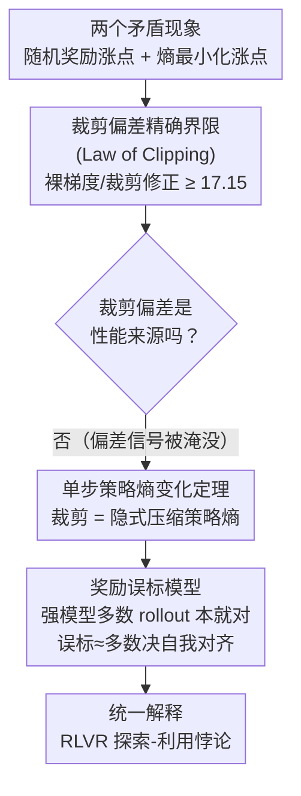

# Exploration vs Exploitation: Rethinking RLVR through Clipping, Entropy, and Spurious Reward

**会议**: ICLR 2026  
**arXiv**: [2512.16912](https://arxiv.org/abs/2512.16912)  
**代码**: 无  
**领域**: 强化学习  
**关键词**: RLVR, 探索-利用权衡, 裁剪偏差, 策略熵, 虚假奖励, GRPO

## 一句话总结
通过理论推导和跨模型实验，证明 RLVR 中裁剪偏差提供的学习信号可忽略不计（≤1/17），真正起作用的是裁剪对策略熵的隐式压缩效应，并提出奖励误标模型解释为何随机奖励能让强模型获益。

## 研究背景与动机
**领域现状**：RLVR（Reinforcement Learning with Verifiable Rewards）使用 GRPO 等在线策略优化算法，通过可验证的数学推理答案作为二值奖励来提升 LLM 的推理能力。DeepSeek-R1 等工作验证了这一范式的有效性，GRPO 因其计算简洁性和内存效率成为最流行的变体。

**反直觉现象一**：Shao et al. (2025) 发现用完全随机的 Bernoulli(1/2) 奖励训练 Qwen-Math 模型，MATH500 上准确率竟然大幅提升。随机奖励与正确答案完全无关，为何能改善推理性能？传统解释（Wu et al. 2025）将其归因于数据污染——Qwen-Math 在 MATH500 上存在大量记忆/污染轨迹。

**反直觉现象二**：多项研究发现最小化策略熵（抑制探索、使输出更确定性）反而能改善 RLVR 性能。Agarwal et al. (2025) 和 Gao et al. (2025) 甚至直接优化熵目标、不需要可验证反馈就能获得提升。这与经典 RL 中"探索有益"的直觉矛盾。

**争议焦点**：Shao et al. 将随机奖励的收益归因于 PPO 式上裁剪偏差（upper-clipping bias），认为裁剪优先放大高先验概率的 token——但 Oertell et al. (2025) 反驳称这些收益源于算法启发式和评估伪影，在他们的实验中随机奖励甚至降低了性能。

**核心矛盾**：抑制利用（随机奖励）和抑制探索（熵最小化）都能改善推理性能——这似乎自相矛盾。需要统一理论框架来调和。

**RLVR 特殊性**：与经典 RL 不同，RLVR 的奖励是结果级的、极端稀疏的，仅在长 rollout 末尾提供；探索在序列空间展开，由解码温度控制；策略更新依赖 ratio clipping + 组标准化优势，使得对重要性比率和相对排名的敏感度远高于绝对奖励值。

## 方法详解

### 整体框架
本文不提新算法，而是用三层递进的理论分析，把 RLVR 里两个看似矛盾的现象（随机奖励能涨点、熵最小化也能涨点）拆开重装成一套自洽解释。它依次回答三个问题：裁剪偏差到底有多大（答案：小到可忽略），裁剪真正在做什么（答案：隐式压缩策略熵），随机奖励为何还能让强模型涨点（答案：误标对多数正确的 rollout 其实是自我对齐）。三步对应三个理论结果——裁剪偏差精确界限（Law of Clipping）、单步策略熵变化定理、奖励误标模型——后一步建立在前一步的结论之上，最终合起来解开 RLVR 的探索-利用悖论。

### 关键设计

**1. 裁剪偏差精确界限（Law of Clipping）：定量证伪"裁剪偏差假说"**

既有解释把随机奖励的收益归因于 PPO 式上裁剪带来的偏差信号，本文先回答这个信号到底有多强。做法是把裁剪代理目标拆成裸项 $N_t = r_t A$ 和裁剪修正项 $N_t^{\text{clip}}$，再定义全部上裁剪修正量 $C_{\text{tot}}^+ = \sum_t (\bar{r}_t - r_t) I_t^+ A$，然后推导裸梯度与裁剪修正的幅度比 $\mathbb{E}[|N_{\text{raw}}|] / \mathbb{E}[|C_{\text{tot}}^+|]$ 的下界（Theorem 3.4）。推导借助 Lemma 2.2 的对数比率重参数化，并依赖 GRPO 优势函数在随机二值奖励下的对称性（Lemma 2.4）——此时 $|A_i| \leq \sqrt{G} - 1/\sqrt{G}$ 且所有奇数阶矩 $\mathbb{E}[A_i^{2k-1}]=0$，使得交叉项整齐消去。代入实际超参（$\eta=5\times10^{-7}$，$\epsilon=0.2$，$p_+=0.001$，$G=16$，$L=4096$）得到 Corollary 3.6 的比值 ≥ 17.15，即裁剪偏差信号被裸梯度淹没了至少一个量级，根本不可能是性能提升的来源。

**2. 单步策略熵变化定理：揭示裁剪的真实作用是隐式熵压缩**

既然裁剪不是靠偏差信号起作用，它的真正效应藏在哪？本文对 softmax 策略更新 $\pi_{\text{new}}(a|h) \propto \pi_{\text{old}}(a|h) \exp(\eta \tilde{A}(h,a))$ 做精确二阶展开。无裁剪时熵的单步期望变化为 $\mathbb{E}[\mathcal{H}(\pi_{\text{new}}) - \mathcal{H}(\pi_{\text{old}})] = -c_G \Phi(\pi_{\text{old}}) \eta^2 + O(\eta^4)$，其中 $\Phi$ 度量策略分布的偏度（skewness）：偏度小则熵下降，偏度大时熵反而可能上升——这正解释了实验里无裁剪训练熵一路涨到约 9.0 的现象。加上裁剪后（Theorem 4.3）展开式额外多出一个负项，确保熵被系统性地往下压，于是"裁剪 = 隐式熵最小化"。这里同时纠正了 Cui et al. (2025) 的一阶近似 $\Delta\mathcal{H} \approx -\text{Cov}(\log\pi, A)$：在随机奖励下 $\log\pi$ 与 $A$ 独立，协方差恒为零、预测熵不变，与实测矛盾；只有二阶项才能捕捉裁剪的真实效应。

**3. 奖励误标模型：解释随机奖励为何让强模型获益**

裁剪虽压低了熵，但低熵本身不保证涨点（弱模型会收敛到低熵但错误的策略），所以还差最后一块拼图。本文把一组 $G$ 个 rollout 分成正确集 $\mathcal{C}$（$n_c$ 个）和错误集 $\mathcal{I}$（$n_i$ 个），随机奖励会制造两类标签错误——错误 rollout 被误奖励（假阳性）、正确 rollout 被漏奖励（假阴性）。为量化这种污染对学习信号的破坏，定义"正确响应优势损失" $\Delta(f,g) = \Sigma_{\mathcal{C}}^{\text{ideal}} - \Sigma_{\mathcal{C}}(f,g)$，即理想标注与误标下正确集所获优势之差，可算出 $\mathbb{E}[\Delta] = n_c(G-n_c)/G$、$\text{Var}(\Delta) = n_c(G-n_c)/(4G)$。关键在于二者都随 $n_c \to G$ 而趋零：强模型大多数 rollout 本就正确，误标只动了少数错误样本，期望损失和方差同时变小，训练曲线因此更稳、收益更大。换句话说，随机奖励对强模型实质上是一种多数决式的自我对齐，而非真在传递任务信号。

### 损失函数 / 训练策略
实验沿用标准 GRPO 与 Shao et al. 的超参：batch size 128、group size 16、温度 1.0、裁剪比 0.2、学习率 $5\times10^{-7}$、KL 系数 0，基于 verl 框架。随机奖励直接采样 $\mathbf{r}(x,y) \sim \text{Bernoulli}(1/2)$，与 prompt 和 rollout 完全独立，以此隔离出裁剪与熵动态本身的作用。

## 实验关键数据

### 主实验：随机奖励训练效果

| 模型 | 基线准确率 | 随机奖励+裁剪后准确率 | 提升幅度 |
|------|----------|------------------|---------|
| Qwen2.5-Math-7B | ~53% | ~68% | +28% |
| R1-Distill-Llama-8B | ~65.6% | ~79% | +20% |
| QwQ-32B | 高 | 更高 | 稳定提升 |
| Qwen2.5-Math-1.5B | ~44% | ~46% | +4.5% |

### 裁剪与熵动态消融

| 配置 | 策略熵趋势 | MATH500 性能 | 说明 |
|------|-----------|-------------|------|
| 无裁剪 + 随机奖励 | 增长至~9.0 | 有时改善 | 无隐式熵压缩，探索增强 |
| 有裁剪 + 随机奖励 | 单调降至~7.5 | 常改善 | 裁剪=隐式熵最小化 |
| 裁剪激活率(Qwen-7B) | <0.2% | — | 证实裁剪偏差信号可忽略 |
| AIME 困难集 + 7B弱模型 | 不稳定 | 随机游走 | 弱模型在困难数据上无法收益 |
| AIME 困难集 + 32B/8B强模型 | 稳定下降 | 早期持续改善 | 强模型仍得益 |

### 关键发现
- 裁剪偏差信号被裸梯度信号淹没（比值 ≥ 17.15），不是性能提升的原因
- 无裁剪训练时存在梯度爆炸风险：R1-Distill-Llama-8B 在 step~150 性能从 76.6% 崩溃至谷底
- 随机奖励的收益不限于可能被污染的 Qwen-Math——Llama 和 QwQ 家族同样获益，证伪"纯污染假说"
- 熵最小化是必要非充分条件：弱模型可能收敛到低熵但错误的策略（在困难训练集上显示随机游走行为）
- 模型初始准确率越高，随机奖励训练曲线越平稳、收益越大——与误标模型 $\text{Var}(\Delta)$ 预测完美一致
- 裁剪同时起到防止梯度爆炸的稳定性作用（在无裁剪实验中明确验证）

## 亮点与洞察
- 以显式定量界限（而非渐近论证）证伪了"裁剪偏差假说"，核心结论可用 Corollary 3.6 的数值实例一步验证
- 建立了裁剪与策略熵之间的确定性联系：裁剪通过压缩离散空间中的概率分布间接"作用"，而非通过偏差项直接提供学习信号
- 奖励误标模型优雅地统一了两个看似矛盾的观察：强模型中随机奖励之所以有效，是因为大多数 rollout 本身正确，"误标"实质上对少数错误 rollout 进行了多数决定式自我对齐
- 提出用虚假奖励主动增加策略熵的新策略方向——区别于传统的正则化减缓熵坍缩，可与真实奖励组合使用
- 方法论上，将随机奖励下 GRPO 的分析从一阶提升到二阶是关键技术贡献

## 局限与展望
- 实验主要聚焦 MATH500 验证集，编程、逻辑推理等任务待扩展验证
- 奖励误标模型简化为二值 ORM + 独立 rollout 假设，连续/过程奖励（PRM）的分析待做
- 理论洞察尚未转化为具体的算法改进方案（如何利用熵-裁剪交互来设计更好的 RLVR 训练策略）
- $\pi_{\min}$ 的全局下界假设在实际 LLM（词表 >100K）中可能过于保守
- 策略偏度 $\Phi(\pi)$ 的实际量化依赖于 token 级分布，大规模计算成本高

## 相关工作与启发
- Cui et al. (2025) 的一阶熵分析在随机奖励下失效（Remark 2.7 明确指出），本文的二阶分析是必要修正
- 与 Agarwal et al. (2025) 直接优化熵目标的工作互补：后者提供实践方案，本文提供理论解释——为何熵最小化有效但不总是有效
- Shao et al. (2025) 将收益归因于裁剪偏差——本文定量证伪；Oertell et al. (2025) 认为收益是伪影——本文证明收益真实存在且跨模型
- 启示：RLVR 的探索-利用权衡与经典 RL 有本质区别——稀疏的结果级奖励 + ratio clipping + 组标准化优势使动态学习行为迥异于传统 MDP

## 评分
- 新颖性: ⭐⭐⭐⭐⭐ 定量证伪流行假说，统一框架解释矛盾现象
- 实验充分度: ⭐⭐⭐⭐ 跨模型家族（Qwen/Llama/QwQ）和规模（1.5B-32B）验证，但任务类型单一
- 写作质量: ⭐⭐⭐⭐⭐ 理论推导严谨，层层递进，图表清晰
- 价值: ⭐⭐⭐⭐⭐ 为 RLVR 理论基础提供了关键拼图

<!-- RELATED:START -->

## 相关论文

- [\[ACL 2026\] Semantic-Space Exploration and Exploitation in RLVR for LLM Reasoning](../../ACL2026/reinforcement_learning/semantic-space_exploration_and_exploitation_in_rlvr_for_llm_reasoning.md)
- [\[ICLR 2026\] Controllable Exploration in Hybrid-Policy RLVR for Multi-Modal Reasoning](controllable_exploration_in_hybrid-policy_rlvr_for_multi-modal_reasoning.md)
- [\[ACL 2026\] HEALing Entropy Collapse: Enhancing Exploration in Few-Shot RLVR via Hybrid-Domain Entropy Dynamics Alignment](../../ACL2026/reinforcement_learning/healing_entropy_collapse_enhancing_exploration_in_few-shot_rlvr_via_hybrid-domai.md)
- [\[AAAI 2026\] Reasoning with Exploration: An Entropy Perspective](../../AAAI2026/reinforcement_learning/reasoning_with_exploration_an_entropy_perspective.md)
- [\[ICML 2026\] Probing RLVR Training Instability through the Lens of Objective-Level Hacking](../../ICML2026/reinforcement_learning/probing_rlvr_training_instability_through_the_lens_of_objective-level_hacking.md)

<!-- RELATED:END -->
