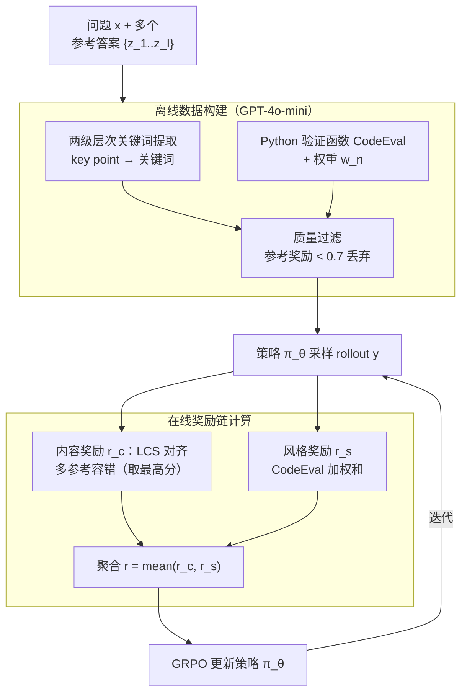

# From Verifiable Dot to Reward Chain: Harnessing Verifiable Reference-based Rewards for RL of Open-ended Generation

**会议**: ICLR 2026  
**arXiv**: [2601.18533](https://arxiv.org/abs/2601.18533)  
**代码**: [https://github.com/YJiangcm/RLVRR](https://github.com/YJiangcm/RLVRR)  
**领域**: 强化学习 / LLM对齐  
**关键词**: RLVR, 开放式生成, 奖励链, 可验证奖励, GRPO

## 一句话总结

提出 RLVRR 框架，将 RLVR（强化学习+可验证奖励）从数学/代码推理扩展到开放式文本生成：从高质量参考答案中提取关键词序列（内容奖励）和可执行 Python 检查函数（风格奖励），构成"奖励链"替代单点验证信号，在 10+ 个 benchmark 上以 10K 数据超越 100K SFT 和高级奖励模型。

## 研究背景与动机

**领域现状**：RLVR（如 DeepSeek-R1、GRPO）在数学和代码生成上取得巨大成功——通过检查最终答案的正确性（一个"可验证点"）提供奖励信号。RLHF 则用偏好奖励模型指导开放式生成任务的对齐。

**现有痛点**：(a) RLVR 无法直接用于开放式生成——开放式回答没有唯一正确答案，单点验证不适用；(b) RLHF 的奖励模型容易 reward hacking（过拟合表面特征），且需要大规模偏好标注数据，训练成本高且不稳定。

**核心矛盾**：开放式生成需要同时评估多维度质量（内容完整性、格式、风格），但缺乏像数学答案那样的确定性验证信号。

**本文目标**：设计一种从参考答案中自动提取多维度可验证信号的方法，使 RLVR 范式能扩展到开放式生成。

**切入角度**：把参考答案视为"规则来源"——就像数学推理从 ground truth 推导规则一样，从高质量参考中提取有序的语言学信号（奖励链），将单点监督升级为链式监督。

**核心 idea**：把参考答案分解为关键词（内容）+ Python 验证函数（风格），用这两个可验证维度的规则化奖励替代奖励模型。

## 方法详解

### 整体框架

RLVRR 想解决的是：RLVR 那套"检查一个可验证点给奖励"的范式只在数学/代码上跑得通，开放式生成没有唯一正确答案，单点验证无从下手。它的办法是把高质量参考答案 $z$ 当成"规则来源"，先离线把参考拆成一串可验证的语言学信号，再用这串信号在线指导 RL。

整体两阶段。**数据构建**阶段（离线），给定问题 $x$ 和参考答案 $z$，用 GPT-4o-mini 从 $z$ 里抽出两类东西：一是内容维度的层次化关键词，二是风格维度的可执行 Python 检查代码，再做一次质量过滤。**RL 训练**阶段（在线），用 GRPO 优化策略 $\pi_\theta$，对每条 rollout $y$ 同时算内容奖励 $r_c$ 和风格奖励 $r_s$，再聚合成总奖励 $r_\phi(x,y) = \mathcal{F}(r_c(x,y,z), r_s(x,y,z))$（实现上取两者平均）。一句话说，原来的"一个验证点"被换成了"一条由关键词链和风格检查组成的奖励链"，监督粒度从单点升级为链式。

### 关键设计

**1. 两级层次关键词提取（内容奖励）：把"内容对不对"变成可验证的关键词对齐**

开放式回答的内容好坏没有标准答案可比对，直接拿参考全文算相似度又会逼模型抄措辞、丢掉表达自由度。RLVRR 的做法是先让 LLM 从参考里抽出 $M$ 个 key point（如"解释风险"、"拒绝有害请求"），再在每个 key point 下抽出具体关键词（每个 <3 词），形成两级结构。算奖励时不用词袋，而是用最长公共子序列（LCS）逐 key point 衡量 rollout 关键词序列 $K_y^m$ 和参考关键词序列 $K_z^m$ 的对齐度，再对 $M$ 个 key point 取平均：

$$r_c = \frac{1}{M}\sum_{m=1}^{M}\frac{\text{len}(\text{LCS}(K_z^m, K_y^m))}{\max(\text{len}(K_z^m), \text{len}(K_y^m))}$$

之所以分两级而不是直接平铺抽词，是因为先定 key point 再展开关键词覆盖得更全、更系统；用 LCS 而非 bag-of-words，是因为它保留了关键词的顺序和重复，比"出现没出现"更精细地刻画了内容结构。而且抽出来的关键词只占参考全文约 15%，模型只需命中这些核心点，剩下怎么组织语言都自由——这正是它既能精确指导内容、又不退化成 SFT 抄答案的关键。

**2. Python 验证函数（风格奖励）：把"格式风格对不对"交给确定性的代码而非奖励模型**

内容之外，开放式回答还要满足长度、markdown 格式等风格约束，而这些用奖励模型来打分既贵又容易被 reward hacking。RLVRR 让 LLM 针对每条参考生成 $N$ 个 Python CodeEval 检查函数（比如"是否在某长度区间"、"是否含 markdown 标题"），每个函数带一个权重 $w_n$，风格奖励就是这些检查结果的加权和：

$$r_s = \sum_{n=1}^{N} w_n \cdot \text{CodeEval}_n(y)$$

用代码做检查的好处是它确定性、可验证、零额外成本——同样的输入永远给同样的判定，不会像奖励模型那样过拟合表面特征或漂移，也不用额外加载几十亿参数的模型。

**3. 多参考容错：用多个参考答案抹平单一参考的偏置**

单条参考的关键词和风格未必唯一合理，盯着一条参考容易把奖励信号绑死在一种写法上。RLVRR 支持同时用 $I=3$ 个参考答案，对每个 key point 在多个参考间取最高对齐分，相当于"只要命中任一合理写法就算对"。消融实验显示，多参考比单参考（$I=1$）在一致性和鲁棒性上都更好。

### 损失函数 / 训练策略

- 优化算法：GRPO（Group Relative Policy Optimization）
- KL 散度约束：$\beta \mathbb{D}_{KL}[\pi_\theta || \pi_{ref}]$
- 训练数据：仅 10K 条开放式指令-回答对（从 100K 中筛选），数据构建用 GPT-4o-mini
- 质量过滤：丢弃内容+风格奖励 < 0.7 的样本

## 实验关键数据

### 主实验

Qwen2.5-3B-Instruct 上 5 个开放式 benchmark 对比：

| 方法 | 数据量 | AlpacaEval2 (LC%) | ArenaHard (WR%) | MTBench | IFEval | FollowBench |
|------|--------|-------------------|-----------------|---------|--------|-------------|
| SFT | 100K | 25.1 | 32.9 | 7.5 | 35.9 | 51.3 |
| RM (Skywork-8B) | 10K | 28.8 | 32.3 | 7.6 | 34.5 | 51.4 |
| GRM (GPT-4o-mini) | 10K | 27.1 | 28.7 | 7.4 | 35.2 | 50.9 |
| DPO | 10K | 24.8 | 28.8 | 7.5 | 35.5 | 49.5 |
| **RLVRR** | **10K** | **31.5** | **36.2** | **7.7** | **36.8** | **53.1** |

RLVRR 用 10K 数据在所有指标上超越 100K SFT 和 8B 奖励模型。

### 消融实验

| 配置 | AlpacaEval2 | ArenaHard | 说明 |
|------|-------------|-----------|------|
| Full RLVRR | 31.5 | 36.2 | 完整框架 |
| w/o 层次提取（直接提关键词） | 30.6 | 35.0 | 层次化贡献 +0.9 |
| w/o 风格奖励 | 29.8 | 33.1 | 风格信号有效 |
| w/o 多参考（I=1） | 30.2 | 34.5 | 多参考提升鲁棒性 |
| BLEU 作奖励 | 24.3 | 27.5 | n-gram 远不如关键词 |
| Random 奖励 | 22.5 | 25.1 | 基线 |

### 关键发现

- RLVRR 的计算开销极低：相比随机奖励仅增加 0.71%，而加载奖励模型需要额外 GPU 内存和计算
- RLVRR 可无缝与 RLVR 结合——统一训练推理任务和开放式生成任务
- 深入分析表明 RLVRR 在保持输出多样性的同时提升了质量（不像 SFT 容易产生单一模式输出）
- BLEU 作为奖励信号非常差——n-gram 精度无法捕捉与人类偏好对齐的关键内容

## 亮点与洞察

- **"奖励链"概念巧妙**：从"验证一个点"到"验证一条链"，是 RLVR 范式的自然延伸。关键词链保留了内容的确定性可验证属性，同时允许表达自由度——兼顾了 SFT 的精确指导和 RL 的探索性
- **去掉奖励模型**：用规则化检查（正则匹配、Python 代码）替代数十亿参数的奖励模型，大幅降低 RL 训练成本和不稳定性。这个思路可推广到任何有参考答案的场景
- **少量数据大效果**：10K 数据超过 100K SFT，说明 RL 的探索机制在对齐任务中的数据效率远高于监督学习

## 局限与展望

- **依赖参考答案质量**：关键词和风格检查都从参考提取，如果参考质量差或存在偏见，RLVRR 也会学到错误模式
- **关键词提取依赖 GPT-4o-mini**：数据构建阶段需要调用强大 LLM，开源替代方案的效果未验证
- **风格检查较浅**：目前只检查长度、格式等表面属性，语气、逻辑连贯性等深层风格无法用简单代码验证
- **仅在 ≤7B 模型上验证**：更大模型（如 70B+）上 RLVRR 是否仍有优势未知

## 相关工作与启发

- **vs RLHF/DPO**: RLHF 需要偏好数据+奖励模型，成本高且易 hack；DPO 离线优化但缺乏在线探索。RLVRR 保留 RL 在线探索优势但去掉了奖励模型
- **vs BLEU-as-reward** (Chang et al. 2025): BLEU 是 n-gram 精度，无法区分关键内容和填充文本。RLVRR 用层次化关键词精准捕捉核心概念
- **vs RLPR** (Yu et al. 2025): RLPR 用模型自身的 token 概率做奖励，但只在短答案上有效。RLVRR 适用于长文本开放式生成

## 评分

- 新颖性: ⭐⭐⭐⭐ "奖励链"概念新颖，但内容奖励本质是关键词匹配，技术上不算突破性创新
- 实验充分度: ⭐⭐⭐⭐⭐ 10+ benchmark、多模型系列、详细消融、多样性分析、效率分析
- 写作质量: ⭐⭐⭐⭐ 叙事清晰，"dot→chain"的类比直观
- 价值: ⭐⭐⭐⭐⭐ 实用价值极高——为没有标准答案的对齐任务提供了低成本、可扩展的 RL 训练方案

<!-- RELATED:START -->

## 相关论文

- [\[ICLR 2026\] LongRLVR: Long-Context Reinforcement Learning Requires Verifiable Context Rewards](longrlvr_long-context_reinforcement_learning_requires_verifiable_context_rewards.md)
- [\[NeurIPS 2025\] Reasoning Gym: Reasoning Environments for Reinforcement Learning with Verifiable Rewards](../../NeurIPS2025/reinforcement_learning/reasoning_gym_reasoning_environments_for_reinforcement_learning_with_verifiable_.md)
- [\[ICLR 2026\] Helix: Evolutionary Reinforcement Learning for Open-Ended Scientific Problem Solving](helix_evolutionary_reinforcement_learning_for_open-ended_scientific_problem_solv.md)
- [\[NeurIPS 2025\] Generalizing Verifiable Instruction Following](../../NeurIPS2025/reinforcement_learning/generalizing_verifiable_instruction_following.md)
- [\[ICLR 2026\] References Improve LLM Alignment in Non-Verifiable Domains](references_improve_llm_alignment_in_non-verifiable_domains.md)

<!-- RELATED:END -->
