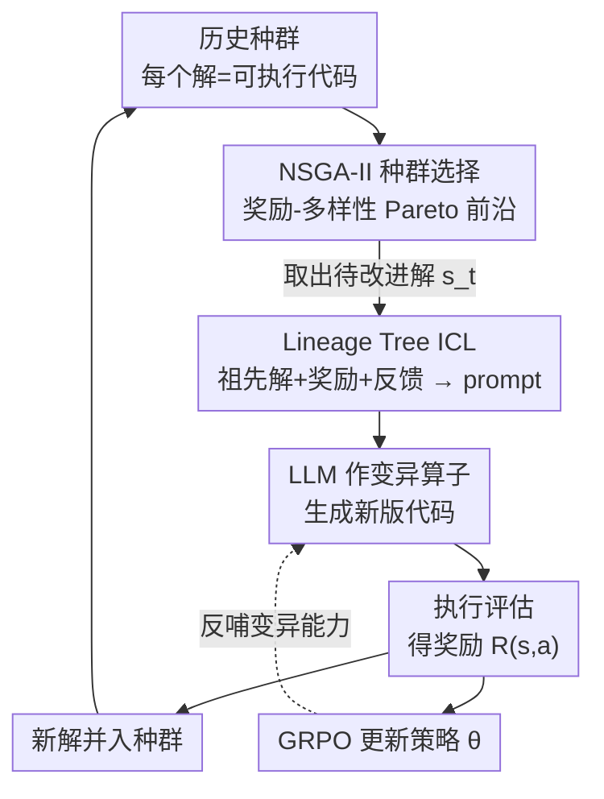

# Helix: Evolutionary Reinforcement Learning for Open-Ended Scientific Problem Solving

**会议**: ICLR 2026  
**arXiv**: [2603.07642](https://arxiv.org/abs/2603.07642)  
**代码**: 无（论文未提供）  
**领域**: 强化学习 / 科学发现  
**关键词**: 进化算法, GRPO, 科学优化, NSGA-II, 上下文学习

## 一句话总结

提出 HELIX 框架，将强化学习（GRPO）与进化算法（NSGA-II）结合用于开放式科学问题求解：RL 迭代优化策略，进化机制平衡解的质量与多样性，in-context learning 利用历史解指导探索，仅用 14B 模型在圆填充、机器学习任务等 20 个任务中超越 GPT-4o 流水线。

## 研究背景与动机

**领域现状**：用 LLM 解决复杂科学问题（符号回归、分子生成、数学优化）是热门方向。后训练方法（SFT/RLVR）在推理任务上有效，但面对开放式科学问题容易 entropy collapse 难以发现真正新颖的解。工作流方法（如 AlphaEvolve）把 LLM 嵌入进化流水线，但高度依赖任务特定设计。

**现有痛点**：(a) 纯 RL 方法无记忆——对同一问题的采样上下文固定，无法利用历史发现的好解；(b) 进化方法用的是固定预训练模型做变异，不更新模型参数，探索能力受限于预训练知识；(c) 两类方法都缺乏探索与利用的良好平衡。

**核心矛盾**：开放式科学问题三个特性——领域特异、解空间无界、无全局最优保证——要求同时具备：从经验中学习、平衡质量与多样性、站在巨人肩上探索。

**本文目标**：设计一个通用框架，让 LLM 能在无标准答案的科学优化问题中，通过 RL + 进化的协同迭代持续发现更优解。

**切入角度**：将"解"表示为代码，用 LLM 作变异/改进算子；用 RL（GRPO）更新策略参数使模型越来越会改进解；用 NSGA-II 在奖励-多样性 Pareto 前沿上筛选种群。

**核心 idea**：RL 教模型"如何改进解"，进化保证"探索多样方向"，in-context learning 让模型"站在已知好解的肩上"。

## 方法详解

### 整体框架

HELIX 要解决的是开放式科学优化：没有标准答案、解空间无界、还得既会改进又不撞死在一个方向上。它把每个"解"写成一段可执行代码，让 LLM 充当变异/改进算子，然后用三个模块拧成一根迭代的绳子。每一轮的转法是：先用 NSGA-II 从历史种群（所有已生成的解）里挑出一批又好又多样的解，从中取出当前要改进的解 $s_t$；接着把这个解连同它的祖先（lineage tree）打包进 prompt，让模型在"看过前人怎么改"的前提下生成新一版代码；新解执行后拿到奖励 $R$，一方面把它并入种群供下一轮挑选，另一方面用 GRPO 把这次的得失回灌到策略参数 $\theta$ 里、让变异算子本身越用越强。三者各管一件事：进化保证不收敛到单点、ICL 让每次改进都站在已知好解的肩上、RL 让模型越改越准。

### 关键设计

**1. NSGA-II 多目标种群选择：用多样性顶住 entropy collapse**

如果只按奖励高低选解，RL 很快会把熵压垮、收敛到一个局部最优，开放式探索就死了。HELIX 因此把"选谁进种群"做成一个奖励-多样性的双目标问题。每个解除了奖励 $R(s)$，还算一个多样性分数：

$$\text{Div}(s_i) = 1 - \frac{1}{k}\sum_{j \in \mathcal{N}_k(i)} \cos(E(s_i), E(s_j))$$

即在预训练 embedding 空间里取它的 $k$ 近邻、用余弦相似度的均值反过来衡量它有多"独特"。NSGA-II 在这两个目标上做非支配排序 + 拥挤度筛选，留下整条 Pareto 前沿，使种群始终既有高分解又有方向各异的解，探索空间不被提前关死。

**2. Lineage Tree In-context Learning：让模型看见解的进化家谱**

种群选出待改进解 $s_t$ 后，怎么让模型改得有的放矢？给它几个随机好解当示例，它只知道"好的长什么样"，却不知道"怎么从差变好"。HELIX 改为把当前解的整条血缘——祖先解、它们各自的奖励和反馈——一并塞进 prompt：

$$q = \text{ConstructPrompt}\big(\{p\} \cup \{s_t, R(s_t), F(s_t)\} \cup \{f^{(k)}(s_t), R(f^{(k)}(s_t)), F(f^{(k)}(s_t))\}_{1 \leq k < n}\big)$$

其中 $f^{(k)}$ 是第 $k$ 代祖先。模型于是能看到这个解是如何一步步从 $v_0$ 改到 $v_n$、每步奖励怎么变的，从而推断出"有效的改进方向"，而不是凭空再试一遍。

**3. GRPO 策略优化：让"变异算子"本身越用越强**

前两步都建立在一个固定模型上——而纯工作流方法（如 AlphaEvolve）正是反复调用一个固定的预训练模型做变异，改进能力从头到尾不变。HELIX 的根本区别在于用 RL 把奖励信号回灌进参数。新解执行拿到奖励后，给定 prompt $q$ 和当前解 $s_t$，模型采样 $G$ 个 rollout $\{a_j\}$，按 GRPO 的 clipped surrogate objective 训练，优势用组内奖励归一化得到：

$$\hat{A}_{j,k} = \frac{R(s_t,a_j) - \text{mean}\{R\}}{\text{std}\{R\}}$$

这样模型不再停留在预训练知识里，而是真正学会"对这类问题该往哪个方向改代码"，变异能力随训练持续提升，反过来又喂给下一轮的种群与 ICL，形成越转越强的闭环。

### 损失函数 / 训练策略

训练目标是带 clipping $\epsilon$ 和 KL penalty $\beta$ 的标准 GRPO objective。多样性度量刻意用预训练 embedding 模型在语义空间算，而不是直接比对代码文本——因为两段代码风格不同但功能相同时不该被当作"多样"。整体是迭代式训练：每轮生成新解 → 执行评估奖励 → 用 NSGA-II 更新种群 → 用 GRPO 更新策略参数，循环推进。

## 实验关键数据

### 主实验

20 个任务 5 个类别的最佳结果对比：

| 任务类别 | 任务 | Task-Specific | GPT-4o+OpenEvolve | **HELIX (14B)** |
|----------|------|---------------|-------------------|-----------------|
| ML | Adult Income (F1↑) | 80.72 | 72.27 | **82.07** |
| ML | Bank Marketing (F1↑) | 76.32 | 78.54 | **80.65** |
| ML | Boston Housing (RMSE↓) | 3.258 | 2.937 | **1.747** |
| 圆填充 | Sum of Radii ↑ | - | - | **2.63598** |

HELIX 用 14B 模型在 ML 任务上超越 GPT-4o 流水线，F1 平均提升 5.95 分。

### 消融实验

| 配置 | 平均奖励 | 说明 |
|------|----------|------|
| Full HELIX | 最高 | RL + Evolution + ICL |
| w/o RL (只用进化) | 中等 | 模型不更新参数，变异能力固定 |
| w/o Evolution (只用RL) | 低 | entropy collapse，解多样性丧失 |
| w/o ICL (无历史) | 中等 | 无法利用祖先经验 |
| w/o Diversity in selection | 中低 | 只按奖励选解，快速收敛到局部最优 |

### 关键发现

- **RL 和进化缺一不可**：纯 RL 会 entropy collapse，纯进化用固定模型变异能力上限低。两者协同才能持续发现更优解
- 多样性度量用语义 embedding 比用代码文本更好——因为功能相同但代码风格不同的解应被视为"不多样"
- Lineage tree 的深度（祖先数量）对性能有显著影响——过短则缺乏上下文，过长则 prompt 太长
- 14B 模型 + HELIX 在多个任务上超越 GPT-4o + 精心设计的流水线，说明更新模型参数（RL）比增大模型更有效

## 亮点与洞察

- **RL + 进化的融合范式**：RL 负责"越来越会改进"，进化负责"不要只改进一个方向"。这种二元体系比单一的 RL 或单一的进化算法都更适合无界开放问题
- **Lineage tree 作为 ICL 上下文**：不是随机给几个好解做示例，而是展示一个解的完整进化历史——让模型理解"什么样的修改方向是有效的"
- **通用框架**：同一个 HELIX 框架处理 ML 任务、物理仿真、圆填充、函数最小化、符号回归等完全不同的问题类别，泛化性很强

## 局限与展望

- **代码评估可能不安全**：在物理仿真等任务中需要执行生成的代码来获取奖励，存在安全风险
- **仍需任务特定的评估函数**：虽然框架通用，但每个任务仍需定义准确的奖励函数 $R(s)$
- **训练计算量**：每轮迭代需要生成 + 评估 + RL 更新，在大模型上的训练开销不小
- **32B 模型才能处理物理任务**：对几何推理能力要求高的任务需要更大模型，14B 不够

## 相关工作与启发

- **vs AlphaEvolve/OpenEvolve**: 这些方法用固定预训练模型做变异，不更新模型参数。HELIX 加入 RL 使模型越来越会变异，是更本质的进步
- **vs 标准 RLVR (GRPO/DAPO)**: RLVR 不维护解的种群，每次独立采样。HELIX 通过进化种群保持多样性和历史记忆
- **对 AI for Science 的启发**：这种"RL 教能力 + 进化保多样 + ICL 给上下文"的三位一体思路可推广到蛋白质设计、催化剂发现、芯片设计等科学优化场景

## 评分

- 新颖性: ⭐⭐⭐⭐ RL+进化的结合思路有创意且执行到位，但各组件（GRPO、NSGA-II、ICL）都不是新的
- 实验充分度: ⭐⭐⭐⭐⭐ 5 类 20 个任务覆盖面广，消融详细
- 写作质量: ⭐⭐⭐⭐ 框架描述清晰，但公式较多
- 价值: ⭐⭐⭐⭐⭐ 为 AI 解决开放式科学问题提供了强大的通用框架

<!-- RELATED:START -->

## 相关论文

- [\[ICLR 2026\] From Verifiable Dot to Reward Chain: Harnessing Verifiable Reference-based Rewards for RL of Open-ended Generation](from_verifiable_dot_to_reward_chain_harnessing_verifiable_reference-based_reward.md)
- [\[ACL 2026\] KASER: Knowledge-Aligned Student Error Simulator for Open-Ended Coding Tasks](../../ACL2026/reinforcement_learning/kaser_knowledge-aligned_student_error_simulator_for_open-ended_coding_tasks.md)
- [\[ICLR 2026\] Solving Parameter-Robust Avoid Problems with Unknown Feasibility using Reinforcement Learning](solving_parameter-robust_avoid_problems_with_unknown_feasibility_using_reinforce.md)
- [\[CVPR 2026\] Specificity-aware Reinforcement Learning for Fine-grained Open-world Classification](../../CVPR2026/reinforcement_learning/specificity-aware_reinforcement_learning_for_fine-grained_open-world_classificat.md)
- [\[ICLR 2026\] Solving Football by Exploiting Equilibrium Structure of 2p0s Differential Games with One-Sided Information](solving_football_by_exploiting_equilibrium_structure_of_2p0s_differential_games_.md)

<!-- RELATED:END -->
