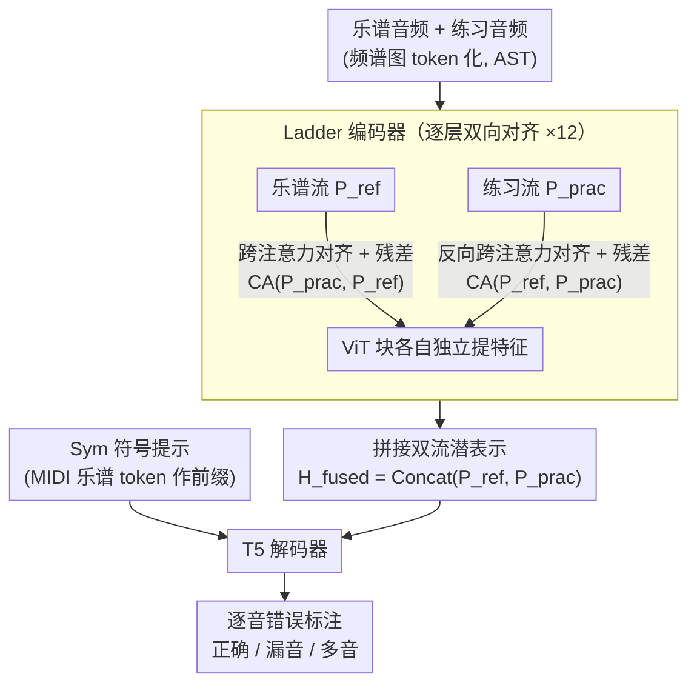

# LadderSym: A Multimodal Interleaved Transformer for Music Practice Error Detection

**会议**: ICLR 2026  
**arXiv**: [2510.08580](https://arxiv.org/abs/2510.08580)  
**代码**: [GitHub](https://github.com/ben2002chou/LadderSYM)  
**领域**: 强化学习  
**关键词**: 音乐错误检测, 多模态融合, 交叉注意力, 符号提示, 对齐模块

## 一句话总结
提出LadderSym架构解决音乐练习错误检测任务，通过交替式跨流对齐模块（Ladder）克服晚期融合的对齐不足，并用符号乐谱提示（Sym）减少纯音频乐谱的频率歧义，在MAESTRO-E上将漏音F1从26.8%提升到56.3%。

## 研究背景与动机

**领域现状**：音乐练习错误检测将练习录音与参考乐谱比较，发现漏音、多音、错音。早期方法依赖DTW显式对齐（对偏差敏感），Polytune用Transformer做潜空间对齐是当前SOTA。

**现有痛点**：(1) Polytune使用晚期融合（仅最后一层联合编码），注意力图分析显示跨流对齐不充分；(2) 乐谱仅以合成音频形式输入，多音并发时频谱重叠导致歧义，特别影响漏音检测。

**核心矛盾**：早期融合（单编码器）提升对齐但限制了非对称特征提取（因参数共享）；晚期融合保持独立处理但牺牲对齐能力。需要解耦对齐和特征提取。

**切入角度**：(1) 设计Ladder编码器在每层用跨注意力模块做双向对齐，同时ViT块独立做特征提取；(2) 引入符号乐谱作为解码器提示减少音频歧义。

## 方法详解

### 整体框架
任务是把一段练习录音和参考乐谱逐音比对，标出哪些音正确、哪些漏弹、哪些多弹。LadderSym 用一对并行的编码器分别吃乐谱音频和练习音频，但和前作 Polytune"各编各的、最后一层才合"（晚期融合）不同，它在**每一层都让两个流先互相对齐一次再各自提特征**：乐谱流参考练习流调整自己，练习流也回看乐谱流。两条流各跑完 12 层后把潜表示拼起来，送进 T5 解码器；解码器在开口前还会先读一段符号化的 MIDI 乐谱 token 当提示，最后吐出 MIDI 形式的标注（正确 / 漏音 / 多音）。两个新意都落在"对齐"上——一个发生在编码阶段（Ladder 编码器），一个发生在解码阶段（Sym 符号提示）。

### 关键设计

**1. Ladder 编码器：把"对齐"拆出来逐层做，不再挤到最后一层**

前作 Polytune 用晚期融合，两个流各自独立编码、只在最末层联合一次，注意力图显示这样跨流对齐根本不充分；但简单退回早期融合（共享单编码器）又会逼着两个非对称输入共用参数。探针实验把这对矛盾量化了出来：晚期融合里两个流本就分了工——练习流维持强局部性（位置探针 0.86）、乐谱流则发展出更强的全局感（globality 0.179→0.186）；而早期融合因参数共享让两流局部性都飙到 0.91/0.93，反而抹掉了这种分工。LadderSym 的对策是把"对齐"和"特征提取"解耦：每层的 ViT 块照旧各自独立提特征，但在进 ViT 块之前先插一个跨注意力模块做双向对齐。乐谱流用练习流当 key/value 算一次跨注意力、残差加回自己再过 ViT，练习流对称地做反向更新：

$$P_{\text{ref}}^{(i+1)} = \text{ViT}_{\text{ref}}\big(P_{\text{ref}}^{(i)} + \text{CA}(P_{\text{prac}}^{(i)}, P_{\text{ref}}^{(i)})\big)$$

两条流各跑到底后拼成融合表示 $H_{\text{fused}} = \text{Concat}(P_{\text{ref}}^{\text{final}}, P_{\text{prac}}^{\text{final}})$。这样 Ladder 既保住了双流独立性（在它身上重测探针，乐谱流对练习流的跨流对应精度 0.30 高过所有先前模型），又把 DTW 那种显式时间对齐变成了潜空间里逐层自动学的对齐——把学到的跨注意力图可视化，会看到与 DTW 对齐路径几乎一致的反对角线结构，证明它学到的确实是练习与乐谱之间有意义的时间对应，而非随意混合。

**2. Sym 符号提示：用无歧义的乐谱 token 替音频"报出"该有哪些音**

漏音检测一直是难点，根子在于乐谱以合成音频形式输入时，多音并发会让频谱互相重叠，模型分不清单个音到底在不在。Sym 绕开这个歧义：把 MIDI 乐谱直接 token 化，作为前缀提示拼在解码器序列起始符之前。解码器在生成标注之前就"看到"了一份明确列出每个应弹音的清单，判断"这个音是不是漏了"时有了无歧义参照，而不必从重叠频谱里硬抠。音频与符号两种视图还互补——符号 token 在复杂拍号下易引入对齐误差，音频频谱又难分辨并发音，两者一起喂能各补各的短板。它不动任何架构、只加了个提示，却恰好打在漏音检测最痛的地方。

### 损失函数 / 训练策略
- 标准序列到序列训练，输出加了显式错误标签（正确 / 漏音 / 多音）的 MIDI-like token
- 编码器为 12 层 Audio Spectrogram Transformer（AST），解码器为 8 层 T5，层数对齐 Polytune 配置

## 实验关键数据

### 主实验 (MAESTRO-E)

| 方法 | 漏音F1↑ | 多音F1↑ | 说明 |
|------|---------|---------|------|
| Polytune (SOTA) | 26.8% | 72.0% | 晚期融合+纯音频 |
| **LadderSym** | **56.3%** | **86.4%** | +29.5% / +14.4% |

### CocoChorales-E

| 方法 | 漏音F1↑ | 多音F1↑ |
|------|---------|---------|
| Polytune | 51.3% | 46.8% |
| **LadderSym** | **61.7%** | **61.4%** |

### 消融实验

| 配置 | 漏音F1 | 多音F1 | 说明 |
|------|--------|--------|------|
| Ladder + Sym | **56.3** | **86.4** | 完整方案 |
| Ladder only | 中 | 中 | 无符号提示 |
| Sym only | 中 | 中 | 无Ladder |
| Polytune | 26.8 | 72.0 | baseline |

### 关键发现
- 漏音检测提升最大(+29.5%)——Sym消除了"哪些音应该存在"的歧义
- 注意力图确认Ladder学到了类DTW的时间对齐模式
- 在真实录音数据上也验证了泛化性（标注极昂贵：20首需52人时）

## 亮点与洞察
- **对齐与特征提取的解耦**：跨注意力专门做对齐，ViT块专门做特征提取——职责分离的设计让两个能力都更强。
- **符号提示的简洁力量**：不改变架构只是加了提示，但效果巨大——因为它从根本上消除了多音频率歧义。
- **超越音乐的洞察**：比较任务的架构设计原则（逐层对齐、非对称特征提取）可迁移到RL评估、人类技能评估等其他比较场景。

## 局限与展望
- 仅在钢琴和合唱上验证，其他乐器（吉他、管弦乐）效果未知
- 真实数据仍很少（20首），难以全面评估真实场景泛化性
- 符号乐谱需要MIDI格式，并非所有场景都有
- 计算开销比Polytune大（每层多一个跨注意力）

## 相关工作与启发
- **vs Polytune**: 相同范式但改进了融合策略和输入模态，漏音检测翻倍
- **vs DTW方法**: 从显式对齐升级到学习的潜空间对齐，对偏差更鲁棒
- **可迁移到**: RL中的策略评估（比较两个trajectory）、代码审查（比较reference和submission）

## 评分
- 新颖性: ⭐⭐⭐⭐ Ladder+Sym的组合设计在音乐错误检测中首次出现
- 实验充分度: ⭐⭐⭐⭐ 合成+真实数据，注意力图分析深入
- 写作质量: ⭐⭐⭐⭐⭐ 动机清晰、探针实验有说服力、可视化丰富
- 价值: ⭐⭐⭐⭐ 对音乐教育工具和序列比较任务有直接价值

<!-- RELATED:START -->

## 相关论文

- [\[ICLR 2026\] Echo: Towards Advanced Audio Comprehension via Audio-Interleaved Reasoning](echo_towards_advanced_audio_comprehension_via_audio-interleaved_reasoning.md)
- [\[ICLR 2026\] Spotlight on Token Perception for Multimodal Reinforcement Learning](spotlight_on_token_perception_for_multimodal_reinforcement_learning.md)
- [\[ICLR 2026\] MARS-Sep: Multimodal-Aligned Reinforced Sound Separation](mars-sep_multimodal-aligned_reinforced_sound_separation.md)
- [\[AAAI 2026\] TextShield-R1: Reinforced Reasoning for Tampered Text Detection](../../AAAI2026/reinforcement_learning/textshield-r1_reinforced_reasoning_for_tampered_text_detection.md)
- [\[ICLR 2026\] UME-R1: Exploring Reasoning-Driven Generative Multimodal Embeddings](ume-r1_exploring_reasoning-driven_generative_multimodal_embeddings.md)

<!-- RELATED:END -->
