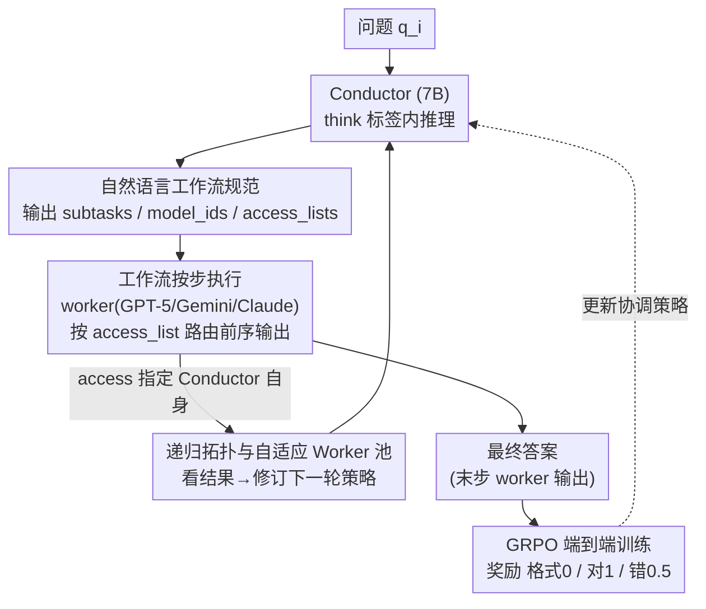

# Learning to Orchestrate Agents in Natural Language with the Conductor

**会议**: ICLR 2026  
**arXiv**: [2512.04388](https://arxiv.org/abs/2512.04388)  
**代码**: 有（随论文提交）  
**领域**: 强化学习  
**关键词**: multi-agent coordination, reinforcement-learning, workflow orchestration, test-time scaling, collective intelligence

## 一句话总结
用GRPO训练一个7B Qwen2.5模型作为"Conductor"，通过自然语言输出完整的Agent工作流（子任务指令+worker分配+通信拓扑访问列表），协调GPT-5/Claude Sonnet 4/Gemini 2.5 Pro等frontier模型，仅用960题×200迭代训练，在7个推理benchmark上平均77.27%超越所有单模型（GPT-5为74.78%）和多Agent基线。

## 研究背景与动机

**领域现状**：不同LLM在不同领域有专长（GPT-5擅长代码、Gemini擅长科学推理），商业AI产品依赖手动设计的Agent工作流来发挥模型组合优势。

**现有痛点**：
- 手工设计的Agent scaffolding需要大量prompt工程，缺乏自适应性
- MoA/RouterDC等方法仅做模型路由或使用固定拓扑，表达力受限于预定义选项集
- 自修正（self-reflection）策略5轮后收益递减，单模型内的改进空间有限
- 缺乏一种端到端学习协调策略的方法——让RL自动发现"谁做什么、怎么配合"

**核心矛盾**：需要灵活的Agent协调策略以发挥异构模型组合的最大潜力 → 但人工设计策略成本高且不可泛化，路由分类器的策略空间又受限于预定义拓扑。

**本文目标** 让一个小模型通过RL自动学会为任意问题设计最优的多模型协调工作流。

**切入角度**：以自然语言作为工作流的规范语言——Conductor直接输出子任务描述、模型ID、访问列表三个Python list，任何可以用自然语言表达的协调策略都在搜索空间内。

**核心 idea**：把"设计Agent工作流"建模为一个可以用RL端到端优化的序列生成任务。

## 方法详解

### 整体框架

这篇论文要解决的问题是：异构 frontier 模型各有专长（GPT-5 擅长代码、Gemini 擅长科学推理），但要把它们组合成一套针对具体问题的最优工作流，目前只能靠人工 prompt 工程或受限于预定义拓扑的路由分类器。Conductor 的做法是训练一个 7B 小模型来"指挥"这群大模型：它接收问题 $q_i$，在 `<think>` 标签内推理后，直接输出三个 Python list——`subtasks`（每一步的自然语言子任务指令）、`model_ids`（这一步派给哪个 worker）、`access_lists`（这个 worker 能看到哪些前序步骤的输出）。三个 list 合起来就是一张完整的协调拓扑图，也就是后文说的"自然语言工作流规范"。工作流按步骤顺序执行，前序 worker 的响应按 access_list 注入到后续 worker 的上下文里，最后一步 worker 的输出即最终答案。若 access_list 里指定了 Conductor 自己，工作流就进入递归——它能看着上一轮结果再修订下一轮策略。整套系统的关键在于：协调策略不是人写死的，而是这个小模型用 GRPO 从结果正确性里学出来的。

### 关键设计

**1. 自然语言工作流规范：让协调策略的搜索空间等于"人能写出的任何 prompt"**

针对的痛点是路由分类器只能从预定义选项里挑、表达力天花板太低。Conductor 把一条工作流形式化为 $\{(\text{subtask}_i, \text{agent}_i, \text{access}_i)\}_{i=1}^L$ 的序列：每一步带一句自然语言子任务、一个 worker ID、一个访问列表。访问列表决定了拓扑形态——它可以退化成简单的 best-of-N、串成链式，也可以靠 `access=[[],[],["all"]]` 这样的写法构造出"两个 worker 并行、第三个汇总全部"的树结构。worker 的上下文由对话模板把前序步骤的"任务+响应"组织进去。之所以用自然语言而不是离散标签当接口，是因为前者能表达的协调行为远不止"选谁"：Conductor 可以顺手做 prompt engineering（给 worker 写聚焦指令）、任务分解（拆成多步规划）、验证（让另一个模型检查上一步结果），甚至角色分配（"你是 planner"/"你负责写代码"）。这些能力都不需要额外设计，只要它能写出对应的 subtask 文本就自动具备。

**2. GRPO 端到端训练：只用一个三档的结果奖励，把协调技巧从 reward maximization 里逼出来**

有了表达力极强的动作空间，问题变成怎么学。Conductor 用 GRPO 做端到端优化，目标函数为

$$J(\theta) = \mathbb{E}\Big[\frac{1}{G}\sum_{i=1}^{G}\min\big(r_i A_i,\ \text{clip}(r_i, 1-\epsilon, 1+\epsilon)A_i\big)\Big]$$

优势函数 $A_i = (r_i - \text{mean})/\text{std}$ 按组内归一化，且不加 KL 约束（β=0）。奖励设计刻意简洁：格式错误给 0，答案正确给 1，答案错误给 0.5。这里最关键的是把"格式对但答错"设成 0.5 而非 -1——如果给负奖励，模型会退化成只敢输出安全但保守的工作流；给 0.5 则在"答错"和"格式都不对"之间留出梯度，鼓励它探索多样的协调策略。整个训练只用 960 题、200 次迭代就收敛，原因是 frontier worker 本身已经提供了很强的执行基础，Conductor 只需要学"怎么调度"而不必学"怎么解题"。

**3. 递归拓扑与自适应 Worker 池：把协调器自身变成一根可扩展的推理时计算轴**

前两点定义了"一次性"的工作流，这一点让它能自我延展。递归靠一个简单机制实现：允许 Conductor 在某步的 access_list 里指定自己的 ID，于是递归调用时它会拿到父级输出加前序 worker 响应作为上下文，再决定下一轮怎么走（最大递归深度人工设限）。这开启了一根新的推理时扩展轴——Conductor 观察完初始策略的结果后可以自适应修订，比如发现 GPT-5 在 BigCodeBench 上表现不佳，下一轮就把任务转给 Claude 或 Gemini。自适应 Worker 池则解决"换一批模型还能不能用"的问题：在预训练好的 Conductor 上做一轮微调，每步随机采样 $k$ 个 worker 子集，训完同一个 Conductor 既能在纯闭源场景跑、也能只用开源模型（R1-Distill/Gemma/Qwen）跑。

### 一个完整示例

以一道复杂代码题为例走一遍。Conductor 先在 `<think>` 里判断这是 LiveCodeBench 级别的难题，规划出 3 步工作流：第 1 步派 GPT-5 出初版代码（`subtask`="写出解题代码"，`access=[]`）；第 2 步让 Gemini 2.5 Pro 审查并修正（`access=[[0]]`，能看到第 1 步输出）；第 3 步由一个 worker 汇总定稿（`access=[["all"]]`）。若开启递归，Conductor 在看到首轮 GPT-5 代码在该子领域偏弱后，会把后续轮次转向 Claude/Gemini——这正是 BigCodeBench 上额外 +2.2% 的来源。对照之下，遇到 MMLU 这类简单题，Conductor 只会生成 2 步工作流，把贵的多模型协调省下来；这种"按难度自动分配计算"的行为也是从奖励里涌现的，没有任何人工规则告诉它简单题该少走几步。

### 损失函数 / 训练策略

训练数据：960 题来自 4 个领域（MATH 300、MMLU 若干、RLPR 若干、LiveCodeBench V1）。训练超参：batch_size=256（4 问题×64 rollout），lr=1e-6，cosine scheduling，AdamW(β₁=0.9, β₂=0.999)，max completion=1024，200 GRPO 迭代。Worker 设置：max 4096 output tokens，temperature 0.2，最低推理预算。训练硬件：2×H100 80GB。

## 实验关键数据

### 主实验——与"无约束"最佳结果对比

| 模型 | MATH500 | LiveCodeBench | AIME25 | GPQA-D | 平均 |
|------|---------|--------------|--------|--------|------|
| GPT-5 | 99.0 | 82.90 | 90.8 | 82.3 | 74.78 |
| Gemini 2.5 Pro | 96.0 | 67.24 | 78.3 | 84.8 | 70.97 |
| Claude Sonnet 4 | 96.0 | 46.54 | 74.3 | 77.7 | 65.69 |
| R1-Distill-32B | 82.5 | 26.86 | 63.0 | 58.1 | 54.49 |
| **Conductor (7B)** | **99.4** | **83.93** | **93.3** | **87.5** | **77.27** |

### 与多Agent基线对比（约束设置，4K token/最低推理）

| 方法 | MATH500 | MMLU | RLPR | LCB | 平均 |
|------|---------|------|------|-----|------|
| MoA | 83.10 | 88.46 | 38.37 | 38.57 | 62.13 |
| MASRouter | 80.60 | 86.28 | 32.80 | 27.86 | 56.89 |
| RouterDC | 59.25 | 87.52 | 27.53 | 35.33 | 52.41 |
| 5× Self-Reflection (GPT-5) | 76.93 | 91.79 | 31.80 | 57.57 | 64.52 |
| **Conductor** | **89.33** | **93.14** | **42.63** | **64.29** | **72.35** |

### 消融实验

| 配置 | MATH500 | LiveCodeBench | 说明 |
|------|---------|--------------|------|
| Conductor (完整) | 89.33 | 64.29 | OOD few-shot + subtasks |
| w/o subtasks | 88.50 | 58.62 | 去掉prompt engineering → LCB掉5.7% |
| w/o few-shot | 82.00 | 54.86 | 去掉few-shot示例 → 全面下降 |
| All GPT-5 workers | 93.33 | - | 固定worker → 失去异构互补 |

### 关键发现
- 7B Conductor在AIME25上比GPT-5高2.5%，在GPQA-D上高5.2%——对应entire generational improvement的量级
- Conductor平均仅用3步工作流（远低于5步上限），MASRouter用4-5步→Conductor更高效
- 涌现行为：MMLU简单题用2步，LiveCodeBench复杂题用3-4步→自动难度自适应的计算分配
- 仅用开源模型（R1-Distill/Gemma/Qwen）时，仍比Claude Sonnet 4高约10%
- 递归拓扑在BigCodeBench上额外+2.2%，在GPQA-D上+1%→新的推理时扩展轴
- 3B Conductor与7B选择相同的模型分布，但7B通过更好的prompt engineering获得额外增益→模型规模直接转化为协调能力

## 亮点与洞察
- **范式创新**：首次用纯RL端到端学习Agent协调策略——prompt engineering、验证、辩论、任务分解全部从reward maximization中自然涌现，无需任何人类先验
- **小模型指挥大模型**：7B Conductor协调100×以上大小的frontier模型达到集体智能新高度——产品级Agent框架的训练成本仅为2×H100×几天
- **自然语言=通用工作流语言**：输出不是离散选择而是完整的自然语言指令，表达力等价于人类prompt engineer能写出的任何scaffold
- **OOD few-shot的反直觉发现**：用域外任务的成功协调策略作为few-shot比用域内任务更好——避免了lazy exploitation

## 局限与展望
- 依赖昂贵的闭源API（GPT-5/Claude/Gemini），每次评估成本高且不可控
- 训练数据仅960题，对非数学/代码/科学领域的泛化待验证
- 递归深度人工设限，未探索最优递归策略的自动发现
- 未分析Conductor的失败模式——何时错误分配模型、写出糟糕的prompt
- Worker池固定于7个模型，更大池的扩展效率和组合爆炸问题未研究

## 相关工作与启发
- **vs MoA**：MoA用固定的layer+aggregator拓扑，7个candidate响应可能混淆正确/错误答案（尤其在大解空间任务如LiveCodeBench）；Conductor学习针对性的子任务分配避免此问题
- **vs MASRouter**：MASRouter训练路由分类器从预定义拓扑中选择，表达力受限；Conductor用自然语言自由构建任何拓扑
- **vs Self-Reflection**：5轮自修正已接近单模型上限（GPT-5: 57.57→无显著提升），Conductor通过跨模型协调打破单模型天花板（64.29）

## 评分
- 新颖性: ⭐⭐⭐⭐⭐ RL学习Agent协调的范式创新，递归拓扑开创推理时扩展新轴
- 实验充分度: ⭐⭐⭐⭐⭐ 7个benchmark+全面多Agent基线+消融+规模分析+效率分析
- 写作质量: ⭐⭐⭐⭐⭐ 涌现行为分析引人入胜，设计决策的讨论透彻
- 价值: ⭐⭐⭐⭐⭐ 开创性工作，定义了用RL训练Agent协调器的新范式

<!-- RELATED:START -->

## 相关论文

- [\[AAAI 2026\] HCPO: Hierarchical Conductor-Based Policy Optimization in Multi-Agent Reinforcement Learning](../../AAAI2026/reinforcement_learning/hcpo_hierarchical_conductor-based_policy_optimization_in_multi-agent_reinforceme.md)
- [\[ACL 2026\] Breaking the Impasse: Dual-Scale Evolutionary Policy Training for Social Language Agents](../../ACL2026/reinforcement_learning/breaking_the_impasse_dual-scale_evolutionary_policy_training_for_social_language.md)
- [\[ICLR 2026\] VerifyBench: Benchmarking Reference-based Reward Systems for Large Language Models](verifybench_benchmarking_reference-based_reward_systems_for_large_language_model.md)
- [\[ICML 2026\] Randomized Advantage Transformation (RAT): Computing Natural Policy Gradients via Direct Backpropagation](../../ICML2026/reinforcement_learning/randomized_advantage_transformation_rat_computing_natural_policy_gradients_via_d.md)
- [\[ICLR 2026\] Towards Strategic Persuasion with Language Models](towards_strategic_persuasion_with_language_models.md)

<!-- RELATED:END -->
