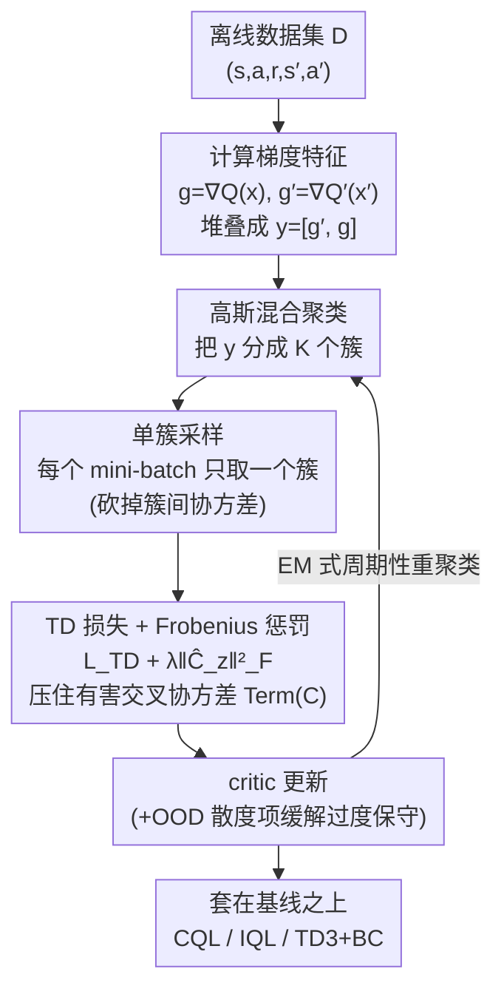

# Less is More: Clustered Cross-Covariance Control for Offline RL

**会议**: ICLR 2026  
**arXiv**: [2601.20765](https://arxiv.org/abs/2601.20765)  
**代码**: 无  
**领域**: 强化学习  
**关键词**: 离线强化学习, 分布偏移, TD交叉协方差, 缓冲区分区, 保守性控制

## 一句话总结

本文揭示了离线RL中标准平方误差目标会引入有害的TD交叉协方差，并提出C⁴（Clustered Cross-Covariance Control for TD）方法，通过分区缓冲区采样和显式梯度校正惩罚来抑制这一效应，在小数据集和OOD区域主导的场景下实现高达30%的回报提升。

## 研究背景与动机

离线强化学习的核心挑战是分布偏移（Distributional Shift）：策略需要在离线数据集未覆盖的状态-动作对上做出决策，但价值函数在这些区域的估计是不可靠的。这一问题在以下场景中尤为严重：

**数据稀缺**: 离线数据集规模有限，无法充分覆盖状态-动作空间

**OOD区域主导**: 数据集中的分布与目标策略分布存在显著差异，大量更新落在分布外区域

**过度保守**: 现有方法（如CQL）通过惩罚OOD区域的Q值来应对分布偏移，但这种保守策略在极端OOD区域可能导致过度悲观的价值估计

本文的关键发现是：**标准的均方误差（MSE）TD目标会引入有害的TD交叉协方差**。这种交叉协方差效应在OOD区域被放大，导致优化方向偏离最优，从而降低策略学习的质量。这一机制此前未被充分认识。

## 方法详解

### 整体框架

C⁴把离线RL在小数据、OOD（out-of-distribution，分布外）主导场景下的失败，归因到一个被忽视的梯度项：标准平方误差TD目标的二阶矩展开里，藏着一个TD独有的**交叉协方差项**，它带负号进入被最小化的损失、于是优化反而越推越大，在OOD区扭转更新方向甚至触发训练崩溃。围绕这个诊断，方法用两条互补手段把它压住，且都做成能叠加在任意策略约束型基线上的即插即用模块。先把每个转移里"当前critic梯度"与"目标critic梯度"堆成一对，用高斯混合（Gaussian mixture）在梯度空间聚成若干簇，再让每个mini-batch只从单个簇采样，从而消掉"簇间"那部分协方差；对簇内残留的协方差，则在损失里加一个Frobenius范数惩罚显式抵消。聚类与critic更新以EM式交替、周期性重聚（梯度随训练在变，分区不能只算一次），整套流程再配一个只在OOD区激活的轻量散度项来防止过度保守。

### 关键设计

**1. TD交叉协方差诊断：揪出平方误差目标里的寄生梯度项**

离线RL的TD学习最小化残差平方的二阶矩 $\mathbb{E}[\delta^2]=(\mathbb{E}[\delta])^2+\mathrm{Var}[\delta]$。本文把 $\mathrm{Var}[\delta]$ 在特征空间朝OOD方向做虚拟位移（$x\mapsto x+kw$）后一阶泰勒展开，拆出三项：前两项 $k^2\mathrm{Var}\langle w,\nabla_x Q\rangle$ 和 $\gamma^2 k'^2\mathrm{Var}\langle w',\nabla_{x'}Q'\rangle$ 是有益的隐式正则（类比有监督学习里噪声带来的正则，能压低OOD区Q值方差、利于泛化）；第三项 $-2\gamma k k'\,\mathrm{Cov}(\langle w',g'\rangle,\langle w,g\rangle)$ 是TD独有的**交叉协方差项（Term C）**，它耦合了同一次转移里当前critic的梯度 $g=\nabla_x Q_\phi$ 与目标critic的梯度 $g'=\nabla_{x'}Q_{\phi'}$。关键在于它带负号进入被最小化的损失，优化于是会去**增大**它，在严重OOD区把梯度方向越推越偏。注意有害的是**梯度特征**的跨时协方差，而非Q值本身——这是把病根从以往笼统的"过估计/保守"钉到具体一项上的诊断，也是后两个组件能对症的前提。

**2. 单簇采样：聚类梯度对，砍掉簇间协方差**

既然Term C来自跨区域梯度的不规则耦合，C⁴把每个转移的两个梯度堆成 $y=[g',g]\in\mathbb{R}^{2m}$，用K分量高斯混合在 $y$ 空间聚成 $K$ 个簇，并改成**每个mini-batch只从单个簇采样**。依全协方差律 $C=\mathbb{E}[C_Z]+\mathrm{Cov}(\mu'_Z,\mu_Z)$，单簇采样让"簇间均值偏移"那项在该batch里直接归零，残下的只有簇内协方差 $C_z$，定理给出batch级上界 $2\gamma kk'\|C_z\|_2\le 2\gamma kk'\sqrt{\mathrm{tr}\,\Sigma'_z}\sqrt{\mathrm{tr}\,\Sigma_z}$。聚类按梯度几何而非原始状态-动作，且因梯度随训练变化要**周期性重聚**（与critic更新以EM式交替）。论文还证明这种单簇采样保持了最大化目标的下界性质——隔离偏差没有以牺牲收敛保证为代价。

**3. Frobenius校正惩罚：把簇内残留协方差再压一刀**

单簇采样把簇间项清零，但簇内的 $C_z$ 还在，C⁴再补一刀显式校正。它在TD损失上叠加一个正比于簇内交叉协方差矩阵谱大小的惩罚 $\min_\phi L_{\mathrm{TD}}(\phi)+\lambda\sum_z p_z\|C_z\|_F^2$，其中 $\|C_z\|_F^2=\mathrm{tr}(C_z C_z^\top)$ 上界了谱范数、又便于每个batch估计。实际按batch估 $\hat C_z(B)=\mathrm{Cov}_B(g',g)$，惩罚取 $\|\hat C_z(B)\|_F^2+\beta(\mathrm{tr}\,\hat C_z(B))^2$，系数 $\lambda$ 控制力度。相比单簇采样靠"结构隔离"被动压制，这一项在mini-batch粒度上主动精确消偏，一粗一细互补，实验中并用效果最好。

**4. 即插即用 + OOD散度项：只掰正方向，不动基线保守内核**

C⁴的两个控制都不碰基础算法的损失主干——聚类只改采样、Frobenius惩罚只加一项梯度，因此能直接套在CQL、IQL、TD3+BC等策略约束型离线RL之上。为防"掰正方向"反而带来过度保守，C⁴再配一个轻量散度项，它对分布内中性、只在OOD区激活，缓解极端OOD区不必要的悲观，同时不改变基线"保守约束"的核心行为。最终让同一个基线在小数据、OOD主导场景下泛化更好、训练更稳。

## 实验关键数据

### 主实验

本文在D4RL等标准离线RL基准上进行了广泛评估：

| 数据集类型 | 基线方法 | 基线+C⁴ | 提升幅度 | 说明 |
|------------|----------|---------|----------|------|
| 小数据集（1%） | CQL | CQL+C⁴ | 最高30% | 数据稀缺时提升最显著 |
| 小数据集（1%） | IQL | IQL+C⁴ | 显著提升 | C⁴与多种基线兼容 |
| OOD主导数据集 | CQL | CQL+C⁴ | 显著提升 | OOD区域多时效果突出 |
| 标准数据集 | 各基线 | 各基线+C⁴ | 稳定提升 | 即使正常条件也有改善 |
| Medium-Expert | TD3+BC | TD3+BC+C⁴ | 提升 | 混合质量数据受益 |

### 消融实验

| 配置 | 关键指标 | 说明 |
|------|---------|------|
| 仅分区采样 | 提升显著 | 分区本身就能有效抑制协方差 |
| 仅梯度校正 | 提升明显 | 精确校正有效但不如分区稳定 |
| 分区+校正 | 最优 | 两者互补效果最佳 |
| 不同分区数K | 最优K存在 | K过小失去分区效果，K过大每个分区数据不足 |
| 不同数据集大小 | 小数据集提升更大 | 符合理论预期：数据越少协方差偏差越严重 |
| OOD比例变化 | OOD越多提升越大 | 验证了C⁴对OOD区域的特异性效果 |

### 关键发现

1. **交叉协方差是被忽视的关键因素**: 此前的离线RL研究主要关注值函数过估计和策略约束，忽略了交叉协方差的有害影响
2. **小数据集受益最大**: 在仅使用1%数据时，C⁴带来的提升最为显著（高达30%），说明协方差偏差在数据稀缺时尤为突出
3. **减轻过度保守**: C⁴在极端OOD区域减轻了过度保守性，使策略能更好地泛化
4. **稳定性提升**: 除了回报提升外，训练过程的稳定性也有显著改善
5. **通用增强器**: C⁴可以作为通用的插件增强多种离线RL基线，体现了其理论洞察的普适价值

## 亮点与洞察

1. **理论洞察深刻**: 揭示了TD学习中交叉协方差的有害机制，这是一个看似简单但被长期忽视的问题
2. **解决方案优雅**: 分区缓冲区采样方法极其简洁，几乎不增加计算开销，却能带来显著改善
3. **理论保证充分**: 证明了分区不会破坏下界性质，且约束能减轻过度保守而不改变核心行为
4. **实验验证全面**: 在多种基线、多种数据集配置下验证了方法的有效性
5. **"少即是多"的哲学**: 方法名恰如其分——通过限制每次更新的数据范围（少）来获得更好的优化方向（多）

## 局限与展望

1. **聚类质量**: 分区效果依赖于聚类算法的质量，在高维梯度特征空间中聚类可能不够准确
2. **聚类设计仍是开放问题**: C⁴需周期性地在梯度空间重聚类（EM式交替），但作者也指出"聚类设计仍是开放挑战"——重聚频率、簇数 $K$ 的自适应确定都缺乏成熟方案
3. **在线RL扩展**: 理论分析主要针对离线设定，在在线或混合在线/离线设定下的表现尚不清楚
4. **分区数选择**: K的选择需要调优，目前缺乏自适应确定K的方法
5. **计算开销**: 周期性重聚类在超大规模缓冲区上可能耗时
6. **高维连续控制**: 在更复杂的连续控制任务（如机器人操控）上的验证有限

## 相关工作与启发

- **CQL (Conservative Q-Learning)**: 通过惩罚OOD区域Q值来应对分布偏移，C⁴从不同角度（协方差控制）解决类似问题
- **IQL (Implicit Q-Learning)**: 通过分位数回归避免OOD动作查询，C⁴可作为增强模块叠加使用
- **TD3+BC**: 在TD3基础上添加行为克隆约束，C⁴同样可以集成
- **Prioritized Experience Replay**: 通过优先级控制采样分布，与C⁴的分区采样思路有关联但出发点不同
- **启发**: 
    - TD学习的梯度分析可能还有更多被忽视的偏差项值得挖掘
    - 缓冲区的结构化管理（不仅仅是优先级）可能成为离线RL的新研究方向
    - "限制范围以提升质量"的思路可以推广到其他机器学习问题中

## 评分
- 新颖性: ⭐⭐⭐⭐
- 实验充分度: ⭐⭐⭐⭐⭐
- 写作质量: ⭐⭐⭐⭐
- 价值: ⭐⭐⭐⭐

<!-- RELATED:START -->

## 相关论文

- [\[ICLR 2026\] Dual-Robust Cross-Domain Offline Reinforcement Learning Against Dynamics Shifts](dual-robust_cross-domain_offline_reinforcement_learning_against_dynamics_shifts.md)
- [\[ICLR 2026\] ReFORM: Reflected Flows for On-support Offline RL via Noise Manipulation](reform_reflected_flows_for_on-support_offline_rl_via_noise_manipulation.md)
- [\[ACL 2026\] LENS: Less Noise, More Voice — Reinforcement Learning for Reasoning via Instruction Purification](../../ACL2026/reinforcement_learning/less_noise_more_voice_reinforcement_learning_for_reasoning_via_instruction_purif.md)
- [\[ICLR 2026\] Offline Reinforcement Learning with Generative Trajectory Policies](offline_reinforcement_learning_with_generative_trajectory_policies.md)
- [\[ICLR 2026\] BA-MCTS: Bayes Adaptive Monte Carlo Tree Search for Offline Model-based RL](bayes_adaptive_monte_carlo_tree_search_for_offline_model-based_reinforcement_lea.md)

<!-- RELATED:END -->
