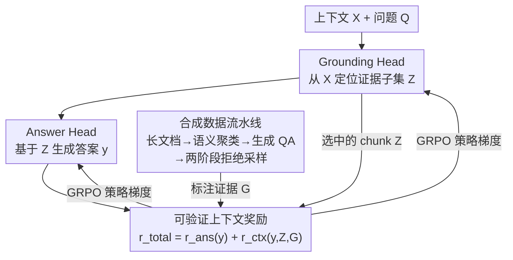

# LongRLVR: Long-Context Reinforcement Learning Requires Verifiable Context Rewards

**会议**: ICLR 2026  
**arXiv**: [2603.02146](https://arxiv.org/abs/2603.02146)  
**代码**: [real-absolute-AI/LongRLVR](https://github.com/real-absolute-AI/LongRLVR)  
**领域**: 强化学习  
**关键词**: RLVR, 长上下文推理, 上下文定位, 可验证奖励, 梯度消失, GRPO  

## 一句话总结

提出 LongRLVR，通过在 RLVR 训练中引入可验证的上下文奖励（context reward），解决长上下文场景下仅靠最终答案奖励导致的上下文定位（grounding）梯度消失问题，显著提升 LLM 长上下文推理能力。

## 研究背景与动机

**RLVR 在长上下文中失效**：RLVR（如 DeepSeek-R1）在数学/编程等依赖参数化知识的推理任务上表现优异，但在长上下文场景（需要从外部文档中检索和推理）中效果不佳

**上下文定位是核心瓶颈**：长上下文推理需要先准确定位相关证据（contextual grounding），再基于证据生成答案；仅靠最终答案奖励的信号过于稀疏，无法有效引导定位过程

**梯度消失的理论证明**：作者从理论上证明，outcome-only reward 导致 grounding head 的梯度被"激活事件"概率 Pr(ε_j) 缩放——即只有当其他所有必要证据已被选中时，选中某个证据 chunk 才能获得正梯度信号，这在训练初期几乎不可能发生

**实验验证**：naive RLVR 训练时，上下文召回率（contextual recall）快速停滞，直接限制了答案准确率的提升上限（Figure 1）

## 方法详解

### 整体框架

LongRLVR 要解决的问题是：直接把 RLVR 搬到长上下文场景，模型只拿"答案对不对"这一个稀疏奖励训练，根本学不会先从长文档里"找对证据"。它的做法是把长上下文策略显式拆成两个串联的"头"——Grounding Head $\pi_\theta^{gnd}(Z|X,Q)$ 先从上下文 $X$ 中挑出相关证据子集 $Z$，Answer Head $\pi_\theta^{ans}(y|X,Q,Z)$ 再基于这些证据生成答案 $y$。推理时模型先吐出一串 chunk 标识符完成定位，再生成最终答案；训练时则用一个新的奖励同时奖励"答对"和"找对地方"，让定位过程也能拿到直接的学习信号。要做到这一点还需要带 ground-truth 证据标注的训练数据，这部分由一条合成数据流水线离线产出。

### 关键设计

**1. 可验证上下文奖励：给稀疏的答案信号补一条密集的定位梯度**

只用答案奖励（outcome-only）在长上下文里失效有理论根因：作者证明（Proposition 1），选中某个 ground-truth chunk $c_j$ 得到的正梯度会被一个"激活事件"概率 $Pr(\varepsilon_j)$ 缩放——只有当 $c_j$ 之外的其余必要证据都已被选中时，这块证据才显出价值；而训练初期一次 rollout 几乎不可能同时凑齐这些证据，于是 grounding head 的梯度被压到接近零，上下文召回率早早停滞、直接卡死答案准确率的上限。

LongRLVR 的修法是把总奖励拆成答案奖励加上下文奖励 $r_{total}(y,Z) = r_{ans}(y) + r_{ctx}(y,Z,G)$，其中上下文奖励用一个"调制 F-score"设计：

$$r_{ctx}(y,Z,G) = \eta \cdot F_\beta(Z,G) + (1-\eta) \cdot r_{ans}(y) \cdot F_\beta(Z,G)$$

前一项 $\eta \cdot F_\beta$ 是无条件定位奖励，不管答案对错都按选中 chunk 与 ground-truth $G$ 的 F-score 给分，保证 grounding 始终有密集信号；后一项 $(1-\eta) \cdot r_{ans} \cdot F_\beta$ 是协同成功奖励，只有答案正确才解锁完整定位分数，避免模型为刷召回而乱选 chunk、让定位和最终目标脱钩。权重取 $\eta=0.1$（密集信号只占小头、主要靠协同项对齐目标），F-score 取 $\beta=2$ 偏重召回，因为多证据推理里漏一块证据比多选一块代价更高。它为什么有效有理论保证（Proposition 2）：上下文奖励给每个 $c_j$ 贡献的梯度里包含一项 $\alpha_j \cdot Var(z_j)$，这一项只依赖该 chunk 自身选择概率的方差、与稀有的激活事件无关，因此哪怕其它证据还没选对，单独选对一块也能拿到稳定正梯度，从根上消除了上面那个梯度消失。

**2. 合成数据流水线：用拒绝采样造出带 grounding 标注的长上下文 QA**

上下文奖励需要每条样本都有 ground-truth chunk 标注 $G$，而公开数据极少，所以作者自建了一条数据流水线喂给上面的训练。具体地，从 book / arXiv / code 三个领域采集 8K–64K token 的长文档，对每篇随机选 4 个语义聚类（每簇至少 4 个 chunk），让 Qwen3-235B 为每个聚类用思维链生成 3 个候选 $(Q, y, G)$ 三元组并标注必要证据，再让同一模型当裁判按"清晰度 / 正确性 / 证据相关性"打 1–10 分。随后两阶段拒绝采样选出每篇文档唯一的最佳 QA（先在每簇内选最高分，再在 4 个候选里选最优），并丢掉最终评分 < 9 的样本，得到 46K 条高质量长上下文 QA。消融显示过滤太简单的题有益、过滤过难的题反而有害（性能从 38.6 掉到 35.8），说明保留高难度样本对长上下文推理至关重要。

## 实验

### 主实验（Table 1）

| 模型 | RULER-QA (AVG) | LongBench v2 | LongReason (AVG) |
|------|:-:|:-:|:-:|
| Qwen2.5-14B-1M (base) | 75.20 | 40.2 | 73.55 |
| +RLVR | 73.17 | 39.8 | 72.33 |
| **+LongRLVR** | **88.90** | **46.5** | **78.42** |
| Qwen2.5-7B-1M (base) | 65.00 | 33.0 | 66.45 |
| +RLVR | 66.90 | 32.4 | 69.27 |
| **+LongRLVR** | **78.67** | **38.6** | **79.22** |
| LLaMA-3.1-8B (base) | 62.77 | 30.4 | 49.31 |
| +RLVR | 67.80 | 32.4 | 49.62 |
| **+LongRLVR** | **80.33** | **36.2** | **53.23** |

- Qwen2.5-14B-LongRLVR 超越 Qwen3-14B（RULER-QA 88.90 vs 87.60）和 QwenLong-L1-32B
- Qwen2.5-7B-LongRLVR 在 LongReason 上大幅超越 LLaMA-3.1-70B（79.22 vs 57.59）

### 消融实验

| 消融维度 | 关键发现 |
|---------|---------|
| **奖励组件**（Figure 3）| answer-only 召回停滞→性能天花板；context-only 召回高但答案不准；两者协同最优 |
| **数据质量**（Figure 4）| 拒绝采样 best > median > worst（38.6 vs 36.6 vs 34.8）；过滤简单题有效，过滤难题有害 |
| **η 混合因子**（Figure 5a）| η=0.1 最优；η=0 初始信号太稀疏；η=1 定位与答案脱耦 |
| **F-score β**（Figure 5b）| β=2 最优；偏重召回对多证据推理至关重要 |
| **chunk 数量**（Figure 5c）| 16-128 chunks 性能稳健，模型学到语义级定位而非依赖分块策略 |

## 亮点

- 从理论（梯度消失证明）和实验双重角度揭示 outcome-only RLVR 在长上下文中的根本缺陷，分析严谨
- 上下文奖励的设计巧妙：调制 F-score 同时兼顾密集信号和目标对齐，避免 reward hacking
- 7B/14B 小模型训练后超越 70B+ 大模型甚至专用推理模型（Qwen3-14B），参数效率极高
- 对 chunk 数量的鲁棒性说明模型学到了真正的语义定位能力

## 局限性

- 需要 ground-truth grounding chunks 标注，依赖高质量合成数据流水线，泛化到无标注场景未验证
- 仅在 QA 任务上验证，对摘要、信息抽取等其他长上下文任务的效果未知
- 训练数据长度限于 8K-64K tokens，对更长上下文（如 256K+）的可扩展性未探讨
- F-score 奖励假设 chunk 粒度的标注是可用的，实际应用中获取此类标注可能代价高昂
- 理论分析基于独立 chunk 选择假设，实际 LLM 的自回归生成中 chunk 选择存在依赖

## 相关工作

- **RLVR 推理增强**: DeepSeek-R1, Kimi, DAPO 等——本文指出它们在长上下文中的局限
- **长上下文对齐**: RoPE 扩展 (YaRN, LongRoPE)、长上下文 SFT/DPO——本文是 RLVR 路线的改进
- **QwenLong-L1-32B**: 基于推理模型的长上下文 RLVR——LongRLVR 用更小模型达到可比性能
- **长上下文 Agent**: 分块-多轮协作方案——与本文正交，可结合使用

## 评分

⭐⭐⭐⭐ (4/5)

- **新颖性**: ⭐⭐⭐⭐ — 理论驱动的奖励设计思路清晰，梯度消失分析是核心贡献
- **实验充分度**: ⭐⭐⭐⭐ — 多模型、多基准、丰富消融，数据覆盖全面
- **写作质量**: ⭐⭐⭐⭐⭐ — 理论与实验衔接紧密，论述逻辑清晰
- **实用价值**: ⭐⭐⭐⭐ — 对长上下文 RLVR 训练有直接指导意义，但需合成标注数据

<!-- RELATED:START -->

## 相关论文

- [\[ICLR 2026\] From Verifiable Dot to Reward Chain: Harnessing Verifiable Reference-based Rewards for RL of Open-ended Generation](from_verifiable_dot_to_reward_chain_harnessing_verifiable_reference-based_reward.md)
- [\[ICLR 2026\] Scalable In-Context Q-Learning](scalable_in-context_q-learning.md)
- [\[ICLR 2026\] SPELL: Self-Play Reinforcement Learning for Evolving Long-Context Language Models](spell_self-play_reinforcement_learning_for_evolving_long-context_language_models.md)
- [\[ICML 2026\] Safe In-Context Reinforcement Learning](../../ICML2026/reinforcement_learning/safe_in-context_reinforcement_learning.md)
- [\[NeurIPS 2025\] Reasoning Gym: Reasoning Environments for Reinforcement Learning with Verifiable Rewards](../../NeurIPS2025/reinforcement_learning/reasoning_gym_reasoning_environments_for_reinforcement_learning_with_verifiable_.md)

<!-- RELATED:END -->
