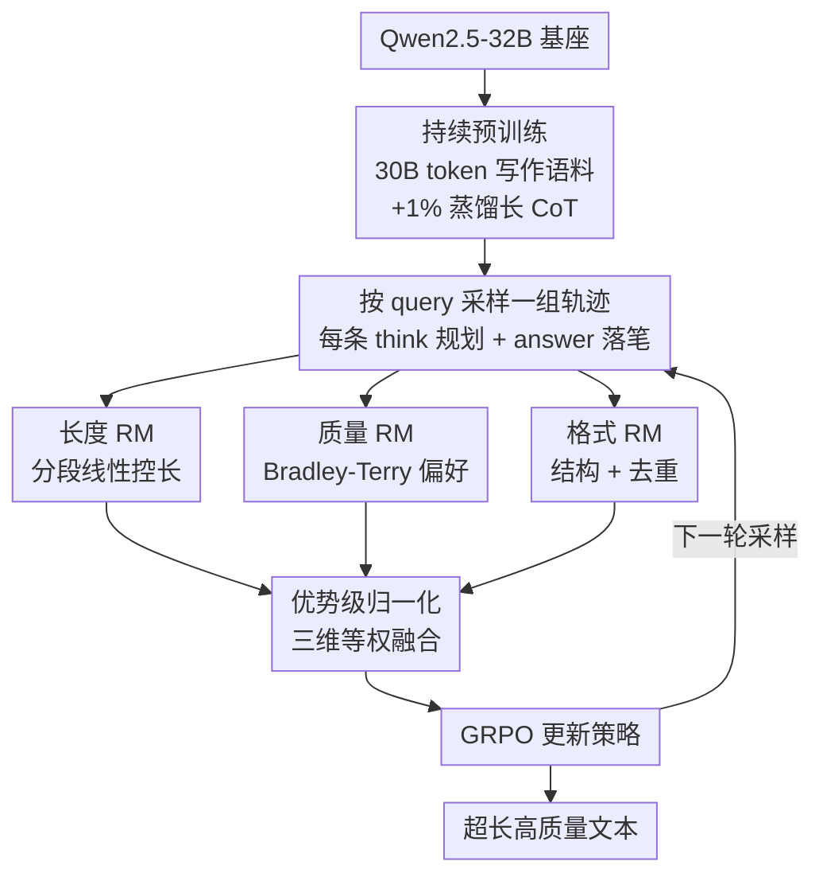

# LongWriter-Zero: Mastering Ultra-Long Text Generation via Reinforcement Learning

**会议**: ICLR 2026 (Oral)  
**arXiv**: [2506.18841](https://arxiv.org/abs/2506.18841)  
**代码**: [https://huggingface.co/THU-KEG/LongWriter-Zero-32B](https://huggingface.co/THU-KEG/LongWriter-Zero-32B)  
**领域**: Reinforcement Learning / Long-form Generation  
**关键词**: 超长文本生成, 强化学习, GRPO, 复合奖励模型, 测试时推理

## 一句话总结

提出 LongWriter-Zero：从基础模型出发，不依赖任何标注或合成数据，仅通过 GRPO 强化学习 + 三维度复合奖励模型（长度 / 质量 / 格式），涌现出超长高质量文本生成能力，在 WritingBench 上以 32B 参数量超越 DeepSeek-R1 和 Qwen3-235B 等 100B+ 模型。

## 研究背景与动机

超长文本生成（报告、小说、法律文书等）是 LLM 高频应用场景，但存在两个核心瓶颈：(1) 模型最大生成长度受限，超出训练分布后质量退化；(2) 随序列增长，文本出现局部不连贯、内部矛盾、重复措辞、主题漂移和结构崩塌。

以 LongWriter 为代表的先前方法走「教学」路线——在合成长文本上做 SFT。这条路有根本性天花板：

| SFT 路线缺陷 | 具体表现 |
|:---|:---|
| 数据质量受限于教师模型 | 合成数据的多样性和创新性被现有模型能力上限锁死 |
| 最大似然目标缺乏全局信号 | 无法显式优化连贯性、格式一致性等全局属性 |
| 构建成本高且质量不稳定 | 长文本合成需要复杂的 agent pipeline，输出常不连贯 |
| 风格人工化 | 合成数据结构模式单调，overly artificial |

作者核心洞察：与其「教」模型怎么写（SFT），不如「激励」模型自己学会写（RL）。这与 DeepSeek-R1-Zero 理念一致——完全通过 RL 从零涌现能力，绕过对精心构造训练数据的依赖。

## 方法详解

### 整体框架

LongWriter-Zero 把超长文本生成当作一个纯强化学习（RL）问题来做：既不教模型怎么写、也不喂任何标注或合成长文，而是给它一把能打分的尺子，让它在自我探索里涌现出写长文的能力。整条流水线分三步走——先在 Qwen2.5-32B 上用 30B token 写作语料做持续预训练，把基座的写作底子顶高；再让模型对每条 query 采样一组轨迹（每步 32 条），每条都按「先在 `<think>` 段头脑风暴、列提纲，再在 `<answer>` 段落笔」的格式生成，享受「先想后写」的测试时推理红利；最后由长度、质量、格式三个奖励模型分别打分，经优势级归一化后融成一个标量优势，用 GRPO 更新策略。训练跑在 8 节点 × 8 × H800 上，最大输出 14,000 token，温度 $T=0.8$、top-p 为 1.0。

### 关键设计

**1. 三维度复合奖励模型：给没有标准答案的写作造一把可优化的尺子**

开放式写作不像数学题有 ground truth 可供规则判分，作者因此把「写得好」拆成三个互补的奖励信号。长度奖励（Length RM）负责精确控长，用 QwQ-32B 为每条 query 预测合理字数区间 $[L_{\text{lower}}, L_{\text{upper}}]$，再用分段线性函数 $r_{\text{length}}(o)$ 在区间内给满分、不足或超出时线性衰减——$\text{len}(o)<L_{\text{lower}}$ 时取 $\text{len}(o)/L_{\text{lower}}$，超出 $L_{\text{upper}}$ 时取 $(L_{\text{max}}-\text{len}(o))/(L_{\text{max}}-L_{\text{upper}})$，把「写够但别注水」量化成可导信号。质量奖励（Writing RM）评判整体水准（流畅、连贯、信息量），以 Qwen2.5-72B 为骨干在人工偏好数据上用 Bradley-Terry 目标 $\mathcal{L}=-\mathbb{E}[\log\sigma(r(x,y_w)-r(x,y_l))]$ 训练。格式奖励（Format RM）守结构与去重，检查是否严格遵守「一个 `<think>` + 一个 `<answer>`」格式，并按语义重叠度惩罚复制段落——这正是 RL 训练里模型偷长度的常见捷径。

三个信号若直接相加，量纲大的分量会主导整体奖励，把模型往单一维度带偏。作者因此改用优势级归一化（advantage-level averaging）：不在原始分数上平均，而是先把每个分量在同一组采样轨迹内各自算成归一化优势，再取均值 $A_{\text{final}}=\frac{1}{3}(A_{\text{length}}+A_{\text{write}}+A_{\text{format}})$。这样三个维度等权贡献，长度或格式不会淹没写作质量。

**2. 写作中的测试时推理：让模型先打草稿提纲再落笔**

R1-Zero 在数学里靠长链式思维（CoT）实现测试时扩展，但写作是否也需要「先想后写」是个开放问题。作者用 Think Prompt（先在 `<think>` 里头脑风暴、列提纲、选风格、适配受众、自审，再在 `<answer>` 出稿）对比 Direct-Answer（跳过思考直接写）。结果是 Base-think 初期因要先学会 think/answer 格式而落后于 Base-nothink，但随训练推进反超并触到更高天花板，Arena-Write Elo 拉开到 1221 对 668。更有意思的是写作的 think 长度会收敛到约 2000–3000 token 后趋于平稳，而非像数学推理那样无限膨胀——说明写作的规划需求存在天然饱和点，规划足够后更多思考只是白白吃掉上下文窗口。

**3. 持续预训练抬高 RL 天花板：先把基座写作能力喂饱，RL 才探得更高**

既有研究指出 RL 的上限受基座能力约束，作者在写作任务上验证了这点同样成立。预训练用 30B token 中英文书籍、报告、学术论文（来自 Common Crawl），并混入 1% 从 Base-think 蒸馏的长 CoT 数据做格式对齐——比例压到 1% 是为了避免模型记死特定 CoT 模式；训练用 batch size 512、packed sequences、最大上下文 32K token。效果上，Continual-Pretrain-think 的初始质量奖励和长度奖励分数就高于 Base-think，最终收敛值也更高，Arena-Write Elo 从约 1000 起步收敛到约 1400，对应对 DeepSeek-R1 接近 80% 的胜率。

## 实验关键数据

### 主实验：WritingBench 全指标对比

| 模型 | 参数量 | Avg | 学术工程 | 金融商务 | 政法 | 文学艺术 | 教育 | 广告营销 | 风格 | 格式 | 长度 | Elo |
|:---|:---|:---|:---|:---|:---|:---|:---|:---|:---|:---|:---|:---|
| **LongWriter-Zero** | 32B | **8.69** | **8.7** | **8.8** | **8.8** | 8.4 | **8.9** | **8.6** | **8.7** | **8.7** | 8.6 | **1447** |
| Qwen3-235B-A22B | 235B | 8.68 | 8.6 | 8.6 | 8.6 | 8.7 | 8.8 | 8.6 | 8.7 | **8.7** | **8.7** | 1343 |
| Claude-Sonnet-4 | - | 8.60 | 8.6 | 8.6 | 8.5 | **8.6** | 8.7 | 8.5 | 8.6 | 8.6 | 8.6 | 1185 |
| DeepSeek-R1 | 671B | 8.55 | 8.5 | 8.5 | 8.6 | **8.6** | 8.7 | 8.6 | 8.7 | 8.6 | 8.6 | 1343 |
| GPT-4o | - | 8.16 | 8.1 | 8.1 | 8.2 | 8.1 | 8.4 | 8.1 | 8.3 | 8.2 | 8.2 | 947 |
| LongWriter-8B (SFT) | 8B | 7.91 | 8.0 | 8.1 | 8.1 | 7.7 | 8.1 | 7.6 | 7.9 | 8.1 | 7.7 | 457 |

### 消融实验

| 配置 | WritingBench Avg | Arena-Write Elo | 关键变化 |
|:---|:---|:---|:---|
| LongWriter-Zero (完整) | **8.69** | **1447** | 持续预训练 + Think + 三奖励 |
| w/o 持续预训练 (Base-think) | 8.12 | 1221 | Avg 下降 0.57，Elo 下降 226 |
| w/o 思考 (Base-nothink) | 8.04 | 668 | Think 对 Elo 影响更大 (1221→668) |

### SFT vs RL 对比

| 初始化 | SFT Elo | RL Elo | 差距 |
|:---|:---|:---|:---|
| Qwen2.5-32B (Base) | 964 | 1221 | RL +257 |
| Qwen2.5-32B (Cont. Pretrain) | 971 | 1447 | RL +476 |

SFT 从持续预训练中几乎无收益（964 → 971），因为性能被训练数据质量锁死；RL 则大幅获益（1221 → 1447），说明更强基座给 RL 提供了更高的探索天花板。

### 人工评测胜率

LongWriter-Zero vs 6 个强基线的 GPT-4.1 自动评估胜率最高达 98.2%，最低也超 62%。人工评测（3 名标注者）对比 DeepSeek-R1 和 Qwen3-235B 也保持领先，尽管人工标注倾向于在微妙差异时判定 tie。

## 亮点与洞察

- **范式论证**：首次在开放式文本生成领域完整论证「纯 RL 优于 SFT」，且用三个 RQ 系统性地回答了奖励设计、test-time scaling、持续预训练三个关键问题
- **32B 超越 100B+**：以 7 倍以下参数量超越 DeepSeek-R1 (671B) 和 Qwen3-235B，说明 RL 训练在写作任务上有极高的参数效率
- **写作推理的饱和现象**：think 长度在训练中收敛而非无限增长，揭示了写作与数学推理在 test-time scaling 行为上的本质差异
- **优势级归一化**：advantage-level averaging 是实用的多奖励融合策略，避免了量纲不等导致的偏斜优化
- **完整开源**：数据、训练框架、奖励模型、模型权重全部开源

## 局限性

- **事实性未纳入奖励**：Writing RM 不覆盖细粒度事实正确性，长文本中的事实幻觉风险无显式约束
- **仅验证 32B 规模**：未在 7B 或更小模型上验证，RL 写作的参数效率下限不明
- **计算开销**：8 节点 × 8 × H800 的 RL 训练成本远高于 SFT，工程门槛高
- **评估偏差风险**：WritingBench 评委模型和 Arena-Write 评委模型均来自特定模型家族，可能存在 preference leakage
- **风格可控性缺失**：无法精细控制特定写作风格（学术 vs 文学 vs 法律），当前奖励设计为通用型

## 相关工作与启发

- **LongWriter** (SFT 方法)：在合成长文本上微调，是本文的主要对比基准
- **R1-Zero / DeepSeek R1**：从零开始 RL 涌现推理能力的范式，本文将其成功迁移到写作任务
- **WritingBench**：长文本写作的标准评估基准
- **RLHF / PPO**：策略梯度 RL 方法在 LLM 微调中的应用基础

**启发**：这篇工作证明了 RL 不仅能增强 LLM 的推理能力，还能显著提升其生成能力。从零开始 RL 的范式可能在更多任务（代码生成、翻译、摘要等）中展现出类似的涌现效果。多维度奖励设计的思路值得在其他生成任务中借鉴。

## 评分

- 新颖性: ⭐⭐⭐⭐⭐ — 首次将 R1-Zero 范式成功应用于长文本写作，开创性工作
- 实验充分度: ⭐⭐⭐⭐ — WritingBench + Arena-Write 全指标 SOTA，但评估场景可更多样
- 写作质量: ⭐⭐⭐⭐ — Oral 级别论文，思路清晰，动机充分
- 价值: ⭐⭐⭐⭐⭐ — 实际应用价值高，开源模型权重，推动 RL+写作方向发展

<!-- RELATED:START -->

## 相关论文

- [\[ICLR 2026\] LoongRL: Reinforcement Learning for Advanced Reasoning over Long Contexts](loongrl_rl_for_reasoning_long_contexts.md)
- [\[ICLR 2026\] LongRLVR: Long-Context Reinforcement Learning Requires Verifiable Context Rewards](longrlvr_long-context_reinforcement_learning_requires_verifiable_context_rewards.md)
- [\[ICLR 2026\] SPELL: Self-Play Reinforcement Learning for Evolving Long-Context Language Models](spell_self-play_reinforcement_learning_for_evolving_long-context_language_models.md)
- [\[NeurIPS 2025\] Decoder-Hybrid-Decoder Architecture for Efficient Reasoning with Long Generation](../../NeurIPS2025/reinforcement_learning/decoderhybriddecoder_architecture_for_efficient_reasoning_wi.md)
- [\[ACL 2026\] LoVeC: Reinforcement Learning for Better Verbalized Confidence in Long-Form Generations](../../ACL2026/reinforcement_learning/lovec_reinforcement_learning_for_better_verbalized_confidence_in_long-form_gener.md)

<!-- RELATED:END -->
