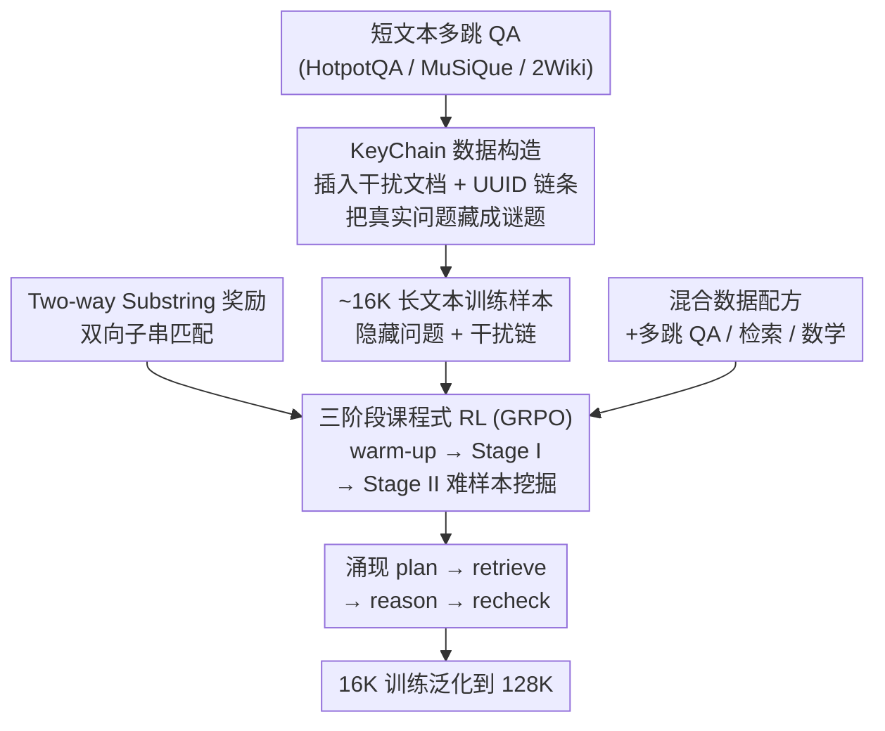

# LoongRL: Reinforcement Learning for Advanced Reasoning over Long Contexts

**会议**: ICLR 2026 Oral  
**arXiv**: [2510.19363](https://arxiv.org/abs/2510.19363)  
**代码**: 有（附补充材料提供训练代码和 KeyChain 数据合成代码）  
**领域**: 强化学习  
**关键词**: long-context reasoning, reinforcement-learning, GRPO, multi-hop QA, emergent reasoning patterns

## 一句话总结
提出 LoongRL，通过构建 KeyChain 合成数据进行强化学习训练，使 LLM 涌现出 plan–retrieve–reason–recheck 的长上下文推理模式，仅在 16K 上下文上训练即可泛化到 128K，14B 模型达到 74.2 分接近 o3-mini (74.5) 和 DeepSeek-R1 (74.9)。

## 研究背景与动机

**领域现状**：当前 LLM 推理方面的进展（如 DeepSeek-R1、o1）主要集中在短上下文推理任务（数学、代码），通过 RL 引导模型产生更长的 chain-of-thought 和自我反思。对于长上下文推理——需要在数千 token 的外部输入中检索并整合信息——则基本未被探索。

**现有痛点**：(a) 现有长上下文模型虽然支持长窗口（128K+），但主要只擅长 **检索**，在需要 **推理** 的场景下表现差；(b) 用于 RL 训练的高难度长上下文数据极度稀缺，答案形式多样导致验证困难；(c) 将 RL rollout 从短文本（<1K）扩展到 128K 上下文计算成本极高；(d) 仅在长上下文数据上训练会退化短上下文能力。

**核心矛盾**：长上下文推理需要独特的思维模式（先规划→再检索→再推理→再验证），但这种模式无法通过简单的 SFT 或 prompting 获得，需要 RL 来探索和激励。然而，适合 RL 训练的数据不存在——必须足够难以触发推理，必须需要从长上下文中检索信息，且答案必须可验证。

**本文目标** (a) 如何设计高质量 RL 训练数据来激励长上下文推理？ (b) 如何在短上下文上训练但泛化到超长上下文？ (c) 如何保持短上下文能力不退化？

**切入角度**：作者观察到，如果 RL 数据本身就需要"追踪线索链→找到真正问题→检索→推理"这种多步操作，模型就会涌现出结构化的长上下文推理模式。这个模式一旦学会，就可以泛化到任意长度。

**核心 idea**：通过在短多跳 QA 中插入 UUID 链条隐藏真实问题（KeyChain），构造高难度 RL 训练数据，使 LLM 涌现 plan-retrieve-reason-recheck 推理模式并泛化到 128K 上下文。

## 方法详解

### 整体框架
LoongRL 想解决的是：怎样用一份"够难、可验证、又不昂贵"的数据，把长上下文推理这种特殊思维方式从模型里逼出来。它的做法是先把现成的短文本多跳 QA 改造成高难度长上下文题目（KeyChain），再用 GRPO 在这些题目上做多阶段 RL，同时掺入数学和检索数据守住短上下文能力。整条链路的输入是约 16K token 的长文本加一个问题，输出是带推理过程、最终答案放在 `\boxed{}` 里的回答。关键在于：训练长度始终压在 16K，但学到的推理模式能直接迁移到 128K。

### 关键设计

**1. KeyChain 数据构造：用 UUID 链条把"真正的问题"藏起来，逼模型先规划再检索**

光往上下文里塞干扰文档，难度上不去——模型照样能直接检索作答。KeyChain 的核心是先把"问题是什么"本身藏成一道需要追踪的谜题。具体做法：先从 HotpotQA、MuSiQue、2WikiMultiHopQA 里筛中等难度的 QA 对（277K→72K，筛选方式是让 Qwen2.5-32B 各回答 8 次，只保留 pass rate 落在 0 到 1 之间的题，太简单太难都丢），然后一方面插入无关文档把上下文撑到约 16K token，另一方面插入多条 UUID key-value 链：每个 key 是 32 字符的 UUID（字符取自 0-9、A-F），对应的 value 里要么是下一个 key、要么是最终问题；其中一条链最终指向原始问题 $o\_q_i$，其余几条链则指向干扰问题。模型拿到初始 key 后，必须沿正确链条一跳一跳追下去，找到被隐藏的真实问题，再回到长上下文里检索相关信息、推理出答案。正是这个"先找到问题"的前置步骤，天然把模型推向 plan→retrieve→reason→recheck 的结构化思维——不是直接教它怎么推理，而是设计数据让它非推理不可。

**2. Two-way Substring Exact Match：给开放式 QA 一个既不苛刻也不放水的奖励信号**

通用 QA 的答案不像数学有唯一解，表达方式五花八门，所以奖励验证是个真问题：严格 exact match 会把"对但格式不同"的答案误判为错，F1 不够精确，LLM-as-a-judge 既效果一般又要额外挂一个模型。LoongRL 用双向子串匹配——预测答案 $a$ 与抽取出的答案串 $y_{\text{ans}}$ 只要一方是另一方的子串就给满分：

$$r_i = 1 \iff a \subseteq y_{\text{ans}} \lor y_{\text{ans}} \subseteq a$$

为了能稳定抽取，模型被要求把最终答案写进 `\boxed{}`。这样既容下了表述差异，又比 LLM judge 更快、更不容易被 reward hacking 钻空子，在宽容度和准确性之间找到了平衡。

**3. 三阶段课程式 RL：从能答对的题起步，逐步逼到只剩硬骨头**

如果一上来就喂 KeyChain，小模型会全军覆没——所有 rollout 都答错、reward 全为 0，根本产生不了有效梯度。LoongRL 因此把训练拆成由易到难的三段。Warm-up（42 步，只有 7B 需要）先在不含 KeyChain 的数据（标准多跳 QA + 检索 + 数学）上把基础能力练起来；Stage I（168 步）正式加入 KeyChain 数据，引导模型学出 plan-retrieve-reason-recheck 模式；Stage II（约 120-150 步）做 hard-mining——对每个样本生成 8 条 rollout，把全部答对的样本（约占 60-70%）直接丢弃，只在剩下的困难样本上继续训，避免在已经掌握的题上反复过拟合。14B 模型初始能力够强，可以跳过 warm-up 直接进 Stage I。

**4. 混合数据配方：掺数学和检索，守住短上下文不退化**

纯长上下文训练有个已知副作用——短上下文通用能力会退化（R1-distill 系列和 QwenLong-L1 都栽在这上面）。LoongRL 的训练集因此是个混合配方：7,500 条 KeyChain QA + 7,500 条标准多跳 QA + 1,024 条 needle retrieval + 5,000 道数学题（DAPO + MATH），全部限制在约 16K 上下文以内。数学题在这里起的是"压舱石"作用，让模型在学长上下文推理的同时保住通用推理能力。

### 损失函数 / 训练策略
采用 GRPO (Group Relative Policy Optimization)，group size $G=8$，学习率 $1 \times 10^{-6}$，cosine decay，KL penalty $\beta=0.001$，并去掉熵损失项以避免训练不稳定。最大输出长度 4,096 token，推理时温度 0.6、top-p 0.95。

## 实验关键数据

### 主实验

| 模型 | LongBench v1 Avg | HotpotQA | 2Wiki | MuSiQue | NarrativeQA | QASPER |
|------|------------------|----------|-------|---------|-------------|--------|
| o3-mini | 74.5 | 83.0 | 89.0 | 64.0 | 60.7 | 60.5 |
| DeepSeek-R1 | 74.9 | 82.7 | 91.3 | 72.2 | 66.9 | 61.4 |
| QwenLong-L1-32B | 70.1 | 80.7 | 89.1 | 65.2 | 58.6 | 56.7 |
| Qwen2.5-7B-Instruct | 48.9 | 69.5 | 50.5 | 34.0 | 44.5 | 46.0 |
| **LoongRL-7B** | **72.4** | 83.1 | 91.1 | 65.6 | 58.4 | 63.6 |
| Qwen2.5-14B-Instruct | 53.1 | 74.0 | 60.5 | 36.5 | 48.5 | 46.0 |
| **LoongRL-14B** | **74.2** | 82.2 | 93.3 | 67.5 | 63.4 | 64.5 |

### 消融实验

| 配置 | LongBench v1 Avg | 说明 |
|------|------------------|------|
| Qwen2.5-7B-Instruct | 48.9 | 基线 |
| LoongRL-7B (no KeyChain) | 66.2 | 用等量普通多跳 QA 替代 KeyChain |
| LoongRL-7B (full) | 72.4 | 完整模型，KeyChain 贡献 +6.2% |

| 奖励验证器 | Avg | 说明 |
|-----------|-----|------|
| F1 score | 65.1 | 不够精确 |
| LLM-as-a-judge | 65.2 | 需额外模型且效果差 |
| Exact match | 69.2 | 过于严格 |
| Two-way Substring (ours) | **72.4** | 最优 |

### 关键发现
- **KeyChain 是核心贡献**：去掉 KeyChain 后性能从 72.4 降至 66.2，差距巨大。KeyChain 训练的模型会涌现显式的 plan 步骤和 recheck 行为，而无 KeyChain 模型的推理和检索混在一起，缺乏规划
- **16K 训练泛化到 128K**：LoongRL-7B 在 RULER 128K 上达到 76.8（基线 69.4），LoongRL-14B 达到 79.9（基线 73.6）。NarrativeQA 32K-64K 区间分别提升 +14.8% 和 +16.0%
- **奖励验证器对比**：双向子串匹配显著优于 F1、LLM judge 和 exact match，说明对 QA 这类开放式答案，恰当的验证松弛很重要
- **Needle-in-a-haystack 完美通过**：LoongRL-7B 在所有深度和长度上达到 100% 准确率，甚至基线 Qwen2.5-7B 和 QwenLong-L1-32B 都无法完全通过
- **短上下文能力保持**：MMLU 提升 +2.8%/+1.1%，IFEval 仅微降 -0.3%/-2.6%，数学保持稳定

## 亮点与洞察
- **KeyChain 数据构造思路极其巧妙**：通过在数据层面引入"先找问题再答题"的结构，自然引导模型涌现规划能力。这个思路可以迁移到其他需要结构化推理的任务——不是直接教模型怎么推理，而是设计数据让模型必须推理才能答题
- **短训练长泛化**：仅 16K 训练泛化到 128K 是一个重要发现，说明推理模式一旦学会就是长度无关的。这大幅降低了长上下文 RL 训练的成本（否则 128K rollout 的 GPU 成本不可承受）
- **双向子串匹配**：简单但有效的奖励设计，解决了 QA 答案多样性问题，避免了 LLM-as-a-judge 的额外开销和 reward hacking 风险。可直接复用到其他开放式 QA 的 RL 训练
- **多阶段课程学习**：warm-up → KeyChain → hard-mining 的策略非常实用。特别是 Stage II 的 hard-mining（丢弃全答对样本）策略，避免在简单样本上浪费计算

## 局限与展望
- **仅评估 QA 类型任务**：LongBench 和 NarrativeQA 主要是抽取式/生成式 QA，未测试长文档摘要、跨文档推理等其他长上下文任务类型
- **训练长度固定 16K**：虽然 16K→128K 泛化效果好，但对于更长上下文（256K, 1M）是否仍有效未被验证
- **KeyChain 合成较人工**：UUID 链条是完全人工构造的，与真实世界的"信息追踪"任务存在分布差距。能否设计更自然的 KeyChain 变体？
- **仅用 Qwen 系列实验**：未在 LLaMA、Mistral 等其他架构上验证泛化性
- **涌现模式的分析不够深入**：plan-retrieve-reason-recheck 模式是否总是稳定出现？failure case 长什么样？

## 相关工作与启发
- **vs QwenLong-L1**：QwenLong-L1 在 R1-distill-Qwen-32B 上用 60K 上下文 RL 训练，仅提升 +4.6%。LoongRL 用 16K 训练在 7B 模型上就超越它 +2.3%。关键差异在于 KeyChain 数据的质量
- **vs R1-Distill 系列**：R1 蒸馏在长上下文上效果差甚至退化（7B 退化 -17.7%），因为蒸馏的长 CoT 数据主要针对短上下文推理，未覆盖长上下文特有的检索-推理模式

## 评分
- 新颖性: ⭐⭐⭐⭐ KeyChain 数据构造非常有创意，但底层 RL 框架（GRPO）本身并非新方法
- 实验充分度: ⭐⭐⭐⭐⭐ 对比全面（含 o3-mini、R1），消融充分（KeyChain、验证器、训练策略），还有 128K 泛化和 NIAH 测试
- 写作质量: ⭐⭐⭐⭐⭐ 动机清晰，方法描述流畅，图表直观，附录详尽含训练轨迹对比
- 价值: ⭐⭐⭐⭐⭐ 为长上下文 LLM 推理提供了高效且可复现的方案，KeyChain 数据构造可被广泛复用

<!-- RELATED:START -->

## 相关论文

- [\[ICLR 2026\] Echo: Towards Advanced Audio Comprehension via Audio-Interleaved Reasoning](echo_towards_advanced_audio_comprehension_via_audio-interleaved_reasoning.md)
- [\[ICLR 2026\] LongWriter-Zero: Mastering Ultra-Long Text Generation via Reinforcement Learning](longwriter-zero_mastering_ultra-long_text_generation_via_reinforcement_learning.md)
- [\[ICLR 2026\] LongRLVR: Long-Context Reinforcement Learning Requires Verifiable Context Rewards](longrlvr_long-context_reinforcement_learning_requires_verifiable_context_rewards.md)
- [\[NeurIPS 2025\] Incentivizing Reasoning for Advanced Instruction-Following of Large Language Models](../../NeurIPS2025/reinforcement_learning/incentivizing_reasoning_for_advanced_instruction-following_of_large_language_mod.md)
- [\[ICLR 2026\] SPELL: Self-Play Reinforcement Learning for Evolving Long-Context Language Models](spell_self-play_reinforcement_learning_for_evolving_long-context_language_models.md)

<!-- RELATED:END -->
