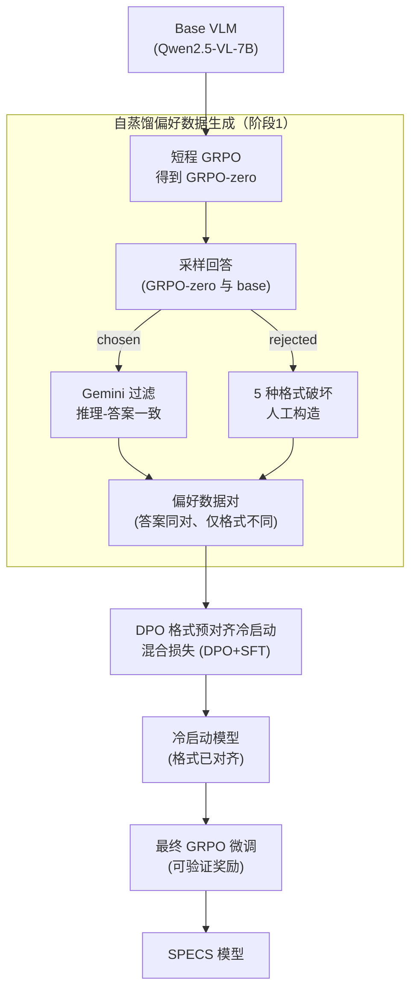

# Metis-SPECS: Decoupling Multimodal Learning via Self-distilled Preference-based Cold Start

**会议**: ICLR 2026  
**arXiv**: [2510.25801](https://arxiv.org/abs/2510.25801)  
**代码**: [项目页面](https://kwen-chen.github.io/SPECS-VL/)  
**领域**: 多模态VLM / 强化学习  
**关键词**: Cold Start, DPO, 解耦学习, 自蒸馏, VLM推理

## 一句话总结

提出 SPECS 三阶段冷启动框架——先通过自蒸馏生成偏好数据（仅区分格式差异），再用 DPO 做格式预对齐作为冷启动，最后接 GRPO 微调——解耦了格式学习和推理学习，实现 MEGA-Bench +4.1%、MathVista +12.2% 的一致性能提升。

## 研究背景与动机

**领域现状**：受 DeepSeek-R1 启发，越来越多的"MLLM-r1"工作将 RL（特别是 GRPO）应用于视觉语言模型提升推理能力。训练范式通常为：冷启动（SFT）→ RL微调。

**现有痛点**：(1) SFT 冷启动将推理范式、任务解答和输出格式耦合在一起学习，导致 instruction-style 过拟合，削弱 OOD 泛化能力；(2) 外部 teacher 模型蒸馏时，teacher 和 student 能力差距过大反而降低效果；(3) SFT-based 冷启动与后续 RL 的训练目标不一致（SFT 最大化 log-likelihood vs RL 优化奖励），影响训练稳定性。

**核心矛盾**：冷启动阶段如果学得太"深"（同时学格式+推理内容），会过拟合训练分布，反而限制了后续 RL 的探索空间和泛化能力。

**本文目标** 设计更适合 RL 后续训练的冷启动策略——让冷启动只学"浅层"的格式/结构规范，把"深层"的推理能力留给 RL 阶段。

**切入角度**：提出 Generalization Factor (GF) 度量量化不同冷启动方法的泛化能力，发现 DPO-based 冷启动比 SFT-based 泛化更好，由此设计解耦学习框架。

**核心 idea**：冷启动用 DPO 只学格式对齐（chosen/rejected 都答案正确但格式不同），推理能力交给 RL 学习——解耦学习目标避免 SFT 的过拟合陷阱。

## 方法详解

### 整体框架

SPECS 想解决的是 VLM 强化学习里"冷启动学太深"的问题：传统 SFT 冷启动把格式、解题、推理一锅炖，过拟合训练分布，反而压缩了后续 RL 的探索空间。它的思路是把冷启动从"模仿学习"换成"格式偏好对齐"，让冷启动只负责浅层的输出规范，把深层推理留给 RL。

整套流程分三阶段串起来。第一阶段先对 base model 做一轮简短的 GRPO，得到一个格式已经很规整的中间模型 GRPO-zero，再用它自蒸馏出偏好数据；第二阶段用 DPO 加 SFT 的混合损失对这批偏好数据做"格式预对齐"，这一步就是冷启动；第三阶段在对齐后的模型上接 GRPO 做最终 RL 微调。关键在于前两阶段共同把"格式"这件事提前对齐好，第三阶段的 RL 就能专注在推理能力上。GF（泛化因子）度量则是贯穿全文的诊断工具，用来量化"哪种冷启动泛化更好"，正是它的对比结果支撑了"用 DPO 而非 SFT 做冷启动"这个核心选择。

### 关键设计

**1. 自蒸馏偏好数据生成：让 chosen/rejected 只差在格式上**

DPO 要学"格式规范"而不是"推理内容"，前提是构造出来的 chosen 和 rejected 必须答案都正确、只在格式上有别——否则 DPO 学到的就混进了对错判断。SPECS 用自蒸馏来满足这个前提：先对 base model 做一轮简短 GRPO 得到 $\pi_{\text{GRPO-zero}}$，这个中间模型的格式准确率已经从 base 的 41.62% 提到 96.74%，能稳定产出结构规整的回答；再用 $\pi_{\text{GRPO-zero}}$ 采样作为 chosen response，并用 Gemini-2.5-flash 评估推理路径的一致性来过滤掉跑偏的样本；rejected response 则不重新生成，而是在 chosen 基础上做 5 种格式破坏（去标签、移位标签等）人工构造出来。

之所以不直接找外部大模型当 teacher，是因为 teacher 和 student 能力差距太大反而拉低效果——实验里 72B teacher 蒸馏就不如自蒸馏。自蒸馏既绕开了能力差距问题，又因为 chosen/rejected 仅在格式上不同，保证了 DPO 学到的确实是格式规范这一层。

**2. DPO-based 格式预对齐冷启动：用偏好对齐替代 SFT 模仿**

冷启动这一步在自蒸馏偏好数据上用 DPO 加 SFT 的混合损失训练：

$$\mathcal{L}_{\text{hybrid}} = \mathcal{L}_{\text{DPO}} + \lambda \mathcal{L}_{\text{SFT}}$$

其中 DPO 损失负责学习格式偏好，

$$\mathcal{L}_{\text{DPO}} = -\mathbb{E}\left[\log \sigma\left(\beta \log \frac{\pi_\theta(y_w|x)}{\pi_{\text{ref}}(y_w|x)} - \beta \log \frac{\pi_\theta(y_l|x)}{\pi_{\text{ref}}(y_l|x)}\right)\right]$$

SFT 项则在 chosen response 上做正则化，防止模型在偏好优化中偏移太远。这样设计的好处是训练目标的连贯性：DPO 优化的是一个隐式奖励模型，和后续 GRPO 的奖励驱动目标天然对齐，而 SFT 最大化 log-likelihood 与 RL 优化奖励之间存在目标断裂。实验也量化印证了这点——DPO 冷启动的泛化因子 GF 始终高于 SFT。

**3. Generalization Factor (GF) 度量：用一个分数判断冷启动好不好**

为了把"哪种冷启动泛化更好"从感觉变成可比的数字，SPECS 定义了泛化因子 GF：

$$\Gamma(n) = (1+\beta^2) \frac{G_{\text{ID}}(n) \cdot G_{\text{OOD}}(n)}{\beta^2 \cdot G_{\text{ID}}(n) + G_{\text{OOD}}(n)}$$

其中 $G_{\text{ID}}$ 和 $G_{\text{OOD}}$ 分别是分布内、分布外的性能增益，$n$ 是训练步数。它借用了 $F_\beta$-score 的形式并取 $\beta=2$ 偏重 OOD：这种调和均值的特性使得只要 ID 或 OOD 任一维度很差，总分就会被拉低，正好契合"泛化能力要两头都好"的评估需求。用 GF 一比，DPO 的 OOD 泛化优势随训练步数增加而扩大，这正是支撑全文"DPO 冷启动优于 SFT"结论的量化依据。

### 损失函数 / 训练策略

Stage 3 使用 GRPO，奖励函数 $R_{\text{total}} = R_{\text{format}} + R_{\text{acc}}$，其中格式奖励 0.5 分（结构正确），准确性奖励 1.0 分（答案正确）。选择题/数值题用规则判断，简答题用 GPT-4o 评判。学习率 $1 \times 10^{-6}$，batch size 128，每样本 8 rollouts。

## 实验关键数据

### 主实验

| 基准 | 指标 | SPECS (Ours-7B) | Backbone (QwenVL-2.5-7B) | Δ |
|------|------|-----------------|--------------------------|---|
| MEGA-Bench Core | Score | 39.17 | 35.07 | +4.1 |
| MathVista | Acc | 75.90 | 63.70 | +12.2 |
| MathVerse | Acc | 48.73 | 38.20 | +10.5 |
| MathVision | Acc | 29.50 | 25.40 | +4.1 |
| MMMU | Acc | 56.78 | 54.20 | +2.5 |

### 消融实验

| 配置 | AVG (冷启动/冷启动+RL) | 说明 |
|------|----------------------|------|
| Self-Distillation + Decoupled | 47.27 / 50.02 | 完整 SPECS |
| Qwen-72B Distillation | 44.90 / 48.98 | 外部 teacher 不如自蒸馏 |
| Qwen-32B Distillation | 42.89 / 46.43 | 更大能力差距更差 |
| Base model Distillation | 45.07 / 48.79 | 不经 GRPO-zero 的自蒸馏 |
| Coupled Data (DPO) | 47.67 / 48.68 | 耦合数据（格式+内容混合）效果差 |
| SFT-based GRPO | — / 47.65 | SFT 冷启动 vs DPO 冷启动 |
| DPO-based GRPO | — / 50.02 | DPO 冷启动更优 |

### 关键发现

- 自蒸馏优于外部 teacher 蒸馏：GRPO-zero 的格式准确率 96.74% 远高于 base model 的 41.62%，提供更高质量的 chosen response
- 解耦数据（格式差异）优于耦合数据（格式+正确性差异）：DPO 冷启动只学格式更有利于后续 RL
- DPO-based GRPO 比 SFT-based GRPO 训练更稳定（policy loss 曲线更平滑）且最终性能更高
- GF 度量验证了 DPO 的 OOD 泛化优势随训练步数增加而扩大

## 亮点与洞察

- "解耦学习"的核心洞察：浅层学习（格式/结构）和深层学习（推理能力）分别由 DPO 和 RL 承担，各司其职效果最好
- 自蒸馏避免了 teacher-student 能力差距问题，GRPO-zero 作为中间体既提升了数据质量又保持了分布一致
- DPO 与 RL 目标的对齐性解释了训练稳定性差异——SFT (模仿学习) → RL (奖励优化) 存在目标不连续，DPO (隐式奖励) → RL (显式奖励) 更连贯

## 局限与展望

- Stage 1 需要额外的 GRPO 预训练来生成 GRPO-zero，增加了计算开销
- 偏好数据中的 rejected response 通过规则破坏格式构造，可能不反映真实的格式错误分布
- chosen response 需要 Gemini-2.5-flash 评估推理一致性，依赖外部 API
- 目前仅在 7B 级别验证，更大规模模型上的有效性未知

## 相关工作与启发

- **vs SFT Cold Start (DeepSeek-R1 范式)**: SFT 同时学格式+推理导致 OOD 泛化差，SPECS 的 DPO 冷启动解耦了两个目标
- **vs Orsta-7B**: 使用相同训练数据，SPECS 在 MEGA-Bench 上高 0.86 分，在 MathVista 上高 5.7 分，证明框架优势
- **vs VL-Rethinker-7B**: 在 MEGA-Bench 和 MathVista 上持平或略超，但 SPECS 的冷启动策略更通用

## 评分

- 新颖性: ⭐⭐⭐⭐ 解耦学习 + DPO 冷启动 + 自蒸馏的组合是新颖的系统设计
- 实验充分度: ⭐⭐⭐⭐ 多基准覆盖全面，消融设计精细（蒸馏源/数据策略/冷启动方法）
- 写作质量: ⭐⭐⭐ 内容扎实但略显冗长，GF 度量的阐述可更简洁
- 价值: ⭐⭐⭐⭐ 为 VLM 的 RL 训练提供了更优的冷启动范式，对 MLLM-r1 生态有实践指导意义

<!-- RELATED:START -->

## 相关论文

- [\[ICLR 2026\] From Narrow to Panoramic Vision: Attention-Guided Cold-Start Reshapes Multimodal Reasoning](from_narrow_to_panoramic_vision_attention-guided_cold-start_reshapes_multimodal_.md)
- [\[ICLR 2026\] Self-Harmony: Learning to Harmonize Self-Supervision and Self-Play in Test-Time Reinforcement Learning](self-harmony_learning_to_harmonize_self-supervision_and_self-play_in_test-time_r.md)
- [\[ICML 2026\] Metis: Learning to Jailbreak LLMs via Self-Evolving Metacognitive Policy Optimization](../../ICML2026/reinforcement_learning/metis_learning_to_jailbreak_llms_via_self-evolving_metacognitive_policy_optimiza.md)
- [\[ICLR 2026\] Spotlight on Token Perception for Multimodal Reinforcement Learning](spotlight_on_token_perception_for_multimodal_reinforcement_learning.md)
- [\[ICLR 2026\] Self-Improving Skill Learning for Robust Skill-based Meta-Reinforcement Learning](self-improving_skill_learning_for_robust_skill-based_meta-reinforcement_learning.md)

<!-- RELATED:END -->
