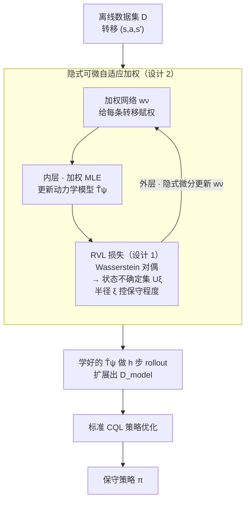

# ROMI: Model-based Offline RL via Robust Value-Aware Model Learning with Implicitly Differentiable Adaptive Weighting

**会议**: ICLR 2026  
**arXiv**: [2603.08118](https://arxiv.org/abs/2603.08118)  
**代码**: 无  
**领域**: 强化学习  
**关键词**: 离线RL, 模型基方法, 对抗性模型学习, Wasserstein对偶, 双层优化  

## 一句话总结
ROMI 通过 Wasserstein 对偶将动力学不确定集转化为状态不确定集来实现鲁棒的价值感知模型学习，并用隐式可微的自适应加权机制平衡动力学精度与价值感知，解决了 RAMBO 方法中的 Q 值低估和梯度爆炸问题，在 D4RL 和 NeoRL 上达到模型基离线 RL 的 SOTA。

## 研究背景与动机

**领域现状**：模型基离线 RL 通过学习环境动力学模型来增强数据集，用模拟 rollout 扩展训练数据。RAMBO 是代表性的对抗性模型学习方法，通过逆向优化动力学模型来产生保守的价值估计。

**现有痛点**：RAMBO 有一个致命缺陷——其权衡系数 $\lambda$ 必须保持极小（3e-4），稍微增大（0.05-0.1）就会导致 Q 值严重低估和梯度爆炸，训练崩溃。这使得 RAMBO 的保守性本质上不可控。

**核心矛盾**：模型学习需要同时满足两个目标——(a) 动力学精确性（拟合数据）和 (b) 价值感知（对策略可能利用的不准确区域保守）。RAMBO 通过直接在模型上做梯度对抗来平衡两者，但两个目标的梯度尺度不匹配导致不稳定。

**切入角度**：通过 Wasserstein 对偶将"模型空间的对抗"转化为"状态空间的不确定集"，使保守性可以通过不确定集半径 $\xi$ 平滑控制。

**核心 idea**：不对抗动力学模型本身，而是对抗预测状态的扰动来实现保守价值估计。

## 方法详解

### 整体框架
ROMI 要解决的是模型基离线 RL 里那对老矛盾：动力学模型既要拟合数据、又要对策略可能利用的不准区域保守。它的关键转念是把保守性从"对抗动力学模型本身"挪到"对抗预测状态的扰动"上。整体流程分内外两层：内层用加权 MLE 学一个动力学模型 $\hat{T}_\psi$；外层用一个加权网络决定每条转移在 MLE 里占多大权重，并由鲁棒价值感知损失（RVL）来更新它，两层之间的梯度靠隐式微分打通。学到的模型随后做 rollout 扩展数据集，最后接标准 CQL 做策略优化。

### 关键设计

**1. 鲁棒价值感知模型学习（RVL）：把模型空间的对抗换成状态空间的扰动**

RAMBO 直接在动力学模型上做梯度对抗，动力学精度和价值保守这两个目标的梯度尺度对不上，于是权衡系数 $\lambda$ 稍大就崩。RVL 换了个等价但稳定的口子：它不扰动模型，而是对模型预测出的下一状态施加一个 Wasserstein 球约束。关键是 Proposition 4.1 给出的对偶——在动力学不确定集 $\mathcal{M}_\xi$ 上取最坏价值，等于在 MLE 模型预测状态的邻域 $U_\xi(s')$ 上取最坏价值：

$$\min_{\hat{T} \in \mathcal{M}_\xi} \mathbb{E}_{s' \sim \hat{T}}\hat{V}(s') = \mathbb{E}_{s' \sim \hat{T}_{\text{MLE}}}\Big[\min_{\hat{s} \in U_\xi(s')}\hat{V}(\hat{s})\Big]$$

由此得到 RVL 损失 $\mathcal{L}_{\text{RVL}} = (\mathbb{E}_{\hat{s}' \sim \hat{T}}\hat{V}(\hat{s}') - \min_{\tilde{s}' \in U_\xi(s')}\hat{V}(\tilde{s}'))^2$。这样一来，保守程度完全由不确定集半径 $\xi$ 决定——半径越大越保守，而且在 $\xi \in \{0.01, 0.1, 1.0, 10\}$ 这么大的范围里都稳定，不像 RAMBO 的 $\lambda$ 那样一动就爆。Proposition 4.2 进一步保证由此得到的 Q 值是有界的：$Q_{\text{true}} - \frac{\gamma(\epsilon_1 + \epsilon_2)}{1-\gamma} \leq \hat{Q} \leq Q_{\text{true}} + \frac{\gamma\epsilon_1}{1-\gamma}$，既不会无限低估也不会爆炸，这正是 $\xi$ 可控的根源。

**2. 隐式可微自适应加权：让模型把精度花在价值敏感的区域**

均匀 MLE 在所有转移上花同等力气，但 rollout 时真正会被策略利用的只是少数价值敏感的状态-动作对，把精度浪费在别处就拉低了多步 rollout 的准确性。ROMI 用一个双层优化来分配精度：内层按加权 MLE 更新动力学模型 $\psi$，$\min_\psi \mathbb{E}[w_\nu(s,a,s')\log\hat{T}_\psi(s'|s,a)]$；外层则更新加权网络 $\nu$，让它去最小化前面的 $\mathcal{L}_{\text{RVL}}$。难点在于外层的梯度要穿过"内层已收敛的 $\psi^*(\nu)$"——ROMI 用隐式函数定理直接算这个梯度，不必把内层优化路径展开存下来，既省内存又更稳。效果上，加权网络把权重压向价值相关的转移，模型在那里更准，从而压低 rollout 中的模型利用；Proposition 4.3 给出这套双层优化 $\mathcal{O}(1/\sqrt{K})$ 的收敛率。

### 损失函数 / 训练策略
- 外层：$\min_\nu \mathcal{L}_{\text{RVL}}(\psi^*(\nu), \nu)$
- 内层：$\min_\psi \mathcal{L}_{\text{WSL}}(\psi, \nu) = \mathbb{E}[w_\nu \log\hat{T}_\psi]$
- 策略优化：用学到的模型做 rollout，标准 CQL 训练

## 实验关键数据

### 主实验
D4RL MuJoCo（12 个任务总分）：

| 方法 | 总分↑ | 类别 |
|------|------|------|
| RAMBO | 804.1 | 模型基对抗 |
| MOBILE | 857.7 | 模型基 |
| Count-MORL | 927.5 | 模型基 |
| **ROMI** | **953.5** | 模型基 |

亮点：hopper-mr 102.0（vs RAMBO 77.2），walker2d-me 113.3（vs RAMBO 73.7）。

NeoRL（9 个任务总分）：**472.2**（vs RAMBO 382.8，vs CQL 466.3）。

### 消融实验

| 配置 | 效果 | 说明 |
|------|------|------|
| 去除自适应加权 | 多步 rollout 预测误差增大，性能下降 | 证明动力学感知的重要性 |
| $\xi$ 敏感性 | 在 0.01-10 范围内稳定 | RAMBO 在 $\lambda \geq 0.05$ 就崩溃 |
| 大 $\xi$ | Q 值更低但无爆炸 | 保守性可控 |

### 关键发现
- ROMI 在 12 个 D4RL 任务中 11 个超越 RAMBO（+18.6% 总分）
- $\xi$ 的可控性是与 RAMBO 的核心区别——Q 值不会爆炸或坍缩
- 自适应加权在多步 rollout 中尤为关键——减少了 OOD 区域的模型利用

## 亮点与洞察
- **Wasserstein 对偶转化**非常优雅：把不稳定的"模型空间对抗"变为稳定的"状态空间扰动"，使保守性变成一个简单的半径参数 $\xi$。这个思路可以迁移到其他需要鲁棒性控制的场景。
- **双层优化实现价值-动力学协同**：外层驱动模型关注价值敏感区域，内层保证动力学精度——两个本来矛盾的目标通过分层解耦了。
- 在 RAMBO 完全失败的超参数区间（$\lambda \geq 0.05$），ROMI 仍然稳定工作，实用性大幅提升。

## 局限与展望
- 双层优化增加了计算开销（每步需要隐式微分）
- $\xi$ 仍需预先指定，没有运行时自适应调整
- 仅在 MuJoCo/NeoRL 等标准基准上验证，缺少更复杂环境的测试

## 相关工作与启发
- **vs RAMBO**: ROMI 完全解决了 RAMBO 的 $\lambda$ 敏感性问题，总分提升 18.6%
- **vs MOBILE**: MOBILE 使用模型不确定性估计（ensemble disagreement），ROMI 使用价值感知的 Wasserstein 鲁棒性，效果更好
- **vs Count-MORL**: Count-MORL 用计数型探索奖励，ROMI 通过自适应加权达到类似效果但更原理化

## 评分
- 新颖性: ⭐⭐⭐⭐ Wasserstein 对偶 + 隐式微分自适应加权的组合是新的，但各组件已有前人工作
- 实验充分度: ⭐⭐⭐⭐ D4RL + NeoRL 全面覆盖，稳定性分析充分
- 写作质量: ⭐⭐⭐⭐ 理论推导严谨，RAMBO 失败原因分析深入
- 价值: ⭐⭐⭐⭐ 为模型基离线 RL 的保守性控制提供了稳定可靠的方案

<!-- RELATED:START -->

## 相关论文

- [\[ICLR 2026\] BA-MCTS: Bayes Adaptive Monte Carlo Tree Search for Offline Model-based RL](bayes_adaptive_monte_carlo_tree_search_for_offline_model-based_reinforcement_lea.md)
- [\[ICLR 2026\] Transitive RL: Value Learning via Divide and Conquer](transitive_rl_value_learning_via_divide_and_conquer.md)
- [\[ICLR 2026\] From Observations to Events: Event-Aware World Model for Reinforcement Learning](from_observations_to_events_event-aware_world_model_for_reinforcement_learning.md)
- [\[ICLR 2026\] Model Predictive Adversarial Imitation Learning for Planning from Observation](model_predictive_adversarial_imitation_learning_for_planning_from_observation.md)
- [\[ICLR 2026\] The Sample Complexity of Online Reinforcement Learning: A Multi-Model Perspective](the_sample_complexity_of_online_reinforcement_learning_a_multi-model_perspective.md)

<!-- RELATED:END -->
