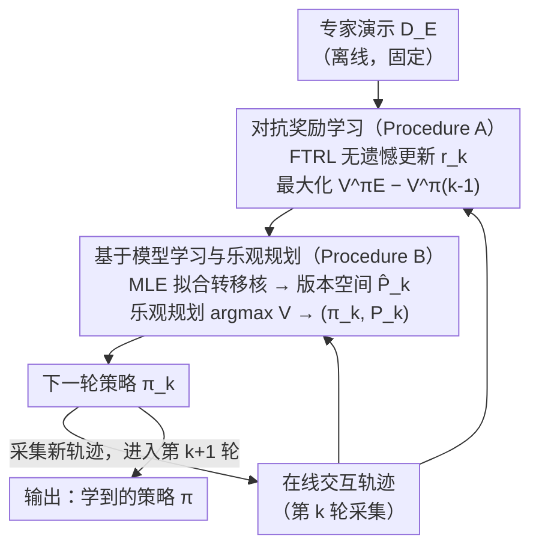

# Near-Optimal Second-Order Guarantees for Model-Based Adversarial Imitation Learning

**会议**: ICLR 2026  
**arXiv**: [2510.09487](https://arxiv.org/abs/2510.09487)  
**代码**: 无  
**领域**: 强化学习 / 模仿学习  
**关键词**: 对抗模仿学习, 基于模型的方法, 二阶界, 样本复杂度, 信息论下界

## 一句话总结

提出 MB-AIL（基于模型的对抗模仿学习）算法，在一般函数逼近下建立了无视域（horizon-free）的二阶样本复杂度上界，结合新构建的困难实例上的信息论下界，证明 MB-AIL 在在线交互的样本复杂度上达到极小极大最优（相差对数因子）。

## 研究背景与动机

模仿学习（IL）旨在从专家演示中学习策略，无需访问奖励信号。其主要方法分为两类：

**行为克隆（BC）**：直接用监督学习拟合专家策略

**对抗模仿学习（AIL）**：通过对抗框架对齐专家与学习者的状态-动作分布

### 核心问题

经验上 AIL 在少量专家演示时通常优于 BC，但其背后的理论理解仍不完整。本文聚焦于两个关键问题：

**在线交互的精确收益**：在线交互究竟为模仿学习带来了多大的样本效率提升？

**随机性的影响**：专家策略和环境动态的随机性如何影响样本复杂度？

### 已有工作的不足

| 已有工作 | 限制 |
|---------|------|
| Xu et al. (2023) | 仅限表格MDP，确定性专家 |
| Viano et al. (2024) | 仅限线性MDP |
| Xu et al. (2024) OPT-AIL | 一般函数逼近，但非基于模型，未给出二阶界，在线交互复杂度较高 |
| Foster et al. (2024) | BC理论，无在线交互的下界 |

没有一个已有工作同时给出了：(1) 一般函数逼近下的结果，(2) 二阶（方差相关）界，(3) 在线交互的信息论下界。

## 方法详解

### 整体框架

MB-AIL 的出发点是一个结构性假设：模仿学习的策略空间 $\Pi$ 可以拆解为奖励类 $\mathcal{R}$ 与模型类 $\mathcal{P}$ 的组合，于是整个算法在每一轮交互中并行做两件估计、再合成下一轮策略——用专家演示对抗式地估计当前最难区分专家与学习者的奖励（对抗奖励学习），用环境交互数据极大似然地拟合转移核、并在版本空间里做乐观规划得到下一轮策略（基于模型学习与乐观规划）。新策略又去环境里采集轨迹，回到下一轮，如此迭代 $K$ 轮直到收敛。把奖励和模型分开估计，正是后面二阶分析能把界写成方差相关、且能在 $\mathcal{R}$ 或 $\mathcal{P}$ 较简单时占便宜的关键。

> 框架图画的是 MB-AIL 的**每轮算法回环**（设计 1、2）；设计 3「二阶分析」是套在整个回环之上的证明技术，无对应算法节点。

### 关键设计

**1. 对抗奖励学习（Procedure A）：在没有真实奖励时把"对齐专家"变成一个在线优化目标**

AIL 的困难在于奖励未知，无法直接评估策略好坏。MB-AIL 把奖励学习写成一个极小极大博弈：奖励函数想最大化专家策略 $\pi_E$ 与当前学习者策略 $\pi_{k-1}$ 的价值差距，而策略想缩小这个差距。具体地，第 $k$ 轮用在线轨迹和离线专家数据构造经验损失 $\mathcal{L}_{k-1}(r) = \hat{V}_{1,P^*,r}^{\pi_{k-1}}(s_1) - \hat{V}_{1,P^*,r}^{\pi_E}(s_1)$，再用 Follow-the-Regularized-Leader（FTRL）这种无遗憾在线算法在奖励类 $\mathcal{R}$ 上更新。FTRL 的无遗憾性质把奖励估计误差控制在 $O(1/\sqrt{K})$，这也是后面把总误差归结到 $\log\mathcal{N_R}$（奖励类覆盖数）而非整个策略空间复杂度的来源。

**2. 基于模型学习与乐观规划（Procedure B）：用环境数据单独喂模型，让样本效率吃到结构红利**

如果像无模型方法那样把奖励和动态揉在一起估计，复杂度只能跟着整个 $\Pi$ 走。MB-AIL 改为对转移核单独做极大似然，并按对数似然差不超过 $\beta$ 构造一个版本空间 $\hat{\mathcal{P}}_k = \{P \in \mathcal{P}: \sum_{(s,a,s') \in \mathcal{D}_k} \log P(s'|s,a) \geq \max_{\tilde{P}} \sum \log \tilde{P}(s'|s,a) - \beta\}$，把所有与数据足够吻合的模型都保留下来。随后在这个版本空间里做乐观规划 $(\pi_k, P_k) = \arg\max_{\pi, P \in \hat{\mathcal{P}}_k} V_{1,P,r_k}^\pi(s_1)$，对当前奖励 $r_k$ 取最乐观的模型与策略，从而驱动探索。这一步让模型学习的代价只跟模型类覆盖数 $\log\mathcal{N_P}$ 和它的 Eluder 维度 $d_E$ 挂钩，是"$\mathcal{R}$ 或 $\mathcal{P}$ 简单就能本质性省样本"的技术落点。

**3. 二阶分析：把方差显式写进界里，统一确定性与随机性两种极端**

一阶界对所有问题一视同仁地付出 $O(1/\epsilon^2)$，无法解释为什么接近确定性的系统更好学。MB-AIL 把遗憾分解成奖励误差和策略误差两部分：奖励误差用 Bernstein 型集中不等式得到与方差 $\sigma^2$ 相关的界，策略误差则借助 Eluder 维度配合方差转换引理（Variance Conversion Lemma）同样换成二阶界。两条线索合起来，最终上界正比于 $\sigma^2$，且对视域 $H$ 只有对数依赖（horizon-free）——当 $\sigma^2 \to 0$ 系统趋于确定时，复杂度自然从 $O(1/\epsilon^2)$ 收紧到 $O(1/\epsilon)$，不需要人为分情形讨论。

### 损失函数 / 训练策略

理论层面三个组件各司其职：奖励用 FTRL 做对抗式优化，自监督地拉大专家与学习者的价值差距；模型用极大似然估计；策略用基于版本空间的乐观探索。Section 6 给出的实际实现把这三者替换成标准深度学习组件——奖励网络采用带梯度惩罚的 Wasserstein GAN 式判别器，模型部分用 7 个世界模型的集成做 MLE 训练（集成方差近似版本空间里的乐观/不确定性），策略优化则交给 SAC（Soft Actor-Critic）。

## 实验关键数据

### 理论结果对比

| 方法 | 专家演示复杂度 | 在线交互复杂度 | 二阶？ |
|------|-------------|-------------|--------|
| MB-TAIL (Xu, 2023) | $\tilde{O}(H^{3/2}|S|/\epsilon)$ | $\tilde{O}(H^3|S|^2|A|/\epsilon)$ | 否 |
| OPT-AIL (Xu, 2024) | $\tilde{O}(H^2 \log\mathcal{N_R}/\epsilon^2)$ | $\tilde{O}(H^4 d_{GEC} \log(\mathcal{N_R}\mathcal{N_Q})/\epsilon^2)$ | 否 |
| **MB-AIL (本文)** | $\tilde{O}(\sigma^2 \log\mathcal{N_R}/\epsilon^2)$ | $\tilde{O}(\sigma^2 (d_E \log\mathcal{N_P} + \log\mathcal{N_R})/\epsilon^2)$ | **是** |
| **下界（本文）** | $\Omega(\sigma^2/\epsilon^2)$ | $\Omega(\sigma^2 \log^2|\mathcal{P}| e^{-N}/\epsilon^2)$ | **是** |

### GridWorld 实验

| 实验设置 | 发现 |
|---------|------|
| 变化奖励空间大小 | 小奖励空间时 AIL 显著优于 BC |
| 变化环境随机性 | 更确定性环境下两者都改善，AIL 始终优于 BC |

### MuJoCo 实验

| 环境 | Expert | BC | GAIL | OPT-AIL | **MB-AIL** |
|------|--------|-----|------|---------|-----------|
| Hopper | 3609 | 2857 | 3212 | 3439 | **3451** |
| Walker2d | 4637 | 2697 | 3777 | 4238 | 4170 |
| Humanoid | 5885 | 343 | 1614 | 2014 | **5816** |

### 交互效率对比

| 环境 | OPT-AIL | **MB-AIL** | 提升 |
|------|---------|-----------|------|
| Hopper | 210K | **60K** | 3.5x |
| Walker2d | 320K | **120K** | 2.7x |
| Humanoid | 220K | **90K** | 2.4x |

### 关键发现

1. **二阶界的意义**：当系统接近确定性时（$\sigma^2 \to 0$），样本复杂度可以从 $O(1/\epsilon^2)$ 改善为 $O(1/\epsilon)$，精确刻画了随机性的定量影响
2. **Horizon-free**：与已有工作不同，本文的上界仅对 $H$ 有对数依赖，消除了对长视域问题的指数惩罚
3. **在线交互的极小极大最优性**：当专家数据有限时（$N \ll \log^2|\mathcal{P}|$），MB-AIL 的在线交互复杂度 $\Omega(\sigma^2 \log^2|\mathcal{P}|/\epsilon^2)$ 与下界匹配相差对数因子
4. **BC vs AIL 的精确分离**：
    - AIL 更优：当奖励类 $\mathcal{R}$ 结构简单时（$\log\mathcal{N_R}$ 小）
    - BC 更优：当专家策略确定但环境高度随机时
5. **Humanoid 环境的突破**：MB-AIL 在高维 Humanoid 上达到了几乎等于专家的性能（5816 vs 5885），远超其他基线

## 亮点与洞察

1. **分解思想的力量**：将策略空间分解为 $\Pi = \mathcal{R} \times \mathcal{P}$ 是本文的核心洞察。当 $\mathcal{R}$ 或 $\mathcal{P}$ 的复杂度远低于 $\Pi$ 时，基于模型的方法可以获得本质性的统计优势
2. **二阶分析的自然性**：方差相关的界统一了确定性和随机性情形，避免了人为区分
3. **理论与实践的一致性**：GridWorld 实验精确验证了理论预测（小奖励空间 → AIL优势；确定性环境 → 两者改善）
4. **困难实例构造的巧妙性**：通过两种情形（策略难学 vs 模型难学）的组合，区分了专家演示和在线交互各自负责估计的量
5. **实际算法的简洁性**：实际实现仅需要标准组件（世界模型集成 + SAC + GAN判别器）

## 局限与展望

1. **专家演示复杂度的对数差距**：上界为 $\tilde{O}(\sigma^2 \log\mathcal{N_R}/\epsilon^2)$，下界为 $\Omega(\sigma^2/\epsilon^2)$，存在 $\log|\mathcal{R}|$ 的差距。作者猜测此差距可能是本质性的
2. **时间齐次假设**：理论分析假设转移核和奖励不随时间变化，限制了对更一般MDP的适用性
3. **实现中的近似**：实际算法中的乐观规划通过模型集成近似，理论保证的严格性有所降低
4. **MuJoCo实验的限制**：仅使用了3个环境和64条专家轨迹，规模较小
5. **与离线BC的公平对比**：BC不需要在线交互，两者的比较并非完全对等

## 相关工作与启发

### 理论类

- **Foster et al. (2024)**：BC的二阶界和信息论下界，是本文在AIL方向的对应
- **Wang et al. (2024)**：基于模型的 RL 的二阶分析框架，本文的分析技术主要基于此
- **Xu et al. (2024) OPT-AIL**：一般函数逼近下的AIL上界，但非基于模型

### 实践类

- **GAIL (Ho & Ermon, 2016)**：经典的对抗模仿学习方法
- **SAC (Haarnoja et al., 2018)**：实际算法中使用的策略优化方法
- **世界模型集成**：实际实现中的模型不确定性量化方法

### 对研究的启发

1. 基于模型的方法在样本效率上有理论保证的本质优势
2. 二阶分析是理解随机性影响的正确框架
3. 上下界的同时建立对于理解问题的本质困难度至关重要

## 评分

- 新颖性: ⭐⭐⭐⭐⭐ — 首次在一般函数逼近下给出AIL的二阶上下界，首个AIL在线交互的信息论下界
- 实验充分度: ⭐⭐⭐ — GridWorld验证了理论，MuJoCo展示了实用性，但环境数量和规模偏少
- 写作质量: ⭐⭐⭐⭐ — 理论严谨，39页内容详尽，但密度较高
- 价值: ⭐⭐⭐⭐⭐ — 为模仿学习的理论基础做出了重要贡献，清晰回答了"在线交互的价值"这一核心问题

<!-- RELATED:START -->

## 相关论文

- [\[ICLR 2026\] Model Predictive Adversarial Imitation Learning for Planning from Observation](model_predictive_adversarial_imitation_learning_for_planning_from_observation.md)
- [\[ICLR 2026\] On Discovering Algorithms for Adversarial Imitation Learning](on_discovering_algorithms_for_adversarial_imitation_learning.md)
- [\[ICLR 2026\] Latent Wasserstein Adversarial Imitation Learning](latent_wasserstein_adversarial_imitation_learning.md)
- [\[NeurIPS 2025\] A Near-optimal, Scalable and Parallelizable Framework for Stochastic Bandits Robust to Adversarial Corruptions and Beyond](../../NeurIPS2025/reinforcement_learning/a_nearoptimal_scalable_and_parallelizable_framework_for_stoc.md)
- [\[ICLR 2026\] The Sample Complexity of Online Reinforcement Learning: A Multi-Model Perspective](the_sample_complexity_of_online_reinforcement_learning_a_multi-model_perspective.md)

<!-- RELATED:END -->
