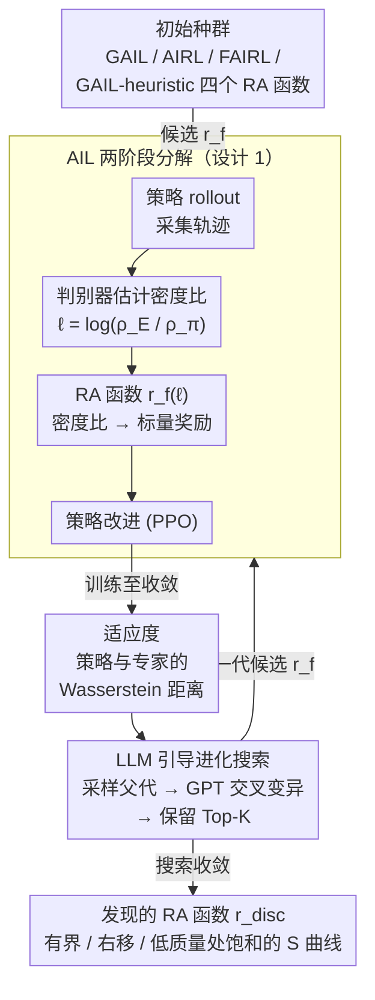

# On Discovering Algorithms for Adversarial Imitation Learning

**会议**: ICLR 2026  
**arXiv**: [2510.00922](https://arxiv.org/abs/2510.00922)  
**代码**: 无  
**领域**: 模仿学习 / 元学习  
**关键词**: 对抗性模仿学习, 奖励赋值函数, LLM引导进化, 元学习, 训练稳定性

## 一句话总结

提出 DAIL——首个元学习对抗性模仿学习算法：将 AIL 分解为密度比估计和奖励赋值(RA)两阶段，用 LLM 引导的进化搜索自动发现最优 RA 函数 $r_{\text{disc}}$，在未见环境和策略优化器上泛化并超越所有人工设计基线。

## 研究背景与动机

**领域现状**：对抗性模仿学习(AIL)是有限专家示范下最有效的模仿学习范式。AIL 受 GAN 启发，将学习过程形式化为判别器(区分专家与策略轨迹)和策略(生成接近专家的轨迹)之间的对抗博弈。从散度最小化的视角看，AIL 自然分解为两个阶段：(1) **密度比估计**(DR)——判别器估计状态-动作对在专家与策略下的占有度之比 $\frac{\rho_E}{\rho_\pi}$；(2) **奖励赋值**(RA)——将密度比映射为标量奖励信号用于策略优化。

**现有痛点**：
- AIL 训练不稳定，类似 GAN 的训练困难——梯度信号质量直接影响策略改进效果
- 大量研究集中在改进阶段(1)的判别器训练（如 C-GAIL、Diffusion-Reward），而 RA 函数(阶段2)被严重忽视
- 现有 RA 函数(GAIL 的 softplus、AIRL 的 log-ratio、FAIRL 的指数衰减)均从 $f$-散度理论人工推导，依赖人类直觉，可能远非最优

**核心矛盾**：人工设计的 RA 函数在理论优雅性和实际训练稳定性之间存在根本冲突——GAIL 对低质量状态-动作对过度奖励，FAIRL 的指数衰减导致训练不稳定，AIRL 的负奖励诱导提前终止。

**本文方案**：跳出人工设计范式，用 LLM 引导的进化搜索直接从性能驱动发现最优 RA 函数，实现 AIL 算法的元学习。

## 方法详解

### 整体框架

DAIL 把"设计 AIL 算法"本身变成一个可被搜索的优化问题：外层用 LLM 引导的进化搜索去优化奖励赋值(RA)函数 $r_f$，内层则在给定 $r_f$ 后跑标准 AIL 循环（策略 rollout → 判别器训练做密度比估计 → 用 $r_f$ 赋值奖励 → 策略改进），并以训练后策略与专家的 Wasserstein 距离衡量这个 $r_f$ 好不好。整体可写成一个双层优化：$\min_f \mathcal{W}(\rho_E, \rho_{\pi^*}; f)$，约束为 $\pi^* = \arg\max_\pi r_f(\rho_E \| \rho_\pi)$。

### 关键设计

**1. AIL 的两阶段分解：把被忽视的奖励赋值单独拎出来**

DAIL 的第一步是把 AIL 的奖励信号形成过程拆成两个独立阶段——密度比估计(DR)和奖励赋值(RA)，从而把过去被混在一起、且被研究严重忽视的 RA 函数暴露为可单独优化的对象。判别器先估出对数密度比 $\ell = \log \frac{\rho_E(s,a)}{\rho_\pi(s,a)}$，而 RA 函数 $r_f(\ell)$ 负责把这个比值映射成喂给策略的标量奖励。不同的人工 RA 函数其实就是不同 $f$-散度的推导结果，但它们对密度比的响应曲线差异巨大，直接决定了梯度信号的信息量和训练稳定性：FAIRL 的 $-\ell \cdot e^{\ell}$ 指数无界衰减导致训练不稳定，AIRL 的线性 $\ell$ 产生大量负奖励诱导提前终止，GAIL 的 $\text{softplus}(\ell)$ 对低质量样本过度奖励，而 GAIL-heuristic 的 $-\text{softplus}(-\ell)$ 仅激励匹配、以负奖励为主。把这四个公认基线并排看清它们各自的病灶，正是后续搜索的起点。

| 散度类型 | 算法 | RA 函数 $r_f(\ell)$ | 特性 |
|---------|------|---------------------|------|
| Forward KL | FAIRL | $-\ell \cdot e^{\ell}$ | 指数无界衰减，训练不稳定 |
| Backward KL | AIRL | $\ell$ | 线性，大量负奖励→提前终止 |
| Jensen-Shannon | GAIL | $\text{softplus}(\ell)$ | 对低质量样本过度奖励 |
| 未命名 $f$-div | GAIL-heuristic | $-\text{softplus}(-\ell)$ | 仅激励匹配，负奖励为主 |

**2. LLM 引导的进化搜索：用黑箱优化绕开不可行的双层反传**

双层优化原则上需要对整个 AIL 训练循环反向传播，计算上不可行，所以 DAIL 改用黑箱进化搜索来发现 RA 函数。它以 GAIL、AIRL、FAIRL、GAIL-heuristic 四个 RA 函数作为初始种群，每个候选 $r_f$ 都训练一个策略到收敛、再用 rollout 与专家的 Wasserstein 距离作为适应度。变异和交叉交给 LLM 来做：采样一对父代 $\{r_{f_1}, r_{f_2}\}$ 连同它们的适应度送入 GPT-4.1-mini，提示其融合父代优点生成子代 $r_{f_3}$；每代评估 $M \times N$ 个候选并保留 Top-$K$ 进入下一代。关键在于 RA 函数直接以 Python 代码表示，既保证了可解释性又留足了表达力，让 LLM 能真正改写函数形状而非只调参数。整个搜索在 Minatar SpaceInvaders 上进行，评估约 200 个候选函数、耗时约 3 小时。

**3. 发现的 RA 函数 $r_{\text{disc}}$：一条有界、右移、低质量处饱和的 S 曲线**

搜索最终收敛到的最优 RA 函数为 $r_{\text{disc}}(x) = 0.5 \cdot \text{sigmoid}(x) \cdot [\tanh(x) + 1]$，它的几条特性恰好对症了前面那些基线的病灶。它把奖励限制在有界区间 $[0,1]$——有界奖励早已被证明能稳定深度 RL 训练；它是一条 S 型曲线，但梯度比标准 sigmoid 更陡峭且整体右移，因而在 $x \in [-1,0]$ 这一最吃紧的区间提供信息丰富的梯度；更重要的是它对 $x \lesssim -1.8$（接近随机策略行为）饱和至零，等于主动过滤掉低质量状态-动作对的噪声奖励，而 GAIL 在 $x=-2$ 处还在给高正奖励。两次独立运行进化搜索得到的 Top-5 函数结构高度相似，说明这条解并非偶然，搜索过程本身是稳定的。

## 实验结果

### 主实验：跨环境泛化

在搜索环境外的 Brax (MuJoCo) 和 Minatar 基准上评估，所有方法共享相同超参数，仅 RA 函数不同：

| 方法 | Brax Mean ↑ | Brax Median ↑ | Minatar Mean ↑ | Minatar Median ↑ |
|------|------------|--------------|----------------|-----------------|
| GAIL | ~0.65 | ~0.70 | ~0.55 | ~0.60 |
| AIRL | ~0.70 | ~0.75 | ~0.30 | ~0.25 |
| FAIRL | ~0.40 | ~0.35 | ~0.35 | ~0.30 |
| GAIL-heuristic | ~0.55 | ~0.60 | ~0.25 | ~0.20 |
| **DAIL** | **~0.75** | **~0.72** | **~0.85** | **~0.90** |

关键发现：
- DAIL 在 Minatar 上**大幅**超越所有基线（Mean 和 Median 均显著领先）
- 在 Brax 上 DAIL 多数指标最优，Mean 统计显著优于所有基线
- AIRL 和 GAIL-heuristic 在 Minatar 上表现差——负奖励为主激励提前终止

### 消融实验：分析 DAIL 优势来源

| 分析维度 | 发现 | 量化指标 |
|---------|------|---------|
| 搜索环境泛化 | SpaceInvaders 上搜索→其他环境泛化 | $\mathcal{W}$ 距离降低 20%，归一化回报提升 12.5% |
| 策略优化器泛化 | PPO 搜索→A2C 上评估 | DAIL 在 A2C 上同样显著优于 GAIL |
| 判别器正则化鲁棒性 | 5 种正则化策略(none/w-decay/entropy/spectral/grad-pen) | DAIL 在 3/5 种设置下超越 GAIL |
| 策略熵收敛 | DAIL 策略收敛到更低熵 | 接近真实奖励 PPO 基线的熵水平 |
| 组件消融 | $r_{\text{disc}}$ vs sigmoid vs $0.5[\tanh+1]$ | $r_{\text{disc}}$ > $0.5[\tanh+1]$ > sigmoid |
| 搜索稳定性 | 两次独立进化搜索 | Top-5 RA 函数结构高度相似 |

策略熵分析揭示 DAIL 训练更稳定的核心原因：$r_{\text{disc}}$ 对 $x \lesssim -1.8$ 饱和至零，过滤随机策略行为产生的噪声奖励；GAIL 在 $x=-2$ 仍给出高正奖励，对低质量行为过度敏感，导致奖励信号嘈杂。

### 不同判别器正则化下的详细性能

| 算法 | 环境 | None | W-Decay | Entropy | Spectral | Grad-Pen |
|------|------|------|---------|---------|----------|----------|
| DAIL | Asterix | 0.88±0.03 | 1.33±0.03 | 0.12±0.01 | 0.92±0.03 | 0.66±0.03 |
| DAIL | Breakout | 0.81±0.07 | 0.74±0.08 | 0.91±0.02 | 0.77±0.07 | 1.01±0.00 |
| DAIL | SpaceInv | 0.71±0.07 | 0.81±0.01 | 0.80±0.01 | 0.70±0.09 | 0.90±0.00 |
| DAIL | **Overall** | **0.80±0.03** | **0.96±0.03** | 0.61±0.01 | **0.80±0.04** | **0.85±0.01** |
| GAIL | Asterix | 1.18±0.03 | 1.44±0.03 | 0.48±0.03 | 0.22±0.03 | 0.52±0.04 |
| GAIL | Breakout | 0.76±0.07 | 0.52±0.10 | 0.89±0.01 | 0.33±0.10 | 0.85±0.07 |
| GAIL | SpaceInv | 0.61±0.09 | 0.34±0.09 | 0.81±0.00 | 0.42±0.08 | 0.81±0.03 |
| GAIL | **Overall** | 0.85±0.04 | 0.76±0.04 | **0.73±0.01** | 0.32±0.05 | 0.73±0.03 |

## 论文评价

### 优点
- **问题定位精准**：首次系统性揭示 RA 函数对 AIL 训练稳定性的关键影响，填补了领域空白
- **方法论创新**：将元学习引入 AIL 的 RA 函数发现，实现从人工设计到数据驱动的范式转变
- **分析深入**：通过密度比分布、策略熵、组件消融等多角度分析清晰解释了 DAIL 的优势来源
- **泛化性强**：跨环境(Brax+Minatar)、跨优化器(PPO→A2C)、跨正则化策略的一致性优势

### 不足
- 发现的 $r_{\text{disc}}$ 不对应有效 $f$-散度，缺乏理论收敛保证
- RA 函数在训练过程中保持静态，未利用训练状态信息（如剩余更新步数、观测到的密度比分布）进行自适应调整
- 搜索仅在单一环境(SpaceInvaders)上进行，更大规模环境集合上的搜索可能发现更强函数
- 未在更复杂基准(Atari-57/Procgen)上验证

### 评分
⭐⭐⭐⭐ — 问题定位精准、方法新颖、分析深入，但缺乏理论保证且搜索规模受限。

<!-- RELATED:START -->

## 相关论文

- [\[ICLR 2026\] Latent Wasserstein Adversarial Imitation Learning](latent_wasserstein_adversarial_imitation_learning.md)
- [\[ICLR 2026\] Model Predictive Adversarial Imitation Learning for Planning from Observation](model_predictive_adversarial_imitation_learning_for_planning_from_observation.md)
- [\[ICLR 2026\] Near-Optimal Second-Order Guarantees for Model-Based Adversarial Imitation Learning](near-optimal_second-order_guarantees_for_model-based_adversarial_imitation_learn.md)
- [\[ICLR 2026\] Learning to Generate Unit Test via Adversarial Reinforcement Learning](learning_to_generate_unit_test_via_adversarial_reinforcement_learning.md)
- [\[ICLR 2026\] Boolean Satisfiability via Imitation Learning](boolean_satisfiability_via_imitation_learning.md)

<!-- RELATED:END -->
