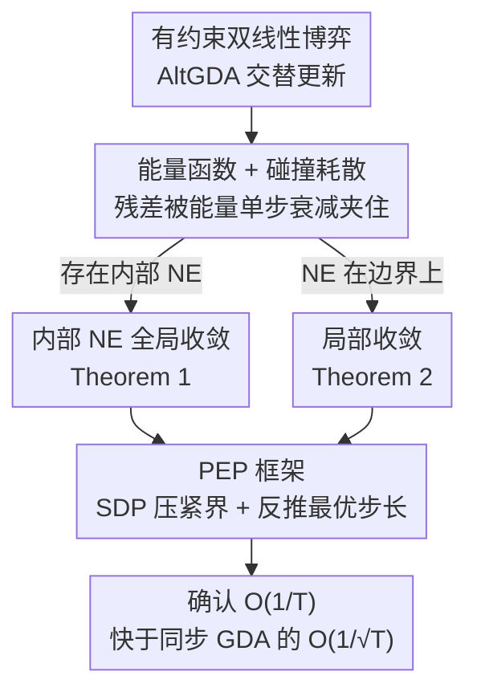

# On the $O(1/T)$ Convergence of Alternating Gradient Descent-Ascent in Bilinear Games

**会议**: ICLR 2026  
**arXiv**: [2510.03855](https://arxiv.org/abs/2510.03855)  
**代码**: 无  
**领域**: 强化学习 / 博弈论 / 优化  
**关键词**: 交替梯度下降上升, 双线性博弈, Nash均衡, 收敛速率, 性能估计编程

## 一句话总结
首次证明交替梯度下降上升（AltGDA）在有约束双线性零和博弈中以 $O(1/T)$ 速率收敛到Nash均衡（存在内部NE时），比同步GDA的 $O(1/\sqrt{T})$ 快，用能量函数衰减刻画轨迹碰撞边界时的"摩擦"效应，并通过性能估计编程（PEP）进一步优化步长。

## 研究背景与动机

**领域现状**：无遗憾学习是计算博弈均衡的主要方法，用于超人级扑克AI、Stratego、Diplomacy等。理论上乐观方法（如OGDA）能达到 $O(1/T)$，但实践中CFR+交替策略更常用。交替（两玩家轮流更新）作为numerical trick极大改善了实际性能。

**现有痛点**：交替在实践中效果远好于同步更新，但理论理解极为有限。无约束情况下AltGDA已被证明 $O(1/T)$，但**有约束情况（对应标准Nash均衡定义）完全没有理论支持**——这是一个悬而未决的开放问题。

**核心矛盾**：同步GDA在有约束双线性博弈中只有 $O(1/\sqrt{T})$，乐观方法达到 $O(1/T)$ 但需要额外结构。AltGDA实证显示 $O(1/T)$ 行为，但无人证明。

**本文目标** 证明AltGDA在有约束设置下的 $O(1/T)$ 收敛率。

**切入角度**：发现AltGDA轨迹有两阶段行为——先碰撞simplex边界被"弹回"，再在内部循环。碰撞导致能量函数衰减，衰减量恰好约束了遗憾残差项的可加性。

**核心 idea**：AltGDA轨迹碰撞约束边界时产生的"能量耗散"使得残差项可加，从而将无约束的 $O(1/T)$ 结果推广到有约束设置。

## 方法详解

### 整体框架
论文要回答的是一个纯理论问题：交替梯度下降上升（AltGDA）在**有约束**双线性零和博弈 $\min_{\mathbf{x}\in\mathcal{X}}\max_{\mathbf{y}\in\mathcal{Y}}\ \mathbf{y}^\top A\mathbf{x}$ 上到底收敛多快。算法本身很简单：先更新 $\mathbf{x}^{t+1} = \Pi_\mathcal{X}(\mathbf{x}^t - \eta A^\top \mathbf{y}^t)$，再用 $\mathbf{x}$ 的**新值**更新 $\mathbf{y}^{t+1} = \Pi_\mathcal{Y}(\mathbf{y}^t + \eta A \mathbf{x}^{t+1})$，两个玩家轮流走、各自投影回单纯形。收敛用遍历平均策略 $(\bar{\mathbf{x}}^T,\bar{\mathbf{y}}^T)$ 的 Duality Gap 来度量。整篇证明的脉络是：先造一个能量函数把"投影碰撞边界会耗能"这件事量化出来，再分别在"有内部均衡"和"无内部均衡"两种情形下把这份耗能转成对遗憾残差的界，最后用 PEP 把这套结论在数值上压到最紧并反推最优步长。

### 关键设计

**1. 能量函数与"碰撞耗散"机制：把投影边界的损耗变成可加的残差界**

无约束情形下 AltGDA 的 $O(1/T)$ 早已被证明，关键就卡在投影上——一旦策略被约束在单纯形内，标准分析里的残差项不再恒为零，整套递推就断了。本文的破局点是构造能量函数

$$\mathcal{E}(\mathbf{x}^t, \mathbf{y}^t) = \|\mathbf{x}^t - \mathbf{x}^*\|^2 + \|\mathbf{y}^t - \mathbf{y}^*\|^2 - \eta(\mathbf{y}^t)^\top A \mathbf{x}^t$$

并盯住每步的遗憾残差 $r_t$。无约束时 $r_t \equiv 0$ 是已知结论；有约束时投影的一阶最优条件只能保证 $r_t \geq 0$，单凭这点不够。论文真正证出来的是 $r_t \leq \mathcal{E}^t - \mathcal{E}^{t+1}$——残差被能量的单步衰减夹住了。物理图景非常直观：轨迹一旦撞上单纯形边界，投影就把它"弹回"内部并损耗掉一部分能量，能量随之单调递减，于是 $\sum_t r_t$ 被首末能量差控制为有界，遍历平均的 Duality Gap 自然以 $O(1/T)$ 衰减。

**2. 内部NE的全局 $O(1/T)$ 收敛（Theorem 1）：当均衡落在单纯形内部时，全局加速**

第一个定理处理博弈存在**内部** Nash 均衡（最优策略每个分量都严格大于 0）的情形。此时只要步长满足

$$\eta \leq \frac{1}{\|A\|_2} \min\{\min_i x_i^*, \min_j y_j^*\},$$

上面的能量耗散论证就能在全局生效，给出

$$\text{DualityGap}(\bar{\mathbf{x}}^T, \bar{\mathbf{y}}^T) \leq \frac{9 + 4\eta\|A\|_2}{\eta T}.$$

这是**首个在有约束 minimax 设置下严格证明交替更新快于同步更新的结果**：同步 GDA 在同样问题上只有 $O(1/\sqrt{T})$，而交替凭这套碰撞耗散机制直接进到 $O(1/T)$。代价是步长上界依赖均衡的最小支撑概率，均衡越贴近边界、可用步长越小。

**3. 局部 $O(1/T)$ 收敛（Theorem 2）：均衡在边界上时，退而求其次但去掉了对博弈参数的依赖**

大多数矩阵博弈的均衡并不在内部，Theorem 1 的步长条件会失效，于是第二个定理转为局部结论。做法是先圈定一个 NE 邻域 $S_0$：在这个区域内轨迹不会再去触碰那些非支撑面的边界，能量虽然可能局部回升，但累计增量被牢牢压在 $\delta^2/128$ 以内，耗散论证依旧成立。这样得到的收敛界为

$$\frac{9 + 7\eta\|A\|_2 + \delta^2/128}{\eta T},$$

仍是 $O(1/T)$。它的步长要求 $\eta \leq \frac{1}{2\|A\|_2}$ **与博弈参数无关**，比 Theorem 1 更实用；代价是只保证从邻域内出发能收敛，没有给出如何先走进这个邻域的保证。

**4. 性能估计编程（PEP）框架：用 SDP 把收敛界数值压到最紧并反推最优步长**

解析证明给的是上界，未必最紧，论文再用性能估计编程（PEP）从数值上逼真实速率。思路是把"最坏情况下走 $T$ 步的性能"建模成一个半正定规划（SDP），在给定步长下解出最坏 Duality Gap，再对步长做网格搜索找最优配置。结果很说明问题：PEP 解出的最优步长呈现周期性的缓慢衰减模式（约 $O(1/(\log T)^\alpha)$），对应的 Duality Gap 确认趋向 $O(1/T)$；而同样优化过步长的 SimGDA 仍然停在 $O(1/\sqrt{T})$，从数值侧再次坐实了交替相对同步的本质优势。这也是 PEP 首次被用到含线性算子的原始-对偶算法上。

### 损失函数 / 训练策略
优化算法，无训练损失；步长 $\eta$ 是唯一核心超参，其上界形式正是两个定理区别的关键。

## 实验关键数据

### 主实验（10×20随机矩阵博弈，6种分布）

| 算法 | 收敛行为 | 步长 | $T=10^6$ |
|------|---------|------|---------|
| AltGDA | $O(1/T)$ | $\eta=0.01$ 常数 | Gap→0 |
| SimGDA | 不收敛（常数步长） | $\eta=0.01$ 常数 | Gap振荡 |

### PEP数值结果（$T=5$到$T=50$）

| 算法 | 优化步长下收敛率 |
|------|----------------|
| AltGDA | **$O(1/T)$** |
| SimGDA | $O(1/\sqrt{T})$ |

### 关键发现
- AltGDA在6种分布（uniform/integer/binary/normal/lognormal/exponential）和3种规模（10×20/30×60/60×120）下**一致**表现出 $O(1/T)$ 收敛
- 轨迹初始阶段的"慢收敛期"对应能量衰减阶段，之后进入快速 $O(1/T)$ 收敛
- SimGDA在常数步长下无法收敛——必须用与 $T$ 相关的递减步长才能得到 $O(1/\sqrt{T})$
- 经验收敛速率与 $1/\eta$ 线性缩放，与Theorem 1/2的预测一致

## 亮点与洞察
- **"碰撞耗散"的物理直觉极为优美**：将投影算法的收敛性质比喻为粒子碰撞边界时的能量损失，这个类比不仅直觉清晰，而且直接启发了证明技术。发现两阶段行为（碰撞→内部循环）是在实验中可视化出来的
- **常数步长+交替=探索性+隐式乐观**：AltGDA的交替结构本质上提供了一种隐式的"乐观"效应——y更新看到x的最新值，产生了类似extrapolation的效果。这解释了为什么交替在实践中如此有效
- **PEP框架的方法论贡献**：首次将步长优化的PEP应用于含线性算子的原始-对偶算法，这个框架可以推广到更多minimax算法

## 局限与展望
- Theorem 1要求内部NE存在（步长依赖最小支撑概率），大多数矩阵博弈不满足
- Theorem 2的局部结果需要初始点在NE邻域内，缺少如何到达该邻域的保证
- **只覆盖双线性博弈**，更一般的凸凹博弈未涉及
- PEP数值结果暗示全局 $O(1/T)$ 可能成立但解析证明尚未完成

## 相关工作与启发
- **vs Bailey et al. (2020)**：无约束AltGDA已有 $O(1/T)$，本文推广到有约束——核心困难在于投影使得能量不再守恒
- **vs Wibisono et al. (2022)**：他们证明交替镜像下降（Legendre正则化）达到 $O(1/T^{2/3})$，但不覆盖欧氏投影/GDA
- **vs 乐观方法**：OGDA/Mirror-Prox已有 $O(1/T)$ 但需要额外结构，AltGDA是更简单的纯梯度方法

## 评分
- 新颖性: ⭐⭐⭐⭐⭐ 首次证明AltGDA在有约束设置的加速收敛，能量耗散机制是全新分析工具
- 实验充分度: ⭐⭐⭐⭐ 多种分布+多种规模的矩阵博弈+PEP数值验证，但缺少大规模博弈应用
- 写作质量: ⭐⭐⭐⭐⭐ 物理直觉→数学证明→数值验证的三重论证极具说服力
- 价值: ⭐⭐⭐⭐⭐ 回答了博弈论/优化社区的长期开放问题，对大规模博弈求解有重要指导意义

<!-- RELATED:START -->

## 相关论文

- [\[ICML 2026\] Convergence of Steepest Descent and Adam under Non-Uniform Smoothness](../../ICML2026/reinforcement_learning/convergence_of_steepest_descent_and_adam_under_non-uniform_smoothness.md)
- [\[NeurIPS 2025\] Last Iterate Convergence in Monotone Mean Field Games](../../NeurIPS2025/reinforcement_learning/last_iterate_convergence_in_monotone_mean_field_games.md)
- [\[ICLR 2026\] Learning to Play Multi-Follower Bayesian Stackelberg Games](learning_to_play_multi-follower_bayesian_stackelberg_games.md)
- [\[ICLR 2026\] Nearly-Optimal Bandit Learning in Stackelberg Games with Side Information](nearly-optimal_bandit_learning_in_stackelberg_games_with_side_information.md)
- [\[ICLR 2026\] Solving Football by Exploiting Equilibrium Structure of 2p0s Differential Games with One-Sided Information](solving_football_by_exploiting_equilibrium_structure_of_2p0s_differential_games_.md)

<!-- RELATED:END -->
