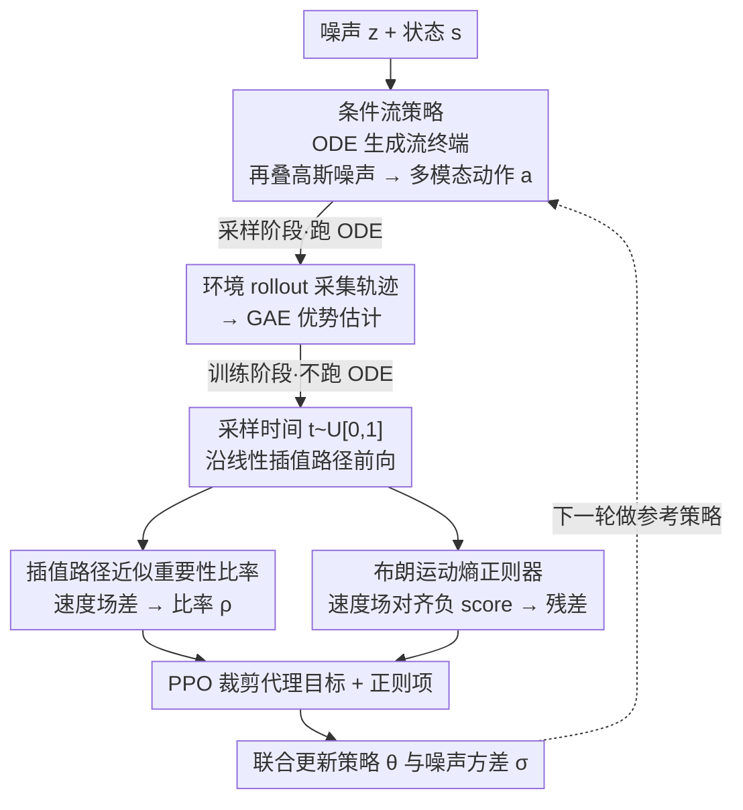

# PolicyFlow: Policy Optimization with Continuous Normalizing Flow in Reinforcement Learning

**会议**: ICLR 2026  
**arXiv**: [2602.01156](https://arxiv.org/abs/2602.01156)  
**代码**: [项目页面](https://policyflow2026.github.io/)  
**领域**: 强化学习/策略优化  
**关键词**: 连续归一化流, PPO, 多模态策略, 重要性比率近似, 布朗运动熵正则

## 一句话总结

提出PolicyFlow，将连续归一化流(CNF)策略无缝嵌入PPO框架：通过沿插值路径的速度场变化近似重要性比率（避免全流路径反向传播），并引入受布朗运动启发的隐式熵正则器防止模式坍缩，在MultiGoal/PointMaze/IsaacLab/MuJoCo等环境中达到或超越高斯PPO和流式基线(FPO/DPPO)的性能。

## 研究背景与动机

**领域现状**：PPO是在线强化学习最主流的策略梯度方法，广泛用于机器人控制和LLM对齐。其核心是通过重要性比率(importance ratio)来更新策略，通常假设策略为高斯分布以简化似然计算。然而，高斯策略只能表示单峰分布，无法建模复杂的多模态动作。

**现有痛点**：

- **高斯策略表达力不足**：在需要多目标到达、多路径规划等场景下，高斯策略只能覆盖一个模式
- **生成式策略的似然计算代价高**：连续归一化流(CNF)和扩散模型表达力足够，但计算重要性比率需沿ODE完整路径反向传播——内存密集、梯度不稳定
- **FPO的偏差问题**：FPO通过ELBO估计重要性比率，但存在非对称估计偏差（比率增大时可靠、减小时不可靠），需要更大batch才能稳定
- **DPPO的局限**：DPPO将扩散过程作为内部MDP处理，适合微调但从头训练时性能退化，因为缺乏off-manifold探索能力
- **熵正则化困难**：流式策略的动作log likelihood难以直接计算，传统熵正则化方法不适用

## 方法详解

### 整体框架

PolicyFlow把一个连续归一化流当作PPO的策略：用流模型从噪声生成动作以获得多模态表达力，再用一个绕开ODE路径反向传播的近似来算重要性比率，最后用布朗运动启发的正则项隐式做熵最大化。整套框架的关键是让昂贵的ODE只在采样轨迹时跑一次，训练阶段全部退化为速度场的前向计算——这条「采样跑ODE、训练只前向」的分工是整篇方法能跑得快的根。

### 关键设计

**1. 条件流策略：用流终端加噪声换来 Gaussian mixture 表达力**

高斯策略只能表示单峰动作，PolicyFlow改用条件流 $\varphi:[0,1]\times\mathbb{R}^d\times\mathbb{R}^n\to\mathbb{R}^d$ 生成动作，它由ODE $\frac{d}{dt}\varphi_t(\mathbf{z};\mathbf{s}) = v_t(\varphi_t(\mathbf{z};\mathbf{s});\mathbf{s})$、初值 $\varphi_0(\mathbf{z};\mathbf{s})=\mathbf{z}$ 支配，其中 $v$ 是神经网络参数化的时间依赖速度场。最终动作取流终端再叠一个高斯噪声 $\mathbf{a}=\varphi_1(\mathbf{z};\mathbf{s})+\mathbf{n}$，其中 $\mathbf{z}\sim\mathcal{N}(\mathbf{0},\mathbf{I})$、$\mathbf{n}\sim\mathcal{N}(\mathbf{0},\boldsymbol{\sigma}^2)$。对 $\mathbf{z}$ 积分后策略写成 $\pi(\mathbf{a}|\mathbf{s})=\int\mathcal{N}(\mathbf{a};\varphi_1(\mathbf{z};\mathbf{s}),\boldsymbol{\sigma}^2)p_z(\mathbf{z})d\mathbf{z}$，是一个严格比单高斯更强的混合分布。末尾这个高斯噪声不只是探索手段：正因为它是高斯，重要性比率才有后面那个能解析展开的形式。

**2. 插值路径近似重要性比率：把 ODE 路径积分换成一次速度场前向差**

PPO要算新旧策略的似然比 $\rho$，对流策略而言这本该沿整条ODE轨迹反向传播——内存密集、梯度不稳。PolicyFlow先利用高斯似然比的平移不变性，把比率化简为只依赖流终端位移差 $\delta_{\varphi_1}$ 的形式；再用一条线性插值路径 $\mathbf{x}_t=(1-t)\mathbf{z}+t\hat{\varphi}_1(\mathbf{z};\mathbf{s})$ 上的速度场差 $\delta_{v_t}=v_t(\mathbf{x}_t;\mathbf{s},\theta)-\hat{v}_t(\mathbf{x}_t;\mathbf{s})$ 去替代终端位移差，得到

$$\rho \approx \mathbb{E}_{p(t)}\left[\frac{p_n(\mathbf{a}-\hat{\varphi}_1; \delta_{v_t}(\mathbf{x}_t;\mathbf{s}), \boldsymbol{\sigma}^2)}{p_n(\mathbf{a}-\hat{\varphi}_1; \mathbf{0}, \hat{\boldsymbol{\sigma}}^2)}\right]\,.$$

理论上这个近似的误差是 $\mathcal{O}(\epsilon)$，而 $\epsilon$ 恰好是PPO的裁剪范围——也就是说策略更新本来就被限制在小步长内，一阶近似在这个范围里足够精确，误差被裁剪机制天然压住。代入标准PPO目标得到裁剪代理 $J^{\text{Flow}}(\theta,\boldsymbol{\sigma})=\mathbb{E}[\min(\rho\hat{A},\text{clip}(\rho,1-\epsilon,1+\epsilon)\hat{A})]$，整个训练过程不再需要任何ODE模拟。

**3. 布朗运动熵正则器：不算 log-likelihood 也能防模式坍缩**

流策略的动作似然难以直接算，传统熵正则失效，FPO/DPPO因此容易模式坍缩。PolicyFlow借用一个物理直觉：布朗运动粒子自然扩散、熵单调递增，其概率路径遵循热方程 $\partial p_t/\partial t=\nabla^2 p_t$，对应速度场恰为负score $v_t=-\nabla\log p_t$。于是只要把策略速度场往参考流的负score方向对齐，就等价于让轨迹更"散开"、隐式抬高熵。利用score与速度场的显式关系 $\nabla_{\mathbf{x}}\log\hat{p}_t(\mathbf{x}_t;\mathbf{s})=\frac{1}{1-t}(t\hat{v}_t(\mathbf{x}_t;\mathbf{s})-\mathbf{x}_t)$，定义对齐残差 $\eta_t=(1-t)v_t(\mathbf{x}_t;\mathbf{s},\theta)-(\mathbf{x}_t-t\hat{v}_t(\mathbf{x}_t;\mathbf{s}))$ 并惩罚其范数，就把熵最大化变成了纯前向的speed-score对齐，完全绕开似然计算。

### 损失函数 / 训练策略

总训练目标在裁剪代理之外加一个正则项，$J^{\text{Reg}}$ 含两部分：布朗正则器 $-w_b\|\eta_t\|_2^2$ 推动速度场与负score对齐促进轨迹扩散，高斯噪声熵 $\frac{w_g}{2}\sum_i\log(2\pi e\sigma_i^2)$ 鼓励末端噪声的随机性，合起来优化 $J^{\text{Flow}}+J^{\text{Reg}}$。每次迭代的流程是：先用参考策略采集轨迹（这一步要跑ODE生成 $\hat{\varphi}_1$），算GAE优势估计；再在mini-batch上采样时间 $t\sim U[0,1]$，沿插值路径一次前向算出近似比率 $\rho$ 和布朗正则残差 $\eta_t$；最后联合更新策略参数 $\theta$ 和噪声方差 $\boldsymbol{\sigma}$。ODE只在采样阶段出现，训练阶段既不模拟ODE也不沿路径反传，这正是它能在不牺牲效率的前提下用流模型的根本原因。

## 实验结果

### 主实验：IsaacLab基准

| 环境 | PPO | PolicyFlow | p-value |
|------|-----|-----------|---------|
| Lift-Cube | $153.1\pm3.0$ | $\mathbf{154.6\pm0.6}$ | 0.32 |
| Navigation | $3.5\pm0.3$ | $\mathbf{4.2\pm0.1}$ | **0.0027** |
| Open-Drawer | $\mathbf{99.8\pm1.7}$ | $99.1\pm0.7$ | 0.41 |
| Quadcopter | $\mathbf{141.8\pm0.5}$ | $141.0\pm0.09$ | 0.099 |
| Anymal-D | $24.5\pm0.1$ | $\mathbf{24.6\pm0.2}$ | 0.26 |
| G1 | $25.4\pm1.2$ | $\mathbf{30.0\pm1.1}$ | **0.00026** |
| H1 | $\mathbf{29.3\pm0.9}$ | $27.3\pm0.2$ | **0.0069** |
| Go2 | $\mathbf{27.9\pm0.3}$ | $27.4\pm0.9$ | 0.33 |

PolicyFlow在多数IsaacLab任务上与PPO持平或更优，在G1人形机器人上显著超越PPO（+18%），在Navigation上也有统计显著优势。

### 计算效率对比

| 环境 | Embedding维度 | PPO (ms) | PolicyFlow (ms) | 增幅 |
|------|--------------|----------|-----------------|------|
| Lift-Cube | 64 | 43.0 | 57.7 | +34% |
| Navigation | 64 | 36.9 | 54.1 | +47% |
| Open-Drawer | 64 | 81.3 | 104.1 | +28% |
| Quadcopter | 64 | 37.8 | 55.6 | +47% |
| Anymal-D | 64 | 41.2 | 57.1 | +39% |
| G1 | 256 | 66.9 | 90.6 | +35% |
| H1 | 512 | 63.4 | 115.5 | +82% |
| Go2 | 512 | 63.9 | 111.5 | +74% |

当模型参数与PPO可比时，每迭代训练时间增加<50%；即使embedding维度增大8倍，计算成本仍不到PPO的2倍。

### 多模态能力(MultiGoal)

在6个等距目标的MultiGoal环境中：PPO（高斯策略）只能覆盖部分目标；FPO/DPPO因缺乏有效熵正则也发生模式坍缩；PolicyFlow+布朗正则器能够最平衡地到达全部6个目标，展现了CNF的多模态表达能力。消融实验显示：仅用均匀噪声注入仍有模式坍缩 → 仅用高斯熵正则部分缓解 → 加入布朗正则器后最优。

### 消融实验

- **裁剪范围 $\epsilon$**：较小 $\epsilon$ 减少近似误差但限制更新步长（学习变慢），$\epsilon=0.2$ 为最佳平衡点
- **网络初始化**：Glorot初始化+输出层置零(GI+ZOL) > 标准Glorot(GI) > 全零初始化(ZI)
- **时间采样**：连续均匀(USC)、离散均匀(USD)、多点离散均匀(Multi-USD)三种策略差异不大，USD作为默认选择因最简单
- **插值路径**：Rectified Flow路径、TrigFlow路径在MultiGoal上优于Stochastic Interpolant路径；在运动控制任务上三者无显著差异

## 优点与创新

- ⭐⭐⭐ **重要性比率近似方案精巧**：利用高斯似然比的平移不变性+插值路径近似，将昂贵的ODE路径积分转化为简单的速度场差前向计算，误差由PPO裁剪范围自然控制
- ⭐⭐⭐ **布朗运动熵正则器**：从物理直觉出发的概念优雅设计——不需计算log-likelihood也不用启发式噪声注入，直接通过speed-score对齐实现隐式熵最大化
- ⭐⭐ **实验覆盖面广**：从简单2D多目标到IsaacLab机器人集（操作/导航/步态/四旋翼），全面验证了方法的通用性
- ⭐⭐ **计算效率分析诚实**：明确报告了训练时间开销（+28%~+82%），不回避高维度时的额外成本

## 不足与展望

- ⭐⭐ **布朗正则器的理论基础有限**：作者自己承认这不是理论严格推导——策略的速度场不是流匹配梯度得到的，与rectified flow动力学不完全对应，更多是启发式设计
- ⭐⭐ **高维度时计算开销显著增加**：H1/Go2环境中embedding=512时训练时间接近PPO的2倍，对大规模实际部署可能成为瓶颈
- ⭐ **缺少与FPO/DPPO在IsaacLab上的直接对比**：由于框架差异（JAX vs PyTorch）未进行直接比较，在这些重要基准上的相对优势无法确认
- ⭐ **仅测试了中等维度动作空间**：未在超高维动作空间（如灵巧手操作）上验证，方法的可扩展性有待进一步检验

## 个人思考

PolicyFlow的核心贡献在于找到了一种**在不牺牲训练效率的前提下使用高表达力流模型做在线RL**的方法路径。重要性比率的近似方案很巧妙——利用了PPO裁剪范围本身就限制了策略更新幅度这一事实，使得一阶近似在实践中足够精确。布朗正则器虽然理论上不完全严格，但从"让速度场指向熵增方向"这个设计意图来看是合理的，且实验效果确实显著。

对后续研究的启示：(1) 这套框架可以直接用于LLM的RLHF——如果将语言模型视为流式策略，PolicyFlow的重要性比率近似可能提供比标准PPO更表达力的策略更新方式；(2) 布朗正则化的思路可以推广到其他需要避免模式坍缩的场景（如多样化文本生成）；(3) 插值路径的选择提示了一个有趣的方向——不同的插值族可能适合不同的任务特性。

<!-- RELATED:START -->

## 相关论文

- [\[ICLR 2026\] Flow Actor-Critic for Offline Reinforcement Learning (FAC)](flow_actor-critic_for_offline_reinforcement_learning.md)
- [\[ICLR 2026\] Safe Continuous-time Multi-Agent Reinforcement Learning via Epigraph Form](safe_continuous-time_multi-agent_reinforcement_learning_via_epigraph_form.md)
- [\[NeurIPS 2025\] Sequential Monte Carlo for Policy Optimization in Continuous POMDPs](../../NeurIPS2025/reinforcement_learning/sequential_monte_carlo_for_policy_optimization_in_continuous_pomdps.md)
- [\[ICLR 2026\] InFOM: Intention-Conditioned Flow Occupancy Models](infom_intention_flow_occupancy.md)
- [\[ICLR 2026\] Continuous-Time Value Iteration for Multi-Agent Reinforcement Learning](continuous-time_value_iteration_for_multi-agent_reinforcement_learning.md)

<!-- RELATED:END -->
