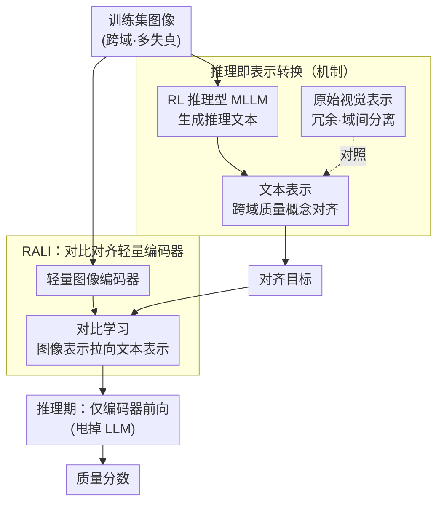

# Reasoning as Representation: Rethinking Visual Reinforcement Learning in Image Quality Assessment

**会议**: ICLR 2026 (Oral)  
**arXiv**: [2510.11369](https://arxiv.org/abs/2510.11369)  
**代码**: 无  
**领域**: 强化学习 / 图像质量评估 (Reinforcement Learning / Image Quality Assessment)  
**关键词**: 图像质量评估, 强化学习, 推理即表示, 对比学习, 跨域泛化

## 一句话总结

通过系统实验揭示了 RL 训练的推理型 IQA 模型泛化能力的本质机制——推理过程本质上是将冗余的视觉表示转换为紧凑的跨域对齐文本表示——并基于此提出 RALI 算法，通过对比学习直接对齐图像与这些文本表示，以不到 5% 的参数和推理时间达到了可比的泛化性能。

## 研究背景与动机

图像质量评估（Image Quality Assessment, IQA）是计算机视觉的基础任务，旨在自动化地评估图像的视觉质量。近年来，基于多模态大语言模型（MLLM）通过强化学习（RL）训练的推理型 IQA 模型展现出了**卓越的泛化能力**——可以在未见过的失真类型和数据集上保持高性能。

然而，当前存在两个关键未解问题：

**机制不明**：这些推理型 IQA 模型**为什么**能泛化？RL 训练赋予的推理能力与泛化之间的具体联系是什么？现有研究停留在经验观察层面——知道"有效"但不知道"为什么有效"。

**效率瓶颈**：尽管性能卓越，这些模型的推理代价极其高昂——需要加载完整的 MLLM 并进行自回归文本生成，推理能耗和延迟比传统 IQA 方法**高出数个数量级**，严重限制了实际部署。

本文的核心动机是：**如果能理解推理型 IQA 模型泛化的根本原因，就有可能保留泛化能力的同时大幅降低计算开销。**

## 方法详解

### 整体框架

本文想回答一个被前人观察到却没解释清的问题：RL 训练出来的推理型 IQA 模型，**为什么**能在没见过的失真类型和数据集上保持高性能？整篇工作分两步走。前半是**诊断**——通过一系列控制实验，对比 RL 训练前后、文本表示与视觉表示在不同域上的分布，把"泛化从哪来"这件事定位到一个具体机制（推理即表示转换）上。后半是**兑现**——既然找到了机制，就顺着它设计一个不再需要跑完整 MLLM 的轻量替代方案 RALI（Reasoning-Aligned Lightweight IQA）：用训练好的推理型 MLLM 一次性把跨域对齐的文本表示生成出来当作对齐目标，再用对比学习把一个轻量图像编码器拉到这套目标上；推理期只剩这个编码器，用不到 5% 的参数与时间继承同样的跨域泛化。所以这篇论文的方法主体不是一个新网络，而是"先讲清原理、再用原理换效率"的一条逻辑链。

### 关键设计

**1. 推理即表示转换：泛化的真正来源是文本表示的跨域对齐，而非推理内容本身**

推理型 IQA 模型为什么泛化得好，过去只停在"经验上有效"。本文用系统实验给出机制层面的答案：经过 RL 训练，MLLM 是在用它的推理能力，把**冗余的视觉表示**转换成**紧凑、且跨域对齐的文本表示**，而这个转换恰恰就是泛化能力的来源。具体看三层证据：原始视觉表示（如 ViT 特征）维度高、冗余大，不同失真类型和不同域的特征彼此分离；推理过程把这些视觉信息"压缩"进文本表示空间；而对比 RL 训练前后会发现，仅有监督微调（SFT）阶段的文本表示仍然域间分离，只有 RL 训练后**不同域的图像质量概念才在文本空间里对齐**——不同域里相似的质量等级会被映射到相近的位置。正是这种对齐，让模型在新域上仍能把质量判对。它的反直觉之处在于：真正起作用的不是推理链里写了什么内容，而是推理过程顺带完成的表示空间重组。这也直接给出了提效的口子——如果推理只是一种"表示转换的方式"而非内容本身重要，那它就可以被更便宜的手段替代。

**2. RALI：用对比学习把这套跨域对齐"焊进"轻量图像编码器，推理时彻底甩掉 LLM**

顺着上一条洞察，既然泛化来自文本表示的跨域对齐，那就没必要每次推理都真的跑一遍 MLLM 去生成那段文本——直接让图像表示去对齐那套已经对齐好的文本表示即可。RALI 用**对比学习**（contrastive learning）做这件事，分三步：先用训练好的 RL 推理型 MLLM 对训练集图像生成推理文本、并提取其文本表示，作为对齐目标；再训练一个轻量级图像编码器，通过对比学习把图像表示直接拉到这些文本表示上（拉近跨域同质量等级的图文表示、推开不同质量等级的表示）；推理阶段就只剩这个轻量编码器，**不必加载 LLM、也不必做自回归文本生成**。

值得点明的是，RALI 本质上是一种特殊形态的知识蒸馏，但它蒸的对象和常规蒸馏不同：常规蒸馏对齐的是教师的预测/logits，RALI 对齐的是**表示空间的跨域对齐结构**本身。对比学习目标保证学生学到的不只是"某张图给几分"，更关键的是不同域之间质量概念的对应关系——这正是泛化能跨域迁移、而不是只在训练分布上拟合分数的原因。换句话说，推理在这里被当成训练期一次性用掉的"中间手段"，它的产物（对齐好的目标表示）被固化进图像编码器，部署时的开销就从完整 MLLM 降到一次轻量前向。

### 训练策略

- **教师模型**：RL 训练的推理型 MLLM（如 Q-Instruct 等），用来生成跨域对齐的文本表示作为对齐目标。
- **学生模型**：轻量级视觉编码器，参数量不到教师的 5%，通过对比学习对齐到教师的文本表示。
- **对比目标**：拉近跨域同质量等级图像的表示，推开不同质量等级图像的表示，使学生继承跨域对齐结构。
- **无 LLM 推理**：测试阶段仅需学生视觉编码器一次前向，完全消除 LLM 的加载与文本生成开销。

## 实验关键数据

### 主实验

在图像质量评分任务上的跨域泛化性能对比：

| 方法 | 泛化性能 | 模型参数 | 推理时间 | 说明 |
|------|---------|---------|---------|------|
| RL-推理型 MLLM | SOTA | 100% | 100% | 完整模型 + 推理 |
| RALI | **可比** | **<5%** | **<5%** | 仅视觉编码器 |
| 传统 IQA | 较差 | 小 | 快 | 泛化不足 |
| 非推理型 MLLM | 中等 | 大 | 中 | 缺乏跨域对齐 |

### 消融实验

| 配置 | 关键指标 | 说明 |
|------|---------|------|
| 视觉表示空间分析 | 域间分离 | 原始视觉表示缺乏跨域对齐 |
| RL训练前文本表示 | 域间分离 | SFT 阶段的文本表示未对齐 |
| RL训练后文本表示 | 域间对齐 | RL 训练实现了跨域对齐 |
| 仅对齐到SFT表示 | 泛化差 | 证明RL训练的对齐是关键 |
| 对齐到RL表示（RALI） | 泛化好 | 成功继承跨域泛化能力 |
| 移除对比学习 | 泛化下降 | 对比目标是对齐的关键 |

### 关键发现

1. **推理的真正角色是表示转换**：推理链中的文本内容本身并非泛化的关键，关键在于推理过程自然产生的文本表示在不同域之间形成了对齐。这挑战了"推理内容=性能来源"的直觉认知。

2. **RL 训练的独特贡献**：对比 RL 训练前后的文本表示发现，RL 训练显著提升了不同域的文本表示的对齐程度。SFT 阶段的表示仍然域间分离，RL 阶段才实现真正的跨域对齐。

3. **大幅效率提升**：RALI 在保持可比泛化性能的同时，将模型参数和推理时间都降低到原来的 5% 以下，使得部署在资源受限场景成为可能。

4. **无需 LLM 推理**：推理时完全不需要加载 LLM 或进行文本生成，只需前向通过一个轻量级视觉编码器，极大简化了部署流程。

## 亮点与洞察

1. **深刻的机制洞察**：本文最大的贡献不是 RALI 算法本身，而是关于"推理即表示转换"的洞察。这一发现改变了我们对推理型模型泛化能力的理解——推理过程是**手段**而非**目的**，真正重要的是推理过程中隐式完成的表示空间重组。

2. **从理论洞察到实用算法的闭环**：先通过实验建立理论理解（为什么推理型模型泛化？），再基于理论设计高效替代方案（RALI），形成了完整的研究闭环。这一范式对其他领域也有借鉴意义。

3. **ICLR 2026 Oral 的品质**：作为 Oral 论文，其贡献在于提供了一个可能改变该领域研究方向的洞察——如果推理只是表示转换，那么是否所有推理型模型的泛化都可以通过类似方式"蒸馏"？

4. **对 RL 训练的新理解**：RL 训练在推理型模型中的角色不仅是"教模型推理"，更根本地是"重组表示空间"——使不同域的概念对齐。这为理解 RL 训练的本质提供了新视角。

5. **实际部署价值**：20 倍以上的效率提升使 IQA 模型可以部署在边缘设备上，对实际应用有直接推动。

## 局限与展望

1. **仅验证于 IQA 任务**：核心洞察（推理=表示转换）是否可以推广到其他推理任务（如数学推理、代码生成）尚不清楚。IQA 可能是一个相对简单的任务，推理的角色在更复杂任务中可能有所不同。

2. **质量评分 vs 质量描述**：当前 RALI 主要针对质量评分（回归）任务。对于需要详细质量描述的应用场景，仍然需要完整的 MLLM。

3. **教师模型依赖**：RALI 的训练依赖于 RL 训练的教师 MLLM 来生成文本表示作为对齐目标，如果教师模型不够好，学生模型的泛化能力也会受限。

4. **对比学习的瓶颈**：对比学习的效果依赖于负样本的质量和多样性，跨域对齐的质量可能受到训练数据分布的影响。

5. **推理可解释性的丧失**：RALI 消除了推理过程，也同时丧失了推理型模型的可解释性优势——无法提供质量评估的理由和证据。

## 相关工作与启发

- **推理型 IQA 模型**：如 Q-Instruct、Q-Boost 等通过 MLLM 推理来进行质量评估的方法
- **视觉强化学习**：R1 风格的 RL 训练在视觉任务中的应用
- **知识蒸馏**：从大模型到小模型的知识传递，RALI 可视为表示空间结构的蒸馏
- **对比学习**：CLIP 等视觉-语言对齐方法，RALI 在 IQA 场景下进行了特化
- **传统 IQA**：NIQE、BRISQUE 等手工特征方法，到 MUSIQ、DBCNN 等深度学习方法
- 启发方向：**"推理即表示转换"**这一洞察可能适用于理解其他推理型模型的成功机制，值得在更多领域验证

## 评分

- 新颖性: ⭐⭐⭐⭐⭐ （"推理即表示转换"是极具洞察力的发现，改变了对推理型模型的理解范式）
- 实验充分度: ⭐⭐⭐⭐⭐ （从机制分析到算法设计，实验链条完整严密，值得 Oral）
- 写作质量: ⭐⭐⭐⭐⭐ （论证逻辑清晰，从洞察到算法的过渡自然）
- 价值: ⭐⭐⭐⭐⭐ （既有深刻理论贡献又有巨大实用价值，>20x效率提升意义重大）

<!-- RELATED:START -->

## 相关论文

- [\[ICLR 2026\] PreferThinker: Reasoning-based Personalized Image Preference Assessment](preferthinker_reasoning-based_personalized_image_preference_assessment.md)
- [\[ICLR 2026\] DiVE-k: Differential Visual Reasoning for Fine-grained Image Recognition](dive-k_differential_visual_reasoning_for_fine-grained_image_recognition.md)
- [\[ICLR 2026\] Stackelberg Coupling of Online Representation Learning and Reinforcement Learning](stackelberg_coupling_of_online_representation_learning_and_reinforcement_learnin.md)
- [\[ICML 2026\] From Reward-Free Representations to Preferences: Rethinking Offline Preference-Based Reinforcement Learning](../../ICML2026/reinforcement_learning/from_reward-free_representations_to_preferences_rethinking_offline_preference-ba.md)
- [\[ICLR 2026\] RewardMap: Tackling Sparse Rewards in Fine-grained Visual Reasoning via Multi-Stage Reinforcement Learning](rewardmap_tackling_sparse_rewards_in_fine-grained_visual_reasoning_via_multi-sta.md)

<!-- RELATED:END -->
