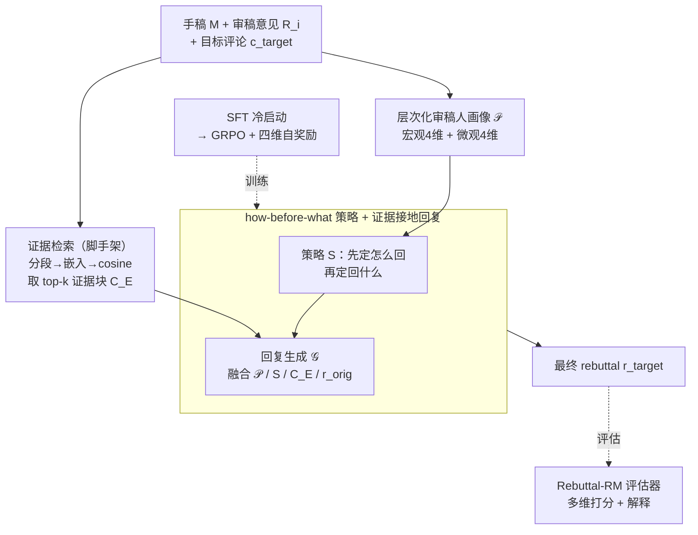

# RebuttalAgent: Strategic Persuasion in Academic Rebuttal via Theory of Mind

**会议**: ICLR2026  
**arXiv**: [2601.15715](https://arxiv.org/abs/2601.15715)  
**代码**: [GitHub](https://github.com/Zhitao-He/RebuttalAgent)  
**领域**: 强化学习  
**关键词**: academic rebuttal, Theory of Mind, strategic persuasion, GRPO, self-reward, reward model  

## 一句话总结
首次将心智理论（ToM）引入学术 rebuttal，提出 ToM-Strategy-Response 三阶段框架：先建模审稿人心理状态，再制定说服策略，最后生成证据支撑的回复，结合自奖励 RL 训练和专用 Rebuttal-RM 评估器，平均指标超越基座模型 18.3%。

## 背景与动机
- 学术 rebuttal 不是简单的技术辩论，而是在严重信息不对称下的**战略沟通**（类似不完全信息动态博弈）
- 作者不了解审稿人的知识背景、内在偏见、或回复的连锁效应
- **现有方法的根本缺陷**：主要依赖 SFT 训练在 review 数据集上，只能模仿表层语言模式（表面礼貌但模板化），缺乏战略深度
- 成功的 rebuttal 本质是**换位思考**（perspective-taking），需要分析何时让步、何时坚持、何时重新框架叙事
- 这种能力在认知科学中称为 Theory of Mind（ToM）——理解他人的信念、意图和观点以预测其行为

## 方法详解

### 整体框架

RebuttalAgent 把"写 rebuttal"建模成 ToM-Strategy-Response (TSR) 的三阶段推理链：给定原始手稿 $M$、审稿意见 $R_i$ 和目标评论 $c_{target}$，模型先揣摩审稿人的心理状态，再据此定下说服策略，最后检索手稿证据生成回复 $r_{target} = \mathcal{G}(M, R_i, c_{target})$。具体地，动笔前先有一个证据检索模块（脚手架）：把手稿分段、用预训练嵌入模型编码后按 cosine 相似度取 top-$k$ 证据块 $C_E$，给每条评论圈出最相关的原文。随后进入 TSR：ToM 阶段沿宏观/微观两层构建审稿人画像 $\mathcal{P}$，策略阶段把画像翻译成可执行的高层策略 $S$，回复阶段融合 $\mathcal{P}$、$S$、$C_E$ 生成最终回复。整条链路先在 RebuttalBench 上做 SFT 冷启动学会结构化推理，再用带自奖励的 GRPO 强化说服力；评估侧另训一个专门的 Rebuttal-RM 充当裁判。

### 关键设计

**1. 层次化审稿人画像：把"换位思考"拆成可推理的结构**

rebuttal 的难点在于作者看不到审稿人的知识背景和真实顾虑，只能盲猜。本文让模型在动笔前先做两层 ToM 分析：宏观层从整体立场（Overall Stance）、整体态度（Overall Attitude）、核心顾虑（Dominant Concern）、审稿人专长（Reviewer Expertise）四个维度推断审稿人的整体意图，用来定全局语气；微观层则沿重要性（Significance）、方法论（Methodology）、实验严谨性（Experimental Rigor）、表达（Presentation）四个维度把每条具体评论归类，用来定针对性回应。两层画像合起来构成审稿人心理状态 $\mathcal{P}$，把抽象的"理解他人"落成一组结构化、可被后续阶段直接条件化的字段——有了它，策略生成才不再是对着评论字面瞎猜，而是对齐审稿人的真实意图。

**2. how-before-what 策略生成 + 证据接地回复：先想清楚怎么回，再保证有据可查**

直接让模型读完评论就写回复，往往只会被动应付表面问题。本文在画像 $\mathcal{P}$ 和目标评论之后插入一步显式的策略生成：模型先综合二者输出一份简洁的高层策略 $S$，关键在于这一步**强迫模型先决定"如何回复"（how，让步、坚持还是重新框架叙事）再决定"回复什么"（what）**，从而把回复锚定在审稿人的深层关切上。有了策略还要避免空谈，所以回复阶段的生成器 $\mathcal{G}$ 同时条件化于画像 $\mathcal{P}$、策略 $S$、检索证据块 $C_E$ 以及原始草稿 $r_{orig}$（$r_{orig}$ 只在数据合成阶段当作行文参考，推理时不用），让最终回复既战略对齐又句句有手稿证据支撑。

**3. Rebuttal-RM 专用评估器：通用 judge 打不准 rebuttal**

rebuttal 质量（态度、清晰度、说服力、建设性）很难用通用 LLM judge 可靠衡量。本文基于 Qwen3-8B 微调出专门的 Rebuttal-RM，训练数据来自 102K 样本三源混合——1.2 万条原始作者回复（真实人类基线）、GPT-4.1 精修回复（高标准参照）、多模型生成回复（覆盖风格），标签则用"审稿人后续抬分则视为高质量并人工打分 + Gemini 2.5 Pro 自动标注"的混合策略获得，输出多维打分并附解释。它与人类标注的平均一致性达 0.812，比 GPT-4.1 的 0.745 高 9.0%，既用作主实验的裁判，本身也能独立复用。

### 损失函数 / 训练策略

训练数据来自 RebuttalBench（70K 样本）：以 Re2-rebuttal 数据集为源，用 GPT-4.1 解析 200K+ 评论-回复对，再由 GPT-4.1、Claude 3.5 等多教师模型混合生成 TSR 推理链，并刻意排除需要补新实验的评论，聚焦语言说服与战略论证。训练分两阶段：先以 Qwen3-8B 为基座做 SFT 冷启动，学会 TSR 的结构化推理格式；再用 GRPO 做强化学习。

强化阶段的核心是一个四维自奖励，避免了额外训练独立 reward model 的开销：

$$R(o) = w_1 R_{format} + w_2 R_{think} + w_3 R_{resp} + w_4 R_{div}$$

其中 $R_{format}$ 是格式正确性的二值项；$R_{think}$ 让模型自评 Analysis 与 Strategy 两段推理的质量；$R_{resp}$ 让模型自评回复的说服力、清晰度和证据使用；$R_{div}$ 衡量回复与一组预设负样本的语义差异，专门用来抗 reward hacking——防止模型为了刷分退化成模板化的礼貌套话。

## 实验

### Rebuttal-RM 与人类评估一致性

| 评分模型 | Attitude | Clarity | Persuasiveness | Constructiveness | 平均 |
|---------|----------|---------|----------------|-----------------|------|
| GPT-4.1 | 0.752 | 0.720 | 0.761 | 0.747 | 0.745 |
| DeepSeek-R1 | 0.690 | 0.694 | 0.698 | 0.688 | 0.705 |
| **Rebuttal-RM** | **0.859** | **0.740** | **0.814** | **0.828** | **0.812** |

### 主实验：Rebuttal 质量评估

| 模型 | Rigor(C/P/Co) | Soundness(C/P/Co) | 平均 |
|------|-----------|-----------|------|
| o3 | 9.00/8.99/9.55 | 8.84/8.78/9.45 | 9.21 |
| GPT-4.1 | 8.34/7.86/8.80 | 8.27/7.79/8.62 | 8.50 |
| DeepSeek-R1 | 8.47/7.90/8.90 | 8.46/8.03/8.75 | 8.64 |
| Qwen3-8B (Base) | 7.96/7.33/8.18 | 7.84/7.11/7.76 | 7.96 |
| **RebuttalAgent** | **8.72/8.25/9.25** | **8.65/8.28/9.10** | **8.88** |

（RebuttalAgent 为 Self-Refined 版本，超越 base model 平均 18.3% 提升，接近 DeepSeek-R1 水平）

### 关键发现
1. **ToM 分析是核心贡献**：去掉 ToM 阶段后性能显著下降，证明审稿人建模的必要性
2. **自奖励 RL 有效**：相比纯 SFT，RL 阶段在说服力和建设性维度上均有显著提升
3. **8B 模型可媲美大模型**：RebuttalAgent 在多项指标上接近甚至超越 GPT-4.1 和 DeepSeek-R1
4. **Rebuttal-RM 超越通用 judge**：专门训练的评估器比通用 LLM judge 更可靠
5. **多样性奖励抗 reward hacking**：$R_{div}$ 有效防止模型退化为模板化回复

## 亮点
- 首次将 Theory of Mind 引入学术 rebuttal，从博弈论视角重新定义问题
- "先定 how 再定 what" 的显式策略中间步是点睛之笔：把回复从被动应付表面评论，扭成对齐审稿人深层关切
- 自奖励机制避免了额外 reward model 的训练开销，其中多样性奖励 $R_{div}$ 专门抗 reward hacking
- Rebuttal-RM 评估器本身具有独立应用价值
- 开源代码和模型

## 局限性
- 排除了需要新实验/数据的评论，实际 rebuttal 中这类评论占比不小
- 上下文检索基于论文全文，长论文可能导致关键信息遗漏
- 自奖励的质量上限受 SFT 模型能力限制
- 评估主要基于自动化指标，人类评估规模有限
- 实际应用中需谨慎使用，不应替代作者自身的批判性思考

## 相关工作
- **LLM 辅助研究**：从文献总结到假设生成到完整论文写作
- **学术 rebuttal 研究**：Re2 数据集（Zhang et al., 2025）提供原始 review-rebuttal 数据
- **Theory of Mind in AI**：Machine ToM（Rabinowitz et al., 2018），GPT-4 已展示初步 ToM 能力
- **推理型 LLM**：DeepSeek-R1 的 GRPO 算法为 RL 后训练提供基础

## 评分
⭐⭐⭐⭐ (4/5)

问题定义新颖，将 rebuttal 建模为信息不对称的博弈并引入 ToM 是有创意的。TSR 框架设计逻辑清晰。主要concern 是排除了需实验的评论后任务难度降低，且实战效果需要更多验证。

<!-- RELATED:START -->

## 相关论文

- [\[ICLR 2026\] Towards Strategic Persuasion with Language Models](towards_strategic_persuasion_with_language_models.md)
- [\[ICLR 2026\] Unveiling the Cognitive Compass: Theory-of-Mind-Guided Multimodal Emotion Reasoning](unveiling_the_cognitive_compass_theory-of-mind-guided_multimodal_emotion_reasoni.md)
- [\[ICLR 2026\] FAPO: Flawed-Aware Policy Optimization for Efficient and Reliable Reasoning](fapo_flawed-aware_policy_optimization_for_efficient_and_reliable_reasoning.md)
- [\[ICLR 2026\] DiVE-k: Differential Visual Reasoning for Fine-grained Image Recognition](dive-k_differential_visual_reasoning_for_fine-grained_image_recognition.md)
- [\[ICLR 2026\] PreferThinker: Reasoning-based Personalized Image Preference Assessment](preferthinker_reasoning-based_personalized_image_preference_assessment.md)

<!-- RELATED:END -->
