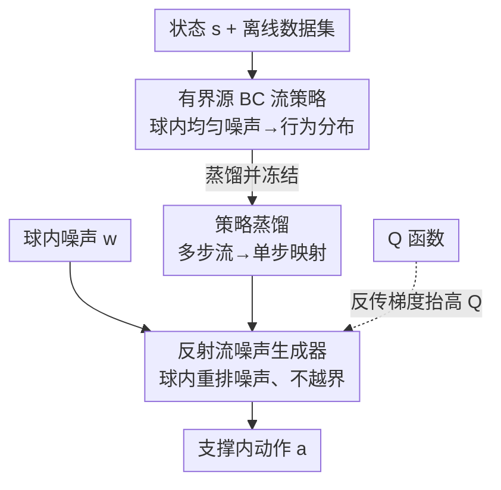

# ReFORM: Reflected Flows for On-support Offline RL via Noise Manipulation

**会议**: ICLR 2026  
**arXiv**: [2602.05051](https://arxiv.org/abs/2602.05051)  
**代码**: [项目页面](https://mit-realm.github.io/reform/)  
**领域**: 强化学习  
**关键词**: 离线强化学习, Flow Matching, 支撑约束, 反射流, OOD问题

## 一句话总结

提出ReFORM方法，通过学习一个反射流噪声生成器来操纵行为克隆流策略的源分布，以**构造性方式**实现支撑约束，避免OOD问题的同时保持策略表达力，无需超参数调节。

## 研究背景与动机

离线强化学习面临两大核心挑战：（1）**OOD问题**——策略生成数据集中不存在的动作，导致Q函数过度乐观的估计；（2）**多模态动作分布**——传统单模态高斯策略无法表示复杂数据集中的多模态行为。

先前方法主要通过正则化统计距离（KL散度、Wasserstein距离等）来约束学习策略接近行为策略，但存在根本性缺陷：
- **KL散度约束过强**（Proposition 1）：KL约束提供了充分但非必要的支撑约束条件，可能过度限制策略改进空间
- **Wasserstein距离约束不足**（Proposition 2）：Wasserstein约束无法保证支撑约束
- 两者都引入超参数 $\alpha$，需为不同任务和数据集分别调节

本文的核心idea：不约束统计距离，而是直接通过**构造性方法确保支撑约束** $\text{supp}(\pi_\theta(\cdot|s)) \subseteq \text{supp}(\pi_\beta(\cdot|s))$。具体做法是在BC流策略的有界源分布空间中进行优化，自然满足约束。

## 方法详解

### 整体框架

ReFORM 想解决的核心问题是：怎样在不引入正则化超参的前提下，让学到的策略只输出数据集里"见过"的动作（支撑约束），同时还能保留多模态表达力。它的思路是把约束问题转移到"噪声空间"里来构造性地满足——只要源噪声始终落在一个有界区域内，经过一个支撑被这块区域框住的策略映射后，输出动作自然不会越界。

整体分两个阶段串起来。第一阶段先用行为克隆（BC）学一个流策略，把一个**有界**的均匀噪声分布映射成数据集的行为分布；这样 BC 策略的"可达动作"就被噪声的有界区域钉死了。中间把这条多步 BC 流蒸馏成单步映射，缩短后续的反向传播链。第二阶段冻结蒸馏后的 BC 策略，再额外学一个反射流噪声生成器，它只在那块有界噪声区域内部重新分配噪声，把噪声往能让 Q 值更高的地方挪——因为生成器的输出仍然没跑出有界区域，喂给 BC 策略后输出动作就始终在支撑内。

### 关键设计

**1. 有界源分布的 BC 流策略：把支撑约束钉在噪声的有界区域上**

支撑约束之所以难，是因为高斯这类无界噪声经过流映射后，理论上能覆盖整个动作空间，没法保证不越界。ReFORM 改用 $d$ 维超球上的均匀分布作源分布 $q_{BC} = \mathcal{U}(\mathcal{B}_l^d)$，其支撑就是这个有界球 $\text{supp}(q_{BC}) = \mathcal{B}_l^d = \{z \in \mathbb{R}^d \mid \|z\| \leq l\}$。流策略 $\psi_{\theta_1}(t,z;s)$ 用标准的线性流匹配损失训练：

$$\mathcal{L}_{BC}(\theta_1) = \mathbb{E}\big[\|v_{\theta_1}(t,x_t;s) - (a-z)\|^2\big]$$

关键在于源分布有界，BC 流的像（值域）就被限制在能近似行为策略支撑集的范围内，这为第二阶段的构造性支撑约束打下基础——后面只要不让噪声跑出这个球，输出动作就出不了支撑。

**2. 策略蒸馏：把多步 BC 流压成单步映射，缩短反向传播链**

噪声生成器要通过 BC 策略的 Q 值反传梯度来训练，而 BC 流是多步积分，反传链很长、计算很重。ReFORM 先把多步 BC 流策略蒸馏成一个单步映射 $\hat{\mu}_{\hat{\theta}_1}$：

$$\mathcal{L}_{\text{Distill}}(\hat{\theta}_1) = \mathbb{E}\big[\|\mu_{\hat{\theta}_1}(z;s) - \mu_{\theta_1}(z;s)\|^2\big]$$

蒸馏后噪声生成器的梯度只需穿过一步映射，BPTT 链大幅缩短，训练加速且更稳定（消融里去掉蒸馏后性能略有下降，印证长 BPTT 链有害）。

**3. 反射流噪声生成器：在有界球内重排噪声，既守约束又保多模态**

第二阶段要在球内挪噪声去抬高 Q 值，难点是普通流模型的支撑是无界的，直接拿来生成噪声会跑出球外、破坏支撑约束。ReFORM 用**反射流**来约束这个生成器 $\psi_{\theta_2}(t,w;s): \mathcal{B}_l^d \to \mathcal{B}_l^d$，让它把球内噪声重新映射到球内的多模态分布。反射通过一个带反射项的 ODE 实现：

$$d\psi_{\theta_2} = v_{\theta_2}\,dt + dL_t$$

其中反射项 $dL_t$ 在轨迹要冲出球面时把超出边界的速度补偿回来。数值上用反射 Euler 法做投影：当一步更新后 $\hat{z}_{k+1} \notin \mathcal{B}_l^d$，就减去越界的法向分量，把点拉回球内。这样既能从理论上保证 support 约束（Theorem 1），又比截断高斯或 tanh 压缩更能保留多模态表达力——后两者要么单模态、要么在边界处梯度消失。

### 损失函数 / 训练策略

噪声生成器的优化目标就是直接最大化组合策略的 Q 值，整条目标里没有任何正则化项：

$$\mathcal{L}_{NG}(\theta_2) = \mathbb{E}_{s,w}\big[-Q^{\mu_\theta}(s,\, \mu_{\theta_1}(\mu_{\theta_2}(w;s);s))\big]$$

支撑约束完全由前两阶段的有界源 + 反射流构造性地保证，因此这里不需要再加 KL / Wasserstein 之类的距离正则，也就没有需要逐任务调的权重超参 $\alpha$。

## 实验关键数据

### 主实验（OGBench 40任务，Performance Profile）

| 方法 | Clean数据集 | Noisy数据集 | 超参调节 |
|------|-----------|-----------|---------|
| ReFORM | **最优** | **最优** | 固定超参 |
| FQL(M) | 第二 | 显著下降 | 手动调 |
| DSRL | 第三 | 显著下降 | 手动调 |
| FQL(S) | 一般 | 第二 | 手动调 |
| IFQL | 较差 | 较差 | - |

### 消融实验

| 配置 | 归一化分数 | 说明 |
|------|----------|------|
| ReFORM（完整） | 最高 | 有界源+反射流+蒸馏 |
| ReFORM(U)：高斯源分布 | 几乎为零 | 无界源导致严重OOD |
| ReFORM(MLP)：MLP噪声生成 | 明显下降 | 无法表示多模态 |
| ReFORM(tanh)：tanh压缩 | 下降 | 梯度消失问题 |
| ReFORM(Gaussian)：截断高斯 | 下降 | 单模态限制 |
| ReFORM(NoDistill) | 略微下降 | 长BPTT链有害 |

### 关键发现
- ReFORM在归一化分数接近1.0的区域比例最高，说明不限制策略改进上限
- Toy example清楚展示：ReFORM能同时到达Q值两个峰值且不越界，DSRL只能坍塌到单模态
- 有界源分布是核心设计——切换为高斯源后性能崩溃

## 亮点与洞察

- **理论上证明**了KL散度约束过强、Wasserstein约束不足，支撑约束是更合理的中间选择
- **构造性方法**彻底消除了正则化超参数的调节负担——所有40个任务使用同一组超参
- **反射流**的引入不仅解决了约束问题，还保持了流模型的多模态表达力

## 局限与展望

- 噪声生成器训练仍需通过BC策略的BPTT，计算量较大
- 支撑约束的质量取决于BC模型学到的支撑精度
- 在数据集包含专家策略时，由于缺乏显式正则化，学习速度慢于统计距离方法

## 相关工作与启发

- 与Wagenmaker et al. (2025)的DSRL方法形成直接对比：两者都操纵噪声空间，但ReFORM用有界源分布消除了超参需求
- 反射流（Xie et al., 2024）首次被应用于RL中的约束满足
- 噪声操纵的思路可推广到在线RL的安全約束和扩散策略的微调

## 评分
- 新颖性: ⭐⭐⭐⭐⭐ 反射流+有界源分布的组合实现构造性支撑约束，思路新颖独到
- 实验充分度: ⭐⭐⭐⭐⭐ 40任务×两种数据集，详细消融，清晰的toy example可视化
- 写作质量: ⭐⭐⭐⭐⭐ 从理论到方法到实验层层递进，逻辑清晰
- 价值: ⭐⭐⭐⭐⭐ 对离线RL的OOD问题提供了既有理论保证又实用的解决方案

<!-- RELATED:START -->

## 相关论文

- [\[ICLR 2026\] Value Flows](value_flows.md)
- [\[ICLR 2026\] Less is More: Clustered Cross-Covariance Control for Offline RL](less_is_more_clustered_cross-covariance_control_for_offline_rl.md)
- [\[ICLR 2026\] Robust Deep Reinforcement Learning against Adversarial Behavior Manipulation](robust_deep_reinforcement_learning_against_adversarial_behavior_manipulation.md)
- [\[ICLR 2026\] BA-MCTS: Bayes Adaptive Monte Carlo Tree Search for Offline Model-based RL](bayes_adaptive_monte_carlo_tree_search_for_offline_model-based_reinforcement_lea.md)
- [\[ICLR 2026\] Offline Reinforcement Learning with Generative Trajectory Policies](offline_reinforcement_learning_with_generative_trajectory_policies.md)

<!-- RELATED:END -->
