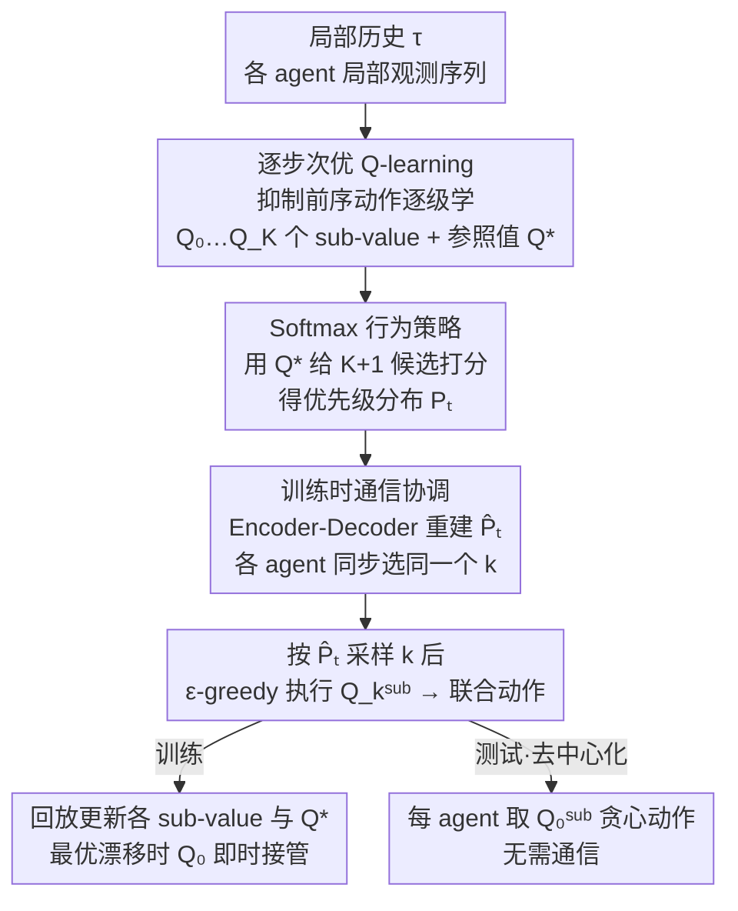

# Retaining Suboptimal Actions to Follow Shifting Optima in Multi-Agent RL

**会议**: ICLR 2026  
**arXiv**: [2602.17062](https://arxiv.org/abs/2602.17062)  
**代码**: [GitHub](https://github.com/hyeon1996/S2Q)  
**领域**: 强化学习  
**关键词**: 多Agent RL, 值分解, 次优动作保留, Softmax行为策略, S2Q, CTDE

## 一句话总结

提出 S2Q（Successive Sub-value Q-learning），通过逐步学习 $K$ 个 sub-value 函数显式保留次优联合动作，结合 Softmax 行为策略在候选间优先级采样，解决合作 MARL 中值分解方法因最优点动态漂移而收敛到次优策略的根本问题。

## 研究背景与动机

**领域现状**：在集中训练分散执行(CTDE)范式下，值分解方法(如 QMIX)是合作 MARL 的主流框架。QMIX 通过单调性约束满足 IGM (Individual-Global-Max) 条件，保证最大化个体效用不会降低联合值函数。WQMIX 引入无约束目标 Q* 缓解单调性限制，但仍聚焦单一最优动作。

**现有痛点**：
- QMIX 的单调性约束限制了联合值函数 $Q^{\text{tot}}$ 的表达力，无法表示非单调值结构
- WQMIX 虽引入无约束 $Q^*$ 改善值估计，但仍只追踪单一最优联合动作
- 当训练过程中探索更新值估计导致**最优动作漂移**时，已丢弃的替代高价值动作信息无法恢复
- $\epsilon$-greedy 在大联合动作空间中联合探索概率指数衰减：$N$ 个 agent 各有 $|\mathcal{A}|$ 个动作，联合探索概率 $\propto \epsilon^N$

**核心矛盾**：现有方法将次优动作信息"用后即丢"，一旦值景观变化使得先前次优变为最优，学习器无法快速适应。这在 payoff matrix 实验中得到清晰验证——在最优从 $(A,A)$ 变为 $(C,C)$ 后，QMIX 和 WQMIX 均无法跟踪新最优。

**本文方案**：显式保留 $K$ 个次优动作的值函数，当最优变化时可立即利用对应的 sub-value 函数引导 $Q^{\text{tot}}$ 适应，并用 Softmax 行为策略替代 $\epsilon$-greedy 实现更高效的定向探索。

## 方法详解

### 整体框架

合作 MARL 里值分解方法（如 QMIX/WQMIX）只盯住单一最优联合动作，一旦训练中值景观变化、原来的最优点漂移，先前被丢弃的替代高价值动作就找不回来了。S2Q 建在 WQMIX 之上，核心思路是把"最优动作"扩成一组按价值排序的候选：每个 agent 的局部历史先送进**逐步次优 Q-learning** 模块，同时学一组 sub-value 函数——$Q_0^{\text{sub}} := Q^{\text{tot}}$ 追踪当前最优，$Q_1^{\text{sub}}, \dots, Q_K^{\text{sub}}$ 依次锁定第 1 到第 $K$ 个次优联合动作，外加一个无约束的参照值 $Q^*$（同 WQMIX）；接着 **Softmax 行为策略** 用 $Q^*$ 给这 $K{+}1$ 个候选打分、得到优先级分布 $\mathbf{P}_t$；由于分布依赖全局信息、且各 agent 必须选中同一个候选才能联合执行，**训练时通信协调** 用一个 Encoder-Decoder 重建出近似分布 $\hat{\mathbf{P}}_t$ 让所有 agent 同步采样到相同的索引 $k$，再各自按 $\epsilon$-greedy 执行 $Q_k^{\text{sub}}$ 形成联合动作。训练时这些经验回灌更新所有 sub-value 与 $Q^*$，最优点漂移时对应的次优函数已把替代动作存好、可立刻接管引导 $Q^{\text{tot}}$ 适应；测试时则完全去中心化，每个 agent 取 $Q_0^{\text{sub}}$ 的贪心动作即可，无需通信。

### 关键设计

**1. 逐步次优 Q-learning：让每个 sub-value 锁定被前序"屏蔽"后剩下的最优动作**

要让 $K$ 个函数互不重叠地各自学到一个次优动作，难点是怎么把"已经被别的函数占走"的动作排除掉。S2Q 的做法是顺序构造 TD 目标：学 $Q_k^{\text{sub}}$ 时，在目标里对前 $k-1$ 个已识别动作施加一个负的抑制项，把它们的估值压低，于是 $Q_k^{\text{sub}}$ 的 argmax 自然落到"排除已识别动作后"的下一个最优上。损失为

$$\mathcal{L}_k = \mathbb{E}\left[w_k \left(Q_k^{\text{sub}} - \left(y_t - \alpha \cdot \mathbb{I}(\mathbf{a}_t \in \mathcal{A}_{k-1,t}) \cdot \max(Q_{\text{targ}}^*, C)\right)\right)^2\right]$$

其中 $\mathcal{A}_{k,t} = \{\mathbf{a}_{0,t}^*, \dots, \mathbf{a}_{k,t}^*\}$ 是前 $k$ 个已识别动作集合，指示函数 $\mathbb{I}(\mathbf{a}_t \in \mathcal{A}_{k-1,t})$ 保证抑制只作用于这些动作，$\alpha$ 控制抑制强度，$\max(\cdot, C)$（$C>0$）用来处理 $Q_{\text{targ}}^*$ 可能为负的情况。所有 sub-value 函数共享 QMIX 的单调混合架构以满足 IGM 条件。论文用 Theorem 4.1 给出正确性保证：只要奖励有界且 $\alpha$ 足够大，$\mathbf{a}_{k,t}^* = \arg\max_{\mathbf{a}} Q_k^{\text{sub}}(s_t, \boldsymbol{\tau}_t, \mathbf{a}_t)$ 就准确对应 $Q^*$ 的第 $k$ 个次优联合动作——即抑制足够强时，逐级"剥洋葱"得到的确实是真正的次优序列，而非随便挑的动作。这一步把"用后即丢"的次优信息显式留了下来，是后面快速适应漂移的前提。

**2. Softmax 行为策略：把探索预算花在有前途的候选上而非均匀乱撞**

光把次优动作存下来还不够——还得真去执行它们，$Q^*$ 才能向全局收敛。但 $\epsilon$-greedy 在大联合动作空间里联合探索概率 $\propto \epsilon^N$ 指数衰减（$N$ 个 agent 各自随机，凑齐一次联合探索的概率极低），等于把次优函数辛苦保留的信息浪费掉。S2Q 改用 $Q^*$ 的估值给 $K+1$ 个候选打分并构造 Softmax 分布

$$\mathbf{P}_t = \text{Softmax}\left(\frac{Q^*(s_t, \boldsymbol{\tau}_t, \mathbf{a}_{0,t}^*)}{T}, \dots, \frac{Q^*(s_t, \boldsymbol{\tau}_t, \mathbf{a}_{K,t}^*)}{T}\right)$$

执行时先按 $\mathbf{P}_t$ 采样一个索引 $k$，再用 $\epsilon$-greedy 执行 $Q_k^{\text{sub}}$ 对应的动作。温度 $T$ 调节探索-利用权衡，论文取 $T=0.1$ 最优。这样探索是围绕高潜力次优动作定向展开的——候选估值越高被选中概率越大，比起均匀随机能更频繁地造访那些"快要变成最优"的动作，从而让 $Q^*$ 更快发现更好的最优/次优解。

**3. 训练时通信协调：保证各 agent 同步选中同一个候选**

前面的 Softmax 分布 $\mathbf{P}_t$ 依赖全局信息，而分散执行下每个 agent 只看得到自己的局部历史，且只有当所有 agent 选同一个索引 $k$ 时联合执行 $Q_k^{\text{sub}}$ 才一致，各自独立采样会错位。S2Q 借鉴 MASIA 的 Encoder-Decoder：Encoder $E$ 把每个 agent 的局部历史压成隐表示 $z_t = E(\boldsymbol{\tau}_t)$，Decoder $D$ 从中重建全局状态与近似分布 $(\hat{s}_t, \hat{\mathbf{P}}_t) = D(z_t)$，各 agent 从同一份 $\hat{\mathbf{P}}_t$ 同步采样得到相同的 $k$。这套通信只在训练时用于协调探索；测试时完全去中心化，每个 agent 直接取 $Q_0^{\text{sub}} = Q^{\text{tot}}$ 的局部贪心动作即可，无需任何消息传递——这相比那些训练和测试都要通信的方法是个实用优势。对 SMAC-Comm 这类通信本身就关键的场景，则用 S2Q-Comm 变体，在测试时也把 $z_t$ 喂给每个 $Q_k^i$。

## 实验结果

### 主实验：SMAC-Hard+ 和 GRF

| 环境 | QMIX | WQMIX | DOP | PAC | RiskQ | MARR | MASIA | **S2Q** |
|------|------|-------|-----|-----|-------|------|-------|---------|
| 5m_vs_6m | ~85% | ~88% | ~82% | ~90% | ~87% | ~90% | ~84% | **~93%** |
| MMM2 | ~75% | ~80% | ~70% | ~82% | ~78% | ~83% | ~76% | **~88%** |
| 27m_vs_30m | ~60% | ~65% | ~55% | ~68% | ~62% | ~70% | ~58% | **~78%** |
| corridor | ~40% | ~50% | ~35% | ~55% | ~45% | ~58% | ~42% | **~68%** |
| 6h_vs_8z | ~30% | ~40% | ~25% | ~45% | ~35% | ~48% | ~32% | **~65%** |
| 3s5z_vs_3s6z | ~50% | ~55% | ~40% | ~60% | ~52% | ~62% | ~48% | **~72%** |
| **Avg Win Rate** | 43.94% | - | - | - | - | - | - | **73.43%** |
| academy_3_vs_2 | ~40% | ~45% | ~30% | ~48% | ~42% | ~50% | ~38% | **~60%** |
| academy_4_vs_3 | ~25% | ~30% | ~20% | ~35% | ~28% | ~38% | ~22% | **~50%** |

S2Q 在所有环境上一致超越基线，优势在探索密集型场景(6h_vs_8z, 3s5z_vs_3s6z)最为显著——正是这些场景中最优动作漂移最频繁。

### 消融实验：组件贡献分析

| 方法 | Avg Win Rate (SMAC-Hard+) |
|------|--------------------------|
| **S2Q** | **73.43 ± 5.29** |
| S2Q_oracle (真实 $\mathbf{P}_t$) | 77.47 ± 4.32 |
| S2Q_independent (独立采样 k) | 46.22 ± 8.20 |
| S2Q_no_wTD (无加权 TD) | 70.59 ± 4.78 |
| S2Q_no_soft (无 Softmax 执行) | 55.17 ± 6.71 |
| S2Q_random (均匀采样 k) | 48.05 ± 9.37 |
| QMIX (基线) | 43.94 ± 10.06 |

关键结论：
- **S2Q_oracle** 作为性能上界，证明准确估计 $\hat{\mathbf{P}}_t$ 的重要性
- **S2Q_independent** 大幅下降→agent 间协调同步至关重要
- **S2Q_no_soft** 下降显著→仅保留次优动作不够，必须优先级执行
- **S2Q_random** 性能与 QMIX 接近→忽略次优动作相对重要性会稀释学习信号
- **S2Q_no_wTD** 仍较强→逐步 sub-value 学习和执行比加权 TD 更关键

### 超参数分析

| 超参数 | 最优值 | 影响分析 |
|--------|--------|---------|
| Sub-network 数量 $K$ | $K=2$ | $K=0$ 无法捕获次优；$K=3$ 引入过多方差 |
| Softmax 温度 $T$ | $T=0.1$ | $T=0.01$ 过于确定性→探索不足；$T=1.0$ 过度探索→收敛慢 |
| 抑制因子 $\alpha$ | 足够大 | 保证 Theorem 4.1 条件 |

## 轨迹行为分析

在 6h_vs_8z 中观察到训练动态：
- 训练初期，agent 偏好 move（生存策略），hit 率低
- 随训练推进，$Q^*$ 发现 hit 的回报更高
- S2Q 通过 Softmax 行为策略逐步增加 hit 的执行频率
- $Q_0^{\text{sub}}$ 迅速从 move 切换到 hit，win rate 随之上升
- 这清晰展示了 S2Q 如何追踪次优动作并在最优变化时高效适应

## 论文评价

### 优点
- **动机清晰**：通过 payoff matrix 实验直观展示最优漂移问题，motivation 极强
- **理论保证**：Theorem 4.1 保证了逐步次优动作选择的正确性
- **设计优雅**：训练时通信+测试时去中心化的设计兼顾了协调性和部署便利性
- **实验全面**：SMAC-Hard+、GRF、SMAC-Comm、SMACv2 等多个基准，且扩展到 VDN/QPLEX 等其他 CTDE 方法

### 不足
- 多个 sub-value 函数增加计算和内存开销（虽然论文称开销适中但未量化精确比较）
- Softmax 温度 $T$ 仍需手动调节
- 理论保证依赖"$\alpha$ 足够大"的条件——实践中如何确定适当的 $\alpha$ 不够明确
- 仅在离散动作空间环境验证，连续动作空间的适用性未知

### 评分
⭐⭐⭐⭐ — 问题定义精准、方法设计优雅、理论与实验兼具，是值分解 MARL 领域的扎实工作。

<!-- RELATED:START -->

## 相关论文

- [\[ICLR 2026\] Safe Continuous-time Multi-Agent Reinforcement Learning via Epigraph Form](safe_continuous-time_multi-agent_reinforcement_learning_via_epigraph_form.md)
- [\[NeurIPS 2025\] Extending NGU to Multi-Agent RL: A Preliminary Study](../../NeurIPS2025/reinforcement_learning/extending_ngu_to_multi-agent_rl_a_preliminary_study.md)
- [\[ICLR 2026\] SPIRAL: Self-Play on Zero-Sum Games Incentivizes Reasoning via Multi-Agent Multi-Turn Reinforcement Learning](spiral_self-play_on_zero-sum_games_incentivizes_reasoning_via_multi-agent_multi-.md)
- [\[ICLR 2026\] Continuous-Time Value Iteration for Multi-Agent Reinforcement Learning](continuous-time_value_iteration_for_multi-agent_reinforcement_learning.md)
- [\[ICML 2026\] LLM-Guided Communication for Cooperative Multi-Agent Reinforcement Learning](../../ICML2026/reinforcement_learning/llm-guided_communication_for_cooperative_multi-agent_reinforcement_learning.md)

<!-- RELATED:END -->
